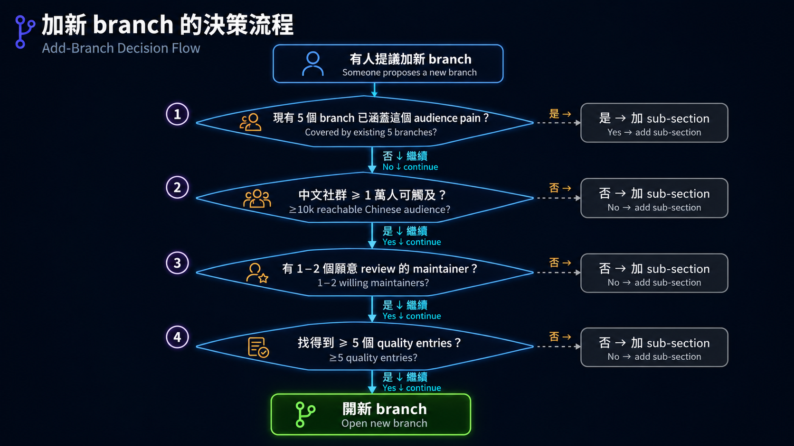

# Branch 設計筆記

> 這份是給 maintainer 看的內部文件，**不是讀者面向的內容**。
>
> 5 個 branch 怎麼分、entry 怎麼判斷該放哪、什麼時候要不要新開 branch——這些設計決定的記錄。新 maintainer 接手時看這份就懂為什麼是這樣分。

---

## 為什麼是 5 個 branch（不是 3 個或 10 個）

### Branch 跟 Track 的關係

5 條 branch 設計成 **兩條軌道走完都接得上**：

- Track A 完成 A3 → 從 branches 選一條繼續
- Track B 完成 Stage 7 → 從 branches 選一條繼續
- Branch entry 的 curation 標準**不依軌道區分**——同一個工具不論是 Track A 用法（用現成 CLI）還是 Track B 用法（自己接 SDK），都放在對應 audience 的 branch 內

**例外：for-everyday-users branch 可以直接進入**——不一定要走完軌道。這條 branch 的目標讀者是「Claude.ai / ChatGPT 重度使用者，想用 AI 但不一定想 build」，他們可能根本不需要碰 Track A 或 B；branch 內也明確標示「不一定要走完整條主幹」。其他 4 條 branch（researcher / developer / teacher / knowledge-worker）預設讀者已走完一條軌道。

Branch maintainer 應該意識到：**進來看 branch 的讀者背景可能差很多**——剛走完 Track A 的人對 framework 內部不熟、剛走完 Track B 的人對 CLI 操作可能不熟、直接進 everyday-users 的人對 Stage 0-2 都可能跳過。Branch entry 的 prose 要盡量讓這幾種讀者都看得懂。

### 太少（≤3）的問題
3 個會強行把多個 audience 塞同一條，譬如「professional」涵蓋 dev + researcher + knowledge worker——但他們的 pain point 完全不同。研究者要 grounded citation，開發者要 git-native，知識工作者要 email triage——硬擠成一條 branch 會讓 entry 互相 dilute。

### 太多（≥7）的問題
audience 切太細會：

- 每個 branch 都很薄（沒幾個 entry），讀者覺得不被照顧
- 邊界開始模糊（資料科學家 vs 機器學習工程師？產品經理 vs 顧問？）
- maintain 成本變高（要看的 branch 變多）

### 5 是 sweet spot
4 個職業（research / dev / teach / knowledge work）覆蓋大部分專業場景；第 5 個 everyday users 收尾「不寫 code 的純使用者」這條沒被任何職業 branch 照顧到的 audience。

**判準**：每個 branch 都應該對應到一個**讀者一秒就能自我認領**的身份標籤。如果 maintainer 自己都要想 30 秒才能決定一個 entry 該放哪，就是 branch 切得不夠清楚。

---

## 5 個 audience 的核心 pain point

每個 branch 都是回應一個具體 pain，不是涵蓋一整個職業生涯：

| Branch | 核心 pain | branch 主要回應 |
|---|---|---|
| 🔬 研究人員 | 「我要 review 100 篇 paper、寫 lit review，但時間不夠」 | 文獻 RAG、Outline-driven 寫作、Zotero 整合 |
| 💻 開發者 | 「我有 10 個 PR 要 review、每個 codebase 都不同 convention」 | git-native CLI、IDE coding agent、code review skill |
| 🎓 教師 | 「備課要花 4 小時、我手上的 prompt 都太通用」 | 學科特化 prompt、課程素材、評量自動化 |
| 📊 知識工作者 | 「每天信箱 100 封、會議紀錄要轉成 action items、隔天還要寫 weekly report」 | Email triage、會議紀錄、自動化 workflow |
| 👥 日常使用者 | 「我不寫 code，但想用 AI 改善生活，不知道從哪開始」 | 按工作選 Chat surface、App／Connector、CLI Agent 或 Local LLM Runtime |

每個 branch 的 entry 選入都應該回到「能不能解決核心 pain」這個問題。如果不能，就是 entry 該放別的地方。

## Branch 頁的閱讀順序

加入 `scripts/reader-ux-pages.yml` 的 Branch 不是工具倉庫。讀者第一次打開頁面時，必須依序看到 `📌` 這條路解決什麼、`🎯` 四個目標、`🧩` 粗體核心詞、`🛠` 一個可直接複製的安全任務、可選入口、必修閱讀與 `✅` 完成條件。收合與否看讀者是否立刻需要：第一題會用到的來源、推薦入口與安全警告必須可見；時間、帳號、費用、替代方案、進階流程與排錯才放進預設關閉的 `
`。必修閱讀與精選 Projects／學習資源保持可見，因為安全政策、工具身分與下一個入口很容易被忽略。舊深連結的空 anchor 要放在語意相符的新 heading 或收合摘要旁，不能全部堆在頁首。

白話只能降低理解門檻，不能刪掉專業詞。研究人員頁要保留 Source、Claim、Citation、Source Verification、Literature RAG、Reproducibility、Private Data 與 Human Review；第一個任務固定教「公開 paper → 三個問題 → 逐 citation 對原文 → 未支持就標出」。開發者頁要保留 IDE／Surface、Coding Agent／Harness、Provider／Router、Model／Runtime、Sandbox、Approval、Diff／Rollback 與 Eval／Observability，而且成對列出不代表它們是同義詞；第一個任務固定教 `read-only plan → 人工批准 → 小改 → diff → test → 人工 review → rollback`，且不授權 push、merge 或 deploy。教師頁要保留 Learning Objective、Scaffolding、Rubric、Formative Assessment、AI Literacy、Student Data、Human Review 與 Academic Integrity；第一個任務固定使用虛構課堂資料，教「目標 → AI 草稿 → 教師檢查隱私／事實／偏見 → 學生使用 → 教師觀察並修改」。

開發工具的「核心身分」和「surface」必須分欄。Coding agent 可以同時有 CLI、IDE、desktop、cloud、CI 或 SDK surface；IDE／CLI 不是互斥產品分類。OpenRouter 是 API Router，Ollama 是 local model runtime，OpenCode／Pi 等才是 coding agent／harness，不能因名字相近而混在一起。

完整資源表保留五星編輯評分，但不保存 GitHub stars。研究人員頁固定 15 筆、`3／4／5／2／1` 五組；開發者頁固定 14 筆、`4／6／2／2` 四組，補齊現行 Codex 與 GitHub Copilot，並把 Continue、Roo Code 放在維護／歷史組；教師頁固定 12 筆、`3／3／3／3` 四組；知識工作者頁固定 15 筆、`4／4／2／3／2` 五組；日常使用者頁固定 15 筆、`4／4／4／2／1` 五組。五頁的必修閱讀、精選工具及學習資源預設可見，因為安全入口與工具身分直接影響第一個練習。每組使用獨立 `<tbody>` 與真正 `rowspan`；三語的 URL、順序、評分、狀態、授權與安全限制要結構化比對。已封存的 `open_deep_research` 與 Roo Code 只能放歷史組；已封存的 Flowise 不放進知識工作者現行推薦組。Gemini Notebook 第一次出現時可附舊名 NotebookLM 幫助辨識。教師頁不能把一般消費者帳號寫成學校已核准方案；地區、資格與資料條款不確定時要明說。

知識工作者頁的九個核心詞固定為 **Source**、**Action Item**、**Knowledge Base**、**Private Data**、**Human Review**、**App／Connector**、**MCP Server**、**Workflow Automation** 與 **Approval Gate**。第一題只用虛構會議紀錄，固定輸出 `Decision | Action Item | Owner | Due date | Source sentence | Needs confirmation`，缺少人名或日期時要標記確認，不得猜測或直接寫回外部系統。ChatGPT 現行把 Connector 稱為 App，但不同供應商仍可能保留 Connector；App／Connector 是服務內的橋，MCP Server 是協定端點，Workflow Automation 是 trigger／condition／action 的重複流程，三者不能互換。官方 MCP Registry 仍是 Preview，namespace／metadata 驗證不能寫成安全背書。n8n 的 Sustainable Use License、Dify／LobeHub 的額外商用條件，以及自架工具實際資料流都要明寫；固定安裝時間、整合數量與 GitHub stars 不進教材。

教師頁的安全線與新圖都不能暗示 AI 可以自行評分、診斷學生、推測特殊教育需求或用單次輸出判定能力。圖只表達教師把關循環，不取代 Human Review、校方政策或所在地規則；三語版本必須保持相同五步、同一箭頭方向與各自語系文字。

日常使用者頁的九個核心詞固定為 **Prompt**、**Source**、**Private Data**、**Hallucination**、**Human Review**、**App／Connector**、**CLI Agent**、**Local LLM／Runtime** 與 **Approval Gate**。第一題只用虛構訊息，固定輸出 `Draft | Facts copied | Needs confirmation`，不能猜測或自行傳送。Chat surface、App／Connector、CLI Agent、Local LLM Runtime 是按工作選的四扇門，不是由低到高的 Tier；desktop 只是 surface，不代表功能等級。App／Connector 的能力取決於方案、地區、workspace 與原服務權限；CLI Agent 在寫檔／執行命令前要有 preview／diff／approval；Local Runtime 啟用 cloud model、web search 或雲端功能時，不能再宣稱所有資料都留在裝置。

---

## Branch 之間的邊界

判斷一個 entry 該放哪個 branch，按這 3 條判準依序考慮：

### 1. 主要 user persona
看上面 pain table——這個 entry 解決的是哪一個 audience 的 pain？通常很清楚。

### 2. 預期動手程度
不寫 code 的工具 → 偏 everyday-users / knowledge-worker。CLI / SDK 工具 → 偏 developer。介於中間（譬如 ChatPaper 是命令列但對研究者友善）→ 看 #1 主要 persona。

### 3. 應用場景
同一個工具在不同場景下歸類不同。例如：

- **Ollama**：給 everyday-users 是「Local LLM Runtime 入口」，給 developer 是「開發 agent 的本地測試 backend」——兩處都要說清 cloud model／web search 不是本機推論；基礎模型說明仍由 **Stage 1** 提供。
- **f/prompts.chat**：放 for-teacher（給教師當教材參考）、也放 for-everyday-users（不寫 code 也能用的 prompt 庫）。

### 灰色地帶處理（同一 repo 出現在多 branch）

**規則**：同一 repo 可以在多 branch 出現，但每處要有不同的 **framing**（適合誰、教什麼）。**推薦星等預設一致**——同一個工具的客觀價值不會因 audience 改變；除非有明確的 audience-specific 理由（譬如「進階度差太多」），且寫進 Notes 解釋。詳見 [`resources/style-guide.md`](../resources/style-guide.md) 2。

**範例**：

- `obra/superpowers` 出現在 Stage 5、for-developer、for-knowledge-worker、for-teacher
  - Stage 5：作為 SKILL.md collection 範例
  - for-developer：作為 TDD / debug skill 來源
  - for-knowledge-worker：作為腦力激盪 / 規劃 skill
  - for-teacher：作為通用寫作 skill
  - **4 處都是 ⭐⭐⭐⭐**（這是規則的正例：framing 不同、評等一致）

**反例（不該這樣做）**：

- `kaixindelele/ChatPaper` 只放 for-researcher，不放 for-everyday-users。原因：它是研究者專用流程（總結 / 翻譯 / 審稿回覆），everyday user 用不到也不該被推。

---

## 兩種 entry 結構：job-based doors vs flat

### Job-based doors（用在 for-everyday-users）
**使用條件**：入口的能力、風險與使用目的不同，但不是由低到高的升級關係。Everyday users 固定按工作選 Chat surface、App／Connector、CLI Agent 或 Local LLM Runtime；每扇門都在表中先說用途與動手前的安全檢查。四列短表比流程圖更容易讀，也避免讀者把箭頭誤認成必走順序，因此不再使用 `branch-tier-progression.png`。

### Flat 結構（其他 4 個 branch 都用這個）
單一個 list，照子主題分類（Coding Agents / Code Review / Workflow Tools 等）。
**用 flat 的條件**：audience 內部相對同質——研究者多半願意動手用 CLI、開發者一定會寫 code，沒必要分 tier。

### 什麼時候從 flat 改成 job-based doors
只有當不同入口的「身分、權限與安全邊界」真的不同時才改；不能只因工具比較難，就畫成升級階梯。先問「讀者是在選工作入口，還是在學同一能力的進階版本？」前者用 doors，後者才可討論 level。

---

## 自我引用排除原則

`WenyuChiou/*` repo 一律不收（已從 catalog 移除 32 instances）。

### 例外（什麼條件下作者自己的 repo 才能加回去）
1. 該 repo 在某個 stage / branch 是**唯一夠用的選項**（沒其他社群替代）
2. 至少 2 個 stage maintainer 簽字同意
3. 在 entry notes 明確標註「作者維護的 repo，含利益關係」
4. 加一個「替代品」連結，方便讀者比較

**目前 0 個 entry 滿足這 4 條**——保持 0 個是健康狀態。

---

## 加新 branch 的決策樹

### 範例：要不要加 `for-data-scientists`？
- pain 已被 for-researcher 涵蓋（文獻 RAG、實驗設計）
- audience scale 大，但跟 researcher 重疊高
- 結論：不加 branch，但可以在 for-researcher 加「資料科學工具」 sub-section

### 範例：要不要加 `for-product-managers`？
- pain 已被 for-knowledge-worker 涵蓋（會議紀錄、report、跨 team 溝通）
- audience scale 大但邊界跟 knowledge-worker 模糊
- 結論：不加 branch，在 for-knowledge-worker 加「產品經理」use case

---

## 5 條 branch 的 maintenance 想法（不是 SLA）

社群 repo 的維護是「能做就做」、不是排程義務。下面是大致方向：

### Review 頻率
- 沒有強制節奏。CI 已設定每月自動跑 link rot + star drift（被動的）。
- 有空想動的人 → 跑 `python scripts/refresh-stars.py` 看哪些 entry 過時、`python scripts/check-links.py --fast` 看哪些連結壞掉。

### Entry 加入 / 移除節奏
- 加入：看到值得收的就 PR。不必為了「衝量」主動找。
- 移除：archived / 長期沒 commit / license 變奇怪 → 看到再標 ⚠️ 或 PR 拿掉。

### 跟 main path stages 的同步
- Stage 改了某個 entry，branch 引用該 entry 的地方順手更新就好——沒做也不會壞。

### Maintainer 自薦 / 退場機制
- 想擔任 maintainer 開 issue 自薦就好，不用承諾什麼具體期間。「我 review 一次」也算貢獻。
- 退場：不需要 ceremony——維持沉默 2 個月，自動視為退場，新人接手
- 詳見 [`CONTRIBUTORS.md`](../CONTRIBUTORS.md)

---

## 不在這份的內容

- **個別 branch 的 entry 詳細**：見 `for-X.md` 本身
- **stage 設計理由**：見 [`../stages/DESIGN.md`](../stages/DESIGN.md)
- **entry schema / 用詞規範**：見 [`../resources/style-guide.md`](../resources/style-guide.md)
