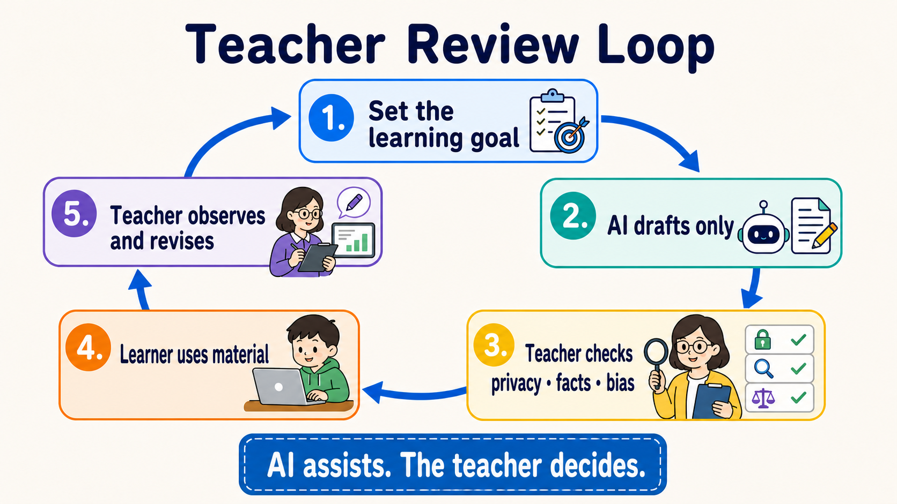
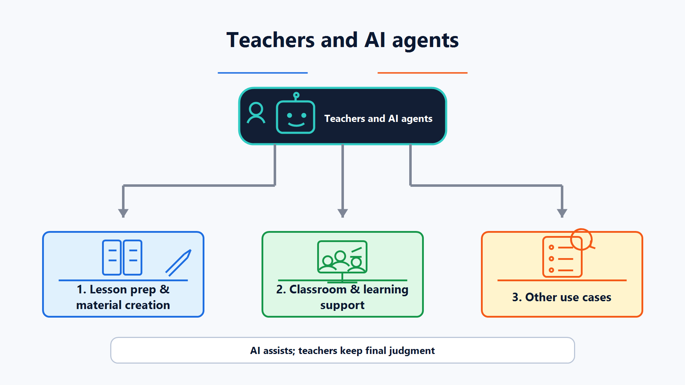

# Extension Path: For Teachers / Educators

> [繁體中文](./for-teacher.md) | [简体中文](./for-teacher.zh-Hans.md) | **English**

[← Back to the main route](../README.en.md)

<!-- freshness: canonical=branches/for-teacher.md; verified_on=2026-08-29; scope=education-guidance,student-data,assessment,tool-availability,project-status; max_age_days=90 -->

<a id="use-cases"></a>
<a id="what-this-path-helps-you-do"></a>
## 📌 What this path helps you do

AI can draft first; teachers decide whether the result is usable. This path shows you how to use AI to prepare materials, design practice, and organize feedback while protecting student information and keeping judgment with people.

If this is your first visit, start with the short exercise on this page. You only need a **school-approved AI tool**; you do not need to learn programming first. When you want large-scale automation, continue to [Track A](../tracks/cli/A1-cli-intro.en.md).

## 🎯 Learning goals

After completing this page, you can:

1. State clearly what students should learn before asking AI for help.
2. Distinguish between providing hints and completing an answer for a student.
3. Use human checks to protect facts, privacy, fairness, and honest work and citation rules.
4. Start with one low-risk activity, then decide whether to expand your use.

## 🧩 Eight core terms

- **Learning Objective**: a concrete behavior students should be able to perform by the end of a lesson, such as “explain the water cycle in their own words.”
- **Scaffolding**: giving hints, examples, or steps first and gradually removing them as students gain ability, like training wheels when learning to ride a bicycle.
- **Rubric**: observable criteria written in advance so teachers and students know how work will be evaluated. AI can draft a Rubric, but the teacher must finalize it.
- **Formative Assessment**: a small check during learning that helps decide what to teach next, rather than only assigning a final score.
- **AI Literacy**: knowing what AI can do, where it can be wrong, and how to use and explain it responsibly.
- **Student Data**: information that can identify a student directly or indirectly, such as a name, student ID, work, grades, voice, or behavior records.
- **Human Review**: a person actually reads the output, checks sources, and makes the decision; it is not merely clicking “accept.”
- **Academic Integrity**: clearly explaining which assistance is allowed, what must be completed independently, and when AI use must be disclosed or cited.

<a id="what-teachers-should-watch-for-when-using-ai"></a>
<a id="privacy--ethics-important"></a>
<a id="keep-five-safety-lines-first"></a>
## 🛡 Keep five safety lines first

1. **Check school policy first**: school rules, approved tools, and parent/student notification requirements take priority over this learning map.
2. **Do not include student data**: practice with fictional content first. Without school approval, do not paste names, work, grades, or identifiable records into a tool.
3. **Teachers keep decision authority**: AI may draft feedback and a Rubric; major decisions about grades, discipline, advancement, or special education belong to qualified people.
4. **Perform Human Review every time**: check facts, citations, bias, age appropriateness, accessibility needs, and alignment with learning goals.
5. **Make usage rules clear**: tell students what they may use, how to disclose it, and which evidence of learning they must produce themselves.



<a id="first-exercise-draft-a-classroom-activity-you-can-check"></a>
## 🛠 First exercise: draft a classroom activity you can check

This is a **fictional scenario**; do not include student data. Copy the entire block below into a school-approved AI tool:

```text
This is a fictional classroom scenario and contains no real student data.

Help me draft a 15-minute activity for upper-elementary students on “Why do shadows become longer or shorter?”
Please provide:
1. One observable Learning Objective.
2. One activity using only paper, a pencil, and a flashlight.
3. Two levels of Scaffolding: a small hint first, then a more explicit hint; do not state the answer directly.
4. One Formative Assessment.
5. One Exit Ticket with only two short questions.
6. Three scientific facts the teacher must verify before use.

Use short sentences. Do not grade real students or pretend to know students’ abilities or needs.
```

When you receive the draft, do not send it directly to students. Perform a **Human Review**:

- [ ] The Learning Objective makes the expected student behavior clear.
- [ ] Scientific facts can be checked against a textbook or reliable source.
- [ ] Hints help students think rather than answer for them.
- [ ] Materials, language, and activity fit this age group and class.
- [ ] There is no Student Data, and AI is not deciding grades.

<a id="references"></a>
<a id="reading-materials"></a>
<a id="required-reading"></a>
## 📚 Required reading

1. [UNESCO — Guidance for Generative AI in Education and Research](https://www.unesco.org/en/articles/guidance-generative-ai-education-and-research?hub=387) ⭐⭐⭐⭐⭐: start with human-centered, data-privacy, and age-appropriateness principles.
2. [European Commission — Ethical Guidelines for Educators](https://education.ec.europa.eu/focus-topics/digital-education/actions/plan/ethical-guidelines-for-educators-on-using-artificial-intelligence) ⭐⭐⭐⭐⭐: use scenarios and questions to check ethics, data, and the AI Act/GDPR boundary.
3. [TeachAI — AI Guidance for Schools Toolkit](https://www.teachai.org/toolkit) ⭐⭐⭐⭐⭐: turn principles into school policy, classroom rules, and communication processes.

Read your own school policy first, then the three documents above. Official guidance tells you which questions to ask; it cannot make legal decisions for your school or location.

<a id="curated-projects"></a>
<a id="teaching-workflow-skills"></a>
<a id="available-building-blocks"></a>
<a id="course-materials-for-teaching"></a>
<a id="prompt-libraries"></a>
<a id="curated-projects-and-learning-resources"></a>
## ⭐ Curated projects and learning resources

<small>Guidance, service availability, repository status, and licenses were checked against official pages and the GitHub API on 2026-08-29 UTC. Ratings are editorial ratings for this learning map, not GitHub stars or performance rankings.</small>

<table>
<thead><tr><th scope="col">Category</th><th scope="col">Official resource / project</th><th scope="col">Start with this</th><th scope="col">Status / license</th><th scope="col">Know this limitation first</th><th scope="col">Rating</th></tr></thead>
<tbody>
<tr><th scope="rowgroup" rowspan="3">Safety and policy</th><td><a href="https://www.unesco.org/en/articles/guidance-generative-ai-education-and-research?hub=387">UNESCO GenAI education guidance</a></td><td>Establish human-centered principles in school</td><td>Current; official guidance</td><td>Global principles still need local rules and age requirements</td><td>⭐⭐⭐⭐⭐</td></tr>
<tr><td><a href="https://education.ec.europa.eu/focus-topics/digital-education/actions/plan/ethical-guidelines-for-educators-on-using-artificial-intelligence">European Commission ethical guidelines for educators</a></td><td>Check data, transparency, and classroom risks</td><td>Current; official guidance</td><td>AI Act/GDPR explanation is mainly framed for the EU</td><td>⭐⭐⭐⭐⭐</td></tr>
<tr><td><a href="https://www.teachai.org/toolkit">TeachAI School Toolkit</a></td><td>Draft school AI guidance and communication materials</td><td>Current; education toolkit</td><td>Templates are not ready-to-copy school policy; stakeholders still need to review them</td><td>⭐⭐⭐⭐⭐</td></tr>
</tbody>
<tbody>
<tr><th scope="rowgroup" rowspan="3">Teacher cloud tools requiring school approval</th><td><a href="https://www.anthropic.com/news/claude-for-teachers">Claude for Teachers</a></td><td>Lesson prep, standards alignment, and teacher workflows</td><td>Region-limited; cloud service</td><td>Currently for verified U.S. K-12 teachers; do not treat the product plan as globally available</td><td>⭐⭐⭐⭐</td></tr>
<tr><td><a href="https://openai.com/index/chatgpt-for-teachers/">ChatGPT for Teachers</a></td><td>Draft materials in a school-managed workspace</td><td>Region-limited; cloud service</td><td>Currently for verified U.S. K-12 educators; still follow school Student Data rules</td><td>⭐⭐⭐⭐</td></tr>
<tr><td><a href="https://support.google.com/gemininotebook/answer/16337734?hl=en">Gemini Notebook (formerly NotebookLM)</a></td><td>Summarize, ask questions, and trace citations against specified sources</td><td>Generally available; cloud service</td><td>Sharing, retention, and data use vary by account; read school policy and Workspace for Education terms first</td><td>⭐⭐⭐⭐⭐</td></tr>
</tbody>
<tbody>
<tr><th scope="rowgroup" rowspan="3">Adaptable courses</th><td><a href="https://github.com/huggingface/agents-course">huggingface/agents-course</a></td><td>Adapt into an Agent introduction course or workshop</td><td>Active; Apache-2.0</td><td>It teaches people to build Agents, not a daily tool for teachers</td><td>⭐⭐⭐⭐⭐</td></tr>
<tr><td><a href="https://github.com/datawhalechina/hello-agents">datawhalechina/hello-agents</a></td><td>Teach Agents with Chinese chapters and hands-on work</td><td>Active; CC BY-NC-SA 4.0</td><td>Noncommercial license; read the full terms before adapting or distributing</td><td>⭐⭐⭐⭐⭐</td></tr>
<tr><td><a href="https://github.com/microsoft/ai-agents-for-beginners">microsoft/ai-agents-for-beginners</a></td><td>Select short courses, notebooks, and exercises</td><td>Active; MIT</td><td>Tools and SDK versions change quickly; rerun examples before teaching</td><td>⭐⭐⭐⭐</td></tr>
</tbody>
<tbody>
<tr><th scope="rowgroup" rowspan="3">Templates and advanced workflows</th><td><a href="https://github.com/anthropics/skills">anthropics/skills</a></td><td>Reference document, slide, and spreadsheet Skills</td><td>Active; per-folder licenses</td><td>The repository does not have one blanket license; read each folder’s license before reuse</td><td>⭐⭐⭐⭐⭐</td></tr>
<tr><td><a href="https://github.com/obra/superpowers">obra/superpowers</a></td><td>Reference planning, writing, and review workflows</td><td>Active; MIT</td><td>Generic workflows still need school policy and a human gate</td><td>⭐⭐⭐⭐</td></tr>
<tr><td><a href="https://github.com/f/prompts.chat">f/prompts.chat</a></td><td>Compare different prompt-writing approaches</td><td>Active; MIT / CC0 dual track</td><td>Community content varies in quality; select and verify before bringing it into class</td><td>⭐⭐⭐</td></tr>
</tbody>
</table>

<a id="other-branches-that-also-apply"></a>
<a id="completion-check-and-next-stop"></a>
## ✅ Completion check and next stop

- [ ] I have read school policy and know which tools I may use.
- [ ] I can explain the difference between Scaffolding, Formative Assessment, and Rubric.
- [ ] I completed one activity draft with fictional content and performed Human Review item by item.
- [ ] I did not upload Student Data or give grades or major decisions to AI.

Next stop: use [Track A](../tracks/cli/A1-cli-intro.en.md) for daily automation; use [Stage 3](../stages/03-tool-use-and-hello-agent.en.md) to build a teaching Agent; use [Stage 6](../stages/06-memory-rag.en.md) for a materials knowledge base; and see the [Researcher path](./for-researcher.en.md) if you also do research.

<a id="tier-recommendations-for-teachers"></a>
<a id="time-tools-cost-and-how-to-start"></a>
<details markdown="1">
<summary>⏱ Expand: time, tools, cost, and how to start</summary>

The first exercise takes about 20–30 minutes. Start with a school-approved chat tool and fictional data; you do not need an API, CLI, or paid plan.

- For one-off lesson prep: stay with a web tool.
- When using your own sources: first check your school account’s file, sharing, retention, and training terms, then use a source-based notebook.
- When repeating the same workflow weekly: read [Track A](../tracks/cli/A1-cli-intro.en.md), but confirm account, permission, and data boundaries with school IT first.
- Prices and plans change; this page does not preserve fixed costs or promises that something will always take a certain number of minutes.

</details>

<a id="lesson-prep-and-class-material-creation"></a>
<a id="lesson-prep-and-classroom-materials"></a>
<a id="classroom-and-learning-support"></a>
<a id="other-use-cases"></a>
<a id="other-teaching-use-cases"></a>
<details markdown="1">
<summary>🧪 Expand: three types of teaching use cases</summary>



### Lesson prep and materials
AI can draft lesson plans, questions, Rubrics, slide outlines, and multilingual versions. Teachers must check curriculum alignment, facts, difficulty, licensing, and accessibility needs.

### Classroom and learning support
AI can act as a practice partner, ask Socratic questions, provide tiered hints, or organize common errors. Do not let it pretend to diagnose a student or decide ability, needs, or grades from one answer.

### Administration and communication
AI can draft parent letters, meeting summaries, and FAQs. Before sending, remove unnecessary personal data, check tone and facts, and obtain approval from the responsible person.

</details>

<a id="workflows-you-can-build-by-teaching-stage"></a>
<a id="workflows-by-teaching-stage"></a>
<a id="3-copy-ready-prompt-templates"></a>
<a id="three-copyable-prompt-templates"></a>
<details markdown="1">
<summary>🧪 Expand: two additional copyable templates</summary>

### Rubric draft
```text
This is a fictional assignment and contains no student data.
Learning goals: [paste 2–3]
Draft a four-level Rubric. Each level must use observable behaviors, not only “good” or “bad.”
At the end, list what the teacher must decide; do not grade the student.
```

### Organize common errors
```text
Here are three fictional error examples I wrote myself: [paste examples]
Group the errors, explain which concept each group may be missing, and give one hint per group that does not state the answer directly.
Do not infer student identity, ability, health, or special-education needs.
```

</details>

<details markdown="1">
<summary>⚙️ Expand: advanced automation and alternatives</summary>
When processing many materials, emails, or forms, first split the workflow into: `select data → remove unnecessary information → AI draft → human check → approve → publish`. Every step must be stoppable.

- Documents and slides: first read the folder boundaries and individual licenses in [anthropics/skills](https://github.com/anthropics/skills).
- Course Agents: complete [Stage 3](../stages/03-tool-use-and-hello-agent.en.md) before adding tools; do not connect LMS write permissions at the start.
- Private materials knowledge bases: see [Stage 6](../stages/06-memory-rag.en.md), and first confirm materials licensing, retention location, and deletion method.
- If no approved cloud tool is available: use an offline drafting workflow without student data, or ask school IT for a compliant environment.
</details>

<a id="community-note"></a>
<a id="community-notes"></a>
<details markdown="1">
<summary>🤝 Expand: legal reminders, troubleshooting, and community contributions</summary>
Laws and policies vary by region, age, institution, and tool contract. Whether FERPA, GDPR, Taiwan’s Personal Data Protection Act, or other rules apply should be determined by your school and qualified personnel; this page is not legal advice.

| Problem | What to do first |
|---|---|
| The AI draft looks complete | Ask it to list facts needing verification, then check each against a textbook or reliable source |
| You are unsure whether student work may be pasted | Do not paste it yet; check school policy, parent/student notices, and tool terms |
| The activity only makes students copy answers | Switch to tiered hints, require explanations, and preserve a path that can be completed without AI |
| The tool does not support your region or account | Do not bypass the restriction; use a school-approved tool or only public, fictional content |

Contributions of subject-specific templates, age-appropriate cases, safe LMS integrations, and teacher-tested workflows are welcome. See [CONTRIBUTING.en.md](../CONTRIBUTING.en.md).
</details>
