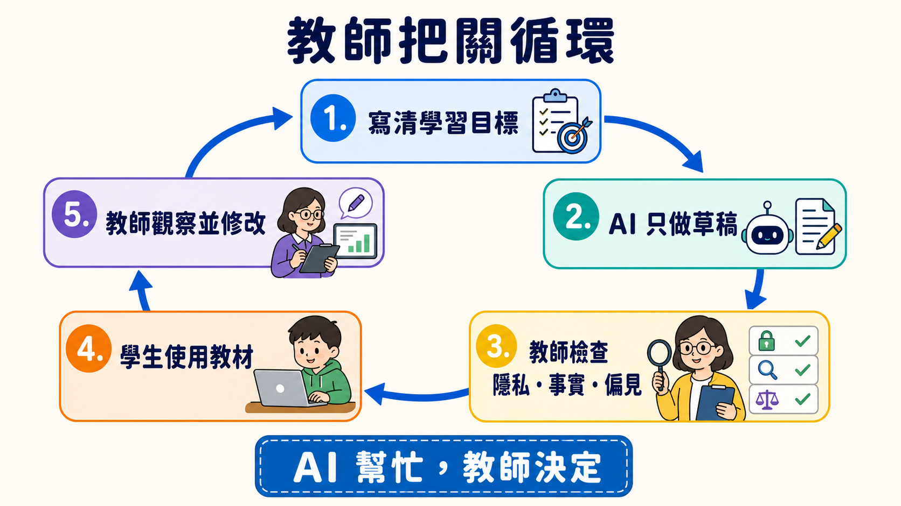
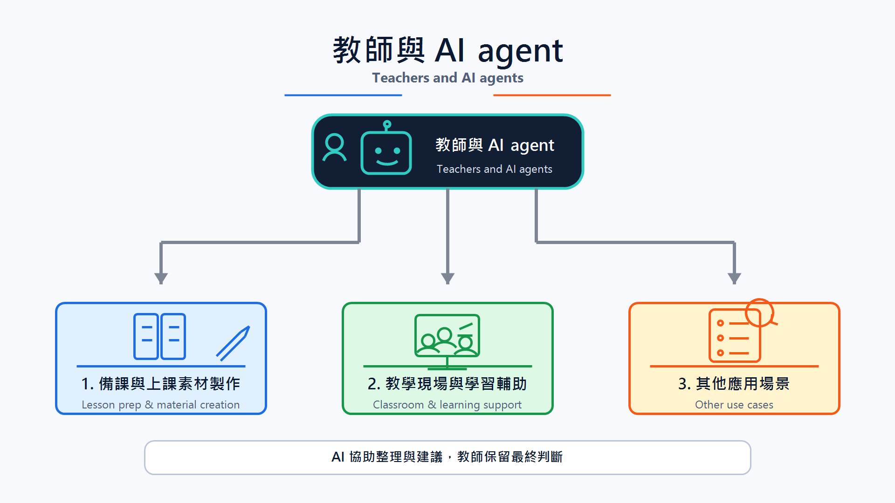

# 教師延伸路線（For Teachers / Educators）

> **繁體中文** | [简体中文](./for-teacher.zh-Hans.md) | [English](./for-teacher.en.md)

[← 回主路線](../README.md)

<!-- freshness: canonical=branches/for-teacher.md; verified_on=2026-08-29; scope=education-guidance,student-data,assessment,tool-availability,project-status; max_age_days=90 -->

<a id="使用情境"></a>
## 📌 這條路幫你做什麼

AI 可以先做草稿，教師負責決定能不能用。這條路教你用 AI 準備教材、設計練習與整理回饋，同時保護學生資料，不把判斷交給機器。

第一次來，先做本頁的小練習。你只需要一個**學校核准的 AI 工具**；不需要先學程式。想做大量自動化時，再走 [Track A](../tracks/cli/A1-cli-intro.md)。

## 🎯 學習目標

完成這一頁後，你可以：

1. 先寫清楚學生要學會什麼，再請 AI 幫忙。
2. 分清「提供提示」和「替學生完成答案」。
3. 用人工檢查守住事實、隱私、公平與學術誠信。
4. 從一個低風險活動開始，再決定是否擴大使用。

## 🧩 八個核心詞

- **Learning Objective（學習目標）**：這堂課結束時，學生應該能做出的具體行為，例如「能用自己的話解釋水循環」。
- **Scaffolding（鷹架）**：先給提示、範例或步驟，等學生會做後再慢慢拿掉，像學騎車時的輔助輪。
- **Rubric（評分規準）**：先寫出可觀察的判準，讓教師和學生知道作品會怎麼被看。Rubric 可以請 AI 草擬，但要由教師定稿。
- **Formative Assessment（形成性評量）**：學習途中做的小檢查，用來決定下一步怎麼教，不是只在最後給一個分數。
- **AI Literacy（AI 素養）**：知道 AI 能做什麼、會錯在哪裡，並能負責任地使用和說明它。
- **Student Data（學生資料）**：能直接或間接認出學生的資料，例如姓名、學號、作品、成績、聲音或行為紀錄。
- **Human Review（人工審查）**：人真的讀過輸出、核對來源並做決定，不是只按一下「接受」。
- **Academic Integrity（學術誠信）**：清楚說明哪些協助可以用、哪些必須自己完成，以及何時要揭露或引用 AI。

<a id="教師使用-ai-輔助時要注意什麼"></a>
<a id="隱私--倫理重要"></a>
## 🛡 先守住五條安全線

1. **先看校方政策**：學校規則、核准工具與家長／學生通知要求，比這份學習地圖優先。
2. **不要放學生資料**：練習先用虛構內容。未經校方核准，不把姓名、作品、成績或可辨識紀錄貼進工具。
3. **教師保留決定權**：AI 可以草擬回饋與 Rubric；成績、紀律、升學或特殊教育等重大決定由合格的人員負責。
4. **每次都要 Human Review**：核對事實、引用、偏見、年齡適切性、無障礙需求與課程目標。
5. **把使用規則說清楚**：讓學生知道什麼可以用、如何揭露，以及哪些學習證據必須自己完成。



## 🛠 第一個練習：做一份可檢查的課堂活動草稿

這是**虛構情境**，不要放學生資料。把下面整段複製到學校核准的 AI 工具：

```text
這是一個虛構的課堂情境，不含真實學生資料。

你要幫我草擬一個 15 分鐘的國小高年級活動，主題是「為什麼影子會變長或變短」。
請提供：
1. 一個可觀察的 Learning Objective。
2. 一個只用紙、筆和手電筒就能做的活動。
3. 兩層 Scaffolding：先給小提示，再給較明確提示；不要直接說答案。
4. 一題 Formative Assessment。
5. 一張 Exit Ticket，只有兩個短問題。
6. 列出教師使用前必須核對的三個科學事實。

用簡短句子。不要替真實學生評分，也不要假裝知道學生的能力或需求。
```

拿到草稿後，不要直接發給學生。做一次 **Human Review**：

- [ ] Learning Objective 能看出學生要做什麼。
- [ ] 科學事實能從課本或可靠來源核對。
- [ ] 提示是在幫學生想，不是在替學生答。
- [ ] 材料、語言和活動適合這個年齡與班級。
- [ ] 沒有 Student Data，也沒有讓 AI 決定成績。

<a id="參考文獻"></a>
<a id="閱讀材料"></a>
## 📚 必修閱讀

1. [UNESCO — Guidance for Generative AI in Education and Research](https://www.unesco.org/en/articles/guidance-generative-ai-education-and-research?hub=387) ⭐⭐⭐⭐⭐：先看以人為中心、資料隱私與年齡適切原則。
2. [European Commission — Ethical Guidelines for Educators](https://education.ec.europa.eu/focus-topics/digital-education/actions/plan/ethical-guidelines-for-educators-on-using-artificial-intelligence) ⭐⭐⭐⭐⭐：用情境與問題檢查倫理、資料與 AI Act／GDPR 邊界。
3. [TeachAI — AI Guidance for Schools Toolkit](https://www.teachai.org/toolkit) ⭐⭐⭐⭐⭐：把原則轉成校方政策、課堂規則與溝通流程。

先讀自己學校的政策，再讀上面三份。官方指引告訴你要問哪些問題，不能替你的學校或所在地做法律判斷。

<a id="精選-projects"></a>
<a id="教學流程-skills"></a>
<a id="可用的基礎元件"></a>
<a id="教學課程素材給教師備課用"></a>
<a id="prompt-素材庫"></a>
## ⭐ 精選 Projects 與學習資源

<small>指引、服務可用性、repository 狀態與授權於 2026-08-29 UTC 依官方頁面與 GitHub API 查核。推薦度是本學習地圖的編輯評分，不是 GitHub stars 或效能排名。</small>

<table>
<thead><tr><th scope="col">分類</th><th scope="col">官方資源／專案</th><th scope="col">先拿來做什麼</th><th scope="col">狀態／授權</th><th scope="col">先知道的限制</th><th scope="col">推薦度</th></tr></thead>
<tbody>
<tr><th scope="rowgroup" rowspan="3">安全與政策</th><td><a href="https://www.unesco.org/en/articles/guidance-generative-ai-education-and-research?hub=387">UNESCO GenAI 教育指引</a></td><td>建立以人為中心的校內原則</td><td>現行；官方指引</td><td>全球原則仍要配合所在地規則與年齡要求</td><td>⭐⭐⭐⭐⭐</td></tr>
<tr><td><a href="https://education.ec.europa.eu/focus-topics/digital-education/actions/plan/ethical-guidelines-for-educators-on-using-artificial-intelligence">European Commission 教師倫理指引</a></td><td>檢查資料、透明度與課堂風險</td><td>現行；官方指引</td><td>AI Act／GDPR 說明以歐盟情境為主</td><td>⭐⭐⭐⭐⭐</td></tr>
<tr><td><a href="https://www.teachai.org/toolkit">TeachAI School Toolkit</a></td><td>草擬學校 AI guidance 與溝通材料</td><td>現行；教育工具包</td><td>範本不是可直接複製的校方政策，仍需利害關係人審查</td><td>⭐⭐⭐⭐⭐</td></tr>
</tbody>
<tbody>
<tr><th scope="rowgroup" rowspan="3">需由學校核准的教師雲端工具</th><td><a href="https://www.anthropic.com/news/claude-for-teachers">Claude for Teachers</a></td><td>備課、標準對照與教師工作流</td><td>限區可用；雲端服務</td><td>目前面向通過驗證的美國 K-12 教師；不能把產品方案當全球通用</td><td>⭐⭐⭐⭐</td></tr>
<tr><td><a href="https://openai.com/index/chatgpt-for-teachers/">ChatGPT for Teachers</a></td><td>在學校管理的 workspace 草擬教材</td><td>限區可用；雲端服務</td><td>目前面向通過驗證的美國 K-12 教育工作者；仍須遵守校方 Student Data 規則</td><td>⭐⭐⭐⭐</td></tr>
<tr><td><a href="https://support.google.com/gemininotebook/answer/16337734?hl=en">Gemini Notebook（原 NotebookLM）</a></td><td>用指定來源做摘要、提問與 citation 回查</td><td>正式可用；雲端服務</td><td>分享、保存與資料使用依帳號而異；先看學校政策和 Workspace for Education 條款</td><td>⭐⭐⭐⭐⭐</td></tr>
</tbody>
<tbody>
<tr><th scope="rowgroup" rowspan="3">可改編課程</th><td><a href="https://github.com/huggingface/agents-course">huggingface/agents-course</a></td><td>改編成 Agent 入門課或工作坊</td><td>活躍；Apache-2.0</td><td>它教人建立 Agent，不是教師日常工具</td><td>⭐⭐⭐⭐⭐</td></tr>
<tr><td><a href="https://github.com/datawhalechina/hello-agents">datawhalechina/hello-agents</a></td><td>使用中文章節與實作教 Agent</td><td>活躍；CC BY-NC-SA 4.0</td><td>非商業授權；改編與散布前先讀完整條款</td><td>⭐⭐⭐⭐⭐</td></tr>
<tr><td><a href="https://github.com/microsoft/ai-agents-for-beginners">microsoft/ai-agents-for-beginners</a></td><td>挑選短課程、notebook 與練習</td><td>活躍；MIT</td><td>工具與 SDK 版本變動快，授課前先重跑範例</td><td>⭐⭐⭐⭐</td></tr>
</tbody>
<tbody>
<tr><th scope="rowgroup" rowspan="3">模板與進階流程</th><td><a href="https://github.com/anthropics/skills">anthropics/skills</a></td><td>參考文件、投影片與 spreadsheet Skills</td><td>活躍；各資料夾授權</td><td>不是整個 repository 一張授權；重用前逐資料夾讀授權</td><td>⭐⭐⭐⭐⭐</td></tr>
<tr><td><a href="https://github.com/obra/superpowers">obra/superpowers</a></td><td>參考 planning、寫作與 review 工作流</td><td>活躍；MIT</td><td>通用 workflow 仍要加校方政策與人工 gate</td><td>⭐⭐⭐⭐</td></tr>
<tr><td><a href="https://github.com/f/prompts.chat">f/prompts.chat</a></td><td>比較不同 prompt 寫法</td><td>活躍；MIT／CC0 雙軌</td><td>社群內容品質不一；先挑選、核對，再拿進課堂</td><td>⭐⭐⭐</td></tr>
</tbody>
</table>

<a id="也適用其他分支"></a>
## ✅ 完成檢查與下一站

- [ ] 我先讀過校方政策，知道哪些工具可以用。
- [ ] 我能說明 Scaffolding、Formative Assessment 與 Rubric 的差別。
- [ ] 我用虛構內容完成一個活動草稿，並逐項 Human Review。
- [ ] 我沒有上傳 Student Data，也沒有把成績或重大決定交給 AI。

下一站：做日常自動化可走 [Track A](../tracks/cli/A1-cli-intro.md)；自己建立教學 Agent 可走 [Stage 3](../stages/03-tool-use-and-hello-agent.md)；要做教材知識庫可走 [Stage 6](../stages/06-memory-rag.md)；也做研究則看 [研究人員路線](./for-researcher.md)。

<a id="給教師的層級建議"></a>
<details markdown="1">
<summary>⏱ 展開：時間、工具、費用與怎麼開始</summary>

第一個練習約 20–30 分鐘。先用學校核准的聊天工具與虛構資料，不需要 API、CLI 或付費方案。

- 只做一次備課：停在網頁工具即可。
- 需要用自己的來源：先確認學校帳號的檔案、分享、保存與訓練條款，再使用來源型 notebook。
- 每週重跑相同流程：讀 [Track A](../tracks/cli/A1-cli-intro.md)，但先和校方 IT 確認帳號、權限與資料邊界。
- 價格與方案會變；本頁不保存固定費用或「幾分鐘一定完成」的承諾。

</details>

<a id="備課與上課素材製作"></a>
<a id="教學現場與學習輔助"></a>
<a id="其他應用場景"></a>
<details markdown="1">
<summary>🧪 展開：三類教學使用情境</summary>



### 備課與教材

AI 可以草擬教案、題目、Rubric、投影片大綱與多語版本。教師要核對課綱、事實、難度、授權與無障礙需求。

### 課堂與學習支援

AI 可以扮演練習對象、提出蘇格拉底式問題、提供分層提示或整理常見錯誤。不要讓它假裝診斷學生，也不要因一次回答就決定能力、需求或成績。

### 行政與溝通

AI 可以草擬家長信、會議摘要與常見問題。寄出前刪除不必要的個資、核對語氣與事實，並由負責的人批准。

</details>

<a id="可以建的流程按教學階段"></a>
<a id="3-個可直接複製的-prompt-範本"></a>
<details markdown="1">
<summary>🧪 展開：兩個額外的可複製模板</summary>

### Rubric 草稿

```text
這是虛構作業，不含學生資料。
學習目標：[貼上 2–3 條]
請草擬一份四級 Rubric。每一級都要使用可觀察的行為，不要只寫「很好」或「不好」。
最後列出教師需要自己決定的地方，不要替學生評分。
```

### 常見錯誤整理

```text
以下是我自己寫的三個虛構錯誤例子：[貼上例子]
請把錯誤分組，說明每組可能缺少哪個概念，並各給一個不直接說答案的提示。
不要推測學生身分、能力、健康或特殊教育需求。
```

</details>

<details markdown="1">
<summary>⚙️ 展開：進階自動化與替代方案</summary>

大量處理教材、Email 或表單時，先把流程切成：`選取資料 → 移除不必要資訊 → AI 草擬 → 人工檢查 → 批准 → 發布`。每一步都要能停下來。

- 文件與投影片：先看 [anthropics/skills](https://github.com/anthropics/skills) 的資料夾邊界和個別授權。
- 課程 Agent：先完成 [Stage 3](../stages/03-tool-use-and-hello-agent.md)，再加工具；不要一開始就接 LMS 寫入權限。
- 私有教材知識庫：看 [Stage 6](../stages/06-memory-rag.md)，並先確認教材授權、保存位置與刪除方式。
- 找不到核准的雲端工具：改用不含學生資料的離線草稿流程，或請校方 IT 提供合規環境。

</details>

<a id="社群備註"></a>
<details markdown="1">
<summary>🤝 展開：法規提示、排錯與社群貢獻</summary>

法規與政策依地區、年齡、機構和工具合約不同。FERPA、GDPR、台灣《個人資料保護法》或其他規則是否適用，應由校方與合格人員判斷；本頁不是法律意見。

| 問題 | 先怎麼做 |
|---|---|
| AI 草稿看起來很完整 | 要求列出待核對事實，再逐條回到課本或可靠來源 |
| 不確定能不能貼學生作品 | 先不要貼；查校方政策、家長／學生通知和工具條款 |
| 活動只會讓學生抄答案 | 改成分層提示、要求說理由，並保留不用 AI 也能完成的路徑 |
| 工具不支援你的地區或帳號 | 不繞過限制；換校方核准工具或只使用公開、虛構內容 |

歡迎貢獻學科專用模板、年齡適切案例、LMS 安全整合與經過教師實測的工作流。請見 [CONTRIBUTING.md](../CONTRIBUTING.md)。

</details>
