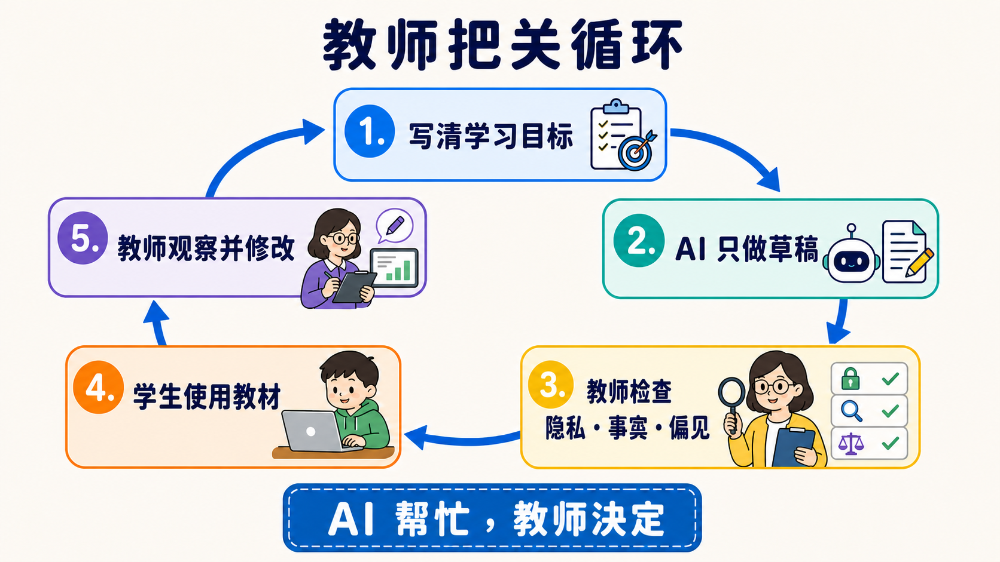
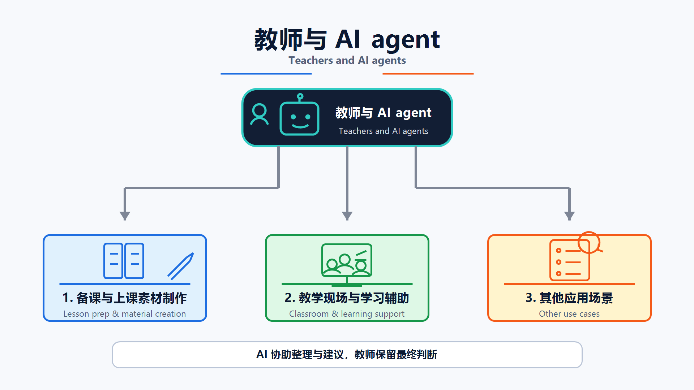

# 教师延伸路线（For Teachers / Educators）

> [繁體中文](./for-teacher.md) | **简体中文** | [English](./for-teacher.en.md)

[← 回到主路线](../README.zh-Hans.md)

<!-- freshness: canonical=branches/for-teacher.md; verified_on=2026-08-29; scope=education-guidance,student-data,assessment,tool-availability,project-status; max_age_days=90 -->

<a id="使用场景"></a>
<a id="这条路帮你做什么"></a>
## 📌 这条路帮你做什么

AI 可以先做草稿，教师负责决定能不能用。这条路教你用 AI 准备教材、设计练习与整理反馈，同时保护学生数据，不把判断交给机器。

第一次来，先做本页的小练习。你只需要一个**学校核准的 AI 工具**；不需要先学编程。想做大量自动化时，再走 [Track A](../tracks/cli/A1-cli-intro.zh-Hans.md)。

## 🎯 学习目标

完成这一页后，你可以：

1. 先写清楚学生要学会什么，再请 AI 帮忙。
2. 分清“提供提示”和“替学生完成答案”。
3. 用人工检查守住事实、隐私、公平与学术诚信。
4. 从一个低风险活动开始，再决定是否扩大使用。

## 🧩 八个核心词

- **Learning Objective（学习目标）**：这堂课结束时，学生应该能做出的具体行为，例如“能用自己的话解释水循环”。
- **Scaffolding（脚手架）**：先给提示、范例或步骤，等学生会做后再慢慢拿掉，像学骑车时的辅助轮。
- **Rubric（评分规则）**：先写出可观察的判准，让教师和学生知道作品会怎样被看。Rubric 可以请 AI 草拟，但要由教师定稿。
- **Formative Assessment（形成性评估）**：学习途中做的小检查，用来决定下一步怎么教，不是只在最后给一个分数。
- **AI Literacy（AI 素养）**：知道 AI 能做什么、会错在哪里，并能负责任地使用和说明它。
- **Student Data（学生数据）**：能直接或间接认出学生的数据，例如姓名、学号、作品、成绩、声音或行为记录。
- **Human Review（人工审查）**：人真的读过输出、核对来源并做决定，不是只按一下“接受”。
- **Academic Integrity（学术诚信）**：清楚说明哪些协助可以用、哪些必须自己完成，以及何时要披露或引用 AI。

<a id="教师使用-ai-辅助时要注意什么"></a>
<a id="隐私--伦理重要"></a>
<a id="先守住五条安全线"></a>
## 🛡 先守住五条安全线

1. **先看校方政策**：学校规则、核准工具与家长／学生通知要求，比这份学习地图优先。
2. **不要放学生数据**：练习先用虚构内容。未经校方核准，不把姓名、作品、成绩或可识别记录贴进工具。
3. **教师保留决定权**：AI 可以草拟反馈与 Rubric；成绩、纪律、升学或特殊教育等重大决定由合格人员负责。
4. **每次都要 Human Review**：核对事实、引用、偏见、年龄适切性、无障碍需求与课程目标。
5. **把使用规则说清楚**：让学生知道什么可以用、如何披露，以及哪些学习证据必须自己完成。



<a id="第一个练习做一份可检查的课堂活动草稿"></a>
## 🛠 第一个练习：做一份可检查的课堂活动草稿

这是**虚构情境**，不要放学生数据。把下面整段复制到学校核准的 AI 工具：

```text
这是一个虚构的课堂情境，不含真实学生数据。

请帮我草拟一个 15 分钟的小学高年级活动，主题是“为什么影子会变长或变短”。
请提供：
1. 一个可观察的 Learning Objective。
2. 一个只用纸、笔和手电筒就能做的活动。
3. 两层 Scaffolding：先给小提示，再给较明确提示；不要直接说答案。
4. 一题 Formative Assessment。
5. 一张 Exit Ticket，只有两个短问题。
6. 列出教师使用前必须核对的三个科学事实。

用简短句子。不要替真实学生评分，也不要假装知道学生的能力或需求。
```

拿到草稿后，不要直接发给学生。做一次 **Human Review**：

- [ ] Learning Objective 能看出学生要做什么。
- [ ] 科学事实能从课本或可靠来源核对。
- [ ] 提示是在帮学生思考，不是在替学生作答。
- [ ] 材料、语言和活动适合这个年龄与班级。
- [ ] 没有 Student Data，也没有让 AI 决定成绩。

<a id="参考文献"></a>
<a id="阅读材料"></a>
<a id="必读"></a>
## 📚 必读

1. [UNESCO — Guidance for Generative AI in Education and Research](https://www.unesco.org/en/articles/guidance-generative-ai-education-and-research?hub=387) ⭐⭐⭐⭐⭐：先看以人为中心、数据隐私与年龄适切原则。
2. [European Commission — Ethical Guidelines for Educators](https://education.ec.europa.eu/focus-topics/digital-education/actions/plan/ethical-guidelines-for-educators-on-using-artificial-intelligence) ⭐⭐⭐⭐⭐：用情境与问题检查伦理、数据与 AI Act／GDPR 边界。
3. [TeachAI — AI Guidance for Schools Toolkit](https://www.teachai.org/toolkit) ⭐⭐⭐⭐⭐：把原则转成校方政策、课堂规则与沟通流程。

先读自己学校的政策，再读上面三份。官方指引告诉你要问哪些问题，不能替你的学校或所在地做法律判断。

<a id="精选-projects"></a>
<a id="教学流程-skills"></a>
<a id="可用的基础组件"></a>
<a id="教学课程素材给教师备课用"></a>
<a id="prompt-素材库"></a>
<a id="精选-projects-与学习资源"></a>
## ⭐ 精选 Projects 与学习资源

<small>指引、服务可用性、repository 状态与授权于 2026-08-29 UTC 依据官方页面与 GitHub API 查核。推荐度是本学习地图的编辑评分，不是 GitHub stars 或性能排名。</small>

<table>
<thead><tr><th scope="col">分类</th><th scope="col">官方资源／项目</th><th scope="col">先拿来做什么</th><th scope="col">状态／授权</th><th scope="col">先知道的限制</th><th scope="col">推荐度</th></tr></thead>
<tbody>
<tr><th scope="rowgroup" rowspan="3">安全与政策</th><td><a href="https://www.unesco.org/en/articles/guidance-generative-ai-education-and-research?hub=387">UNESCO GenAI 教育指引</a></td><td>建立以人为中心的校内原则</td><td>现行；官方指南</td><td>全球原则仍要配合所在地规则与年龄要求</td><td>⭐⭐⭐⭐⭐</td></tr>
<tr><td><a href="https://education.ec.europa.eu/focus-topics/digital-education/actions/plan/ethical-guidelines-for-educators-on-using-artificial-intelligence">European Commission 教师伦理指引</a></td><td>检查数据、透明度与课堂风险</td><td>现行；官方指南</td><td>AI Act／GDPR 说明以欧盟情境为主</td><td>⭐⭐⭐⭐⭐</td></tr>
<tr><td><a href="https://www.teachai.org/toolkit">TeachAI School Toolkit</a></td><td>草拟学校 AI 指引与沟通材料</td><td>现行；教育工具包</td><td>范本不是可直接复制的校方政策，仍需利害关系人审查</td><td>⭐⭐⭐⭐⭐</td></tr>
</tbody>
<tbody>
<tr><th scope="rowgroup" rowspan="3">需由学校核准的教师云工具</th><td><a href="https://www.anthropic.com/news/claude-for-teachers">Claude for Teachers</a></td><td>备课、标准对照与教师工作流</td><td>限区可用；云服务</td><td>目前面向通过验证的美国 K-12 教师；不能把产品方案当全球通用</td><td>⭐⭐⭐⭐</td></tr>
<tr><td><a href="https://openai.com/index/chatgpt-for-teachers/">ChatGPT for Teachers</a></td><td>在学校管理的 workspace 草拟教材</td><td>限区可用；云服务</td><td>目前面向通过验证的美国 K-12 教育工作者；仍须遵守校方 Student Data 规则</td><td>⭐⭐⭐⭐</td></tr>
<tr><td><a href="https://support.google.com/gemininotebook/answer/16337734?hl=en">Gemini Notebook（原 NotebookLM）</a></td><td>用指定来源做摘要、提问与 citation 回查</td><td>正式可用；云服务</td><td>分享、保存与数据使用依账号而异；先看学校政策和 Workspace for Education 条款</td><td>⭐⭐⭐⭐⭐</td></tr>
</tbody>
<tbody>
<tr><th scope="rowgroup" rowspan="3">可改编课程</th><td><a href="https://github.com/huggingface/agents-course">huggingface/agents-course</a></td><td>改编成 Agent 入门课或工作坊</td><td>活跃；Apache-2.0</td><td>它教人建立 Agent，不是教师日常工具</td><td>⭐⭐⭐⭐⭐</td></tr>
<tr><td><a href="https://github.com/datawhalechina/hello-agents">datawhalechina/hello-agents</a></td><td>使用中文章节与实作教 Agent</td><td>活跃；CC BY-NC-SA 4.0</td><td>非商业授权；改编与散布前先读完整条款</td><td>⭐⭐⭐⭐⭐</td></tr>
<tr><td><a href="https://github.com/microsoft/ai-agents-for-beginners">microsoft/ai-agents-for-beginners</a></td><td>挑选短课程、notebook 与练习</td><td>活跃；MIT</td><td>工具与 SDK 版本变动快，授课前先重跑范例</td><td>⭐⭐⭐⭐</td></tr>
</tbody>
<tbody>
<tr><th scope="rowgroup" rowspan="3">模板与进阶流程</th><td><a href="https://github.com/anthropics/skills">anthropics/skills</a></td><td>参考文件、投影片与 spreadsheet Skills</td><td>活跃；各文件夹授权不同</td><td>不是整个 repository 一张授权；重用前逐文件夹读授权</td><td>⭐⭐⭐⭐⭐</td></tr>
<tr><td><a href="https://github.com/obra/superpowers">obra/superpowers</a></td><td>参考 planning、写作与 review 工作流</td><td>活跃；MIT</td><td>通用 workflow 仍要加校方政策与人工 gate</td><td>⭐⭐⭐⭐</td></tr>
<tr><td><a href="https://github.com/f/prompts.chat">f/prompts.chat</a></td><td>比较不同 prompt 写法</td><td>活跃；MIT／CC0 双轨</td><td>社群内容质量不一；先挑选、核对，再拿进课堂</td><td>⭐⭐⭐</td></tr>
</tbody>
</table>

<a id="也适用其他分支"></a>
<a id="完成检查与下一站"></a>
## ✅ 完成检查与下一站

- [ ] 我先读过校方政策，知道哪些工具可以用。
- [ ] 我能说明 Scaffolding、Formative Assessment 与 Rubric 的差别。
- [ ] 我用虚构内容完成一个活动草稿，并逐项 Human Review。
- [ ] 我没有上传 Student Data，也没有把成绩或重大决定交给 AI。

下一站：做日常自动化可走 [Track A](../tracks/cli/A1-cli-intro.zh-Hans.md)；自己建立教学 Agent 可走 [Stage 3](../stages/03-tool-use-and-hello-agent.zh-Hans.md)；要做教材知识库可走 [Stage 6](../stages/06-memory-rag.zh-Hans.md)；也做研究则看[研究人员路线](./for-researcher.zh-Hans.md)。

<a id="给教师的层级建议"></a>
<a id="时间工具费用与如何开始"></a>
<details markdown="1">
<summary>⏱ 展开：时间、工具、费用与如何开始</summary>

第一个练习约需 20–30 分钟。先用学校核准的聊天工具与虚构数据，不需要 API、CLI 或付费方案。

- 只做一次备课：停留在网页工具即可。
- 需要用自己的来源：先确认学校账号的文件、分享、保存与训练条款，再使用来源型 notebook。
- 每周重跑相同流程：阅读 [Track A](../tracks/cli/A1-cli-intro.zh-Hans.md)，但先和校方 IT 确认账号、权限与数据边界。
- 价格与方案会变化；本页不保存固定费用或“几分钟一定完成”的承诺。

</details>

<a id="备课与上课素材制作"></a>
<a id="备课与课堂材料"></a>
<a id="教学现场与学习辅助"></a>
<a id="课堂与学习支持"></a>
<a id="其他应用场景"></a>
<a id="其他教学使用场景"></a>
<details markdown="1">
<summary>🧪 展开：三类教学使用场景</summary>



### 备课与教材
AI 可以草拟教案、题目、Rubric、投影片大纲与多语版本。教师要核对课纲、事实、难度、授权与无障碍需求。

### 课堂与学习支援
AI 可以扮演练习对象、提出苏格拉底式问题、提供分层提示或整理常见错误。不要让它假装诊断学生，也不要因一次回答就决定能力、需求或成绩。

### 行政与沟通
AI 可以草拟家长信、会议摘要与常见问题。寄出前删除不必要的个人数据、核对语气与事实，并由负责的人批准。

</details>

<a id="可以构建的流程按教学阶段"></a>
<a id="按教学阶段建立流程"></a>
<a id="3-个可直接复制的-prompt-模板"></a>
<a id="三个可复制的 prompt 模板"></a>
<details markdown="1">
<summary>🧪 展开：两个额外的可复制模板</summary>

### Rubric 草稿
```text
这是虚构作业，不含学生数据。
学习目标：[贴上 2–3 条]
请草拟一份四级 Rubric。每一级都要使用可观察的行为，不要只写“很好”或“不好”。
最后列出教师需要自己决定的地方，不要替学生评分。
```

### 常见错误整理
```text
以下是我自己写的三个虚构错误例子：[贴上例子]
请把错误分组，说明每组可能缺少哪个概念，并各给一个不直接说答案的提示。
不要推测学生身份、能力、健康或特殊教育需求。
```

</details>

<details markdown="1">
<summary>⚙️ 展开：进阶自动化与替代方案</summary>
大量处理教材、Email 或表单时，先把流程切成：`选择数据 → 移除不必要信息 → AI 草拟 → 人工检查 → 批准 → 发布`。每一步都要能停下。

- 文件与投影片：先看 [anthropics/skills](https://github.com/anthropics/skills) 的文件夹边界和个别授权。
- 课程 Agent：先完成 [Stage 3](../stages/03-tool-use-and-hello-agent.zh-Hans.md)，再加工具；不要一开始就接 LMS 写入权限。
- 私有教材知识库：看 [Stage 6](../stages/06-memory-rag.zh-Hans.md)，并先确认教材授权、保存位置与删除方式。
- 找不到核准的云端工具：改用不含学生数据的离线草稿流程，或请校方 IT 提供合规环境。
</details>

<a id="社群备注"></a>
<details markdown="1">
<summary>🤝 展开：法规提示、排错与社群贡献</summary>
法规与政策依地区、年龄、机构和工具合约不同。FERPA、GDPR、台湾《个人资料保护法》或其他规则是否适用，应由校方与合格人员判断；本页不是法律意见。

| 问题 | 先怎么做 |
|---|---|
| AI 草稿看起来很完整 | 要求列出待核对事实，再逐条回到课本或可靠来源 |
| 不确定能不能贴学生作品 | 先不要贴；查校方政策、家长／学生通知和工具条款 |
| 活动只会让学生抄答案 | 改成分层提示、要求说理由，并保留不用 AI 也能完成的路径 |
| 工具不支持你的地区或账号 | 不绕过限制；换校方核准工具或只使用公开、虚构内容 |

欢迎贡献学科专用模板、年龄适切案例、LMS 安全整合与经过教师实测的工作流。请见 [CONTRIBUTING.zh-Hans.md](../CONTRIBUTING.zh-Hans.md)。
</details>
