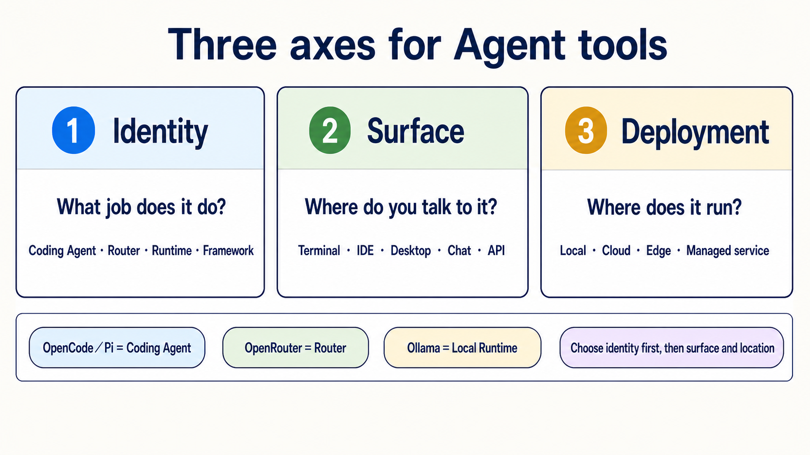

> [繁體中文](./agent-paradigms.md) | [简体中文](./agent-paradigms.zh-Hans.md) | **English**

# How to classify Agent tools: identity, surface, and deployment

> [← Back to the main README](../README.en.md)

<!-- freshness: canonical=resources/agent-paradigms.md; verified_on=2026-08-30; scope=tool-identity,surfaces,deployment,security,project-status; max_age_days=90 -->

One tool can appear in a terminal, IDE, and desktop app. It can also connect to local or cloud models. Instead of forcing tools into five mutually exclusive “types,” ask three separate questions.

## 📌 First, separate three axes

| Axis | Plain explanation | Exact question |
|---|---|---|
| **Identity** | What job does this thing do? | Is it a Coding Agent, Router, Local Runtime, Framework, or Chat Gateway? |
| **Surface** | Which door do you use to talk to it? | Terminal, IDE, desktop, web, chat app, or API? |
| **Deployment** | Where does its body live? | Your computer, a cloud host, an edge device, or a managed service? |

A product can have many **Surfaces** and move between **Deployments**. Its main **Identity** does not automatically change.

## 🎯 What you will learn

- Separate OpenCode, Pi, OpenRouter, and Ollama instead of treating them as the same kind of tool.
- Choose the job first, then the interface and deployment location.
- Know that “local,” “open source,” and “has a permission prompt” are not security guarantees.
- Treat a **Subagent** as an execution pattern, not a sixth product type.

## 🧩 Identity: what is it responsible for?

| Core term | Plain definition | Examples | What it does not automatically provide |
|---|---|---|---|
| **Coding Agent/Harness** | Reads files, edits, runs commands, and reports back inside allowed boundaries | Claude Code, Codex, OpenCode, Pi, Aider, goose | A model, Router, or Sandbox |
| **Router** | Forwards model requests to different Providers | OpenRouter | Repo editing or file permissions |
| **Local Runtime** | Loads and runs a model on your own machine | Ollama, vLLM | Task understanding or workspace operations |
| **Agent Framework** | A toolbox for developers to write state, steps, Handoffs, and Workflows | LangGraph, CrewAI, Microsoft Agent Framework | A finished Agent that works immediately after installation |
| **Chat Gateway** | Connects an Agent to Telegram, Slack, or another messaging entry point | Hermes Agent's gateway/messaging mode | A safe model, permission policy, or deployment by itself |

The shortest check is: **Who runs the model? Who routes the request? Who can touch files? Who arranges multiple steps? Where do you talk to it?**

## 🧭 Where common tools fit

| Tool | Main Identity | Common Surfaces | Possible Deployment | Common beginner confusion |
|---|---|---|---|---|
| [OpenCode](https://opencode.ai/docs/) | Coding Agent/Harness | Terminal, desktop, IDE | The OpenCode process runs locally | Connecting a cloud Provider sends model requests; it does not move the OpenCode process to the cloud. You still choose the model and permissions |
| [Pi](https://pi.dev/docs/latest) | Coding Agent/Harness | Terminal, SDK, RPC | Local | This Pi is not Raspberry Pi; it has no built-in Sandbox |
| [OpenRouter](https://openrouter.ai/docs/faq) | Router | API | Managed cloud service | It does not read files or run commands |
| [Ollama](https://ollama.com/) | Local Runtime | CLI, API | Local or your own server | It is not a Coding Agent; a client or Agent calls it |
| [Aider](https://aider.chat/docs/) | Coding Agent/pair programmer | Terminal | Local | Read its Git auto-commit and `--no-verify` behavior first |
| [goose](https://block.github.io/goose/) | Coding/general Agent | CLI, desktop, API | Local | Review extension permissions separately |
| [Hermes Agent](https://github.com/NousResearch/hermes-agent) | Agent runtime + Chat Gateway | CLI, messaging | Local or your own host | A chat entry point does not guarantee 24/7 service, safety, or zero maintenance |
| [OpenClaw](https://github.com/openclaw/openclaw) | Self-hostable Agent/assistant platform | Web, chat, or CLI, depending on deployment | Local, cloud, or edge | Edge deployment does not remove network, tool, or data-exfiltration risks |

## 📚 Required reading

1. [CLI Agents guide](cli-agents-guide.en.md): compare sign-in, Providers, Sandboxes, project rules, and permissions.
2. [Stage 4: Workflow Graphs & Agent Frameworks](../stages/04-agent-frameworks.en.md): learn Frameworks and Workflow Graphs.
3. [Stage 5: Claude Code Ecosystem](../stages/05-claude-code-ecosystem.en.md): learn Skills, MCP, Hooks, and Subagents.
4. [Stage 7: Agent Production Engineering](../stages/07-multi-agent-production.en.md): learn Harnesses, Loops, Graphs, and production boundaries.

## 🪜 A three-step choice

1. **Choose Identity first**: editing a repo needs a Coding Agent; only routing models needs a Router; running a local model needs a Local Runtime; writing your own Workflow needs a Framework.
2. **Then choose Surface**: prefer an IDE when you keep looking at code, a terminal for commands/Git/long tasks, and a Chat Gateway only when you need a messaging entry point.
3. **Choose Deployment last**: begin with a recoverable demo repo and least privilege, then decide among local, cloud, and edge. Location does not automatically remove risk.

Expand four everyday scenarios and their safety boundaries

### Build one small feature

Use a Coding Agent/Harness in a demo branch. Ask it to state a plan, edit one file, run tests, and show the diff. The model may come from a Provider API or run locally through Ollama.

### Try several Providers through one API account

The Coding Agent still controls files and commands. OpenRouter only forwards model requests. Review their billing, data policies, and permissions separately.

### Receive a routine summary on your phone

Tools such as Hermes Agent can attach a Messaging Gateway. You still manage host updates, secrets, allowed tools, retry behavior, and messaging-platform permissions.

### Process sensitive data on an edge device

A local model can reduce the need to send Prompts to an external Provider. But an Agent with network, tool, or broad folder access can still move data elsewhere. Use firewall rules, a container or VM, least privilege, fake-data tests, and human review.

## Subagent — spawning an agent inside an agent runtime

A **Subagent** is an isolated worker that receives one small part of a task from the main Agent. It describes how work is divided, not where a product runs.

| Path | Who creates the Subagent | Best fit |
|---|---|---|
| **Framework-based** | Your Python/TypeScript orchestration program | You need direct control over state, Providers, Handoffs, and Workflows |
| **Coding-Agent native** | A runtime such as Claude Code or Codex | Split research, implementation, or review inside one repo |

For either path, give the Subagent a precise scope, output format, budget, stop condition, and verification method. The main Agent must still read the result. “Used multiple Agents” is not evidence of correctness.

Continue with [Stage 5 Subagents](../stages/05-claude-code-ecosystem.en.md) and the [copy-ready Subagent Cookbook](subagent-cookbook.en.md).

## 🎯 Curated Projects and learning resources

Stars are this learning map's reading priority. They are not GitHub stars or an overall tool ranking.

<table>
<thead><tr><th>Group</th><th>Project/resource</th><th>Learn this</th><th>Limit</th><th>Rating</th></tr></thead>
<tbody>
<tr><th scope="rowgroup" rowspan="5">Coding Agent/Harness</th><td><a href="https://github.com/anomalyco/opencode">anomalyco/opencode</a></td><td>Provider switching, rules, Skills, and permissions</td><td>Model and Sandbox still need separate choices</td><td>⭐⭐⭐⭐⭐</td></tr>
<tr><td><a href="https://github.com/earendil-works/pi">earendil-works/pi</a></td><td>Small core, extensions, SDK, and RPC</td><td>No built-in Sandbox</td><td>⭐⭐⭐⭐</td></tr>
<tr><td><a href="https://github.com/Aider-AI/aider">Aider-AI/aider</a></td><td>Git diff, commit, and undo workflows</td><td>Check auto-commit and hook settings first</td><td>⭐⭐⭐⭐⭐</td></tr>
<tr><td><a href="https://github.com/aaif-goose/goose">aaif-goose/goose</a></td><td>CLI, desktop, Providers, and extensions</td><td>Start with minimal extension permissions</td><td>⭐⭐⭐⭐</td></tr>
<tr><td><a href="https://github.com/continuedev/continue">continuedev/continue</a></td><td>IDE/CLI Surfaces and Agent mode</td><td>Review each Surface's permissions separately</td><td>⭐⭐⭐⭐</td></tr>
</tbody>
<tbody>
<tr><th scope="rowgroup" rowspan="2">Router/Runtime</th><td><a href="https://openrouter.ai/docs/faq">OpenRouter official docs</a></td><td>Routers, Provider routing, and usage</td><td>Not a Coding Agent</td><td>⭐⭐⭐⭐</td></tr>
<tr><td><a href="https://github.com/ollama/ollama">ollama/ollama</a></td><td>Local model downloads and compatible APIs</td><td>Not a Coding Agent</td><td>⭐⭐⭐⭐⭐</td></tr>
</tbody>
<tbody>
<tr><th scope="rowgroup" rowspan="2">Messaging/self-hosted</th><td><a href="https://github.com/NousResearch/hermes-agent">NousResearch/hermes-agent</a></td><td>Agent runtime, Messaging Gateway, and scheduling</td><td>Self-hosting still needs operations and narrow tool permissions</td><td>⭐⭐⭐⭐</td></tr>
<tr><td><a href="https://github.com/openclaw/openclaw">openclaw/openclaw</a></td><td>Local, edge, and self-hosted assistant trade-offs</td><td>Local does not mean zero data risk</td><td>⭐⭐⭐</td></tr>
</tbody>
<tbody>
<tr><th scope="rowgroup" rowspan="3">Framework/Workflow</th><td><a href="https://github.com/langchain-ai/langgraph">langchain-ai/langgraph</a></td><td>State, nodes, edges, Checkpoints, and Human-in-the-loop</td><td>You still write and test the Workflow</td><td>⭐⭐⭐⭐⭐</td></tr>
<tr><td><a href="https://github.com/crewAIInc/crewAI">crewAIInc/crewAI</a></td><td>Roles, Tasks, and Crew orchestration</td><td>Role descriptions do not replace verification</td><td>⭐⭐⭐⭐</td></tr>
<tr><td><a href="https://github.com/microsoft/agent-framework">microsoft/agent-framework</a></td><td>Microsoft's current Agent and Workflow path</td><td>Old AutoGen/Swarm material is historical context only</td><td>⭐⭐⭐⭐</td></tr>
</tbody>
</table>

## ✅ Completion check

- [ ] I can explain the difference among a Coding Agent, Router, Local Runtime, and Framework in one sentence each.
- [ ] I do not treat OpenRouter as an Agent or Ollama as a file-editing tool.
- [ ] I know that OpenCode/Pi need separate checks for Provider, model, Surface, and Sandbox.
- [ ] I choose Identity before Surface and Deployment.
- [ ] I know local, edge, open source, and permission prompts are not security guarantees.

<small>Tool identity, official entry points, project status, and licenses checked: 2026-08-30 UTC.</small>
