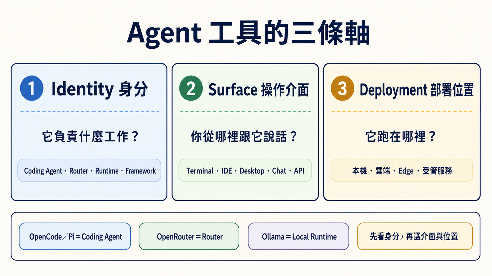

> **繁體中文** | [简体中文](./agent-paradigms.zh-Hans.md) | [English](./agent-paradigms.en.md)

# Agent 工具怎麼分：身分、操作介面、部署位置

> [← 回主路線 README](../README.md)

<!-- freshness: canonical=resources/agent-paradigms.md; verified_on=2026-08-30; scope=tool-identity,surfaces,deployment,security,project-status; max_age_days=90 -->

同一個工具可以出現在 Terminal、IDE 和 Desktop，也可以接本機或雲端模型。所以不要硬把工具塞進五個互斥「型態」。先問三個問題，會比較不容易混亂。

## 📌 先分清三條軸

| 軸 | 五歲也能懂的說法 | 正確問題 |
|---|---|---|
| **Identity（身分）** | 這個東西的工作是什麼？ | 它是 Coding Agent、Router、Local Runtime、Framework，還是 Chat Gateway？ |
| **Surface（操作介面）** | 你從哪扇門跟它說話？ | Terminal、IDE、Desktop、Web、Chat app 或 API？ |
| **Deployment（部署位置）** | 它的身體放在哪裡？ | 你的電腦、雲端主機、邊緣裝置，還是受管服務？ |

一個產品可以同時有很多 **Surface**，也可以換 **Deployment**。這不會改變它的主要 **Identity**。

## 🎯 你會學會什麼

- 分清 OpenCode、Pi、OpenRouter 與 Ollama，不再把它們當同一類。
- 先選工作身分，再選介面與部署位置。
- 知道「本機」「開源」「有 permission prompt」都不等於安全保證。
- 把 **Subagent** 當成執行方式，不當成第六種產品。

## 🧩 身分：它到底負責什麼

| 核心詞 | 白話定義 | 例子 | 它不負責什麼 |
|---|---|---|---|
| **Coding Agent／Harness（程式代理／工作台）** | 能在允許範圍內讀檔、改檔、跑命令，再回來報告 | Claude Code、Codex、OpenCode、Pi、Aider、goose | 不一定包含模型、Router 或 Sandbox |
| **Router（路由器）** | 把模型請求轉送到不同 Provider | OpenRouter | 不會自己改 repo，也不管理檔案權限 |
| **Local Runtime（本機模型引擎）** | 在自己的電腦載入並執行模型 | Ollama、vLLM | 不會自己理解任務或操作工作目錄 |
| **Agent Framework（代理框架）** | 給開發者寫狀態、步驟、Handoff 與 Workflow 的工具箱 | LangGraph、CrewAI、Microsoft Agent Framework | 不是裝好就會替你完成工作的成品 Agent |
| **Chat Gateway（聊天入口）** | 把 Agent 接到 Telegram、Slack 等訊息入口 | Hermes Agent 的 gateway／messaging 模式 | 不代表底層模型、權限與部署已安全 |

最短辨識法：**誰跑模型？誰轉送請求？誰能碰檔案？誰安排多步驟？你從哪裡說話？**

## 🧭 常見工具放在哪裡

| 工具 | 主要 Identity | 常見 Surface | 可用 Deployment | 初學者最容易搞錯的地方 |
|---|---|---|---|---|
| [OpenCode](https://opencode.ai/docs/) | Coding Agent／Harness | Terminal、Desktop、IDE | OpenCode 程式在本機執行 | 連雲端 Provider 只會送出模型請求，不會把 OpenCode 程式搬到雲端；仍要選模型與 permission |
| [Pi](https://pi.dev/docs/latest) | Coding Agent／Harness | Terminal、SDK、RPC | 本機 | 這裡的 Pi 不是 Raspberry Pi；它沒有內建 Sandbox |
| [OpenRouter](https://openrouter.ai/docs/faq) | Router | API | 受管雲端服務 | 它不會自己讀檔或執行命令 |
| [Ollama](https://ollama.com/) | Local Runtime | CLI、API | 本機、自己的伺服器 | 它不是 Coding Agent；要由 Client／Agent 呼叫 |
| [Aider](https://aider.chat/docs/) | Coding Agent／pair programmer | Terminal | 本機 | Git auto-commit／`--no-verify` 行為要先看清楚 |
| [goose](https://block.github.io/goose/) | Coding／general Agent | CLI、Desktop、API | 本機 | Extension 的權限要分開審查 |
| [Hermes Agent](https://github.com/NousResearch/hermes-agent) | Agent runtime＋Chat Gateway | CLI、Messaging | 本機或自己的主機 | Chat 入口不等於 24/7、安全或零維護 |
| [OpenClaw](https://github.com/openclaw/openclaw) | 可自架的 Agent／assistant 平台 | Web、Chat、CLI，依部署而定 | 本機、雲端或 edge | 在 edge 跑不代表沒有網路、工具或資料外流風險 |

## 📚 必讀閱讀

1. [CLI Agents 指南](cli-agents-guide.md)：比較登入、Provider、Sandbox、project rules 與權限。
2. [Stage 4：Workflow Graph 與 Agent 框架](../stages/04-agent-frameworks.md)：學 Framework 與 Workflow Graph。
3. [Stage 5：Claude Code 生態](../stages/05-claude-code-ecosystem.md)：學 Skills、MCP、Hooks 與 Subagents。
4. [Stage 7：Agent Production Engineering](../stages/07-multi-agent-production.md)：學 Harness、Loop、Graph 與上線邊界。

## 🪜 三步選擇法

1. **先選 Identity**：要改 repo 就選 Coding Agent；只想轉接模型就選 Router；要在本機跑模型就選 Local Runtime；要自己寫 Workflow 才選 Framework。
2. **再選 Surface**：眼睛一直看程式就偏 IDE；需要命令、Git 與長任務就偏 Terminal；需要手機訊息入口才考慮 Chat Gateway。
3. **最後選 Deployment**：先從可復原的 demo repo 與最小權限開始，再決定本機、雲端或 edge。部署位置不會自動消除風險。

展開四個生活情境與安全邊界

### 寫一個小功能

選一個 Coding Agent／Harness，在 demo branch 內要求它先說計畫、再改一個檔、跑測試並顯示 diff。模型可以來自 Provider API，也可以由 Ollama 在本機執行。

### 用一個 API key 試不同 Provider

Coding Agent 仍負責檔案與命令；OpenRouter 只負責把模型請求轉送。兩者的帳單、資料政策與權限要分開看。

### 手機收到例行整理

Hermes Agent 這類工具可以接 Messaging Gateway。你仍要處理主機更新、密鑰、允許的工具、失敗重試與訊息平台權限。

### 在 edge 裝置處理敏感資料

本機模型可以減少把 Prompt 送到外部 Provider 的需要，但 Agent 若能連網、呼叫工具或讀其他資料夾，仍可能把資料帶出去。要用防火牆、容器／VM、最小權限、假資料測試與人工覆核。

## Subagent — 「在 agent runtime 裡再 spawn agent」

**Subagent（子代理）** 是主 Agent 把一小塊任務交給另一個隔離工作者。它回答的是「工作怎麼分」，不是「產品跑在哪裡」。

| 路徑 | 誰負責建立子代理 | 適合什麼 |
|---|---|---|
| **Framework-based** | 你的 Python／TypeScript orchestration 程式 | 要自己控制狀態、Provider、Handoff 與 Workflow |
| **Coding-Agent native** | Claude Code、Codex 等 Agent runtime | 在同一個 repo 內，把研究、實作或審查拆成小任務 |

不論哪條路，都要給子代理明確範圍、輸出格式、預算、停止條件與驗證方式。主代理仍要讀結果；「用了多個 Agent」不是正確性的證明。

延伸：[Stage 5 的 Subagents](../stages/05-claude-code-ecosystem.md)與[可直接複製的 Subagent Cookbook](subagent-cookbook.md)。

## 🎯 精選 Projects 與學習資源

星星是本學習地圖的閱讀優先度，不是 GitHub stars，也不是工具總排名。

<table>
<thead><tr><th>分類</th><th>Project／資源</th><th>用它學什麼</th><th>限制</th><th>評分</th></tr></thead>
<tbody>
<tr><th scope="rowgroup" rowspan="5">Coding Agent／Harness</th><td><a href="https://github.com/anomalyco/opencode">anomalyco/opencode</a></td><td>Provider 切換、rules、Skills 與 permission</td><td>模型與 Sandbox 仍要另外選</td><td>⭐⭐⭐⭐⭐</td></tr>
<tr><td><a href="https://github.com/earendil-works/pi">earendil-works/pi</a></td><td>小核心、extensions、SDK 與 RPC</td><td>沒有內建 Sandbox</td><td>⭐⭐⭐⭐</td></tr>
<tr><td><a href="https://github.com/Aider-AI/aider">Aider-AI/aider</a></td><td>Git diff、commit 與 undo 工作流</td><td>先確認 auto-commit 與 hook 設定</td><td>⭐⭐⭐⭐⭐</td></tr>
<tr><td><a href="https://github.com/aaif-goose/goose">aaif-goose/goose</a></td><td>CLI、Desktop、Provider 與 extensions</td><td>先開最小 extension 權限</td><td>⭐⭐⭐⭐</td></tr>
<tr><td><a href="https://github.com/continuedev/continue">continuedev/continue</a></td><td>IDE／CLI Surface 與 Agent mode</td><td>不同 Surface 的權限要分開看</td><td>⭐⭐⭐⭐</td></tr>
</tbody>
<tbody>
<tr><th scope="rowgroup" rowspan="2">Router／Runtime</th><td><a href="https://openrouter.ai/docs/faq">OpenRouter 官方文件</a></td><td>Router、Provider routing 與 usage</td><td>不是 Coding Agent</td><td>⭐⭐⭐⭐</td></tr>
<tr><td><a href="https://github.com/ollama/ollama">ollama/ollama</a></td><td>本機模型下載與相容 API</td><td>不是 Coding Agent</td><td>⭐⭐⭐⭐⭐</td></tr>
</tbody>
<tbody>
<tr><th scope="rowgroup" rowspan="2">Messaging／自架</th><td><a href="https://github.com/NousResearch/hermes-agent">NousResearch/hermes-agent</a></td><td>Agent runtime、Messaging Gateway 與排程</td><td>自架仍要維運與收斂工具權限</td><td>⭐⭐⭐⭐</td></tr>
<tr><td><a href="https://github.com/openclaw/openclaw">openclaw/openclaw</a></td><td>本機／edge／自架 assistant 的部署取捨</td><td>本機不等於零資料風險</td><td>⭐⭐⭐</td></tr>
</tbody>
<tbody>
<tr><th scope="rowgroup" rowspan="3">Framework／Workflow</th><td><a href="https://github.com/langchain-ai/langgraph">langchain-ai/langgraph</a></td><td>狀態、節點、邊、Checkpoint 與 Human-in-the-loop</td><td>需要自己寫與測 Workflow</td><td>⭐⭐⭐⭐⭐</td></tr>
<tr><td><a href="https://github.com/crewAIInc/crewAI">crewAIInc/crewAI</a></td><td>角色、Task 與 Crew orchestration</td><td>角色描述不能取代驗證</td><td>⭐⭐⭐⭐</td></tr>
<tr><td><a href="https://github.com/microsoft/agent-framework">microsoft/agent-framework</a></td><td>Microsoft 現行 Agent／Workflow 開發路徑</td><td>舊 AutoGen／Swarm 教材只作歷史脈絡</td><td>⭐⭐⭐⭐</td></tr>
</tbody>
</table>

## ✅ 完成檢查

- [ ] 我能用一句話說出 Coding Agent、Router、Local Runtime 與 Framework 的差別。
- [ ] 我不會把 OpenRouter 當成 Agent，也不會把 Ollama 當成會改檔的工具。
- [ ] 我知道 OpenCode／Pi 的 Provider、模型、Surface 與 Sandbox 要分開確認。
- [ ] 我選工具時先看 Identity，再看 Surface 與 Deployment。
- [ ] 我知道本機、edge、開源與 permission prompt 都不是安全保證。

<small>工具身分、官方入口、專案狀態與授權查核：2026-08-30 UTC。</small>
