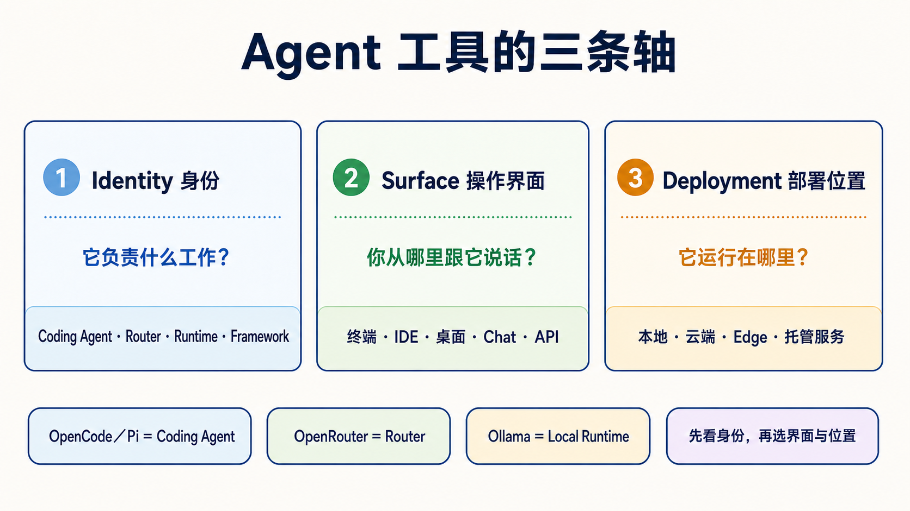

> [繁體中文](./agent-paradigms.md) | **简体中文** | [English](./agent-paradigms.en.md)

# Agent 工具怎么分：身份、操作界面、部署位置

> [← 回主路线 README](../README.zh-Hans.md)

<!-- freshness: canonical=resources/agent-paradigms.md; verified_on=2026-08-30; scope=tool-identity,surfaces,deployment,security,project-status; max_age_days=90 -->

同一个工具可以出现在终端、IDE 和桌面应用中，也可以连接本地或云端模型。所以不要硬把工具塞进五个互斥“类型”。先问三个问题，会比较不容易混乱。

## 📌 先分清三条轴

| 轴 | 五岁也能懂的说法 | 正确问题 |
|---|---|---|
| **Identity（身份）** | 这个东西的工作是什么？ | 它是 Coding Agent、Router、Local Runtime、Framework，还是 Chat Gateway？ |
| **Surface（操作界面）** | 你从哪扇门跟它说话？ | 终端、IDE、桌面、Web、Chat app 还是 API？ |
| **Deployment（部署位置）** | 它的身体放在哪里？ | 你的电脑、云端主机、边缘设备，还是托管服务？ |

一个产品可以同时有很多 **Surface**，也可以更换 **Deployment**。这不会改变它的主要 **Identity**。

## 🎯 你会学会什么

- 分清 OpenCode、Pi、OpenRouter 和 Ollama，不再把它们当作同一类。
- 先选择工作身份，再选择界面和部署位置。
- 知道“本地”“开源”“有 permission prompt”都不等于安全保证。
- 把 **Subagent** 当作执行方式，不当作第六种产品。

## 🧩 身份：它到底负责什么

| 核心词 | 白话定义 | 例子 | 它不自动负责什么 |
|---|---|---|---|
| **Coding Agent／Harness（程序代理／工作台）** | 能在允许范围内读文件、改文件、跑命令，再回来报告 | Claude Code、Codex、OpenCode、Pi、Aider、goose | 不一定包含模型、Router 或 Sandbox |
| **Router（路由器）** | 把模型请求转发给不同 Provider | OpenRouter | 不会自己修改 repo，也不管理文件权限 |
| **Local Runtime（本地模型引擎）** | 在自己的电脑加载并运行模型 | Ollama、vLLM | 不会自己理解任务或操作工作目录 |
| **Agent Framework（代理框架）** | 给开发者编写状态、步骤、Handoff 和 Workflow 的工具箱 | LangGraph、CrewAI、Microsoft Agent Framework | 不是安装后就能替你完成工作的成品 Agent |
| **Chat Gateway（聊天入口）** | 把 Agent 连接到 Telegram、Slack 等消息入口 | Hermes Agent 的 gateway／messaging 模式 | 不代表底层模型、权限和部署已经安全 |

最短识别法：**谁运行模型？谁转发请求？谁能碰文件？谁安排多个步骤？你从哪里说话？**

## 🧭 常见工具放在哪里

| 工具 | 主要 Identity | 常见 Surface | 可用 Deployment | 初学者最容易搞错的地方 |
|---|---|---|---|---|
| [OpenCode](https://opencode.ai/docs/) | Coding Agent／Harness | 终端、桌面、IDE | OpenCode 程序在本地运行 | 连接云端 Provider 只会发出模型请求，不会把 OpenCode 程序搬到云端；仍要选择模型和 permission |
| [Pi](https://pi.dev/docs/latest) | Coding Agent／Harness | 终端、SDK、RPC | 本地 | 这里的 Pi 不是 Raspberry Pi；它没有内置 Sandbox |
| [OpenRouter](https://openrouter.ai/docs/faq) | Router | API | 托管云端服务 | 它不会自己读文件或执行命令 |
| [Ollama](https://ollama.com/) | Local Runtime | CLI、API | 本地或自己的服务器 | 它不是 Coding Agent；要由 Client／Agent 调用 |
| [Aider](https://aider.chat/docs/) | Coding Agent／pair programmer | 终端 | 本地 | 先看清 Git auto-commit／`--no-verify` 行为 |
| [goose](https://block.github.io/goose/) | Coding／general Agent | CLI、桌面、API | 本地 | Extension 权限要单独审查 |
| [Hermes Agent](https://github.com/NousResearch/hermes-agent) | Agent runtime＋Chat Gateway | CLI、消息平台 | 本地或自己的主机 | Chat 入口不等于 24/7、安全或零维护 |
| [OpenClaw](https://github.com/openclaw/openclaw) | 可自建的 Agent／assistant 平台 | Web、Chat、CLI，取决于部署 | 本地、云端或 edge | 在 edge 运行不代表没有网络、工具或数据外泄风险 |

## 📚 必读阅读

1. [CLI Agents 指南](cli-agents-guide.zh-Hans.md)：比较登录、Provider、Sandbox、项目规则和权限。
2. [Stage 4：Workflow Graph 与 Agent 框架](../stages/04-agent-frameworks.zh-Hans.md)：学习 Framework 和 Workflow Graph。
3. [Stage 5：Claude Code 生态](../stages/05-claude-code-ecosystem.zh-Hans.md)：学习 Skills、MCP、Hooks 和 Subagents。
4. [Stage 7：Agent Production Engineering](../stages/07-multi-agent-production.zh-Hans.md)：学习 Harness、Loop、Graph 和上线边界。

## 🪜 三步选择法

1. **先选 Identity**：要修改 repo 就选 Coding Agent；只想转接模型就选 Router；要在本地运行模型就选 Local Runtime；要自己编写 Workflow 才选 Framework。
2. **再选 Surface**：眼睛一直看程序就偏 IDE；需要命令、Git 和长任务就偏终端；需要手机消息入口才考虑 Chat Gateway。
3. **最后选 Deployment**：先从可恢复的 demo repo 和最小权限开始，再决定本地、云端或 edge。部署位置不会自动消除风险。

展开四个生活场景和安全边界

### 编写一个小功能

选择一个 Coding Agent／Harness，在 demo branch 中要求它先说明计划、再修改一个文件、运行测试并显示 diff。模型可以来自 Provider API，也可以由 Ollama 在本地运行。

### 用一个 API key 尝试不同 Provider

Coding Agent 仍负责文件和命令；OpenRouter 只负责转发模型请求。两者的账单、数据政策和权限要分开看。

### 手机接收例行整理

Hermes Agent 这类工具可以连接 Messaging Gateway。你仍要处理主机更新、密钥、允许的工具、失败重试和消息平台权限。

### 在 edge 设备处理敏感数据

本地模型可以减少把 Prompt 发送给外部 Provider 的需要，但 Agent 如果能联网、调用工具或读取其他文件夹，仍可能把数据带出去。要使用防火墙、容器／VM、最小权限、假数据测试和人工审核。

## Subagent — “在 agent runtime 里再 spawn agent”

**Subagent（子代理）** 是主 Agent 把一小块任务交给另一个隔离工作者。它回答的是“工作怎么分”，不是“产品运行在哪里”。

| 路径 | 谁负责建立子代理 | 适合什么 |
|---|---|---|
| **Framework-based** | 你的 Python／TypeScript orchestration 程序 | 要自己控制状态、Provider、Handoff 和 Workflow |
| **Coding-Agent native** | Claude Code、Codex 等 Agent runtime | 在同一个 repo 中拆分研究、实现或审查任务 |

不论哪条路径，都要给子代理明确范围、输出格式、预算、停止条件和验证方式。主代理仍要读取结果；“使用了多个 Agent”不是正确性的证明。

继续阅读 [Stage 5 的 Subagents](../stages/05-claude-code-ecosystem.zh-Hans.md) 和[可直接复制的 Subagent Cookbook](subagent-cookbook.zh-Hans.md)。

## 🎯 精选 Projects 与学习资源

星星是本学习地图的阅读优先级，不是 GitHub stars，也不是工具总排名。

<table>
<thead><tr><th>分类</th><th>Project／资源</th><th>用它学什么</th><th>限制</th><th>评分</th></tr></thead>
<tbody>
<tr><th scope="rowgroup" rowspan="5">Coding Agent／Harness</th><td><a href="https://github.com/anomalyco/opencode">anomalyco/opencode</a></td><td>Provider 切换、rules、Skills 和 permission</td><td>模型和 Sandbox 仍要另外选择</td><td>⭐⭐⭐⭐⭐</td></tr>
<tr><td><a href="https://github.com/earendil-works/pi">earendil-works/pi</a></td><td>小核心、extensions、SDK 和 RPC</td><td>没有内置 Sandbox</td><td>⭐⭐⭐⭐</td></tr>
<tr><td><a href="https://github.com/Aider-AI/aider">Aider-AI/aider</a></td><td>Git diff、commit 和 undo 工作流</td><td>先确认 auto-commit 和 hook 设置</td><td>⭐⭐⭐⭐⭐</td></tr>
<tr><td><a href="https://github.com/aaif-goose/goose">aaif-goose/goose</a></td><td>CLI、桌面、Provider 和 extensions</td><td>先开放最小 extension 权限</td><td>⭐⭐⭐⭐</td></tr>
<tr><td><a href="https://github.com/continuedev/continue">continuedev/continue</a></td><td>IDE／CLI Surface 和 Agent mode</td><td>不同 Surface 的权限要分开看</td><td>⭐⭐⭐⭐</td></tr>
</tbody>
<tbody>
<tr><th scope="rowgroup" rowspan="2">Router／Runtime</th><td><a href="https://openrouter.ai/docs/faq">OpenRouter 官方文档</a></td><td>Router、Provider routing 和 usage</td><td>不是 Coding Agent</td><td>⭐⭐⭐⭐</td></tr>
<tr><td><a href="https://github.com/ollama/ollama">ollama/ollama</a></td><td>本地模型下载和兼容 API</td><td>不是 Coding Agent</td><td>⭐⭐⭐⭐⭐</td></tr>
</tbody>
<tbody>
<tr><th scope="rowgroup" rowspan="2">Messaging／自建</th><td><a href="https://github.com/NousResearch/hermes-agent">NousResearch/hermes-agent</a></td><td>Agent runtime、Messaging Gateway 和调度</td><td>自建仍要维护并收窄工具权限</td><td>⭐⭐⭐⭐</td></tr>
<tr><td><a href="https://github.com/openclaw/openclaw">openclaw/openclaw</a></td><td>本地／edge／自建 assistant 的部署取舍</td><td>本地不等于零数据风险</td><td>⭐⭐⭐</td></tr>
</tbody>
<tbody>
<tr><th scope="rowgroup" rowspan="3">Framework／Workflow</th><td><a href="https://github.com/langchain-ai/langgraph">langchain-ai/langgraph</a></td><td>状态、节点、边、Checkpoint 和 Human-in-the-loop</td><td>需要自己编写和测试 Workflow</td><td>⭐⭐⭐⭐⭐</td></tr>
<tr><td><a href="https://github.com/crewAIInc/crewAI">crewAIInc/crewAI</a></td><td>角色、Task 和 Crew orchestration</td><td>角色描述不能替代验证</td><td>⭐⭐⭐⭐</td></tr>
<tr><td><a href="https://github.com/microsoft/agent-framework">microsoft/agent-framework</a></td><td>Microsoft 当前 Agent／Workflow 开发路径</td><td>旧 AutoGen／Swarm 教材只作历史背景</td><td>⭐⭐⭐⭐</td></tr>
</tbody>
</table>

## ✅ 完成检查

- [ ] 我能用一句话说明 Coding Agent、Router、Local Runtime 和 Framework 的差别。
- [ ] 我不会把 OpenRouter 当成 Agent，也不会把 Ollama 当成修改文件的工具。
- [ ] 我知道 OpenCode／Pi 的 Provider、模型、Surface 和 Sandbox 要分开确认。
- [ ] 我选择工具时先看 Identity，再看 Surface 和 Deployment。
- [ ] 我知道本地、edge、开源和 permission prompt 都不是安全保证。

<small>工具身份、官方入口、项目状态和许可证核查：2026-08-30 UTC。</small>
