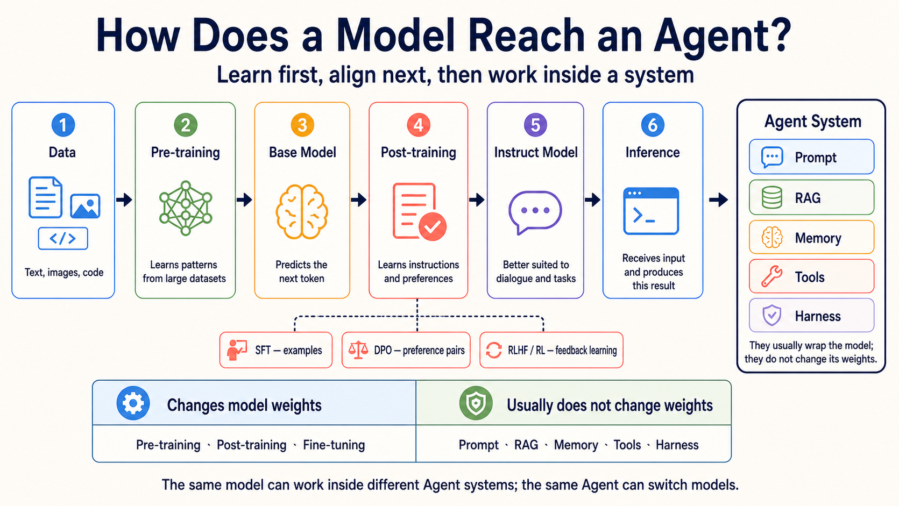

# Optional Guide: Model Training and Adaptation

> [繁體中文](./model-training-guide.md) | [简体中文](./model-training-guide.zh-Hans.md) | **English**

> [← Back to Stage 1](../stages/01-llm-basics.en.md)

This is a path-selection card, not a training course. It helps you tell which methods change a model and which methods simply help a model do a task. Beginners can read the tables first, then return to Stage 1 to call a ready-made model.

<small>Checked: 2026-08-31 UTC; scope: model training, adaptation, and serving methods.</small>

<!-- freshness: canonical=resources/model-training-guide.md; verified_on=2026-08-31; scope=model-training,post-training,adaptation,compression,inference; max_age_days=90 -->

## 🧭 See the whole path first

1. **Pre-training**: large amounts of data are used to build a Base Model.
2. **Post-training**: demonstrations, preferences, or feedback teach the model to follow instructions better.
3. **Inference**: after training, the model receives one input and produces one result.
4. **Agent system**: a model is connected to Prompt, RAG, Memory, Tools, and Harness to complete work.

## 🧩 Learn the methods without implementing them first

<table>
<thead><tr><th scope="col">Goal</th><th scope="col">Method</th><th scope="col">Plain meaning</th><th scope="col">Does it change weights?</th></tr></thead>
<tbody>
<tr><th scope="rowgroup" rowspan="4">Teach the model how to act</th><td><strong>SFT (Supervised Fine-Tuning)</strong></td><td>Show the model good questions and answers so it can imitate them.</td><td>Yes</td></tr>
<tr><td><strong>DPO (Direct Preference Optimization)</strong></td><td>Show two answers and indicate which one is preferred.</td><td>Yes</td></tr>
<tr><td><strong>RLHF/RL</strong></td><td>Use human or rule-based feedback to help the model get better results.</td><td>Yes</td></tr>
<tr><td><strong>GRPO</strong></td><td>Compare several answers to one question, then learn from their relative results.</td><td>Yes</td></tr>
</tbody>
<tbody>
<tr><th scope="rowgroup" rowspan="2">Adapt with fewer changes</th><td><strong>PEFT</strong></td><td>Train only a small part of the parameters.</td><td>Only selected or added parameters</td></tr>
<tr><td><strong>LoRA</strong></td><td>Freeze the original weights and train a smaller low-rank matrix.</td><td>Original weights no; added parameters yes</td></tr>
</tbody>
<tbody>
<tr><th scope="rowgroup" rowspan="2">Make serving smaller or cheaper</th><td><strong>Distillation</strong></td><td>Teach a smaller Student Model from a larger Teacher Model.</td><td>Trains the Student Model</td></tr>
<tr><td><strong>Quantization</strong></td><td>Store or compute weights with fewer bits, usually using less memory.</td><td>Usually no retraining of the original model; some methods add adjustment</td></tr>
</tbody>
</table>

## Do not mistake external systems for training

| Method | What it really does | Usually changes model weights? |
|---|---|---|
| **Prompt** | Tells the model what to do this time. | No |
| **RAG** | Finds outside information and puts evidence into this input. | No |
| **Memory** | Saves state for later and reads it back when needed. | No |
| **Tools** | Lets a program search, calculate, or take another action after checks. | No |
| **Harness** | Manages tools, permissions, state, logs, retries, and stop rules. | No |

“Usually no” matters. A product may start a separate training job behind the scenes. Check official documentation for training jobs, trainable parameters, or model weights.

## 📚 Required reading and selected resources

Read the first two to understand the main path. Use the others when you truly need to train or compress a model. Ratings are editorial guidance, not GitHub stars.

<table>
<thead><tr><th scope="col">Group</th><th scope="col">Resource</th><th scope="col">Rating</th><th scope="col">What you learn</th></tr></thead>
<tbody>
<tr><th scope="rowgroup" rowspan="2">Understand the main path</th><td><a href="https://openai.com/policies/how-chatgpt-and-our-foundation-models-are-developed/">OpenAI: how models are developed</a></td><td>⭐⭐⭐⭐⭐</td><td>How data, training, and models relate.</td></tr>
<tr><td><a href="https://developers.google.com/machine-learning/crash-course/llm/tuning">Google: LLM tuning</a></td><td>⭐⭐⭐⭐⭐</td><td>The boundary between Prompt Engineering, Fine-tuning, and Distillation.</td></tr>
</tbody>
<tbody>
<tr><th scope="rowgroup" rowspan="2">Learn Post-training</th><td><a href="https://openai.com/index/introducing-gpt-oss/">OpenAI: gpt-oss</a></td><td>⭐⭐⭐⭐</td><td>How one model family describes Pre-training, SFT, and RL.</td></tr>
<tr><td><a href="https://huggingface.co/docs/trl/quickstart">Hugging Face TRL</a></td><td>⭐⭐⭐⭐</td><td>An entry point for SFT, DPO, GRPO, and other Post-training methods.</td></tr>
</tbody>
<tbody>
<tr><th scope="rowgroup" rowspan="3">Adapt or compress</th><td><a href="https://huggingface.co/docs/peft/main/methods/overview">Hugging Face PEFT</a></td><td>⭐⭐⭐⭐</td><td>Approaches that train fewer parameters and their limits.</td></tr>
<tr><td><a href="https://huggingface.co/docs/peft/main/conceptual_guides/lora">Hugging Face LoRA</a></td><td>⭐⭐⭐⭐</td><td>Freeze original weights and train a low-rank matrix.</td></tr>
<tr><td><a href="https://huggingface.co/docs/transformers/main_classes/quantization">Hugging Face Quantization</a></td><td>⭐⭐⭐</td><td>Use lower precision to reduce memory and compute needs.</td></tr>
</tbody>
</table>

## 🛠 A decision exercise with no GPU

Choose a first path for each case and give one reason:

1. Company rules change every day: try **RAG** first.
2. Every answer must use a fixed brand voice: start with Prompt and Eval; consider **Fine-tuning** only if evidence shows it is needed.
3. The model is too large for the device: assess **Quantization** or a smaller model first.
4. You want to train fewer parameters for a special format: assess **LoRA/PEFT** first.

These are not permanent answers. Test with your own data, Eval, hardware, and cost limits.

Advanced: what to check before doing real training

- Do you have permission to use the training data, and have you removed sensitive data?
- Does the Base Model license allow your use and distribution method?
- Are training, validation, and test sets separate?
- Did you keep the unadapted model as a baseline?
- After training, did you rerun safety, bias, quality, cost, and latency Evals?
- Can you stop a failed job, keep a checkpoint, and return to the last usable version?

## ✅ Completion check

- [ ] I can say the order of Pre-training, Post-training, and Inference.
- [ ] I know Fine-tuning changes model weights, while RAG usually does not.
- [ ] I can explain SFT, DPO, RLHF/RL, and GRPO in one sentence each.
- [ ] I know LoRA/PEFT, Distillation, and Quantization solve different problems.
- [ ] I will not start an expensive training job just because I saw a new term.

> [← Back to Stage 1 and make your first model call](../stages/01-llm-basics.en.md)
