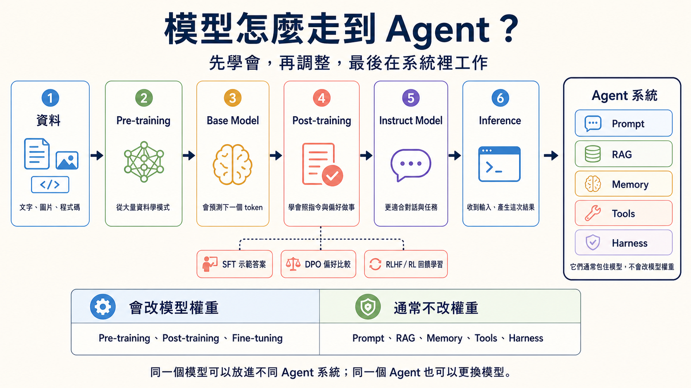

# 模型訓練與調整選修指南

> **繁體中文** | [简体中文](./model-training-guide.zh-Hans.md) | [English](./model-training-guide.en.md)

> [← 回到 Stage 1](../stages/01-llm-basics.md)

這是一張選路卡，不是訓練課。你只要看懂「哪一種方法會改模型，哪一種只是幫模型做事」。初學者可以先讀完表格，再回 Stage 1 呼叫現成模型。

<small>資料查核：2026-08-31 UTC；範圍：模型訓練、調整與部署方法。</small>

<!-- freshness: canonical=resources/model-training-guide.md; verified_on=2026-08-31; scope=model-training,post-training,adaptation,compression,inference; max_age_days=90 -->

## 🧭 先看整條路

1. **Pre-training（預訓練）**：用大量資料建立 Base Model。
2. **Post-training（後訓練）**：用示範、偏好或回饋，讓模型更會照指令做事。
3. **Inference（推論）**：模型訓練完後，收到一次輸入並產生一次結果。
4. **Agent 系統**：把模型和 Prompt、RAG、Memory、Tools、Harness 接起來完成工作。

## 🧩 先認識方法，不必先實作

<table>
<thead><tr><th scope="col">目的</th><th scope="col">方法</th><th scope="col">白話意思</th><th scope="col">會改權重嗎？</th></tr></thead>
<tbody>
<tr><th scope="rowgroup" rowspan="4">教模型怎麼做</th><td><strong>SFT（Supervised Fine-Tuning）</strong></td><td>把好問題和好答案給模型看，讓它模仿。</td><td>會</td></tr>
<tr><td><strong>DPO（Direct Preference Optimization）</strong></td><td>給模型看兩個答案，告訴它哪一個比較符合偏好。</td><td>會</td></tr>
<tr><td><strong>RLHF／RL</strong></td><td>用人類或規則的回饋，讓模型學著拿到更好的結果。</td><td>會</td></tr>
<tr><td><strong>GRPO</strong></td><td>讓同一題的多個答案互相比較，再用相對表現學習。</td><td>會</td></tr>
</tbody>
<tbody>
<tr><th scope="rowgroup" rowspan="2">少改一點就適應</th><td><strong>PEFT</strong></td><td>只訓練一小部分參數，減少需要更新的內容。</td><td>會改少量新增或選定參數</td></tr>
<tr><td><strong>LoRA</strong></td><td>凍結原本權重，另外學一組較小的低秩矩陣。</td><td>原權重不改；會訓練新增參數</td></tr>
</tbody>
<tbody>
<tr><th scope="rowgroup" rowspan="2">讓模型更小或更省</th><td><strong>Distillation（蒸餾）</strong></td><td>讓較小的 Student Model 學習較大的 Teacher Model。</td><td>會訓練 Student Model</td></tr>
<tr><td><strong>Quantization（量化）</strong></td><td>用較少位元保存或運算權重，通常能少用記憶體。</td><td>通常不重新訓練原模型；部分方法會再調整</td></tr>
</tbody>
</table>

## 不要把外部系統誤認成訓練

| 方法 | 它真正做的事 | 通常會改模型權重嗎？ |
|---|---|---|
| **Prompt** | 告訴模型這一次要做什麼。 | 不會 |
| **RAG** | 先找外部資料，再把證據放進這次輸入。 | 不會 |
| **Memory** | 保存之後還要用的狀態，再於需要時讀回。 | 不會 |
| **Tools** | 讓程式在檢查後執行搜尋、計算或其他動作。 | 不會 |
| **Harness** | 管理工具、權限、狀態、記錄、重試與停止規則。 | 不會 |

「通常不會」很重要。有些產品會在背後另外啟動訓練工作；只看畫面名稱無法判斷。要確認時，查看官方文件是否寫到 training job、trainable parameters 或 model weights。

## 📚 必修閱讀與精選資源

先讀前兩筆就能分清主線。其餘在你真的要訓練或壓縮模型時再看。推薦度是編輯判斷，不是 GitHub stars。

<table>
<thead><tr><th scope="col">分類</th><th scope="col">資源</th><th scope="col">推薦度</th><th scope="col">你會學到什麼</th></tr></thead>
<tbody>
<tr><th scope="rowgroup" rowspan="2">先分清主線</th><td><a href="https://openai.com/policies/how-chatgpt-and-our-foundation-models-are-developed/">OpenAI：模型如何開發</a></td><td>⭐⭐⭐⭐⭐</td><td>資料、訓練與模型之間的關係。</td></tr>
<tr><td><a href="https://developers.google.com/machine-learning/crash-course/llm/tuning">Google：LLM 調整</a></td><td>⭐⭐⭐⭐⭐</td><td>Prompt Engineering、Fine-tuning 與 Distillation 的邊界。</td></tr>
</tbody>
<tbody>
<tr><th scope="rowgroup" rowspan="2">學 Post-training</th><td><a href="https://openai.com/index/introducing-gpt-oss/">OpenAI：gpt-oss</a></td><td>⭐⭐⭐⭐</td><td>一個模型家族如何描述 Pre-training、SFT 與 RL。</td></tr>
<tr><td><a href="https://huggingface.co/docs/trl/quickstart">Hugging Face TRL</a></td><td>⭐⭐⭐⭐</td><td>SFT、DPO、GRPO 等 Post-training 方法入口。</td></tr>
</tbody>
<tbody>
<tr><th scope="rowgroup" rowspan="3">少改或壓縮</th><td><a href="https://huggingface.co/docs/peft/main/methods/overview">Hugging Face PEFT</a></td><td>⭐⭐⭐⭐</td><td>只訓練較少參數的做法與限制。</td></tr>
<tr><td><a href="https://huggingface.co/docs/peft/main/conceptual_guides/lora">Hugging Face LoRA</a></td><td>⭐⭐⭐⭐</td><td>凍結原權重，再訓練低秩矩陣。</td></tr>
<tr><td><a href="https://huggingface.co/docs/transformers/main_classes/quantization">Hugging Face Quantization</a></td><td>⭐⭐⭐</td><td>用較低精度減少記憶體與運算需求。</td></tr>
</tbody>
</table>

## 🛠 一個不花 GPU 的判斷練習

把下面四個問題各選一條先試的路，再用一句話說理由：

1. 每天更新的公司規章要能被回答：先試 **RAG**。
2. 每次輸出都要符合固定品牌語氣：先用 Prompt 與 Eval；證據顯示不夠時，再評估 **Fine-tuning**。
3. 模型太大，裝置放不下：先評估 **Quantization** 或較小模型。
4. 想少訓練參數，讓模型適應專門格式：先評估 **LoRA／PEFT**。

這不是永遠正確的答案。真正決定前，要用自己的資料、Eval、硬體與成本限制測試。

進階：真正動手前還要確認什麼？

- 你有沒有合法使用訓練資料，並移除不該出現的敏感資料？
- Base Model 的 license 是否允許你的用途與散布方式？
- 訓練集、驗證集與測試集是否分開？
- 你是否保留未調整模型作為 baseline？
- 訓練後是否重新跑安全、偏差、品質、成本與延遲 Eval？
- 你能不能停止失敗工作、保留 checkpoint，並回到上一個可用版本？

## ✅ 完成檢查

- [ ] 我能說出 Pre-training、Post-training 與 Inference 的順序。
- [ ] 我知道 Fine-tuning 會調整模型權重，RAG 通常不會。
- [ ] 我能用一句話分清 SFT、DPO、RLHF／RL 與 GRPO。
- [ ] 我知道 LoRA／PEFT、Distillation 與 Quantization 解決的問題不同。
- [ ] 我不會因為看到一個新名詞，就立刻開始昂貴的訓練工作。

> [← 回到 Stage 1，繼續第一次模型呼叫](../stages/01-llm-basics.md)
