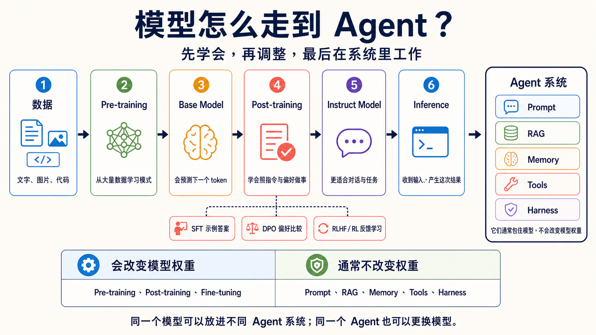

# 模型训练与调整选修指南

> [繁體中文](./model-training-guide.md) | **简体中文** | [English](./model-training-guide.en.md)

> [← 回到 Stage 1](../stages/01-llm-basics.zh-Hans.md)

这是一张选路卡，不是训练课程。它帮助你分清哪些方法会改变模型，哪些方法只是帮助模型完成任务。初学者可以先读表格，再回到 Stage 1 调用现成模型。

<small>数据查核：2026-08-31 UTC；范围：模型训练、调整与部署方法。</small>

<!-- freshness: canonical=resources/model-training-guide.md; verified_on=2026-08-31; scope=model-training,post-training,adaptation,compression,inference; max_age_days=90 -->

## 🧭 先看整条路

1. **Pre-training（预训练）**：用大量数据建立 Base Model。
2. **Post-training（后训练）**：用示范、偏好或反馈，让模型更会遵循指令。
3. **Inference（推理）**：训练完成后，模型收到一次输入并产生一次结果。
4. **Agent 系统**：把模型和 Prompt、RAG、Memory、Tools、Harness 连接起来完成工作。

## 🧩 先认识方法，不必先实作

<table>
<thead><tr><th scope="col">目的</th><th scope="col">方法</th><th scope="col">白话意思</th><th scope="col">会改变权重吗？</th></tr></thead>
<tbody>
<tr><th scope="rowgroup" rowspan="4">教模型如何行动</th><td><strong>SFT（Supervised Fine-Tuning）</strong></td><td>把好问题和好答案给模型看，让它模仿。</td><td>会</td></tr>
<tr><td><strong>DPO（Direct Preference Optimization）</strong></td><td>给模型看两个答案，告诉它哪一个更符合偏好。</td><td>会</td></tr>
<tr><td><strong>RLHF/RL</strong></td><td>用人类或规则的反馈，让模型学着得到更好的结果。</td><td>会</td></tr>
<tr><td><strong>GRPO</strong></td><td>比较同一问题的多个答案，再根据相对结果学习。</td><td>会</td></tr>
</tbody>
<tbody>
<tr><th scope="rowgroup" rowspan="2">少改一点来适应</th><td><strong>PEFT</strong></td><td>只训练一小部分参数，减少需要更新的内容。</td><td>只改选定或新增参数</td></tr>
<tr><td><strong>LoRA</strong></td><td>冻结原来的权重，另外训练较小的低秩矩阵。</td><td>原权重不改；新增参数会训练</td></tr>
</tbody>
<tbody>
<tr><th scope="rowgroup" rowspan="2">让模型更小或更省</th><td><strong>Distillation（蒸馏）</strong></td><td>让较小的 Student Model 学习较大的 Teacher Model。</td><td>会训练 Student Model</td></tr>
<tr><td><strong>Quantization（量化）</strong></td><td>用更少位元保存或运算权重，通常能少用内存。</td><td>通常不重新训练原模型；部分方法会再调整</td></tr>
</tbody>
</table>

## 不要把外部系统误认成训练

| 方法 | 它真正做的事 | 通常会改变模型权重吗？ |
|---|---|---|
| **Prompt** | 告诉模型这一次要做什么。 | 不会 |
| **RAG** | 先找外部资料，再把证据放进这次输入。 | 不会 |
| **Memory** | 保存之后还要用的状态，需要时再读回来。 | 不会 |
| **Tools** | 让程序在检查后执行搜索、计算或其他动作。 | 不会 |
| **Harness** | 管理工具、权限、状态、记录、重试和停止规则。 | 不会 |

“通常不会”很重要。有些产品可能在背后另外启动训练工作。要确认时，查看官方文档是否写到 training job、trainable parameters 或 model weights。

## 📚 必修阅读与精选资源

先读前两项就能分清主线。其余在你真的要训练或压缩模型时再看。推荐度是编辑判断，不是 GitHub stars。

<table>
<thead><tr><th scope="col">分类</th><th scope="col">资源</th><th scope="col">推荐度</th><th scope="col">你会学到什么</th></tr></thead>
<tbody>
<tr><th scope="rowgroup" rowspan="2">先分清主线</th><td><a href="https://openai.com/policies/how-chatgpt-and-our-foundation-models-are-developed/">OpenAI：模型如何开发</a></td><td>⭐⭐⭐⭐⭐</td><td>数据、训练与模型之间的关系。</td></tr>
<tr><td><a href="https://developers.google.com/machine-learning/crash-course/llm/tuning">Google：LLM 调整</a></td><td>⭐⭐⭐⭐⭐</td><td>Prompt Engineering、Fine-tuning 与 Distillation 的边界。</td></tr>
</tbody>
<tbody>
<tr><th scope="rowgroup" rowspan="2">学习 Post-training</th><td><a href="https://openai.com/index/introducing-gpt-oss/">OpenAI：gpt-oss</a></td><td>⭐⭐⭐⭐</td><td>一个模型家族如何描述 Pre-training、SFT 与 RL。</td></tr>
<tr><td><a href="https://huggingface.co/docs/trl/quickstart">Hugging Face TRL</a></td><td>⭐⭐⭐⭐</td><td>SFT、DPO、GRPO 等 Post-training 方法入口。</td></tr>
</tbody>
<tbody>
<tr><th scope="rowgroup" rowspan="3">少改或压缩</th><td><a href="https://huggingface.co/docs/peft/main/methods/overview">Hugging Face PEFT</a></td><td>⭐⭐⭐⭐</td><td>只训练较少参数的做法与限制。</td></tr>
<tr><td><a href="https://huggingface.co/docs/peft/main/conceptual_guides/lora">Hugging Face LoRA</a></td><td>⭐⭐⭐⭐</td><td>冻结原权重，再训练低秩矩阵。</td></tr>
<tr><td><a href="https://huggingface.co/docs/transformers/main_classes/quantization">Hugging Face Quantization</a></td><td>⭐⭐⭐</td><td>用更低精度减少内存与运算需求。</td></tr>
</tbody>
</table>

## 🛠 一个不花 GPU 的判断练习

给下面四个问题各选一条先试的路，再用一句话说理由：

1. 每天更新的公司规定要能被回答：先试 **RAG**。
2. 每次输出都要符合固定品牌语气：先用 Prompt 与 Eval；证据显示不够时，再评估 **Fine-tuning**。
3. 模型太大，设备放不下：先评估 **Quantization** 或较小模型。
4. 想少训练参数，让模型适应专门格式：先评估 **LoRA/PEFT**。

这不是永远正确的答案。真正决定前，要用自己的数据、Eval、硬件与成本限制测试。

进阶：真正动手前还要确认什么？

- 你是否有权使用训练数据，并移除了不该出现的敏感资料？
- Base Model 的 license 是否允许你的用途与分发方式？
- 训练集、验证集与测试集是否分开？
- 是否保留未调整模型作为 baseline？
- 训练后是否重新运行安全、偏差、质量、成本和延迟 Eval？
- 能否停止失败的任务、保留 checkpoint，并回到上一个可用版本？

## ✅ 完成检查

- [ ] 我能说出 Pre-training、Post-training 与 Inference 的顺序。
- [ ] 我知道 Fine-tuning 会改变模型权重，而 RAG 通常不会。
- [ ] 我能用一句话分清 SFT、DPO、RLHF/RL 与 GRPO。
- [ ] 我知道 LoRA/PEFT、Distillation 与 Quantization 解决的问题不同。
- [ ] 我不会因为看到一个新名词，就立刻开始昂贵的训练工作。

> [← 回到 Stage 1，继续第一次模型调用](../stages/01-llm-basics.zh-Hans.md)
