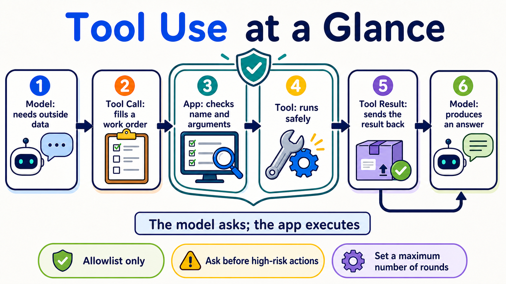

# Stage 3 — Tool Use & Your First Agent Loop ⭐

🌐 **English** | [繁體中文](03-tool-use-and-hello-agent.md) | [简体中文](03-tool-use-and-hello-agent.zh-Hans.md)

This stage does one thing: let the model fill out a “tool work order,” then have your program validate it, execute it, and send the result back. This round trip is your first **Agent Loop**.

<!-- freshness: canonical=stages/03-tool-use-and-hello-agent.md; verified_on=2026-08-27; scope=models,pricing,tool-apis,security; max_age_days=90 -->

## 📌 Learning Objectives

By the end, you can:

- Name the five steps: `schema → call → execute → result → answer`.
- Define a tool, validate its arguments, and safely run the corresponding function.
- Write an **Agent Loop** with a step limit and a stopping condition, without a framework.
- Tell **Function Calling** and **Structured Output** apart instead of treating them as the same thing.
- Compare schemas or models with fixed prompts rather than drawing a conclusion from one result.

## 🚪 Entry Conditions

If you can run a Python file, understand functions and dicts, and have completed [Stage 02](02-prompt-engineering.en.md), you are ready. If your environment is not ready, go back to [Stage 00](00-foundations.en.md) first.

## 🧩 Eight Core Terms First

### **Tool Use**

When a model needs external data or an action, it first makes a tool request. It is like a child asking an adult to open a box on a high shelf: the model says what it wants done, and the program actually acts. This chapter uses it to check weather and do calculations. **The model itself does not execute your client tool.**

### **Function Calling**

The model returns a function name and arguments in an agreed format. It is like filling out a work order with fixed fields. This chapter uses it to turn a natural-language question into a request that a program can read. Message formats are not identical across providers.

### **Tool Schema**

A schema is a tool’s information card: its name, purpose, fields, and data types. It is like a menu telling a customer what can be ordered. This chapter describes tools with JSON Schema. A schema constrains the shape, but the program must still validate values, permissions, and business rules.

### **Tool Call**

A Tool Call is the work order filled out by the model. It contains the tool name, call ID, and arguments. For example: “Check Taipei, using Celsius.” This chapter’s program reads it first, then finds an allowed function in the allowlist. It is a request, not an execution result.

### **Tool Result**

A Tool Result is the data returned after the program finishes the work, matched back to the original request by call ID. It is like a kitchen putting a completed dish on the correct table. This chapter sends successful or error results back to the model. External results may be untrusted and must not be treated as highest-priority instructions.

### **Agent Loop**

The program repeats “ask the model → execute a tool → return the result” until it gets an answer or reaches a limit. It is like following a recipe one step at a time and stopping when it is done. The full round trip is `model → tool call → execute → tool result → model`. This chapter’s working definition is `model + tools + bounded loop`; it is a learning definition, not the only academic definition of an Agent.

### **ReAct**

ReAct alternates between deciding the next step, taking an action, observing what happened, and continuing. It is like looking on the table for your keys first, then checking a drawer if they are not there. The loop written here is **ReAct-inspired and observable**; it does not require the model to reveal private Chain-of-Thought.

### **Structured Output**

The model returns data in a fixed shape, such as JSON that conforms to a schema. It is like filling an answer into a form. This chapter contrasts it with Function Calling: the former asks for data, while the latter asks a program to take an action. Even a valid shape can contain wrong content, a refusal, or truncated output.



## Choose the Right Method First

| What you need | Start with | Example |
|---|---|---|
| Only a text answer | A normal model response | Rewrite an email |
| Data in a fixed shape | Structured Output | Extract a name and date |
| Live data or an action | Function Calling / Tool Use | Check weather, create a ticket |

## ⚠️ Five Guardrails Before Writing Your First Agent

1. Execute only tools in the allowlist; never use a model-generated name for arbitrary function calls.
2. Treat tool arguments as untrusted input; validate types, ranges, and permissions first.
3. Give a tool only the minimum permissions needed to complete the task.
4. Require human confirmation before high-risk actions such as deleting, paying, or sending email.
5. Set a maximum number of turns, a timeout, and a cost limit; do not let the Agent loop forever.

## 📚 Required Reading

Read in this order:

1. [Ollama Tool Calling](https://docs.ollama.com/capabilities/tool-calling) ⭐⭐⭐⭐⭐ — Start with the single-tool and multi-turn loop.
2. [Anthropic — How Tool Use Works](https://platform.claude.com/docs/en/agents-and-tools/tool-use/how-tool-use-works) ⭐⭐⭐⭐⭐ — See what the model, application, and tool result each do.
3. [ReAct paper](https://arxiv.org/abs/2210.03629) ⭐⭐⭐⭐ — Read the abstract first; learn where Reasoning + Acting comes from without trying to finish every equation at once.

<details markdown="1">
<summary>Expand prerequisites, setup, time, and budget</summary>

**Prerequisites**: You can run Python, understand lists/dicts/functions, and have completed [Stage 02](02-prompt-engineering.en.md).

**Primary local path**: Ollama + `qwen2.5:3b`. This is the beginner model retained after verifying the user’s installation; it is not claimed to be best for every schema.

```powershell
ollama pull qwen2.5:3b
ollama serve
python -m pip install "openai>=3.3,<4"
```

**Cloud comparison path**: Anthropic + a pinned Haiku model ID.

```powershell
$env:ANTHROPIC_API_KEY="paste-your-key-here"
python -m pip install "anthropic>=1.0,<2"
```

On macOS/Linux, set it with `export ANTHROPIC_API_KEY="paste-your-key-here"`. Do not put the key in code or commit it.

**Time**: Plan about 2–3 hours for Exercises 1–3, about 3–5 hours for Exercises 4–6, and 5–8 hours for the full active path.

**Cost calculation**:

```text
cost = input tokens ÷ 1,000,000 × input price
     + output tokens ÷ 1,000,000 × output price
```

At the 2026-08-27 check, Claude Haiku 4.5 was `$1 / $5` (input / output, per million tokens). If one request uses 2,000 input + 1,000 output tokens, the example cost is about `$0.007`. A tool loop sends multiple requests; reserve `$0.05` per exercise first, and set a `$1` provider spend limit for five full-chapter experiments. These are conservative caps, not billing guarantees.

Path A has **`$0` in API cost**; it still uses your hardware, memory, and electricity.

</details>

### Classic Agent Paradigms (thinking patterns)

<details markdown="1">
<summary>Expand for the differences between CoT, ReAct, Reflection, and Planning</summary>

| Term | Plain-language use | Where to learn it |
|---|---|---|
| **Chain-of-Thought (CoT)** | Early prompt techniques often asked for intermediate reasoning. Do not treat a full private chain of thought as a general output requirement; when checking, look at the final answer and a short, verifiable reason | [Stage 02](02-prompt-engineering.en.md) |
| **ReAct** | Alternate actions and observations in a loop, then decide the next step | Exercise 3 of this chapter |
| **Reflection** | A broad practice of using one round of feedback to improve the next attempt | The routing section below |
| **Reflexion / Self-Refine** | Research patterns with an explicit Actor/Critic or self-feedback process | This chapter’s concepts; persistent-memory version in [Stage 06](06-memory-rag.en.md) |
| **Planning** | Break the task into steps, then adjust the plan from results | [Stage 07.5](07.5-advanced-agentic-concepts.en.md) |

These terms describe different ways to solve problems, not the only test for whether something is an Agent. Computer-use, CodeAct, and workflow agents may use different loops too.

</details>

## 🛠 Hands-on Exercises

Complete Exercises 1–3 first. Exercises 4–6 make the loop more robust; you do not need to finish them all in one day.

### Exercise 1: Function Calling (One Tool, One Call)

After finishing, you will see the model first produce a `get_weather` Tool Call, the program execute it, and the model answer using the Tool Result.

If you prefer working from files, open the [complete Exercise 1 folder](../examples/stage-3/01-function-calling/README.en.md).

**First action**: Copy and run `ollama pull qwen2.5:3b`. Then expand Path A and copy the complete program into `hello_tool.py`.

<details markdown="1">
<summary>Path A: Complete copyable Ollama example (API cost `$0`)</summary>

```python
import json

from openai import OpenAI

client = OpenAI(base_url="http://localhost:11434/v1", api_key="ollama")

TOOLS = [{
    "type": "function",
    "function": {
        "name": "get_weather",
        "description": "Get demonstration weather data for a specified city",
        "parameters": {
            "type": "object",
            "properties": {
                "city": {"type": "string", "description": "City name, for example Taipei"},
                "unit": {"type": "string", "enum": ["celsius"]},
            },
            "required": ["city", "unit"],
            "additionalProperties": False,
        },
    },
}]


def get_weather(city: str, unit: str) -> dict:
    if unit != "celsius":
        raise ValueError("Only celsius is accepted")
    return {"city": city, "temperature": 26, "unit": unit}


messages = [{"role": "user", "content": "What is the temperature in Taipei now?"}]
first = client.chat.completions.create(
    model="qwen2.5:3b", messages=messages, tools=TOOLS
)
assistant = first.choices[0].message
messages.append(assistant.model_dump(exclude_none=True))

for call in assistant.tool_calls or []:
    if call.function.name != "get_weather":
        raise ValueError(f"Tool not allowed: {call.function.name}")
    args = json.loads(call.function.arguments)
    if (
        not isinstance(args, dict)
        or set(args) != {"city", "unit"}
        or not isinstance(args["city"], str)
        or not args["city"].strip()
        or args["unit"] != "celsius"
    ):
        raise ValueError("city must be a non-empty string and unit must be celsius")
    result = get_weather(args["city"], args["unit"])
    messages.append({
        "role": "tool",
        "tool_call_id": call.id,
        "content": json.dumps(result, ensure_ascii=False),
    })

if not assistant.tool_calls:
    raise RuntimeError("The model did not call a tool; check the model and schema")

final = client.chat.completions.create(
    model="qwen2.5:3b", messages=messages, tools=TOOLS
)
print(final.choices[0].message.content)

assert assistant.tool_calls[0].function.name == "get_weather"
assert any(message["role"] == "tool" for message in messages)
```

```powershell
python hello_tool.py
```

This uses the **OpenAI Python SDK connected to Ollama’s compatible Chat Completions endpoint**; data is not sent to the OpenAI cloud. `additionalProperties: false` helps with the schema, but Ollama and OpenAI strict-mode guarantees are not identical; the program must still validate.

If the model does not call the tool, keep the question, model, and schema unchanged and rerun three times, recording the success count; do not declare that the model “does not support it” after one failure.

</details>

<details markdown="1">
<summary>Path B: Complete Anthropic round trip (reserve `$0.05` first per run)</summary>

```python
import json
import os

import anthropic

client = anthropic.Anthropic(api_key=os.environ["ANTHROPIC_API_KEY"])
tools = [{
    "name": "get_weather",
    "description": "Get demonstration weather data for a specified city",
    "input_schema": {
        "type": "object",
        "properties": {"city": {"type": "string"}},
        "required": ["city"],
        "additionalProperties": False,
    },
}]


def get_weather(city: str) -> dict:
    return {"city": city, "temperature": 26, "unit": "celsius"}


messages = [{"role": "user", "content": "What is the temperature in Taipei now?"}]

first = client.messages.create(
    model="claude-haiku-4-5-20251001",
    max_tokens=512,
    tools=tools,
    messages=messages,
)
messages.append({"role": "assistant", "content": first.content})
tool_results = []
for block in first.content:
    if block.type == "tool_use":
        if block.name != "get_weather":
            raise ValueError(f"Tool not allowed: {block.name}")
        if (
            set(block.input) != {"city"}
            or not isinstance(block.input["city"], str)
            or not block.input["city"].strip()
        ):
            raise ValueError("get_weather requires one string city")
        result = get_weather(block.input["city"])
        tool_results.append({
            "type": "tool_result",
            "tool_use_id": block.id,
            "content": json.dumps(result, ensure_ascii=False),
        })

if not tool_results:
    raise RuntimeError(f"No tool request; stop_reason={first.stop_reason}")

messages.append({"role": "user", "content": tool_results})
final = client.messages.create(
    model="claude-haiku-4-5-20251001",
    max_tokens=512,
    tools=tools,
    messages=messages,
)
print("\n".join(block.text for block in final.content if block.type == "text"))
```

An Anthropic client-tool failure must use the corresponding `tool_use_id` and add `"is_error": true`. Do not insert a tool result into the system prompt.

</details>

### Exercise 2: Multi-Tool Selection

After finishing, the model chooses one of `calculator` and `get_weather`, and the program dispatches only names in the allowlist.

**First action**: Run this mock test directly; no key is needed:

```powershell
python examples/stage-3/02-multi-tool-selection/test.py
```

<details markdown="1">
<summary>Expand Path A/Path B, observation points, and budget</summary>

- [Path A README (Ollama)](../examples/stage-3/02-multi-tool-selection/README.en.md): run `python starter.py`.
- The same folder’s `starter_anthropic.py` is Path B; run `python test_anthropic.py` to validate the message shape with a mock first.
- Observe `tool_calls[0].function.name`, then confirm that the program rejects unknown names.
- Do not dispatch tools with `globals()[model_name]()` or `eval()`.

Path A has `$0` in API cost; reserve `$0.05` for one Path B round first.

</details>

### Structured Output (Structured Outputs / JSON mode) ⭐ function calling’s twin

Function Calling means “ask a program to do something”; Structured Output means “ask the model to put data into a fixed shape.” Both use schemas, but their purposes differ.

<details markdown="1">
<summary>Expand strict mode, JSON mode, and common limitations</summary>

- **JSON mode** usually guarantees only that the response can be parsed as JSON; it does not necessarily follow your field rules.
- **Structured Output** constrains the schema shape within provider-supported limits; refusal, truncation, or semantic errors can still occur.
- **OpenAI strict mode** requires every object to set `additionalProperties: false` and list all properties as required; Chat Completions is still not strict by default.
- **Anthropic strict tool use** has different schema and message formats from OpenAI; do not copy flag names directly.
- **Ollama/other compatible endpoints** vary by model and version. Validate with a fixed eval; do not infer identical behavior from “compatible.”

For Python model-based schema management, see [567-labs/instructor](https://github.com/567-labs/instructor); for constrained decoding, see [dottxt-ai/outlines](https://github.com/dottxt-ai/outlines). Whichever you use, the program must handle parsing and semantic errors.

</details>

### Exercise 3: Implement ReAct from Scratch (No Framework)

After finishing, you will have a minimal Agent Loop: the model can call tools multiple times, but it always stops after the limit.

**First action**: Run the test that needs no key:

```powershell
python examples/stage-3/03-react-from-scratch/test.py
```

<details markdown="1">
<summary>Expand the 13-line loop, two paths, and completion conditions</summary>

```python
for step in range(MAX_STEPS):
    response = ask_model(messages, tools)
    calls = read_tool_calls(response)
    if not calls:
        return read_final_text(response)
    for call in calls:
        name, args, call_id = validate_call(call)
        result = TOOL_IMPL[name](**args)
        messages.append(make_tool_result(call_id, result))
raise RuntimeError(f"Agent exceeded {MAX_STEPS} steps and stopped")
```

The real program must also put the assistant’s Tool Call back into history and handle refusal, max tokens, timeout, unknown tools, JSON parsing, and tool exceptions. The complete two paths are in [`03-react-from-scratch`](../examples/stage-3/03-react-from-scratch/README.en.md).

Record a trace as `action / observation / final` or a short verifiable summary; do not make private Chain-of-Thought a logging contract.

Path A has `$0` in API cost; reserve `$0.05` for one Path B loop first. **Completion condition**: tests prove that “no tool call stops” and “exceeding `MAX_STEPS` raises an error.”

</details>

### Exercise 4: Multi-Step Reasoning Task

After finishing, the same loop first checks data and then calculates, with a corresponding call ID and result for every step.

**First action**: Copy the test command:

```powershell
python examples/stage-3/04-multi-step-reasoning/test.py
```

<details markdown="1">
<summary>Expand the task, comparison method, and budget</summary>

Example task: “Check Taipei’s temperature, then convert it to Fahrenheit.” Use separate `get_weather` and `celsius_to_fahrenheit` tools. Do not secretly combine the two steps into one fake tool; this exercise observes whether the model continues from the previous result.

The complete two paths are in [`04-multi-step-reasoning`](../examples/stage-3/04-multi-step-reasoning/README.en.md). When comparing models, keep the prompt, tools, schema, `MAX_STEPS`, and test cases fixed; rerun at least five times and record success rates and failure types.

Path A has `$0` in API cost; reserve `$0.10` for multiple Path B requests. A larger model may be more stable, or merely more expensive; use an eval to decide.

</details>

### Exercise 5: Error Handling

After finishing, the program returns tool errors that the model can correct, while clearly stopping on transport, parsing, or limit errors.

**First action**: Run both mock tests:

```powershell
python examples/stage-3/05-error-handling/test.py
python examples/stage-3/05-error-handling/test_anthropic.py
```

<details markdown="1">
<summary>Expand error categories, bounded retry, and budget</summary>

| Error | What the program does first | Send back to the model? |
|---|---|---|
| Network timeout/rate limit | Retry with a bound; record the error | Usually not at first |
| Tool Call JSON parsing failure | Do not execute the tool; report a format error | Yes, as an error result |
| Unknown tool/unauthorized argument | Reject execution; leave an audit log | Yes, but never relax permissions |
| Tool cannot find data | Return a clear, minimal semantic error | Yes, so the model can revise or give up |
| `MAX_STEPS`/cost limit reached | Stop immediately | Do not retry |

Anthropic’s failed `tool_result` uses `"is_error": true`. On the OpenAI-compatible path, structured errors can go in the `role: tool` content, but the application must still limit retries.

The complete two paths are in [`05-error-handling`](../examples/stage-3/05-error-handling/README.en.md). Path A has `$0` in API cost; reserve `$0.10` for one Path B error-recovery round.

</details>

### Exercise 6: Function Schema Design (Fixing a Bad Schema)

After finishing, you will compare two schemas with the same set of questions and identify improvements to descriptions, fields, enums, or constraints.

**First action**: Run the bad and good mock tests directly:

```powershell
python examples/stage-3/06-schema-design/test.py
python examples/stage-3/06-schema-design/test_anthropic.py
```

<details markdown="1">
<summary>Expand the five rules, eval card, and budget</summary>

1. Use a clear verb plus noun for a tool name, such as `get_weather`.
2. Say when to use the tool and when not to use it in the description.
3. Give every field a clear name, type, and example.
4. Use `enum`, ranges, and `additionalProperties: false` to constrain inputs explicitly when possible.
5. The schema owns only the interface; the program still validates permissions, business rules, and data safety.

The complete two paths are in [`06-schema-design`](../examples/stage-3/06-schema-design/README.en.md), with a quick reference in [`resources/schema-design-cheatsheet.en.md`](../resources/schema-design-cheatsheet.en.md).

Copy this result card directly; you do not need to draw a blank table first:

```text
Fixed prompt: ________________
Bad schema | success __ / 5 | main error: ________________
Good schema | success __ / 5 | main improvement: ________________
Conclusion | most helpful field: ________________
```

Do not write “a certain model almost always fails.” Path A has `$0` in API cost; reserve `$0.25` for five Path B comparisons first.

</details>

## 🎒 Recommended Mini-Project: A Safe Weather Helper

Connect Exercises 1–6, keeping only two read-only tools: `get_weather` and `convert_temperature`. Add an allowlist, argument validation, `MAX_STEPS`, a timeout, error results, and a five-question eval.

The minimum deliverable is `agent.py`, `test_agent.py`, `eval_cases.json`, and one result card. Get the mock tests passing before running a local model; do not start with payment, file-deletion, or email tools.

### 🪞 Reflection (Reflexion / Self-Refine) — Concept + Routing

<details markdown="1">
<summary>Expand the relationship between Reflection, Reflexion, Self-Refine, and memory</summary>

- **Reflection** is the broad term: inspect the previous round and improve the next one.
- **Reflexion** often writes failures, feedback, and the next strategy into reusable text records.
- **Self-Refine** often improves one output through a “generate → critique → rewrite” cycle.
- These are sibling patterns to ReAct; they are not Tool Use and do not necessarily need persistent memory.

This chapter covers a single-session loop only. For carrying failed experiences across sessions, go to [Stage 06 Reflection Memory](06-memory-rag.en.md); for fuller planning, verification, and long-running execution, go to [Stage 07.5](07.5-advanced-agentic-concepts.en.md).

</details>

## 🎯 Curated Projects

Complete one five-star route first: official docs → Exercises 1–3 → one from-scratch implementation. The full table is a toolbox, not a list of 21 tasks.

<small>Resources checked: 2026-08-27 UTC</small>

> Ratings indicate this Stage’s learning priority, not popularity: `⭐⭐⭐⭐⭐` = skipping it will block this chapter’s route; `⭐⭐⭐⭐` = recommended early; `⭐⭐⭐` = read if needed; `⭐⭐` = historical or niche context.

<table>
  <thead>
    <tr>
      <th scope="col">Category</th>
      <th scope="col">Resource</th>
      <th scope="col">Do first</th>
      <th scope="col">Status / license</th>
      <th scope="col">Rating</th>
    </tr>
  </thead>
  <tbody>
    <tr><th scope="rowgroup" rowspan="6">Official core docs</th><td><a href="https://platform.claude.com/docs/en/agents-and-tools/tool-use/how-tool-use-works">Anthropic — How Tool Use Works</a></td><td>Start with the five-step client-tool round trip.</td><td>Official docs</td><td>⭐⭐⭐⭐⭐</td></tr>
    <tr><td><a href="https://platform.claude.com/docs/en/agents-and-tools/tool-use/handle-tool-calls">Anthropic — Handle Tool Calls</a></td><td>Look at call IDs, results, and <code>is_error</code>.</td><td>Official docs</td><td>⭐⭐⭐⭐⭐</td></tr>
    <tr><td><a href="https://docs.ollama.com/capabilities/tool-calling">Ollama — Tool Calling</a></td><td>Run the single-tool and agent-loop examples once.</td><td>Official docs</td><td>⭐⭐⭐⭐⭐</td></tr>
    <tr><td><a href="https://developers.openai.com/api/docs/guides/function-calling">OpenAI — Function Calling</a></td><td>Compare function schemas and strict mode.</td><td>Official docs</td><td>⭐⭐⭐⭐</td></tr>
    <tr><td><a href="https://ai.google.dev/gemini-api/docs/function-calling">Google Gemini — Function Calling</a></td><td>Compare sequential/parallel calls when you need Gemini.</td><td>Official docs</td><td>⭐⭐⭐</td></tr>
    <tr><td><a href="https://arxiv.org/abs/2210.03629">ReAct paper</a></td><td>Read the abstract and method diagram first.</td><td>Original paper; arXiv</td><td>⭐⭐⭐⭐</td></tr>
  </tbody>
  <tbody>
    <tr><th scope="rowgroup" rowspan="4">Official courses and examples</th><td><a href="https://github.com/anthropics/courses">Anthropic Courses — Tool Use</a></td><td>Complete the Tool Use notebook.</td><td>Official course; upstream provides no SPDX</td><td>⭐⭐⭐⭐</td></tr>
    <tr><td><a href="https://github.com/anthropics/claude-cookbooks/tree/main/tool_use">Anthropic Tool Use Cookbook</a></td><td>Move from one tool to parallel tools.</td><td>Maintained; MIT</td><td>⭐⭐⭐⭐⭐</td></tr>
    <tr><td><a href="https://github.com/anthropics/claude-quickstarts">Anthropic Quickstarts</a></td><td>After the exercises, see how a full app connects tools.</td><td>Maintained; MIT</td><td>⭐⭐⭐⭐</td></tr>
    <tr><td><a href="https://github.com/microsoft/ai-agents-for-beginners">Microsoft AI Agents for Beginners</a></td><td>Choose a chapter if you want another complete course.</td><td>Maintained; MIT</td><td>⭐⭐⭐⭐</td></tr>
  </tbody>
  <tbody>
    <tr><th scope="rowgroup" rowspan="4">From-scratch implementations</th><td><a href="https://github.com/pguso/ai-agents-from-scratch">pguso/ai-agents-from-scratch</a></td><td>Use Ollama to compare with Exercise 3’s loop.</td><td>Maintained; MIT</td><td>⭐⭐⭐⭐⭐</td></tr>
    <tr><td><a href="https://github.com/arunpshankar/react-from-scratch">arunpshankar/react-from-scratch</a></td><td>Read later for Gemini/Reflection variants.</td><td>Updates slowed (last push 2025-05); Apache-2.0</td><td>⭐⭐⭐</td></tr>
    <tr><td><a href="https://github.com/mattambrogi/agent-implementation">mattambrogi/agent-implementation</a></td><td>Use only to read through a minimal teaching toy line by line.</td><td>Historical reference (last push 2024-01); upstream provides no SPDX</td><td>⭐⭐</td></tr>
    <tr><td><a href="https://github.com/lsdefine/GenericAgent">lsdefine/GenericAgent</a></td><td>Compare it later if you want to see a small framework.</td><td>Maintained; MIT</td><td>⭐⭐⭐</td></tr>
  </tbody>
  <tbody>
    <tr><th scope="rowgroup" rowspan="3">Framework / CodeAct comparisons</th><td><a href="https://github.com/huggingface/smolagents">Hugging Face Smolagents</a></td><td>Compare CodeAct after completing the JSON-tool loop.</td><td>Maintained; Apache-2.0</td><td>⭐⭐⭐⭐</td></tr>
    <tr><td><a href="https://github.com/QuantaLogic/quantalogic">QuantaLogic</a></td><td>Read later when you need a second CodeAct implementation.</td><td>Updates slower (last push 2025-12); Apache-2.0</td><td>⭐⭐⭐</td></tr>
    <tr><td><a href="https://github.com/langchain-ai/react-agent">LangChain ReAct Agent</a></td><td>See how a framework wraps the loop you wrote yourself.</td><td>Maintained; MIT</td><td>⭐⭐⭐</td></tr>
  </tbody>
  <tbody>
    <tr><th scope="rowgroup" rowspan="2">Chinese chapter-style textbooks</th><td><a href="https://github.com/datawhalechina/hello-agents">datawhalechina/hello-agents</a></td><td>Use this route for complete Chinese chapters.</td><td>Maintained; upstream metadata provides no SPDX</td><td>⭐⭐⭐⭐⭐</td></tr>
    <tr><td><a href="https://github.com/jjyaoao/HelloAgents">jjyaoao/HelloAgents</a></td><td>Run the code alongside the textbook; check the matching branch first.</td><td>Maintained; upstream metadata provides no SPDX</td><td>⭐⭐⭐⭐⭐</td></tr>
  </tbody>
  <tbody>
    <tr><th scope="rowgroup" rowspan="2">Structured Output tools</th><td><a href="https://github.com/567-labs/instructor">567-labs/instructor</a></td><td>Read it for typed models, validation, and retry.</td><td>Former <code>jxnl/instructor</code> redirects here; MIT</td><td>⭐⭐⭐⭐</td></tr>
    <tr><td><a href="https://github.com/dottxt-ai/outlines">dottxt-ai/outlines</a></td><td>Read it to study constrained decoding locally.</td><td>Maintained; Apache-2.0</td><td>⭐⭐⭐⭐</td></tr>
  </tbody>
</table>

## ✅ Self-Check Before Stage 4

- [ ] I can explain `schema → call → execute → result → answer` in my own words.
- [ ] I can distinguish Tool Call, Tool Result, and Structured Output.
- [ ] My program dispatches only allowlisted tools, validates arguments, and has `MAX_STEPS`.
- [ ] I ran Exercises 1–3 and saw at least one successful and one error path.
- [ ] When comparing models or schemas, I used the same test set and explicit scores.

Once these are done, enter [Stage 4 — Workflow Graphs & Agent Frameworks](04-agent-frameworks.en.md). If you still cannot explain the full round trip, rerun Exercise 1; you do not need to reread the whole chapter.
