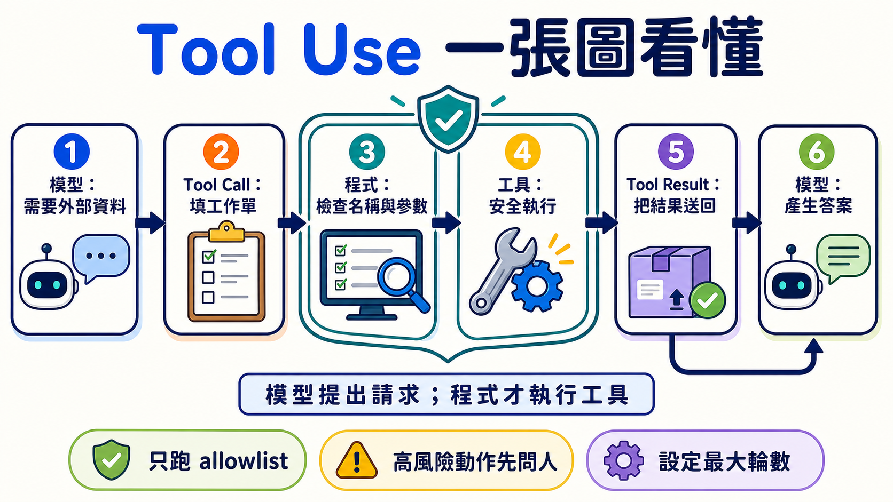

# Stage 3 — 工具使用與第一個 Agent Loop ⭐

🌐 [English](03-tool-use-and-hello-agent.en.md) | [简体中文](03-tool-use-and-hello-agent.zh-Hans.md) | **繁體中文**

這一關要做一件事：讓模型填一張「工具工作單」，再由你的程式檢查、執行並把結果送回去。這個來回就是你的第一個 **Agent Loop**。

<!-- freshness: canonical=stages/03-tool-use-and-hello-agent.md; verified_on=2026-08-27; scope=models,pricing,tool-apis,security; max_age_days=90 -->

## 📌 學習目標

完成後，你可以：

- 說出 `schema → call → execute → result → answer` 五個步驟。
- 定義一個工具，檢查參數，再安全地執行對應函式。
- 不靠 framework，寫出有次數上限和停止條件的 **Agent Loop**。
- 分清 **Function Calling** 與 **Structured Output**，不再把兩者當成同一件事。
- 用固定題目比較 schema 或模型，而不是靠一次結果下結論。

## 🚪 進入條件

你能執行一個 Python 檔、看懂 function 與 dict，並完成 [Stage 02](02-prompt-engineering.md)，就可以開始。環境還沒好時，先回 [Stage 00](00-foundations.md)。

## 🧩 先認識八個核心詞

### **Tool Use（工具使用）**

模型需要外部資料或動作時，先提出工具請求。像孩子請大人幫忙開高處的盒子；模型提出要做什麼，程式才真正動手。本章用它查天氣和做計算。**模型本身不會執行你的 client tool。**

### **Function Calling（函式呼叫）**

模型按照約定格式，回傳要呼叫的函式名稱與參數。像填一張有固定欄位的工作單。本章用它把自然語言問題變成程式能讀的請求。不同供應商的訊息格式不完全相同。

### **Tool Schema（工具綱要）**

Schema 是工具的說明卡：名字、用途、可填欄位和資料型別。像點餐單告訴客人能點什麼。本章會用 JSON Schema 描述工具。Schema 能約束外形，但程式仍要驗證數值、權限與業務規則。

### **Tool Call（工具請求）**

Tool Call 是模型填好的工作單，包含工具名稱、call ID 和參數。像「請查台北，單位用攝氏」。本章的程式會先讀它，再從 allowlist 找到合法函式。它是請求，不是執行結果。

### **Tool Result（工具結果）**

Tool Result 是程式做完事後交回的資料，並用 call ID 對回原請求。像廚房把完成的餐點放回正確桌號。本章會把成功或錯誤結果送回模型。外部結果可能不可信，不能當成最高優先指令。

### **Agent Loop（Agent 執行迴圈）**

程式重複「問模型 → 執行工具 → 回傳結果」，直到得到答案或碰到上限。像照食譜一步一步做，完成就停。完整來回是 `model → tool call → execute → tool result → model`。本章的 working definition 是 `模型 + 工具 + 有界迴圈`；這是學習用定義，不是所有 Agent 的唯一學術定義。

### **ReAct（Reasoning + Acting）**

ReAct 會交替決定下一步、採取 action、查看 observation，再繼續。像找鑰匙時先看桌上，沒看到再查抽屜。本章寫的是 **ReAct-inspired 的可觀察工具迴圈**；不要求模型公開私人 Chain-of-Thought。

### **Structured Output（結構化輸出）**

模型直接交回固定形狀的資料，例如符合 schema 的 JSON。像把答案填進表格。本章用它和 Function Calling 對照：前者要資料，後者要程式採取動作。即使外形合法，內容仍可能錯、被拒答或被截斷。



## 先選對方法

| 你要什麼 | 先用什麼 | 例子 |
|---|---|---|
| 只要文字答案 | 一般模型回答 | 改寫一封信 |
| 要固定形狀的資料 | Structured Output | 抽出姓名與日期 |
| 要查即時資料或採取動作 | Function Calling / Tool Use | 查天氣、建立工單 |

## ⚠️ 寫第一個 Agent 前的五條底線

1. 只執行 allowlist 裡的工具，不用模型輸出的名字做任意函式呼叫。
2. 把工具參數當成不可信輸入；先檢查型別、範圍和權限。
3. 工具只拿完成任務需要的最小權限。
4. 刪除、付款、寄信等高風險動作，執行前要讓人確認。
5. 設定最大輪數、timeout 和費用上限；不能讓 Agent 無限繞圈。

## 📚 必修閱讀

依序讀：

1. [Ollama Tool Calling](https://docs.ollama.com/capabilities/tool-calling) ⭐⭐⭐⭐⭐ — 先看 single tool 與 multi-turn loop。
2. [Anthropic — How Tool Use Works](https://platform.claude.com/docs/en/agents-and-tools/tool-use/how-tool-use-works) ⭐⭐⭐⭐⭐ — 看清楚模型、應用程式和 tool result 各自負責什麼。
3. [ReAct paper](https://arxiv.org/abs/2210.03629) ⭐⭐⭐⭐ — 先讀 abstract；知道 Reasoning + Acting 的來源，不必一次讀完公式。

<details markdown="1">
<summary>展開先備知識、環境、時間與預算</summary>

**先備知識**：能執行 Python、看懂 list／dict／function，並完成 [Stage 02](02-prompt-engineering.md)。

**本機主路徑**：Ollama + `qwen2.5:3b`。這是專案依使用者安裝驗證保留的入門模型，不代表它在每個 schema 都最好。

```powershell
ollama pull qwen2.5:3b
ollama serve
python -m pip install "openai>=3.3,<4"
```

**雲端比較路徑**：Anthropic + pinned Haiku model ID。

```powershell
$env:ANTHROPIC_API_KEY="貼上你的金鑰"
python -m pip install "anthropic>=1.0,<2"
```

macOS／Linux 設定方式是 `export ANTHROPIC_API_KEY="貼上你的金鑰"`。金鑰不要寫進程式或 commit。

**時間**：先跑練習 1–3 約 2–3 小時；再做練習 4–6 約 3–5 小時。完整主動路線合計約 5–8 小時。

**費用計算方式**：

```text
費用 = 輸入 tokens ÷ 1,000,000 × input price
     + 輸出 tokens ÷ 1,000,000 × output price
```

2026-08-27 查核時，Claude Haiku 4.5 是 `$1 / $5`（input / output，每百萬 tokens）。若一次請求用 2,000 input + 1,000 output，範例費用約 `$0.007`。工具迴圈會發出多次請求；每題先保留 `$0.05`、全章五輪實驗先設 `$1` provider spend limit。這是保守上限，不是帳單保證。

Path A 的 **API 費用是 `$0`**；仍會使用你的硬體、記憶體與電力。

</details>

### Agent 的經典範式（thinking patterns）

<details markdown="1">
<summary>展開 CoT、ReAct、Reflection 與 Planning 的差別</summary>

| 名詞 | 白話用途 | 放在哪裡學 |
|---|---|---|
| **Chain-of-Thought（CoT）** | 早期 prompt 技巧常要求寫出中間推理。現在不把完整私人思維鏈當成通用輸出要求；需要檢查時，看最後答案與簡短、可驗證的理由 | [Stage 02](02-prompt-engineering.md) |
| **ReAct** | 在迴圈中交替採取 action、讀 observation、再決定下一步 | 本章練習 3 |
| **Reflection** | 用一次回饋改下一次嘗試的廣義做法 | 本章下方路由 |
| **Reflexion／Self-Refine** | 有明確 Actor／Critic 或自我回饋流程的研究 pattern | 本章概念；持久記憶版到 [Stage 06](06-memory-rag.md) |
| **Planning** | 先拆成多步，再依結果調整計畫 | [Stage 07.5](07.5-advanced-agentic-concepts.md) |

這些詞描述不同解題方式，不是 Agent 的唯一判定表。Computer-use、CodeAct 和 workflow agent 也可能使用不同 loop。

</details>

## 🛠 動手練習

先完成練習 1–3。練習 4–6 用來讓迴圈更穩，不需要一天全部做完。

### 練習 1：Function Calling（一個工具、一次呼叫）

完成後，你會看到模型先產生 `get_weather` Tool Call，程式執行它，再由模型用 Tool Result 回答。

如果你偏好用檔案實作，可直接開啟[練習 1 完整資料夾](../examples/stage-3/01-function-calling/README.md)。

**第一步**：複製並執行 `ollama pull qwen2.5:3b`。接著展開 Path A，把完整程式直接複製成 `hello_tool.py`。

<details markdown="1">
<summary>Path A：Ollama 完整可複製範例（API 費 `$0`）</summary>

```python
import json

from openai import OpenAI

client = OpenAI(base_url="http://localhost:11434/v1", api_key="ollama")

TOOLS = [{
    "type": "function",
    "function": {
        "name": "get_weather",
        "description": "取得指定城市的示範天氣資料",
        "parameters": {
            "type": "object",
            "properties": {
                "city": {"type": "string", "description": "城市名稱，例如台北"},
                "unit": {"type": "string", "enum": ["celsius"]},
            },
            "required": ["city", "unit"],
            "additionalProperties": False,
        },
    },
}]


def get_weather(city: str, unit: str) -> dict:
    if unit != "celsius":
        raise ValueError("只接受 celsius")
    return {"city": city, "temperature": 26, "unit": unit}


messages = [{"role": "user", "content": "台北現在幾度？"}]
first = client.chat.completions.create(
    model="qwen2.5:3b", messages=messages, tools=TOOLS
)
assistant = first.choices[0].message
messages.append(assistant.model_dump(exclude_none=True))

for call in assistant.tool_calls or []:
    if call.function.name != "get_weather":
        raise ValueError(f"不允許的工具：{call.function.name}")
    args = json.loads(call.function.arguments)
    if (
        not isinstance(args, dict)
        or set(args) != {"city", "unit"}
        or not isinstance(args["city"], str)
        or not args["city"].strip()
        or args["unit"] != "celsius"
    ):
        raise ValueError("city 必須是非空字串，unit 必須是 celsius")
    result = get_weather(args["city"], args["unit"])
    messages.append({
        "role": "tool",
        "tool_call_id": call.id,
        "content": json.dumps(result, ensure_ascii=False),
    })

if not assistant.tool_calls:
    raise RuntimeError("模型沒有呼叫工具；請檢查模型與 schema")

final = client.chat.completions.create(
    model="qwen2.5:3b", messages=messages, tools=TOOLS
)
print(final.choices[0].message.content)

assert assistant.tool_calls[0].function.name == "get_weather"
assert any(message["role"] == "tool" for message in messages)
```

```powershell
python hello_tool.py
```

這裡用的是 **OpenAI Python SDK 連到 Ollama 的 compatible Chat Completions endpoint**，沒有把資料送到 OpenAI 雲端。`additionalProperties: false` 對 schema 很有幫助，但 Ollama 和 OpenAI strict mode 的保證不能畫上等號；程式仍要驗證。

若模型沒有呼叫工具，先保持問題、模型和 schema 不變重跑三次，記錄成功次數；不要用一次失敗宣布模型「不支援」。

</details>

<details markdown="1">
<summary>Path B：Anthropic 完整來回（每次先保留 `$0.05`）</summary>

```python
import json
import os

import anthropic

client = anthropic.Anthropic(api_key=os.environ["ANTHROPIC_API_KEY"])
tools = [{
    "name": "get_weather",
    "description": "取得指定城市的示範天氣資料",
    "input_schema": {
        "type": "object",
        "properties": {"city": {"type": "string"}},
        "required": ["city"],
        "additionalProperties": False,
    },
}]


def get_weather(city: str) -> dict:
    return {"city": city, "temperature": 26, "unit": "celsius"}


messages = [{"role": "user", "content": "台北現在幾度？"}]

first = client.messages.create(
    model="claude-haiku-4-5-20251001",
    max_tokens=512,
    tools=tools,
    messages=messages,
)
messages.append({"role": "assistant", "content": first.content})
tool_results = []
for block in first.content:
    if block.type == "tool_use":
        if block.name != "get_weather":
            raise ValueError(f"不允許的工具：{block.name}")
        if (
            set(block.input) != {"city"}
            or not isinstance(block.input["city"], str)
            or not block.input["city"].strip()
        ):
            raise ValueError("get_weather 需要一個字串 city")
        result = get_weather(block.input["city"])
        tool_results.append({
            "type": "tool_result",
            "tool_use_id": block.id,
            "content": json.dumps(result, ensure_ascii=False),
        })

if not tool_results:
    raise RuntimeError(f"沒有工具請求；stop_reason={first.stop_reason}")

messages.append({"role": "user", "content": tool_results})
final = client.messages.create(
    model="claude-haiku-4-5-20251001",
    max_tokens=512,
    tools=tools,
    messages=messages,
)
print("\n".join(block.text for block in final.content if block.type == "text"))
```

Anthropic client tool 的失敗結果要使用對應 `tool_use_id`，並加上 `"is_error": true`。不要把工具結果插進 system prompt。

</details>

### 練習 2：多工具選擇

完成後，模型會在 `calculator` 和 `get_weather` 中選一個，程式只派發 allowlist 內的名稱。

**第一步**：直接複製這行執行 mock test，不需要金鑰：

```powershell
python examples/stage-3/02-multi-tool-selection/test.py
```

<details markdown="1">
<summary>展開 Path A／Path B、觀察重點與預算</summary>

- [Path A README（Ollama）](../examples/stage-3/02-multi-tool-selection/README.md)：執行 `python starter.py`。
- 同一資料夾的 `starter_anthropic.py` 是 Path B；執行 `python test_anthropic.py` 可先用 mock 驗證訊息形狀。
- 觀察 `tool_calls[0].function.name`，再確認程式是否拒絕未知名稱。
- 不要使用 `globals()[model_name]()` 或 `eval()` 派發工具。

Path A 的 API 費用是 `$0`；Path B 一輪先保留 `$0.05`。

</details>

### 結構化輸出（Structured Outputs / JSON mode）⭐ function calling 的孿生兄弟

Function Calling 是「請程式做事」；Structured Output 是「請模型把資料放進固定形狀」。兩者都用 schema，但目的不同。

<details markdown="1">
<summary>展開 strict mode、JSON mode 與常見限制</summary>

- **JSON mode** 通常只保證可解析成 JSON，不一定符合你的欄位規則。
- **Structured Output** 會依供應商支援限制 schema 外形；仍可能遇到 refusal、截斷或語意錯誤。
- **OpenAI strict mode** 要求每個 object 設 `additionalProperties: false`，並把 properties 全列為 required；Chat Completions 預設仍不是 strict。
- **Anthropic strict tool use** 與 OpenAI 的 schema 格式、訊息格式不同，不要直接複製旗標名稱。
- **Ollama／其他 compatible endpoint** 支援範圍取決於模型與版本。以固定 eval 驗證，不以「compatible」推論完全相同。

想用 Python model 管理 schema，可看 [567-labs/instructor](https://github.com/567-labs/instructor)；想研究 constrained decoding，可看 [dottxt-ai/outlines](https://github.com/dottxt-ai/outlines)。不論使用哪一個，程式都要處理解析與語意錯誤。

</details>

### 練習 3：從零實作 ReAct（不用 framework）

完成後，你會有一個最小 Agent Loop：模型可以多次叫工具，但超過上限一定停止。

**第一步**：先跑不需要金鑰的測試：

```powershell
python examples/stage-3/03-react-from-scratch/test.py
```

<details markdown="1">
<summary>展開 13 行 loop、雙路徑與完成條件</summary>

```python
for step in range(MAX_STEPS):
    response = ask_model(messages, tools)
    calls = read_tool_calls(response)
    if not calls:
        return read_final_text(response)
    for call in calls:
        name, args, call_id = validate_call(call)
        result = TOOL_IMPL[name](**args)
        messages.append(make_tool_result(call_id, result))
raise RuntimeError(f"Agent 超過 {MAX_STEPS} 步，已停止")
```

真正的程式還要把 assistant 的 Tool Call 放回 history，並處理 refusal、max tokens、timeout、未知工具、JSON 解析與工具例外。完整雙路徑在 [`03-react-from-scratch`](../examples/stage-3/03-react-from-scratch/README.md)。

把 trace 記成 `action / observation / final` 或簡短可驗證摘要即可；不要把私人 Chain-of-Thought 當 log 契約。

Path A 的 API 費用是 `$0`；Path B 一次 loop 先保留 `$0.05`。**完成條件**：測試能證明「沒有 tool call 就停」與「超過 `MAX_STEPS` 會報錯」。

</details>

### 練習 4：多步驟推理任務

完成後，同一個 loop 會先查資料、再計算，且每一步都有對應 call ID 和結果。

**第一步**：複製測試命令：

```powershell
python examples/stage-3/04-multi-step-reasoning/test.py
```

<details markdown="1">
<summary>展開任務、比較方法與預算</summary>

任務範例：「查台北溫度，再換算成華氏。」工具分成 `get_weather` 與 `celsius_to_fahrenheit`。不要把兩個步驟偷偷合成一個假工具，這題要觀察模型是否會接續使用前一個結果。

完整雙路徑在 [`04-multi-step-reasoning`](../examples/stage-3/04-multi-step-reasoning/README.md)。比較模型時，固定 prompt、tools、schema、`MAX_STEPS` 和測試題，至少重跑五次，再記成功率與失敗類型。

Path A 的 API 費用是 `$0`；Path B 多輪請求先保留 `$0.10`。較大的模型可能比較穩，也可能只是更貴；用 eval 決定。

</details>

### 練習 5：錯誤處理

完成後，程式會把「可以讓模型修正的工具錯誤」送回去，同時對 transport、解析或超出上限的錯誤明確停止。

**第一步**：先跑兩條 mock test：

```powershell
python examples/stage-3/05-error-handling/test.py
python examples/stage-3/05-error-handling/test_anthropic.py
```

<details markdown="1">
<summary>展開錯誤分類、bounded retry 與預算</summary>

| 錯誤 | 程式先做什麼 | 是否送回模型 |
|---|---|---|
| 網路 timeout／rate limit | 有上限地 retry；記錄錯誤 | 通常先不要 |
| Tool Call JSON 解析失敗 | 不執行工具；回報格式錯誤 | 可以，用 error result |
| 未知工具／未授權參數 | 拒絕執行；留下 audit log | 可以，但不能放寬權限 |
| 工具查無資料 | 回傳明確、最小的語意錯誤 | 可以，讓模型改查詢或放棄 |
| 達到 `MAX_STEPS`／費用上限 | 立刻停止 | 不再 retry |

Anthropic 的失敗 `tool_result` 使用 `"is_error": true`。OpenAI-compatible 路徑可在 `role: tool` 的 content 放結構化錯誤，但應用程式仍要自己限制 retry。

完整雙路徑在 [`05-error-handling`](../examples/stage-3/05-error-handling/README.md)。Path A 的 API 費用是 `$0`；Path B 一輪錯誤復原先保留 `$0.10`。

</details>

### 練習 6：Function schema 設計（壞 schema 修到好）

完成後，你會用同一組題目比較兩個 schema，並指出描述、欄位、enum 或限制哪裡改善。

**第一步**：直接跑壞版和好版的 mock test：

```powershell
python examples/stage-3/06-schema-design/test.py
python examples/stage-3/06-schema-design/test_anthropic.py
```

<details markdown="1">
<summary>展開五條規則、eval 卡與預算</summary>

1. 工具名稱用清楚的動詞加名詞，例如 `get_weather`。
2. Description 說明何時用，也說明何時不要用。
3. 每個欄位都有清楚名稱、型別與例子。
4. 能用 `enum`、範圍和 `additionalProperties: false` 就明確限制。
5. Schema 只負責介面；權限、業務規則和資料安全仍在程式驗證。

完整雙路徑在 [`06-schema-design`](../examples/stage-3/06-schema-design/README.md)，速查表在 [`resources/schema-design-cheatsheet.md`](../resources/schema-design-cheatsheet.md)。

直接複製這張結果卡，不必先畫空表：

```text
固定題目：________________
壞 schema｜成功 __ / 5｜主要錯誤：________________
好 schema｜成功 __ / 5｜主要改善：________________
結論｜哪個欄位幫助最大：________________
```

不要寫「某模型幾乎必錯」。Path A 的 API 費用是 `$0`；Path B 五輪比較先保留 `$0.25`。

</details>

## 🎒 推薦小專案：安全的天氣小幫手

把練習 1–6 接起來，只保留兩個只讀工具：`get_weather` 和 `convert_temperature`。加入 allowlist、參數驗證、`MAX_STEPS`、timeout、錯誤結果和五題 eval。

最小成果是 `agent.py`、`test_agent.py`、`eval_cases.json` 和一張結果卡。先讓 mock tests 通過，再跑本機模型；不要先接付款、刪檔或寄信工具。

### 🪞 反思（Reflexion / Self-Refine）— 概念 + 路由

<details markdown="1">
<summary>展開 Reflection、Reflexion、Self-Refine 與記憶的關係</summary>

- **Reflection** 是廣義名稱：看上一輪結果，再改善下一輪。
- **Reflexion** 常把失敗、回饋與下一次策略寫進可重用的文字記錄。
- **Self-Refine** 常用「產生 → 批評 → 改寫」循環改善同一份輸出。
- 這些都是 ReAct 的 sibling patterns，不等於 Tool Use，也不一定需要持久記憶。

本章只理解 single-session loop。需要跨 session 保存失敗經驗時，進 [Stage 06 的 Reflection Memory](06-memory-rag.md)；需要更完整的 planning、verification 與長時執行，進 [Stage 07.5](07.5-advanced-agentic-concepts.md)。

</details>

## 🎯 精選 Projects

先完成一條五星路線：官方文件 → 練習 1–3 → 一個從零實作。完整表是工具箱，不是 21 筆待辦清單。

<small>資源查核：2026-08-27 UTC</small>

> 推薦度是本 Stage 的學習優先順序，不是人氣排名：`⭐⭐⭐⭐⭐`＝跳過會卡住本章路線；`⭐⭐⭐⭐`＝建議優先；`⭐⭐⭐`＝有需要再看；`⭐⭐`＝歷史或少數情境。

<table>
  <thead>
    <tr>
      <th scope="col">分類</th>
      <th scope="col">資源</th>
      <th scope="col">先做什麼</th>
      <th scope="col">狀態／授權</th>
      <th scope="col">推薦度</th>
    </tr>
  </thead>
  <tbody>
    <tr><th scope="rowgroup" rowspan="6">官方核心文件</th><td><a href="https://platform.claude.com/docs/en/agents-and-tools/tool-use/how-tool-use-works">Anthropic — How Tool Use Works</a></td><td>先看 client tool 的五步來回。</td><td>官方文件</td><td>⭐⭐⭐⭐⭐</td></tr>
    <tr><td><a href="https://platform.claude.com/docs/en/agents-and-tools/tool-use/handle-tool-calls">Anthropic — Handle Tool Calls</a></td><td>看 call ID、result 與 <code>is_error</code>。</td><td>官方文件</td><td>⭐⭐⭐⭐⭐</td></tr>
    <tr><td><a href="https://docs.ollama.com/capabilities/tool-calling">Ollama — Tool Calling</a></td><td>照 single tool 和 agent loop 範例跑一次。</td><td>官方文件</td><td>⭐⭐⭐⭐⭐</td></tr>
    <tr><td><a href="https://developers.openai.com/api/docs/guides/function-calling">OpenAI — Function Calling</a></td><td>比較 function schema 與 strict mode。</td><td>官方文件</td><td>⭐⭐⭐⭐</td></tr>
    <tr><td><a href="https://ai.google.dev/gemini-api/docs/function-calling">Google Gemini — Function Calling</a></td><td>需要 Gemini 時比較 sequential／parallel call。</td><td>官方文件</td><td>⭐⭐⭐</td></tr>
    <tr><td><a href="https://arxiv.org/abs/2210.03629">ReAct paper</a></td><td>先讀 abstract 與方法圖。</td><td>原始論文；arXiv</td><td>⭐⭐⭐⭐</td></tr>
  </tbody>
  <tbody>
    <tr><th scope="rowgroup" rowspan="4">官方課程與範例</th><td><a href="https://github.com/anthropics/courses">Anthropic Courses — Tool Use</a></td><td>做 Tool Use notebook。</td><td>官方課程；上游未提供 SPDX</td><td>⭐⭐⭐⭐</td></tr>
    <tr><td><a href="https://github.com/anthropics/claude-cookbooks/tree/main/tool_use">Anthropic Tool Use Cookbook</a></td><td>從單工具讀到平行工具。</td><td>維護中；MIT</td><td>⭐⭐⭐⭐⭐</td></tr>
    <tr><td><a href="https://github.com/anthropics/claude-quickstarts">Anthropic Quickstarts</a></td><td>練習後看完整應用怎麼接工具。</td><td>維護中；MIT</td><td>⭐⭐⭐⭐</td></tr>
    <tr><td><a href="https://github.com/microsoft/ai-agents-for-beginners">Microsoft AI Agents for Beginners</a></td><td>需要另一條完整課程時選讀一章。</td><td>維護中；MIT</td><td>⭐⭐⭐⭐</td></tr>
  </tbody>
  <tbody>
    <tr><th scope="rowgroup" rowspan="4">從零實作</th><td><a href="https://github.com/pguso/ai-agents-from-scratch">pguso/ai-agents-from-scratch</a></td><td>用 Ollama 對照練習 3 的 loop。</td><td>維護中；MIT</td><td>⭐⭐⭐⭐⭐</td></tr>
    <tr><td><a href="https://github.com/arunpshankar/react-from-scratch">arunpshankar/react-from-scratch</a></td><td>需要 Gemini／Reflection 變體時再看。</td><td>更新放緩（最後 push 2025-05）；Apache-2.0</td><td>⭐⭐⭐</td></tr>
    <tr><td><a href="https://github.com/mattambrogi/agent-implementation">mattambrogi/agent-implementation</a></td><td>只用來逐行看最小教學玩具。</td><td>歷史參考（最後 push 2024-01）；上游未提供 SPDX</td><td>⭐⭐</td></tr>
    <tr><td><a href="https://github.com/lsdefine/GenericAgent">lsdefine/GenericAgent</a></td><td>想看小型 framework 時再比較。</td><td>維護中；MIT</td><td>⭐⭐⭐</td></tr>
  </tbody>
  <tbody>
    <tr><th scope="rowgroup" rowspan="3">Framework／CodeAct 對照</th><td><a href="https://github.com/huggingface/smolagents">Hugging Face Smolagents</a></td><td>完成 JSON-tool loop 後比較 CodeAct。</td><td>維護中；Apache-2.0</td><td>⭐⭐⭐⭐</td></tr>
    <tr><td><a href="https://github.com/QuantaLogic/quantalogic">QuantaLogic</a></td><td>需要第二個 CodeAct 實作時再看。</td><td>更新較慢（最後 push 2025-12）；Apache-2.0</td><td>⭐⭐⭐</td></tr>
    <tr><td><a href="https://github.com/langchain-ai/react-agent">LangChain ReAct Agent</a></td><td>看 framework 如何包住自己寫過的 loop。</td><td>維護中；MIT</td><td>⭐⭐⭐</td></tr>
  </tbody>
  <tbody>
    <tr><th scope="rowgroup" rowspan="2">中文章節式教材</th><td><a href="https://github.com/datawhalechina/hello-agents">datawhalechina/hello-agents</a></td><td>需要完整中文章節時走這條主線。</td><td>維護中；上游 metadata 未提供 SPDX</td><td>⭐⭐⭐⭐⭐</td></tr>
    <tr><td><a href="https://github.com/jjyaoao/HelloAgents">jjyaoao/HelloAgents</a></td><td>配合上面教材跑程式；先確認對應分支。</td><td>維護中；上游 metadata 未提供 SPDX</td><td>⭐⭐⭐⭐⭐</td></tr>
  </tbody>
  <tbody>
    <tr><th scope="rowgroup" rowspan="2">Structured Output 工具</th><td><a href="https://github.com/567-labs/instructor">567-labs/instructor</a></td><td>想用 typed model、驗證與 retry 時看。</td><td>原 <code>jxnl/instructor</code> 已轉址；MIT</td><td>⭐⭐⭐⭐</td></tr>
    <tr><td><a href="https://github.com/dottxt-ai/outlines">dottxt-ai/outlines</a></td><td>研究本機 constrained decoding 時看。</td><td>維護中；Apache-2.0</td><td>⭐⭐⭐⭐</td></tr>
  </tbody>
</table>

## ✅ 進 Stage 4 前的自我檢查

- [ ] 我能用自己的話說出 schema → call → execute → result → answer。
- [ ] 我能分清 Tool Call、Tool Result 與 Structured Output。
- [ ] 我的程式只派發 allowlist 工具，會驗證參數，也有 `MAX_STEPS`。
- [ ] 我跑過練習 1–3，並看過至少一次成功和一次錯誤路徑。
- [ ] 我比較模型或 schema 時使用同一組題目與明確分數。

都做到後，進入 [Stage 4 — Workflow Graph 與 Agent 框架](04-agent-frameworks.md)。如果還說不出完整來回，先重跑練習 1；不需要把整章重新讀一遍。
