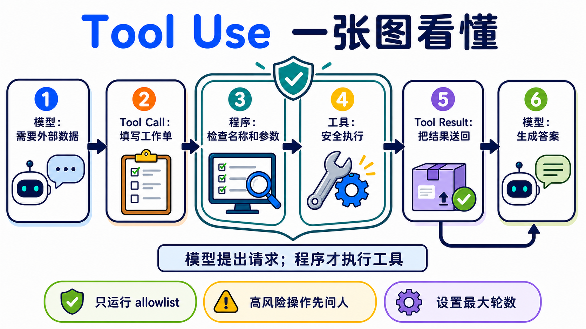

# Stage 3 — 工具使用与第一个 Agent Loop ⭐

🌐 [English](03-tool-use-and-hello-agent.en.md) | **简体中文** | [繁體中文](03-tool-use-and-hello-agent.md)

这一关要做一件事：让模型填写一张“工具工作单”，再由你的程序检查、执行，并把结果送回去。这个来回就是你的第一个 **Agent Loop**。

<!-- freshness: canonical=stages/03-tool-use-and-hello-agent.md; verified_on=2026-08-27; scope=models,pricing,tool-apis,security; max_age_days=90 -->

## 📌 学习目标

完成后，你可以：

- 说出 `schema → call → execute → result → answer` 五个步骤。
- 定义一个工具，检查参数，再安全地执行对应函数。
- 不靠 framework，写出有次数上限和停止条件的 **Agent Loop**。
- 分清 **Function Calling** 与 **Structured Output**，不再把两者当成同一件事。
- 用固定题目比较 schema 或模型，而不是靠一次结果下结论。

## 🚪 进入条件

你能运行一个 Python 文件、看懂 function 与 dict，并完成 [Stage 02](02-prompt-engineering.zh-Hans.md)，就可以开始。环境还没准备好时，先回 [Stage 00](00-foundations.zh-Hans.md)。

## 🧩 先认识八个核心词

### **Tool Use（工具使用）**

模型需要外部资料或动作时，会先提出工具请求。就像孩子请大人帮忙打开高处的盒子：模型提出要做什么，程序才真正动手。本章用它查天气和做计算。**模型本身不会执行你的 client tool。**

### **Function Calling（函数调用）**

模型按照约定格式，返回要调用的函数名称与参数。就像填写一张有固定栏位的工作单。本章用它把自然语言问题变成程序能读取的请求。不同供应商的消息格式不完全相同。

### **Tool Schema（工具纲要）**

Schema 是工具的说明卡：名称、用途、可填栏位和数据类型。就像菜单告诉客人能点什么。本章会用 JSON Schema 描述工具。Schema 能约束外形，但程序仍要验证数值、权限和业务规则。

### **Tool Call（工具请求）**

Tool Call 是模型填好的工作单，包含工具名称、call ID 和参数。比如“请查台北，单位用摄氏”。本章的程序会先读取它，再从 allowlist 找到合法函数。它是请求，不是执行结果。

### **Tool Result（工具结果）**

Tool Result 是程序做完事情后交回的数据，并用 call ID 对回原请求。就像厨房把做好的餐点放回正确桌号。本章会把成功或错误结果送回模型。外部结果可能不可信，不能把它当成最高优先级指令。

### **Agent Loop（Agent 执行循环）**

程序重复“询问模型 → 执行工具 → 返回结果”，直到得到答案或碰到上限。就像照食谱一步一步做，完成就停。完整来回是 `model → tool call → execute → tool result → model`。本章的 working definition 是 `模型 + 工具 + 有界循环`；这是学习用定义，不是所有 Agent 的唯一学术定义。

### **ReAct（Reasoning + Acting）**

ReAct 会交替决定下一步、采取 action、查看 observation，再继续。就像找钥匙时先看桌上，没看到再查抽屉。本章写的是 **ReAct-inspired 的可观察工具循环**；不要求模型公开私有 Chain-of-Thought。

### **Structured Output（结构化输出）**

模型直接返回固定形状的数据，例如符合 schema 的 JSON。就像把答案填进表格。本章用它和 Function Calling 对照：前者要数据，后者要程序采取动作。即使外形合法，内容仍可能错误、被拒答或被截断。



## 先选对方法

| 你要什么 | 先用什么 | 例子 |
|---|---|---|
| 只要文字答案 | 一般模型回答 | 改写一封信 |
| 要固定形状的数据 | Structured Output | 抽取姓名与日期 |
| 要查实时数据或采取动作 | Function Calling / Tool Use | 查天气、建立工单 |

## ⚠️ 写第一个 Agent 前的五条底线

1. 只执行 allowlist 里的工具，不用模型输出的名称做任意函数调用。
2. 把工具参数当成不可信输入；先检查类型、范围和权限。
3. 工具只拿完成任务需要的最小权限。
4. 删除、付款、发邮件等高风险动作，执行前要让人确认。
5. 设置最大轮数、timeout 和费用上限；不能让 Agent 无限绕圈。

## 📚 必修阅读

按顺序阅读：

1. [Ollama Tool Calling](https://docs.ollama.com/capabilities/tool-calling) ⭐⭐⭐⭐⭐ — 先看 single tool 与 multi-turn loop。
2. [Anthropic — How Tool Use Works](https://platform.claude.com/docs/en/agents-and-tools/tool-use/how-tool-use-works) ⭐⭐⭐⭐⭐ — 看清模型、应用程序和 tool result 各自负责什么。
3. [ReAct paper](https://arxiv.org/abs/2210.03629) ⭐⭐⭐⭐ — 先读 abstract；了解 Reasoning + Acting 的来源，不必一次读完所有公式。

<details markdown="1">
<summary>展开前置知识、环境、时间与预算</summary>

**前置知识**：能运行 Python、看懂 list／dict／function，并完成 [Stage 02](02-prompt-engineering.zh-Hans.md)。

**本地主路径**：Ollama + `qwen2.5:3b`。这是根据用户安装情况验证后保留的入门模型，不代表它在每个 schema 上都最好。

```powershell
ollama pull qwen2.5:3b
ollama serve
python -m pip install "openai>=3.3,<4"
```

**云端比较路径**：Anthropic + pinned Haiku model ID。

```powershell
$env:ANTHROPIC_API_KEY="贴上你的密钥"
python -m pip install "anthropic>=1.0,<2"
```

macOS／Linux 的设置方式是 `export ANTHROPIC_API_KEY="贴上你的密钥"`。不要把密钥写进程序或 commit。

**时间**：先跑练习 1–3 约 2–3 小时；练习 4–6 约 3–5 小时；完整 active path 约 5–8 小时。

**费用计算方式**：

```text
费用 = 输入 tokens ÷ 1,000,000 × input price
     + 输出 tokens ÷ 1,000,000 × output price
```

2026-08-27 查核时，Claude Haiku 4.5 是 `$1 / $5`（input / output，每百万 tokens）。如果一次请求使用 2,000 input + 1,000 output，示例费用约 `$0.007`。工具循环会发送多次请求；每题先预留 `$0.05`，全章五轮实验先设置 `$1` provider spend limit。这是保守上限，不是账单保证。

Path A 的 **API 费用是 `$0`**；仍会使用你的硬件、内存与电力。

</details>

### Agent 的经典范式（thinking patterns）

<details markdown="1">
<summary>展开 CoT、ReAct、Reflection 与 Planning 的差别</summary>

| 名称 | 白话用途 | 在哪里学 |
|---|---|---|
| **Chain-of-Thought（CoT）** | 早期 prompt 技巧常要求写出中间推理。现在不把完整私有思维链当成通用输出要求；需要检查时，看最终答案与简短、可验证的理由 | [Stage 02](02-prompt-engineering.zh-Hans.md) |
| **ReAct** | 在循环中交替采取 action、读 observation，再决定下一步 | 本章练习 3 |
| **Reflection** | 用一轮反馈改进下一次尝试的广义做法 | 本章下方路由 |
| **Reflexion／Self-Refine** | 有明确 Actor／Critic 或自我反馈流程的研究 pattern | 本章概念；持久记忆版见 [Stage 06](06-memory-rag.zh-Hans.md) |
| **Planning** | 先拆成多步，再根据结果调整计划 | [Stage 07.5](07.5-advanced-agentic-concepts.zh-Hans.md) |

这些词描述不同的解题方式，不是判断 Agent 的唯一标准。Computer-use、CodeAct 和 workflow agent 也可能使用不同的 loop。

</details>

## 🛠 动手练习

先完成练习 1–3。练习 4–6 用来让循环更稳，不需要一天全部做完。

### 练习 1：Function Calling（一个工具、一次调用）

完成后，你会看到模型先生成 `get_weather` Tool Call，程序执行它，再由模型用 Tool Result 回答。

如果你偏好使用文件实现，可以打开[练习 1 完整文件夹](../examples/stage-3/01-function-calling/README.zh-Hans.md)。

**第一步**：复制并运行 `ollama pull qwen2.5:3b`。接着展开 Path A，把完整程序直接复制成 `hello_tool.py`。

<details markdown="1">
<summary>Path A：Ollama 完整可复制示例（API 费用 `$0`）</summary>

```python
import json

from openai import OpenAI

client = OpenAI(base_url="http://localhost:11434/v1", api_key="ollama")

TOOLS = [{
    "type": "function",
    "function": {
        "name": "get_weather",
        "description": "获取指定城市的示例天气数据",
        "parameters": {
            "type": "object",
            "properties": {
                "city": {"type": "string", "description": "城市名称，例如台北"},
                "unit": {"type": "string", "enum": ["celsius"]},
            },
            "required": ["city", "unit"],
            "additionalProperties": False,
        },
    },
}]


def get_weather(city: str, unit: str) -> dict:
    if unit != "celsius":
        raise ValueError("只接受 celsius")
    return {"city": city, "temperature": 26, "unit": unit}


messages = [{"role": "user", "content": "台北现在几度？"}]
first = client.chat.completions.create(
    model="qwen2.5:3b", messages=messages, tools=TOOLS
)
assistant = first.choices[0].message
messages.append(assistant.model_dump(exclude_none=True))

for call in assistant.tool_calls or []:
    if call.function.name != "get_weather":
        raise ValueError(f"不允许的工具：{call.function.name}")
    args = json.loads(call.function.arguments)
    if (
        not isinstance(args, dict)
        or set(args) != {"city", "unit"}
        or not isinstance(args["city"], str)
        or not args["city"].strip()
        or args["unit"] != "celsius"
    ):
        raise ValueError("city 必须是非空字符串，unit 必须是 celsius")
    result = get_weather(args["city"], args["unit"])
    messages.append({
        "role": "tool",
        "tool_call_id": call.id,
        "content": json.dumps(result, ensure_ascii=False),
    })

if not assistant.tool_calls:
    raise RuntimeError("模型没有调用工具；请检查模型与 schema")

final = client.chat.completions.create(
    model="qwen2.5:3b", messages=messages, tools=TOOLS
)
print(final.choices[0].message.content)

assert assistant.tool_calls[0].function.name == "get_weather"
assert any(message["role"] == "tool" for message in messages)
```

```powershell
python hello_tool.py
```

这里使用的是 **连接到 Ollama compatible Chat Completions endpoint 的 OpenAI Python SDK**，数据不会发送到 OpenAI 云端。`additionalProperties: false` 对 schema 很有帮助，但 Ollama 与 OpenAI strict mode 的保证不能画等号；程序仍要验证。

如果模型没有调用工具，先保持问题、模型和 schema 不变，重跑三次并记录成功次数；不要只凭一次失败就宣布模型“不支持”。

</details>

<details markdown="1">
<summary>Path B：Anthropic 完整来回（每次先预留 `$0.05`）</summary>

```python
import json
import os

import anthropic

client = anthropic.Anthropic(api_key=os.environ["ANTHROPIC_API_KEY"])
tools = [{
    "name": "get_weather",
    "description": "获取指定城市的示例天气数据",
    "input_schema": {
        "type": "object",
        "properties": {"city": {"type": "string"}},
        "required": ["city"],
        "additionalProperties": False,
    },
}]


def get_weather(city: str) -> dict:
    return {"city": city, "temperature": 26, "unit": "celsius"}


messages = [{"role": "user", "content": "台北现在几度？"}]

first = client.messages.create(
    model="claude-haiku-4-5-20251001",
    max_tokens=512,
    tools=tools,
    messages=messages,
)
messages.append({"role": "assistant", "content": first.content})
tool_results = []
for block in first.content:
    if block.type == "tool_use":
        if block.name != "get_weather":
            raise ValueError(f"不允许的工具：{block.name}")
        if (
            set(block.input) != {"city"}
            or not isinstance(block.input["city"], str)
            or not block.input["city"].strip()
        ):
            raise ValueError("get_weather 需要一个字符串 city")
        result = get_weather(block.input["city"])
        tool_results.append({
            "type": "tool_result",
            "tool_use_id": block.id,
            "content": json.dumps(result, ensure_ascii=False),
        })

if not tool_results:
    raise RuntimeError(f"没有工具请求；stop_reason={first.stop_reason}")

messages.append({"role": "user", "content": tool_results})
final = client.messages.create(
    model="claude-haiku-4-5-20251001",
    max_tokens=512,
    tools=tools,
    messages=messages,
)
print("\n".join(block.text for block in final.content if block.type == "text"))
```

Anthropic client tool 的失败结果要使用对应的 `tool_use_id`，并加上 `"is_error": true`。不要把工具结果插入 system prompt。

</details>

### 练习 2：多工具选择

完成后，模型会在 `calculator` 和 `get_weather` 中选择一个，程序只派发 allowlist 内的名称。

**第一步**：直接复制这一行运行 mock test，不需要密钥：

```powershell
python examples/stage-3/02-multi-tool-selection/test.py
```

<details markdown="1">
<summary>展开 Path A／Path B、观察重点与预算</summary>

- [Path A README（Ollama）](../examples/stage-3/02-multi-tool-selection/README.zh-Hans.md)：运行 `python starter.py`。
- 同一文件夹的 `starter_anthropic.py` 是 Path B；运行 `python test_anthropic.py`，先用 mock 验证消息形状。
- 观察 `tool_calls[0].function.name`，再确认程序会拒绝未知名称。
- 不要使用 `globals()[model_name]()` 或 `eval()` 派发工具。

Path A 的 API 费用是 `$0`；Path B 一轮先预留 `$0.05`。

</details>

### 结构化输出（Structured Outputs / JSON mode）⭐ function calling 的孪生兄弟

Function Calling 是“请程序做事”；Structured Output 是“请模型把数据放进固定形状”。两者都使用 schema，但目的不同。

<details markdown="1">
<summary>展开 strict mode、JSON mode 与常见限制</summary>

- **JSON mode** 通常只保证可以解析成 JSON，不一定符合你的栏位规则。
- **Structured Output** 会在供应商支持的限制内约束 schema 外形；仍可能遇到 refusal、截断或语义错误。
- **OpenAI strict mode** 要求每个 object 设置 `additionalProperties: false`，并把 properties 全部列为 required；Chat Completions 默认仍不是 strict。
- **Anthropic strict tool use** 的 schema 格式、消息格式与 OpenAI 不同，不要直接复制旗标名称。
- **Ollama／其他 compatible endpoint** 的支持范围取决于模型与版本。用固定 eval 验证，不要从“compatible”推断完全相同。

想用 Python model 管理 schema，可以看 [567-labs/instructor](https://github.com/567-labs/instructor)；想研究 constrained decoding，可以看 [dottxt-ai/outlines](https://github.com/dottxt-ai/outlines)。无论使用哪一个，程序都要处理解析和语义错误。

</details>

### 练习 3：从零实现 ReAct（不用 framework）

完成后，你会有一个最小 Agent Loop：模型可以多次调用工具，但超过上限一定停止。

**第一步**：先运行不需要密钥的测试：

```powershell
python examples/stage-3/03-react-from-scratch/test.py
```

<details markdown="1">
<summary>展开 13 行 loop、双路径与完成条件</summary>

```python
for step in range(MAX_STEPS):
    response = ask_model(messages, tools)
    calls = read_tool_calls(response)
    if not calls:
        return read_final_text(response)
    for call in calls:
        name, args, call_id = validate_call(call)
        result = TOOL_IMPL[name](**args)
        messages.append(make_tool_result(call_id, result))
raise RuntimeError(f"Agent 超过 {MAX_STEPS} 步，已停止")
```

真正的程序还要把 assistant 的 Tool Call 放回 history，并处理 refusal、max tokens、timeout、未知工具、JSON 解析与工具异常。完整双路径在 [`03-react-from-scratch`](../examples/stage-3/03-react-from-scratch/README.zh-Hans.md)。

把 trace 记成 `action / observation / final` 或简短可验证摘要即可；不要把私有 Chain-of-Thought 当成 log 契约。

Path A 的 API 费用是 `$0`；Path B 一次 loop 先预留 `$0.05`。**完成条件**：测试能证明“没有 tool call 就停止”与“超过 `MAX_STEPS` 会报错”。

</details>

### 练习 4：多步骤推理任务

完成后，同一个 loop 会先查资料、再计算，并且每一步都有对应的 call ID 和结果。

**第一步**：复制测试命令：

```powershell
python examples/stage-3/04-multi-step-reasoning/test.py
```

<details markdown="1">
<summary>展开任务、比较方法与预算</summary>

任务示例：“查台北温度，再换算成华氏。”工具分成 `get_weather` 与 `celsius_to_fahrenheit`。不要把两个步骤偷偷合成一个假工具；本题要观察模型是否会接着使用前一个结果。

完整双路径在 [`04-multi-step-reasoning`](../examples/stage-3/04-multi-step-reasoning/README.zh-Hans.md)。比较模型时，固定 prompt、tools、schema、`MAX_STEPS` 和测试题，至少重跑五次，再记录成功率与失败类型。

Path A 的 API 费用是 `$0`；Path B 多轮请求先预留 `$0.10`。更大的模型可能更稳定，也可能只是更贵；用 eval 决定。

</details>

### 练习 5：错误处理

完成后，程序会把“可以让模型修正的工具错误”送回去，同时对 transport、解析或超出上限的错误明确停止。

**第一步**：先运行两条 mock test：

```powershell
python examples/stage-3/05-error-handling/test.py
python examples/stage-3/05-error-handling/test_anthropic.py
```

<details markdown="1">
<summary>展开错误分类、bounded retry 与预算</summary>

| 错误 | 程序先做什么 | 是否送回模型 |
|---|---|---|
| 网络 timeout／rate limit | 有上限地 retry；记录错误 | 通常先不要 |
| Tool Call JSON 解析失败 | 不执行工具；回报格式错误 | 可以，用 error result |
| 未知工具／未授权参数 | 拒绝执行；留下 audit log | 可以，但不能放宽权限 |
| 工具查无数据 | 返回明确、最小的语义错误 | 可以，让模型改查询或放弃 |
| 达到 `MAX_STEPS`／费用上限 | 立即停止 | 不再 retry |

Anthropic 的失败 `tool_result` 使用 `"is_error": true`。OpenAI-compatible 路径可以在 `role: tool` 的 content 中放结构化错误，但应用程序仍要自己限制 retry。

完整双路径在 [`05-error-handling`](../examples/stage-3/05-error-handling/README.zh-Hans.md)。Path A 的 API 费用是 `$0`；Path B 一轮错误恢复先预留 `$0.10`。

</details>

### 练习 6：Function schema 设计（坏 schema 修到好）

完成后，你会用同一组题目比较两个 schema，并指出描述、栏位、enum 或限制哪里得到改善。

**第一步**：直接运行坏版和好版的 mock test：

```powershell
python examples/stage-3/06-schema-design/test.py
python examples/stage-3/06-schema-design/test_anthropic.py
```

<details markdown="1">
<summary>展开五条规则、eval 卡与预算</summary>

1. 工具名称用清楚的动词加名词，例如 `get_weather`。
2. Description 说明何时使用，也说明何时不要使用。
3. 每个栏位都有清楚的名称、类型与示例。
4. 能用 `enum`、范围和 `additionalProperties: false` 就明确限制。
5. Schema 只负责接口；权限、业务规则和数据安全仍由程序验证。

完整双路径在 [`06-schema-design`](../examples/stage-3/06-schema-design/README.zh-Hans.md)，速查表在 [`resources/schema-design-cheatsheet.zh-Hans.md`](../resources/schema-design-cheatsheet.zh-Hans.md)。

直接复制这张结果卡，不必先画空表：

```text
固定题目：________________
坏 schema｜成功 __ / 5｜主要错误：________________
好 schema｜成功 __ / 5｜主要改善：________________
结论｜哪个栏位帮助最大：________________
```

不要写“某模型几乎必错”。Path A 的 API 费用是 `$0`；Path B 五轮比较先预留 `$0.25`。

</details>

## 🎒 推荐小项目：安全的天气小助手

把练习 1–6 接起来，只保留两个只读工具：`get_weather` 和 `convert_temperature`。加入 allowlist、参数验证、`MAX_STEPS`、timeout、错误结果和五题 eval。

最小成果是 `agent.py`、`test_agent.py`、`eval_cases.json` 和一张结果卡。先让 mock tests 通过，再运行本地模型；不要先接付款、删档或发邮件工具。

### 🪞 反思（Reflexion / Self-Refine）— 概念 + 路由

<details markdown="1">
<summary>展开 Reflection、Reflexion、Self-Refine 与记忆的关系</summary>

- **Reflection** 是广义名称：查看上一轮结果，再改进下一轮。
- **Reflexion** 常把失败、反馈与下一次策略写进可重复使用的文字记录。
- **Self-Refine** 常用“生成 → 批评 → 重写”循环改善同一份输出。
- 这些都是 ReAct 的 sibling patterns，不等于 Tool Use，也不一定需要持久记忆。

本章只理解 single-session loop。需要跨 session 保存失败经验时，进入 [Stage 06 的 Reflection Memory](06-memory-rag.zh-Hans.md)；需要更完整的 planning、verification 与长时间执行时，进入 [Stage 07.5](07.5-advanced-agentic-concepts.zh-Hans.md)。

</details>

## 🎯 精选 Projects

先完成一条五星路线：官方文档 → 练习 1–3 → 一个从零实现。完整表格是工具箱，不是 21 条待办清单。

<small>资源核查：2026-08-27 UTC</small>

> 推荐度是本 Stage 的学习优先顺序，不是人气排名：`⭐⭐⭐⭐⭐`＝跳过会卡住本章路线；`⭐⭐⭐⭐`＝建议优先；`⭐⭐⭐`＝有需要再看；`⭐⭐`＝历史或少数情境。

<table>
  <thead>
    <tr>
      <th scope="col">分类</th>
      <th scope="col">资源</th>
      <th scope="col">先做什么</th>
      <th scope="col">状态／授权</th>
      <th scope="col">推荐度</th>
    </tr>
  </thead>
  <tbody>
    <tr><th scope="rowgroup" rowspan="6">官方核心文档</th><td><a href="https://platform.claude.com/docs/en/agents-and-tools/tool-use/how-tool-use-works">Anthropic — How Tool Use Works</a></td><td>先看 client tool 的五步来回。</td><td>官方文档</td><td>⭐⭐⭐⭐⭐</td></tr>
    <tr><td><a href="https://platform.claude.com/docs/en/agents-and-tools/tool-use/handle-tool-calls">Anthropic — Handle Tool Calls</a></td><td>查看 call ID、result 与 <code>is_error</code>。</td><td>官方文档</td><td>⭐⭐⭐⭐⭐</td></tr>
    <tr><td><a href="https://docs.ollama.com/capabilities/tool-calling">Ollama — Tool Calling</a></td><td>照 single tool 和 agent loop 示例跑一次。</td><td>官方文档</td><td>⭐⭐⭐⭐⭐</td></tr>
    <tr><td><a href="https://developers.openai.com/api/docs/guides/function-calling">OpenAI — Function Calling</a></td><td>比较 function schema 与 strict mode。</td><td>官方文档</td><td>⭐⭐⭐⭐</td></tr>
    <tr><td><a href="https://ai.google.dev/gemini-api/docs/function-calling">Google Gemini — Function Calling</a></td><td>需要 Gemini 时比较 sequential／parallel call。</td><td>官方文档</td><td>⭐⭐⭐</td></tr>
    <tr><td><a href="https://arxiv.org/abs/2210.03629">ReAct paper</a></td><td>先读 abstract 与方法图。</td><td>原始论文；arXiv</td><td>⭐⭐⭐⭐</td></tr>
  </tbody>
  <tbody>
    <tr><th scope="rowgroup" rowspan="4">官方课程与示例</th><td><a href="https://github.com/anthropics/courses">Anthropic Courses — Tool Use</a></td><td>完成 Tool Use notebook。</td><td>官方课程；上游未提供 SPDX</td><td>⭐⭐⭐⭐</td></tr>
    <tr><td><a href="https://github.com/anthropics/claude-cookbooks/tree/main/tool_use">Anthropic Tool Use Cookbook</a></td><td>从单工具读到并行工具。</td><td>维护中；MIT</td><td>⭐⭐⭐⭐⭐</td></tr>
    <tr><td><a href="https://github.com/anthropics/claude-quickstarts">Anthropic Quickstarts</a></td><td>练习后看完整应用如何连接工具。</td><td>维护中；MIT</td><td>⭐⭐⭐⭐</td></tr>
    <tr><td><a href="https://github.com/microsoft/ai-agents-for-beginners">Microsoft AI Agents for Beginners</a></td><td>需要另一条完整课程时选读一章。</td><td>维护中；MIT</td><td>⭐⭐⭐⭐</td></tr>
  </tbody>
  <tbody>
    <tr><th scope="rowgroup" rowspan="4">从零实现</th><td><a href="https://github.com/pguso/ai-agents-from-scratch">pguso/ai-agents-from-scratch</a></td><td>用 Ollama 对照练习 3 的 loop。</td><td>维护中；MIT</td><td>⭐⭐⭐⭐⭐</td></tr>
    <tr><td><a href="https://github.com/arunpshankar/react-from-scratch">arunpshankar/react-from-scratch</a></td><td>需要 Gemini／Reflection 变体时再看。</td><td>更新放缓（最后 push 2025-05）；Apache-2.0</td><td>⭐⭐⭐</td></tr>
    <tr><td><a href="https://github.com/mattambrogi/agent-implementation">mattambrogi/agent-implementation</a></td><td>只用来逐行看最小教学玩具。</td><td>历史参考（最后 push 2024-01）；上游未提供 SPDX</td><td>⭐⭐</td></tr>
    <tr><td><a href="https://github.com/lsdefine/GenericAgent">lsdefine/GenericAgent</a></td><td>想看小型 framework 时再比较。</td><td>维护中；MIT</td><td>⭐⭐⭐</td></tr>
  </tbody>
  <tbody>
    <tr><th scope="rowgroup" rowspan="3">Framework／CodeAct 对照</th><td><a href="https://github.com/huggingface/smolagents">Hugging Face Smolagents</a></td><td>完成 JSON-tool loop 后比较 CodeAct。</td><td>维护中；Apache-2.0</td><td>⭐⭐⭐⭐</td></tr>
    <tr><td><a href="https://github.com/QuantaLogic/quantalogic">QuantaLogic</a></td><td>需要第二个 CodeAct 实现时再看。</td><td>更新较慢（最后 push 2025-12）；Apache-2.0</td><td>⭐⭐⭐</td></tr>
    <tr><td><a href="https://github.com/langchain-ai/react-agent">LangChain ReAct Agent</a></td><td>看 framework 如何包住自己写过的 loop。</td><td>维护中；MIT</td><td>⭐⭐⭐</td></tr>
  </tbody>
  <tbody>
    <tr><th scope="rowgroup" rowspan="2">中文章节式教材</th><td><a href="https://github.com/datawhalechina/hello-agents">datawhalechina/hello-agents</a></td><td>需要完整中文章节时走这条主线。</td><td>维护中；上游 metadata 未提供 SPDX</td><td>⭐⭐⭐⭐⭐</td></tr>
    <tr><td><a href="https://github.com/jjyaoao/HelloAgents">jjyaoao/HelloAgents</a></td><td>配合上面教材运行程序；先确认对应分支。</td><td>维护中；上游 metadata 未提供 SPDX</td><td>⭐⭐⭐⭐⭐</td></tr>
  </tbody>
  <tbody>
    <tr><th scope="rowgroup" rowspan="2">Structured Output 工具</th><td><a href="https://github.com/567-labs/instructor">567-labs/instructor</a></td><td>想使用 typed model、验证与 retry 时看。</td><td>原 <code>jxnl/instructor</code> 已转址；MIT</td><td>⭐⭐⭐⭐</td></tr>
    <tr><td><a href="https://github.com/dottxt-ai/outlines">dottxt-ai/outlines</a></td><td>研究本地 constrained decoding 时看。</td><td>维护中；Apache-2.0</td><td>⭐⭐⭐⭐</td></tr>
  </tbody>
</table>

## ✅ 进 Stage 4 前的自我检查

- [ ] 我能用自己的话说出 `schema → call → execute → result → answer`。
- [ ] 我能分清 Tool Call、Tool Result 与 Structured Output。
- [ ] 我的程序只派发 allowlist 工具，会验证参数，也有 `MAX_STEPS`。
- [ ] 我跑过练习 1–3，并看过至少一次成功和一次错误路径。
- [ ] 我比较模型或 schema 时使用同一组题目与明确分数。

都做到后，进入 [Stage 4 — Workflow Graph 与 Agent 框架](04-agent-frameworks.zh-Hans.md)。如果还说不出完整来回，先重跑练习 1；不需要把整章重新读一遍。
