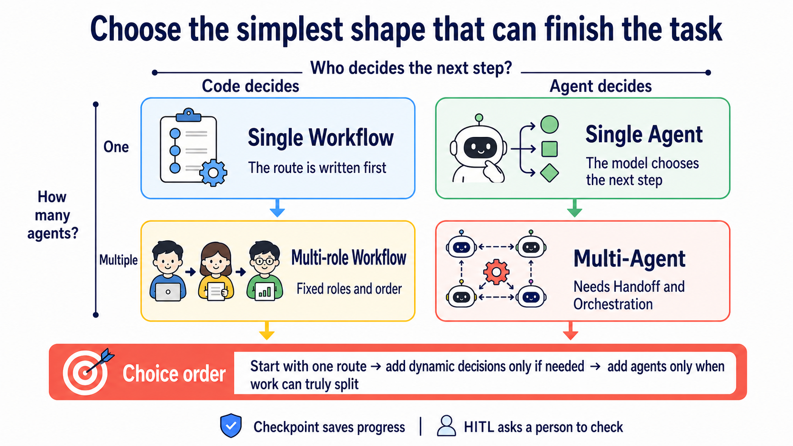

# Stage 4 — Workflow Graphs & Agent Frameworks

> [Traditional Chinese](./04-agent-frameworks.md) | [Simplified Chinese](./04-agent-frameworks.zh-Hans.md) | **English**

In Stage 3, you wrote an **Agent Loop** yourself. This stage first turns multi-step work into a **Workflow Graph**, then chooses a **Framework** to help connect it. Understand the work map first, then choose the toolbox, so you do not make things complicated just because a framework is popular.

<!-- freshness: canonical=stages/04-agent-frameworks.md; verified_on=2026-08-27; scope=frameworks,releases,maintenance,licenses,security; max_age_days=90 -->

## 📌 Learning Goals

After this stage, you can:

- Explain the difference between an Agent Loop, a Workflow Graph, an Agent framework, and a multi-role system in your own words.
- Choose the simplest tool that can finish the task instead of adding roles just because they are fashionable.
- Complete five exercises and compare LangGraph, CrewAI, Smolagents, and Pydantic AI hands-on.
- Explain which problems passing work onward, saving progress, and human approval each solve.

## 🧩 Eight Core Terms First

- **Workflow / Workflow Graph**: Like following a recipe, then drawing every step and next stop. The program writes the nodes, edges, and branches first; the model only completes work that needs judgment inside the route.
- **Framework**: A box of ready-organized building blocks. It connects loops, tools, records, and error handling for you; the larger the box, the more details it can hide.
- **Agent**: Like an assistant given a goal. The model can decide its next step from the current result, but the program still controls real permissions, validation, and stop conditions.
- **Orchestration**: Like a traffic controller. It decides who works first and next, who receives the data, and how to recover from a failure.
- **State**: Like a notebook used while working. It remembers the current input, tool results, progress, and the data needed for the next step.
- **Checkpoint**: Like a game save. After the process is interrupted, it can continue from the saved point instead of starting everything again.
- **Handoff**: Like passing an assignment sheet to another classmate. The next Agent needs enough context to take over, but must not receive permissions it does not need.
- **Human-in-the-loop (HITL)**: Like raising your hand for the teacher to check first. The program pauses before spending money, sending email, deleting data, or publishing, and continues only after a person approves.

<a id="-first-separate-loop-framework-and-graph"></a>
## 🧭 First Separate Loop, Graph, and Framework

| Name | Five-year-old-friendly version | Correct boundary and where to learn it |
|---|---|---|
| **Agent Loop** | The assistant does one step, checks the result, then chooses the next step | The within-one-run loop from Stage 3: model → tool call → execute → tool result → model |
| **Workflow Graph** | Draw every station and road | Represents work order with node, edge, branch, and state; each box can be an Agent, tool, check, or human approval |
| **Agent Framework** | A toolbox that helps connect the wires | Provides runner, tool, state, handoff, checkpoint, and related parts; one Agent can use it too |
| **Loop Engineering** | Design how it repeats, validates, and stops | Stage 7 adds budgets, verification, recovery, and human escalation |
| **Production orchestration** | Make the whole work map run safely in real use | Stage 7 adds observation, recovery, and stop rules around multiple loops, tools, and human approvals; emerging writing may also call this Graph Engineering |

**A framework is the toolbox; a Workflow Graph is the work map you draw; production orchestration is the engineering work that makes the map run safely.** **Graph Engineering** is an emerging, non-standard label, not another name for a framework. **Multi-Agent** systems can go into a graph, but not every graph needs multiple Agents, and not every node has to be an Agent.

## 🗺️ Start with This Choice Map



Ask two questions first: **Who decides the next step? How many Agents are needed?** If a fixed route already completes the task, stay in the upper-left corner. Each extra Agent adds another set of context, tests, and failure modes.

## 🚪 Entry Conditions

Complete Stage 3's six exercises first, and be able to explain `schema → call → execute → result → answer`. Reading `async` and `await` helps, but is not a gate for starting Exercise 1.

<details markdown="1">
<summary>⏱ Expand time, environment, and budget</summary>

- Suggested time: `2–3 weeks`, about `10–15 hours`. You do not need to read all 18 projects at once.
- Python: use `3.11` for the existing examples. CrewAI `1.15.18` currently requires Python `>=3.10,<3.14`; Python 3.14 users should create a separate 3.11 environment. The immediately following stacked 04B layer will migrate all five examples to current majors and verify them in clean environments; this content layer does not claim the old requirements are already upgraded.
- Path A: Ollama exercises have no API charge; your hardware, electricity, and download time still cost something.
- Path B: this chapter compares Anthropic Haiku. The single-run formula is `input tokens ÷ 1,000,000 × $1 + output tokens ÷ 1,000,000 × $5`; the total for five exercises is the sum of five actual usages, not a guessed fixed decimal.

</details>

## 📚 Required Reading

Read how to choose a simple shape first, then pick one of the two framework Quickstarts in Step 4. The five official links below form four reading steps; follow the order without trying to finish every page at once.

1. [Anthropic — Building Effective Agents](https://www.anthropic.com/engineering/building-effective-agents): first distinguish a workflow from an agent, and understand why you should start with the simplest approach.
2. [LangGraph — Workflows and Agents](https://docs.langchain.com/oss/python/langgraph/workflows-agents): see how fixed and dynamic routes become graphs.
3. [OpenAI Agents SDK — Multi-agent orchestration](https://openai.github.io/openai-agents-python/multi_agent/): compare manager-as-tools with handoffs.
4. Choose one Quickstart: [LangGraph](https://docs.langchain.com/oss/python/langgraph/overview) or [CrewAI](https://docs.crewai.com/); go deep on just one first.

Third-party rankings can offer a candidate list, but they cannot prove a version, license, availability, or which option is “best.” Use official documentation and your own evals for those questions.

<a id="-what-is-a-multi-agent-framework"></a>
## 🤔 What Is an Agent Framework?

An Agent framework is a toolbox for connecting models, tools, state, retries, saved progress, and human approvals for one or more Agents. **One Agent can use a framework too; multi-agent is only one later system shape, not the framework definition.** A framework is not magic, and it is not the default answer for every project.

<a id="two-dimensions-to-clarify-first-workflow-vs-agent--single-vs-multi"></a>
### Two Dimensions to Clarify First (workflow vs agent / single vs multi)

| | **Workflow**: the program writes the route first | **Agent**: the model chooses the next step dynamically |
|---|---|---|
| **One Agent** | A linear process or fixed branches | The tool loop you wrote in Stage 3 |
| **Multiple Agents** | Fixed roles and order | Dynamic handoffs, a supervisor, or debate |

These four cells overlap. For example, a LangGraph conditional edge can contain both fixed rules and a model decision. The table helps you ask questions; it does not force every system into a box.

<a id="when-do-you-really-need-multi-agent-dont-force-it"></a>
### When Do You **Really** Need Multi-Agent? (Don't Force It)

Start with one Agent. Consider adding roles only when you have the following evidence:

- The task can genuinely be split into relatively independent pieces of work, each with a clear output.
- Different roles need different tools, permissions, or context, and separating them reduces confusion.
- Several directions can be explored at once, with a clear method to combine and validate them at the end.
- Your evals show that multiple Agents are more reliable than one, and the extra token, latency, and debugging cost is worth it.

Without that evidence, one Agent with good tools, good context, and a bounded loop is usually easier to test. Multiple Agents do not guarantee better accuracy or speed.

<details markdown="1">
<summary>Expand the evidence and constraints</summary>

- [Anthropic — Building Effective Agents](https://www.anthropic.com/engineering/building-effective-agents) recommends starting with the simplest workable approach; a framework can hide prompts and responses, so users still need to understand the underlying layer.
- [Anthropic — Multi-agent Research System](https://www.anthropic.com/engineering/multi-agent-research-system) explains that multi-agent systems suit breadth-first, parallelizable research. Its `90.2%` is a relative improvement on a particular research eval, not a rule for “90% of use cases”; that system used about `15×` the tokens of ordinary chat, and this cannot be generalized to every task.
- [Cognition — Don't Build Multi-Agents](https://cognition.ai/blog/dont-build-multi-agents) emphasizes context fragmentation: when details are scattered among different Agents, overall judgment can worsen. The article does not claim that “90% of use cases should not use” them.
- The completion time for parallel branches depends on the slowest branch, rate limits, retries, and final integration; it is not a fixed `1/N`.

</details>

### Five Collaboration Patterns

**Supervisor** (a supervising Agent) is like a team lead: it breaks up work and combines answers. **Worker** (a working Agent) is like a team member: it receives only the data and tools needed to finish its own task.

| Pattern | One-line shape | Good for | Watch first |
|---|---|---|---|
| **Routing / Handoff** | A decides, then passes work to B | Support triage and expert escalation | Handoff data and permissions |
| **Sequential** | B starts only after A finishes | Processes with a fixed order | An earlier error propagates forward |
| **Parallel** | Several pieces run at the same time | Independent searches or checks | The slowest branch and merge rules |
| **Supervisor–Worker** | One supervisor assigns several workers | Breaking down and consolidating a large task | The supervisor may become a bottleneck |
| **Debate / Peer Review** | Several roles critique one another | High-risk decisions and double-checking | More roles do not make facts true |

<details markdown="1">
<summary>Expand patterns, papers, and the Claude Code comparison</summary>

- Routing / Handoff: [OpenAI Agents SDK handoffs](https://openai.github.io/openai-agents-python/handoffs/) is the current official entry point. [OpenAI Swarm](https://github.com/openai/swarm) remains only for educational source reading; OpenAI recommends migrating production use to the Agents SDK.
- Sequential / Supervisor–Worker: [LangGraph](https://docs.langchain.com/oss/python/langgraph/overview) can make nodes, edges, state, and checkpoints explicit.
- Parallel: suitable for independent research directions; if tasks share substantial context or depend closely on one another, separating them can instead lose information.
- Debate / Society: further reading includes the [AutoGen paper](https://arxiv.org/abs/2308.08155), [CAMEL](https://arxiv.org/abs/2303.17760), [ChatDev](https://arxiv.org/abs/2307.07924), and [Generative Agents](https://arxiv.org/abs/2304.03442). A paper shows that one design can be studied; it does not make that design your production default.
- A Claude Code subagent is another runtime-built-in route: configuration files isolate context and tools, so you do not need to write Python orchestration yourself. The full comparison is in [Stage 5.5](05-claude-code-ecosystem.en.md#55--subagents-claude-codes-native-multi-agent-mechanism--2025-new-feature).

</details>

### Choose a Tool by Need

| Your current situation | Look at first | Why |
|---|---|---|
| A simple tool loop is already enough | Raw SDK / the Stage 3 approach | Most transparent and easiest to debug |
| You need graph-based state, checkpoints, and HITL | **LangGraph** | A low-level orchestration runtime with clear control |
| You want a quick role-based prototype | **CrewAI** | Agents, Tasks, and Crews are easy to start; Flows also support persistence and human feedback |
| You already use the OpenAI ecosystem and need handoffs and tracing | **OpenAI Agents SDK** | The official SDK; Sandbox Agents are still beta |
| A Python / .NET Microsoft team | **Microsoft Agent Framework** | Stable, with AutoGen and Semantic Kernel migration guides |

For Ollama exercises, start with the LangGraph or CrewAI route. Do not change frameworks because the tool list crosses a fixed number; use evals first to see whether context, wrong-selection rate, and latency are actually getting worse.

<details markdown="1">
<summary>Expand advanced tool patterns</summary>

- **Dynamic tool selection**: search or route to a small set of relevant tools first, then give them to the model. See [LlamaIndex tools](https://docs.llamaindex.ai/en/stable/module_guides/deploying/agents/tools/).
- **Tool composition**: connect A's output directly to B's input, reducing unnecessary intermediate prose.
- **Tool-augmented retrieval**: treat a retriever as a tool, then let the Agent decide the next step from the result; full RAG comes in Stage 6.

These three approaches do not necessarily require a framework. A framework's value is writing less repeated code and retaining state and traces; a raw SDK can implement them too.

</details>

## 🛠 Hands-on Exercises

Install the folder's requirements first, then run its offline test. After you see success, use the README in the same folder to choose Ollama Path A or Anthropic Path B.

### Exercise 1: Same Agent, Two Frameworks

**Outcome**: run the same search-and-summarize task through LangGraph and CrewAI, then explain what work each framework hides.

```powershell
Set-Location examples/stage-4/01-same-agent-two-frameworks
py -3.11 -m pip install -r requirements.txt
py -3.11 test.py
```

Budget: Path A has a `$0` API charge per run; Path B uses `$1 / $5` per million input / output tokens. If you run all five exercises once, this chapter's total is the sum of the five actual token costs.

### Exercise 2: Multi-Agent Role Assignment

**Outcome**: give the researcher, writer, and reviewer one clear job each, and see the output from every handoff.

```powershell
Set-Location examples/stage-4/02-multi-agent-roles
py -3.11 -m pip install -r requirements.txt
py -3.11 test.py
```

Budget: Path A has a `$0` API charge per run; Path B uses the same formula. More roles usually add prompts and calls, but there is no fixed multiplier, so record the actual tokens.

### Exercise 3: Graph-Based Workflow

**Outcome**: create branches, checkpoints, and an HITL pause point in LangGraph, then continue from the saved point.

```powershell
Set-Location examples/stage-4/03-graph-workflow
py -3.11 -m pip install -r requirements.txt
py -3.11 test.py
```

Budget: Path A has a `$0` API charge per run; Path B is calculated from actual tokens. A checkpoint saves progress; it does not automatically lower model charges.

### Exercise 4: Generated-Code Actions vs JSON Tools

**CodeAct** lets the model write code as its action. It is like asking an assistant to make a temporary tool for itself: flexible, but all model-generated code is untrusted and must run in a sandbox or constrained environment, never arbitrarily on the host.

**Outcome**: compare constrained CodeAct with a JSON tool call on the same problem, and explain which route is easier to validate.

```powershell
Set-Location examples/stage-4/04-codeact-vs-json-tool
py -3.11 -m pip install -r requirements.txt
py -3.11 test.py
```

Budget: Path A has a `$0` API charge per run; Path B is calculated from actual tokens. A sandbox, container, or managed execution environment may have additional charges.

### Exercise 5: Schema-Validated Agent Output

**Type-safe** means defining the cells of a form first, then checking that the right kind of data is in every cell. Pydantic can validate the shape and bounds of Structured Output; it cannot guarantee that the answer itself is true.

**Outcome**: have Pydantic AI return `answer`, `confidence`, and `sources`, and watch invalid data be rejected.

```powershell
Set-Location examples/stage-4/05-typed-agent
py -3.11 -m pip install -r requirements.txt
py -3.11 test.py
```

Budget: Path A has a `$0` API charge per run; Path B is calculated from actual tokens. Retries after schema-validation failure also incur token costs.

<details markdown="1">
<summary>Expand paths and debugging entry points</summary>

Every folder has a trilingual README, `starter.py`, `starter_anthropic.py`, `test.py`, and `test_anthropic.py`. Install its requirements first and then run the mock test; after it succeeds, follow the README to start a real model:

1. [Exercise 1 README](../examples/stage-4/01-same-agent-two-frameworks/README.en.md)
2. [Exercise 2 README](../examples/stage-4/02-multi-agent-roles/README.en.md)
3. [Exercise 3 README](../examples/stage-4/03-graph-workflow/README.en.md)
4. [Exercise 4 README](../examples/stage-4/04-codeact-vs-json-tool/README.en.md)
5. [Exercise 5 README](../examples/stage-4/05-typed-agent/README.en.md)

If `py -3.11` cannot find Python, run `py -0p` to see installed versions. Do not force-install CrewAI 1.15.18 on Python 3.14; create a Python 3.11 virtual environment.

</details>

## 🎒 Recommended Mini-Project: A Human-Checked Research-Summary Workflow

Combine the five exercises into a small project: one researcher finds sources and one writer prepares a summary; the program saves state and finally stops at HITL, waiting for you to check sources before producing output. Start with just two roles, not a ten-person team.

Success criterion: you can restart the program and continue from a checkpoint; without a person's approval, the process never enters its final publishing step.

## 🎯 Curated Projects

Start with [LangGraph](https://github.com/langchain-ai/langgraph) ⭐⭐⭐⭐⭐: it lets you directly see state, edges, checkpoints, and interruption points. The other 17 entries are grouped by purpose below; the ratings indicate this chapter's learning order, not a popularity ranking.

<small>Framework information checked: 2026-08-27 UTC</small>

<table>
  <thead>
    <tr>
      <th scope="col">Category</th>
      <th scope="col">Project</th>
      <th scope="col">Who it suits</th>
      <th scope="col">Status, license, and limits</th>
      <th scope="col">Rating</th>
    </tr>
  </thead>
  <tbody>
    <tr><th scope="rowgroup" rowspan="4">Production orchestration</th><td><a href="https://github.com/langchain-ai/langgraph">LangGraph</a></td><td>Those who need state, checkpoints, HITL, and replayable workflows.</td><td>Maintained; MIT. A low-level runtime that requires more design work from you.</td><td>⭐⭐⭐⭐⭐</td></tr>
    <tr><td><a href="https://github.com/microsoft/semantic-kernel">Microsoft Semantic Kernel</a></td><td>Existing .NET / Java / Python Microsoft stacks.</td><td>Maintained; MIT. Microsoft also provides guidance for migrating to Agent Framework.</td><td>⭐⭐⭐⭐</td></tr>
    <tr><td><a href="https://github.com/agno-agi/agno">Agno</a></td><td>Those who want to manage Agents, Teams, and Workflows with AgentOS.</td><td>Maintained; Apache-2.0. Its platform scope is broad; confirm you really need the whole stack first.</td><td>⭐⭐⭐⭐</td></tr>
    <tr><td><a href="https://github.com/microsoft/agent-framework">Microsoft Agent Framework</a></td><td>New Python / .NET Microsoft Agent projects.</td><td>Python 1.x stable; MIT. Official AutoGen and Semantic Kernel migration paths are available.</td><td>⭐⭐⭐⭐</td></tr>
  </tbody>
  <tbody>
    <tr><th scope="rowgroup" rowspan="6">Rapid prototyping / multi-agent</th><td><a href="https://github.com/crewAIInc/crewAI">CrewAI</a></td><td>Quick researcher → writer → reviewer role workflows.</td><td>Maintained; MIT. Flows support persistence, resume, and human feedback.</td><td>⭐⭐⭐⭐</td></tr>
    <tr><td><a href="https://github.com/microsoft/autogen">Microsoft AutoGen</a></td><td>Maintaining existing group-chat, debate, or peer-review projects.</td><td>Maintenance mode and community maintained; CC-BY-4.0. Existing Python projects use <code>autogen-agentchat</code> 0.7.x; use Agent Framework for new Microsoft projects and avoid old 0.2 tutorials.</td><td>⭐⭐⭐⭐</td></tr>
    <tr><td><a href="https://github.com/openai/openai-agents-python">OpenAI Agents SDK</a></td><td>Those already in the OpenAI ecosystem who need handoffs, guardrails, and tracing.</td><td>Maintained; MIT. Sandbox Agents are beta, which does not mean every production problem is solved.</td><td>⭐⭐⭐⭐⭐</td></tr>
    <tr><td><a href="https://github.com/langchain-ai/deepagents">Deep Agents</a></td><td>Those who need a full harness for planning, filesystem access, subagents, memory, and permissions.</td><td>Maintained; MIT. Built on LangGraph; it may be too heavy for a simple Agent.</td><td>⭐⭐⭐⭐</td></tr>
    <tr><td><a href="https://github.com/openai/swarm">OpenAI Swarm</a></td><td>Those who want to read small source code to understand Agents and handoffs.</td><td>Frozen / historical educational use; MIT. Superseded by the Agents SDK; do not use it for new production projects.</td><td>⭐⭐⭐⭐ (education)</td></tr>
    <tr><td><a href="https://github.com/strands-agents/harness-sdk">Strands Agents</a></td><td>AWS / Bedrock teams, or those needing Python / TypeScript SDKs.</td><td>Maintained; Apache-2.0. The canonical repository moved from the old <code>sdk-python</code> to <code>harness-sdk</code>.</td><td>⭐⭐⭐⭐</td></tr>
  </tbody>
  <tbody>
    <tr><th scope="rowgroup" rowspan="4">Special paths</th><td><a href="https://github.com/huggingface/smolagents">Hugging Face Smolagents</a></td><td>Those comparing CodeAct and tool calling, or using the Hugging Face ecosystem.</td><td>Maintained; Apache-2.0. Model-generated code must run in isolation.</td><td>⭐⭐⭐⭐</td></tr>
    <tr><td><a href="https://github.com/pydantic/pydantic-ai">Pydantic AI</a></td><td>Those who value typed dependencies, structured output, and validation.</td><td>Maintained; MIT. Schema validation checks shape, not semantic correctness.</td><td>⭐⭐⭐</td></tr>
    <tr><td><a href="https://github.com/letta-ai/letta">Letta</a></td><td>Long sessions, cross-day memory, and persona-stable assistants.</td><td>Maintained; Apache-2.0. It is memory-first; the full memory concepts come in Stage 6.</td><td>⭐⭐⭐⭐</td></tr>
    <tr><td><a href="https://github.com/vercel/eve">Vercel Eve</a></td><td>TypeScript / Vercel teams that need durable workflows, sandboxes, and approvals.</td><td>Public Preview; Apache-2.0. It was only made public in 2026-06, so its API may still change quickly.</td><td>⭐⭐⭐</td></tr>
  </tbody>
  <tbody>
    <tr><th scope="rowgroup" rowspan="3">Specialized</th><td><a href="https://github.com/run-llama/llama_index">LlamaIndex Agents</a></td><td>Document-heavy, retrieval, and knowledge workflows.</td><td>Maintained; MIT. Its strength is data and retrieval, not every orchestration situation.</td><td>⭐⭐⭐</td></tr>
    <tr><td><a href="https://github.com/agentscope-ai/agentscope">AgentScope</a></td><td>Researching multi-agent systems and needing visualization and studio tools.</td><td>Maintained; Apache-2.0. Check community, deployment, and language needs first.</td><td>⭐⭐⭐</td></tr>
    <tr><td><a href="https://github.com/langchain-ai/langchain">LangChain</a></td><td>Those who need high-level building blocks for models, retrieval, tools, and middleware.</td><td>Maintained; MIT. Complex orchestration can move down to LangGraph.</td><td>⭐⭐⭐</td></tr>
  </tbody>
  <tbody>
    <tr><th scope="rowgroup" rowspan="1">Infrastructure</th><td><a href="https://github.com/BerriAI/litellm">LiteLLM</a></td><td>Those switching providers through one interface or building an AI gateway.</td><td>Maintained; the root LICENSE says everything except enterprise uses MIT, while <code>enterprise/</code> has a separate license. It is not an Agent framework.</td><td>⭐⭐⭐⭐</td></tr>
  </tbody>
</table>

## ✅ Self-Check Before Stage 5

- [ ] I can distinguish an Agent Loop, an Agent framework, a Workflow Graph, and a multi-agent system instead of treating them as the same thing.
- [ ] I start with the simplest approach and add Agents only when I see measurable evidence.
- [ ] I can explain what State, Checkpoint, Handoff, and HITL each save or control.
- [ ] I have run the offline tests for all five exercises and completed at least one Ollama Path A.
- [ ] I know CodeAct must run in isolation and that type-safe output still needs its contents checked.

Once you have done all of this, move on to [Stage 5 — Claude Code Ecosystem](05-claude-code-ecosystem.en.md). If the four cells are still unclear, return to the choice map above; you do not need to reread the 18-row table.

<details markdown="1">
<summary>💡 Expand troubleshooting and next steps</summary>

- To learn about Claude Code subagents, go to Stage 5.5.
- To learn about checkpoints and long-term memory, go to Stage 6.
- To put multi-agent systems into production and add evals and observability, go to Stage 7.
- To see more frontier harnesses, dynamic workflows, and failure research, go to Stage 7.5.
- To let an Agent operate a browser, computer, or sandbox, go to Stage 8.

</details>
