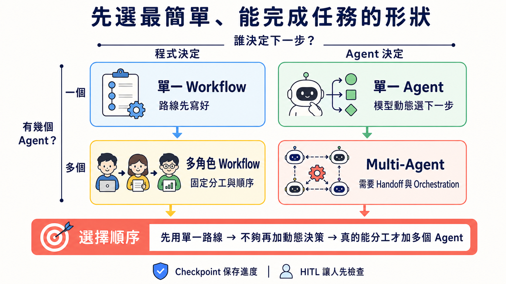

# Stage 4 — Workflow Graph 與 Agent 框架

> **繁體中文** | [简体中文](./04-agent-frameworks.zh-Hans.md) | [English](./04-agent-frameworks.en.md)

你在 Stage 3 已經自己寫過 **Agent Loop**。這一關先把多步工作畫成 **Workflow Graph**，再選 **Framework（框架）** 來幫你接線。先看懂工作地圖，再選工具箱，才不會因為某個框架很流行就硬把事情變複雜。

<!-- freshness: canonical=stages/04-agent-frameworks.md; verified_on=2026-08-27; scope=frameworks,releases,maintenance,licenses,security; max_age_days=90 -->

## 📌 學習目標

完成這一關後，你可以：

- 用自己的話分清 Agent Loop、Workflow Graph、Agent framework 與多角色系統。
- 先選最簡單能完成任務的工具，不為了流行硬加角色。
- 跑完五個練習，親手比較 LangGraph、CrewAI、Smolagents 與 Pydantic AI。
- 說出交接、存檔與人工批准各自解決什麼問題。

## 🧩 先認識八個核心詞

- **Workflow（工作流程）／Workflow Graph（工作流程圖）**：像照食譜做菜，再把每一步和下一站畫出來。程式先寫好 node、edge 與分支，模型只完成其中需要判斷的工作。
- **Framework（框架）**：一盒已經整理好的積木。它幫你接好迴圈、工具、記錄與錯誤處理；但盒子越大，藏起來的細節也越多。
- **Agent（代理程式）**：像拿到目標的助手。模型可以依目前結果決定下一步，但真正的權限、驗證與停止條件仍由程式控制。
- **Orchestration（編排）**：像交通指揮。它安排誰先做、誰後做、資料交給誰，以及失敗時怎麼回來。
- **State（狀態）**：像工作中的筆記本。它記住目前輸入、工具結果、進度與下一步需要的資料。
- **Checkpoint（檢查點）**：像遊戲存檔。流程中斷後，可以從已保存的位置繼續，不必全部重來。
- **Handoff（交接）**：像把工作單交給另一位同學。新的 Agent 接手後，需要拿到足夠背景，也不能得到不需要的權限。
- **Human-in-the-loop（HITL，人在迴圈中）**：像先舉手請老師看。程式在花錢、寄信、刪資料或發布前暫停，等人批准才繼續。

<a id="-先分清loopframework-與-graph"></a>
## 🧭 先分清：Loop、Graph 與 Framework

| 名稱 | 五歲也懂的說法 | 正確邊界與學習位置 |
|---|---|---|
| **Agent Loop** | 助手做一步、看結果，再決定下一步 | Stage 3 的一次執行內迴圈：model → tool call → execute → tool result → model |
| **Workflow Graph** | 把每一站和道路畫出來 | 用 node、edge、branch 與 state 表示工作順序；格子裡可以是 Agent、工具、檢查或人工批准 |
| **Agent Framework** | 一盒幫你接線的工具積木 | 提供 runner、tool、state、handoff、checkpoint 等零件；一個 Agent 也能使用 |
| **Loop Engineering** | 設計它怎麼反覆做、怎麼驗、何時停 | Stage 7 才加入預算、驗證、復原與人工升級 |
| **Production orchestration（上線編排）** | 把整張工作地圖做成真的能安全運轉 | Stage 7 才替多個 loop、工具與人工核准加上觀測、復原與停止規則；新興文章也可能稱為 Graph Engineering |

**Framework 是工具箱；Workflow Graph 是你畫出的工作地圖；Production orchestration 是讓地圖能安全運轉的工程工作。** **Graph Engineering** 是新興但尚未統一的稱呼，不是 Framework 的另一個名字。**Multi-Agent** 可以放進圖裡，但不是每張圖都需要多個 Agent，也不是每個 node 都必須是 Agent。

## 🗺️ 先看一張選擇地圖



先問兩題：**誰決定下一步？需要幾個 Agent？** 如果固定路線已經能完成，就停在左上角；多一個 Agent 會多一份 context、測試與失敗方式。

## 🚪 進入條件

先完成 Stage 3 的六題，至少能說出 `schema → call → execute → result → answer`。會讀 `async`／`await` 很有幫助，但不是開始第一題的門檻。

<details markdown="1">
<summary>⏱ 展開時間、環境與預算</summary>

- 建議時間：`2–3 週`，約 `10–15 小時`。不用一次看完 18 個專案。
- Python：現有範例先用 `3.11`。CrewAI `1.15.18` 目前要求 Python `>=3.10,<3.14`；Python 3.14 使用者請另外建立 3.11 環境。五個範例的 current-major migration 與 clean-environment 驗收會在緊接的 stacked 04B 完成；本層不把舊 requirements 說成已升級。
- Path A：Ollama 練習不收 API 費；你的硬體、電力與下載時間仍有成本。
- Path B：本章用 Anthropic Haiku 比較。單次成本公式是 `輸入 tokens ÷ 1,000,000 × $1 + 輸出 tokens ÷ 1,000,000 × $5`；五題總成本是五次實際用量相加，不先猜固定小數。

</details>

## 📚 必修閱讀

先讀「怎麼選簡單形狀」，再從第 4 步的兩個 framework Quickstart 挑一個。下面共有 4 個閱讀步驟、5 個官方連結；先照順序讀，不必一次讀完每一頁。

1. [Anthropic — Building Effective Agents](https://www.anthropic.com/engineering/building-effective-agents)：先分清 workflow 與 agent，也看懂為什麼要從簡單方案開始。
2. [LangGraph — Workflows and Agents](https://docs.langchain.com/oss/python/langgraph/workflows-agents)：看固定路線與動態路線怎麼寫成圖。
3. [OpenAI Agents SDK — Multi-agent orchestration](https://openai.github.io/openai-agents-python/multi_agent/)：比較 manager-as-tools 與 handoff。
4. Quickstart 二選一：[LangGraph](https://docs.langchain.com/oss/python/langgraph/overview) 或 [CrewAI](https://docs.crewai.com/)；只要先深入一個。

第三方排行榜可以提供候選名單，但不能證明版本、授權、可用性或哪個「最強」。這些事以官方文件與你自己的 eval 為準。

<a id="-什麼是-multi-agent-framework"></a>
## 🤔 什麼是 Agent framework？

Agent framework 是幫一個或多個 Agent 接好模型、工具、state、重試、存檔與人工批准的工具箱。**一個 Agent 也能使用 framework；multi-agent 只是後面的一種系統形狀，不是 framework 的定義。** Framework 不是魔法，也不是每個專案的預設答案。

<a id="兩個維度先分清楚workflow-vs-agent--single-vs-multi"></a>
### 兩個維度先分清楚（workflow vs agent / single vs multi）

| | **Workflow**：程式先寫好路線 | **Agent**：模型動態選下一步 |
|---|---|---|
| **一個 Agent** | 線性流程或固定分支 | Stage 3 寫過的工具迴圈 |
| **多個 Agent** | 固定角色與順序 | 動態 handoff、supervisor 或辯論 |

這四格會重疊。例如 LangGraph 的 conditional edge 可以同時有固定規則與模型決策。表格是幫你問問題，不是把所有系統硬塞進盒子。

<a id="什麼時候真的需要-multi-agent不要硬上"></a>
### 什麼時候**真的**需要 multi-agent（不要硬上）

先用一個 Agent。只有出現下面的證據，再考慮增加角色：

- 任務真的能拆成彼此較獨立的工作，而且每份工作有清楚輸出。
- 不同角色需要不同工具、權限或 context，分開能降低混亂。
- 多個方向可以同時探索，最後也有明確的合併與驗證方法。
- 你的 eval 顯示多 Agent 比單 Agent 更可靠，增加的 token、延遲與除錯成本值得。

沒有這些證據時，一個 Agent 加好工具、好 context 與有限迴圈通常更容易測試。多 Agent 不保證比較準，也不保證比較快。

<details markdown="1">
<summary>展開 Anthropic／Cognition 證據與成本限制</summary>

- [Anthropic — Building Effective Agents](https://www.anthropic.com/engineering/building-effective-agents) 建議先從最簡單可行方案開始；framework 可能遮住 prompt 與 response，使用者仍要懂底層。
- [Anthropic — Multi-agent Research System](https://www.anthropic.com/engineering/multi-agent-research-system) 說明 multi-agent 適合 breadth-first、可平行的研究。文中的 `90.2%` 是特定 research eval 的相對提升，不是「90% 用例」通則；該系統約使用一般 chat 的 `15×` tokens，也不能套到所有任務。
- [Cognition — Don't Build Multi-Agents](https://cognition.ai/blog/dont-build-multi-agents) 強調 context fragmentation：細節散在不同 Agent 後，整體判斷可能變差。文章沒有提出「90% 用例不該使用」的統計。
- 平行分支的完成時間取決於最慢分支、rate limit、重試與最後整合，不是固定 `1/N`。

</details>

### 五種協作 pattern

**Supervisor（主管 Agent）** 像班長，負責拆工作與合併答案。**Worker（工作 Agent）** 像組員，只拿完成自己任務所需的資料與工具。

| Pattern | 一句話形狀 | 適合什麼 | 先注意什麼 |
|---|---|---|---|
| **Routing／Handoff** | A 判斷後交給 B | 客服分類、專家轉接 | 交接資料與權限 |
| **Sequential** | A 做完才輪到 B | 有固定先後的流程 | 前一步錯誤會往後傳 |
| **Parallel** | 多份工作同時做 | 可獨立搜尋或檢查 | 最慢分支與合併規則 |
| **Supervisor–Worker** | 一位主管分派多位工作者 | 大任務拆解與彙整 | 主管可能成為瓶頸 |
| **Debate／Peer Review** | 多個角色互相批評 | 高風險判斷與複查 | 角色多不等於事實正確 |

<details markdown="1">
<summary>展開完整 pattern、論文與 Claude Code subagent 對照</summary>

- Routing／Handoff：[OpenAI Agents SDK handoffs](https://openai.github.io/openai-agents-python/handoffs/) 是現行官方入口。[OpenAI Swarm](https://github.com/openai/swarm) 只保留作為教育用 source reading；官方已建議 production 遷移到 Agents SDK。
- Sequential／Supervisor–Worker：[LangGraph](https://docs.langchain.com/oss/python/langgraph/overview) 可以把 node、edge、state 與 checkpoint 明確畫出。
- Parallel：適合彼此獨立的研究方向；若工作共享大量 context 或緊密相依，分開反而會遺失資訊。
- Debate／Society：可延伸閱讀 [AutoGen paper](https://arxiv.org/abs/2308.08155)、[CAMEL](https://arxiv.org/abs/2303.17760)、[ChatDev](https://arxiv.org/abs/2307.07924) 與 [Generative Agents](https://arxiv.org/abs/2304.03442)。論文證明一種設計能被研究，不代表它是你的 production 預設。
- Claude Code subagent 是 runtime 內建的另一條路：用設定檔隔離 context 與工具，不必自己寫 Python orchestration。完整比較留在 [Stage 5.5](05-claude-code-ecosystem.md#55--subagentsclaude-code-原生-multi-agent-機制-2025-新功能)。

</details>

### 依需求選工具

| 你現在的情況 | 先看什麼 | 為什麼 |
|---|---|---|
| 一個簡單工具迴圈已經夠用 | Raw SDK／Stage 3 寫法 | 最透明、最容易除錯 |
| 要圖式 state、checkpoint、HITL | **LangGraph** | 低階 orchestration runtime，控制清楚 |
| 要快速做角色式雛形 | **CrewAI** | Agent、Task、Crew 容易上手；Flows 也支援 persistence 與 human feedback |
| 已使用 OpenAI 生態、需要 handoff 與 tracing | **OpenAI Agents SDK** | 官方 SDK；Sandbox Agents 目前仍是 beta |
| Python／.NET 的 Microsoft 團隊 | **Microsoft Agent Framework** | 已 stable，並有 AutoGen／Semantic Kernel 遷移指南 |

Ollama 練習先從 LangGraph 或 CrewAI 路線開始。不要因為工具清單超過某個固定數字就換框架；先用 eval 看 context、選錯率與延遲是否真的惡化。

<details markdown="1">
<summary>展開進階 tool patterns</summary>

- **Dynamic tool selection**：先搜尋或路由出少量相關工具，再交給模型。可看 [LlamaIndex tools](https://docs.llamaindex.ai/en/stable/module_guides/deploying/agents/tools/)。
- **Tool composition**：把 A 的輸出直接接到 B 的輸入，減少不必要的中間文字。
- **Tool-augmented retrieval**：把 retriever 當工具，再讓 Agent 根據結果決定下一步；完整 RAG 留到 Stage 6。

這三種做法不一定要用 framework。Framework 的價值是少寫重複程式、留下 state 與 trace；raw SDK 也能實作。

</details>

## 🛠 動手練習

每題先安裝該資料夾的 requirements，再跑不連網測試。看到成功後，再依同資料夾 README 選 Ollama Path A 或 Anthropic Path B。

### 練習 1：同一個 agent、兩個 framework

**成果**：同一個搜尋加摘要任務各走 LangGraph 與 CrewAI，說出兩者藏起來的工作有什麼不同。

```powershell
Set-Location examples/stage-4/01-same-agent-two-frameworks
py -3.11 -m pip install -r requirements.txt
py -3.11 test.py
```

預算：Path A 單次 API 費 `$0`；Path B 依 `$1／$5` 每百萬輸入／輸出 tokens 計算。若五題各跑一次，本章總額就是五次實際 token 成本相加。

### 練習 2：多 agent 角色分配

**成果**：讓 researcher、writer 與 reviewer 各做一件清楚的事，並看見每次交接的輸出。

```powershell
Set-Location examples/stage-4/02-multi-agent-roles
py -3.11 -m pip install -r requirements.txt
py -3.11 test.py
```

預算：Path A 單次 API 費 `$0`；Path B 使用同一公式。角色越多，通常會多出 prompt 與呼叫，但沒有固定倍數，請記錄實際 tokens。

### 練習 3：圖式 workflow

**成果**：在 LangGraph 建立分支、checkpoint 與 HITL 暫停點，再從保存位置繼續。

```powershell
Set-Location examples/stage-4/03-graph-workflow
py -3.11 -m pip install -r requirements.txt
py -3.11 test.py
```

預算：Path A 單次 API 費 `$0`；Path B 依實際 tokens 計算。Checkpoint 保存的是進度，不會自動降低模型費用。

### 練習 4：CodeAct vs JSON tool

**CodeAct** 是讓模型寫程式碼當 action。它像請助手自己寫一把臨時工具，彈性高，但模型產生的程式一律視為不可信，必須放在 sandbox 或受限環境，不能直接在主機任意執行。

**成果**：用同一題比較受限 CodeAct 與 JSON tool call，說出哪一條更容易驗證。

```powershell
Set-Location examples/stage-4/04-codeact-vs-json-tool
py -3.11 -m pip install -r requirements.txt
py -3.11 test.py
```

預算：Path A 單次 API 費 `$0`；Path B 依實際 tokens 計算。Sandbox、容器或受管執行環境可能另收費。

### 練習 5：型別安全 agent

**Type-safe（型別安全）** 像先畫好表格格子，再檢查每格放對資料。Pydantic 可以驗證 Structured Output 的形狀與範圍；它不能保證答案內容一定是真的。

**成果**：讓 Pydantic AI 回傳 `answer`、`confidence` 與 `sources`，並親眼看到不合規資料被拒絕。

```powershell
Set-Location examples/stage-4/05-typed-agent
py -3.11 -m pip install -r requirements.txt
py -3.11 test.py
```

預算：Path A 單次 API 費 `$0`；Path B 依實際 tokens 計算。Schema 驗證失敗後的重試也會產生 token 成本。

<details markdown="1">
<summary>展開五題的 Path A／Path B 與排錯入口</summary>

每個資料夾都有三語 README、`starter.py`、`starter_anthropic.py`、`test.py` 與 `test_anthropic.py`。先安裝 requirements、再跑 mock test；成功後才照 README 啟動真實模型：

1. [練習 1 README](../examples/stage-4/01-same-agent-two-frameworks/README.md)
2. [練習 2 README](../examples/stage-4/02-multi-agent-roles/README.md)
3. [練習 3 README](../examples/stage-4/03-graph-workflow/README.md)
4. [練習 4 README](../examples/stage-4/04-codeact-vs-json-tool/README.md)
5. [練習 5 README](../examples/stage-4/05-typed-agent/README.md)

如果 `py -3.11` 找不到 Python，先跑 `py -0p` 看已安裝版本。不要在 Python 3.14 強裝 CrewAI 1.15.18；建立 Python 3.11 virtual environment。

</details>

## 🎒 推薦小專案：有人先檢查的研究摘要流程

把五題合成一個小作品：一位 researcher 找資料，一位 writer 寫摘要；程式保存 state，最後停在 HITL，等你檢查來源後才輸出。先用兩個角色就好，不要一開始做十人團隊。

成功標準：你能重新啟動程式並從 checkpoint 繼續；沒有人的批准，流程不會進入最後發布步驟。

## 🎯 精選 Projects

第一個入口先看 [LangGraph](https://github.com/langchain-ai/langgraph) ⭐⭐⭐⭐⭐：你能直接看到 state、edge、checkpoint 與中斷點。其餘 17 筆已依用途分組放在下面；推薦度是本章學習順序，不是人氣排行榜。

<small>框架資訊查核：2026-08-27 UTC</small>

<table>
  <thead>
    <tr>
      <th scope="col">分類</th>
      <th scope="col">Project</th>
      <th scope="col">適合誰</th>
      <th scope="col">狀態／授權與限制</th>
      <th scope="col">推薦度</th>
    </tr>
  </thead>
  <tbody>
    <tr><th scope="rowgroup" rowspan="4">Production orchestration</th><td><a href="https://github.com/langchain-ai/langgraph">LangGraph</a></td><td>要 state、checkpoint、HITL 與可重播流程。</td><td>維護中；MIT。低階 runtime，需要自己做較多設計。</td><td>⭐⭐⭐⭐⭐</td></tr>
    <tr><td><a href="https://github.com/microsoft/semantic-kernel">Microsoft Semantic Kernel</a></td><td>既有 .NET／Java／Python Microsoft 技術棧。</td><td>維護中；MIT。Microsoft 另提供遷移到 Agent Framework 的指南。</td><td>⭐⭐⭐⭐</td></tr>
    <tr><td><a href="https://github.com/agno-agi/agno">Agno</a></td><td>要把 Agent、Team、Workflow 接到 AgentOS 管理。</td><td>維護中；Apache-2.0。平台範圍大，先確認是否真的需要整套。</td><td>⭐⭐⭐⭐</td></tr>
    <tr><td><a href="https://github.com/microsoft/agent-framework">Microsoft Agent Framework</a></td><td>新建 Python／.NET Microsoft Agent 專案。</td><td>Python 1.x stable；MIT。有 AutoGen／Semantic Kernel 官方遷移路徑。</td><td>⭐⭐⭐⭐</td></tr>
  </tbody>
  <tbody>
    <tr><th scope="rowgroup" rowspan="6">快速雛形／多 Agent</th><td><a href="https://github.com/crewAIInc/crewAI">CrewAI</a></td><td>快速做 researcher → writer → reviewer 角色流程。</td><td>維護中；MIT。Flows 已支援 persistence、resume 與 human feedback。</td><td>⭐⭐⭐⭐</td></tr>
    <tr><td><a href="https://github.com/microsoft/autogen">Microsoft AutoGen</a></td><td>維護既有 group-chat、辯論或 peer-review 專案。</td><td>Maintenance mode，由社群維護；CC-BY-4.0。既有 Python 專案使用 <code>autogen-agentchat</code> 0.7.x；新的 Microsoft 專案改用 Agent Framework，並避開舊 0.2 教學。</td><td>⭐⭐⭐⭐</td></tr>
    <tr><td><a href="https://github.com/openai/openai-agents-python">OpenAI Agents SDK</a></td><td>已使用 OpenAI 生態，需要 handoff、guardrail 與 tracing。</td><td>維護中；MIT。Sandbox Agents 是 beta，不等於所有 production 問題已解決。</td><td>⭐⭐⭐⭐⭐</td></tr>
    <tr><td><a href="https://github.com/langchain-ai/deepagents">Deep Agents</a></td><td>要 planning、filesystem、subagent、memory 與 permissions 的完整 harness。</td><td>維護中；MIT。建在 LangGraph 上；簡單 Agent 用它可能太重。</td><td>⭐⭐⭐⭐</td></tr>
    <tr><td><a href="https://github.com/openai/swarm">OpenAI Swarm</a></td><td>想讀小型 source，理解 Agent 與 handoff。</td><td>凍結／歷史教育用途；MIT。官方已由 Agents SDK 取代，不用於新 production 專案。</td><td>⭐⭐⭐⭐（教育）</td></tr>
    <tr><td><a href="https://github.com/strands-agents/harness-sdk">Strands Agents</a></td><td>AWS／Bedrock 團隊，或需要 Python／TypeScript SDK。</td><td>維護中；Apache-2.0。canonical repo 已由舊 <code>sdk-python</code> 移到 <code>harness-sdk</code>。</td><td>⭐⭐⭐⭐</td></tr>
  </tbody>
  <tbody>
    <tr><th scope="rowgroup" rowspan="4">特殊路線</th><td><a href="https://github.com/huggingface/smolagents">Hugging Face Smolagents</a></td><td>想比較 CodeAct 與 tool calling，或使用 Hugging Face 生態。</td><td>維護中；Apache-2.0。模型生成 code 必須隔離執行。</td><td>⭐⭐⭐⭐</td></tr>
    <tr><td><a href="https://github.com/pydantic/pydantic-ai">Pydantic AI</a></td><td>重視 typed dependency、structured output 與 validation。</td><td>維護中；MIT。Schema 驗證外形，不保證語意正確。</td><td>⭐⭐⭐</td></tr>
    <tr><td><a href="https://github.com/letta-ai/letta">Letta</a></td><td>長 session、跨日記憶與 persona-stable 助手。</td><td>維護中；Apache-2.0。Memory-first，完整記憶觀念留到 Stage 6。</td><td>⭐⭐⭐⭐</td></tr>
    <tr><td><a href="https://github.com/vercel/eve">Vercel Eve</a></td><td>TypeScript／Vercel 團隊，需要 durable workflow、sandbox 與 approvals。</td><td>Public Preview；Apache-2.0。2026-06 才公開，API 仍可能快速變動。</td><td>⭐⭐⭐</td></tr>
  </tbody>
  <tbody>
    <tr><th scope="rowgroup" rowspan="3">特化</th><td><a href="https://github.com/run-llama/llama_index">LlamaIndex Agents</a></td><td>文件密集、retrieval 與知識工作流程。</td><td>維護中；MIT。強項是資料與 retrieval，不是所有 orchestration 場景。</td><td>⭐⭐⭐</td></tr>
    <tr><td><a href="https://github.com/agentscope-ai/agentscope">AgentScope</a></td><td>研究多 Agent、需要視覺化與 studio 工具。</td><td>維護中；Apache-2.0。先確認社群、部署與語言需求。</td><td>⭐⭐⭐</td></tr>
    <tr><td><a href="https://github.com/langchain-ai/langchain">LangChain</a></td><td>要模型、retrieval、tool 與 middleware 的高階積木。</td><td>維護中；MIT。複雜 orchestration 可下沉到 LangGraph。</td><td>⭐⭐⭐</td></tr>
  </tbody>
  <tbody>
    <tr><th scope="rowgroup" rowspan="1">基礎設施</th><td><a href="https://github.com/BerriAI/litellm">LiteLLM</a></td><td>用同一介面切換多家 provider，或建立 AI gateway。</td><td>維護中；根目錄 LICENSE 說明 enterprise 以外採 MIT，<code>enterprise/</code> 另有授權。它不是 Agent framework。</td><td>⭐⭐⭐⭐</td></tr>
  </tbody>
</table>

## ✅ 進 Stage 5 前的自我檢查

- [ ] 我能分清 Agent Loop、Agent framework、Workflow Graph 與 multi-agent，不把它們當同一件事。
- [ ] 我會先用最簡單方案，只有看到可量測證據才增加 Agent。
- [ ] 我能說明 State、Checkpoint、Handoff 與 HITL 各自保存或控制什麼。
- [ ] 我跑過五題的離線測試，並完成至少一條 Ollama Path A。
- [ ] 我知道 CodeAct 要隔離執行，type-safe output 也仍需檢查內容。

都做到後，進入 [Stage 5 — Claude Code Ecosystem](05-claude-code-ecosystem.md)。如果還分不清四格，回到上面的選擇地圖；不必重讀 18 筆表格。

<details markdown="1">
<summary>💡 展開疑難排解與後續路由</summary>

- 想了解 Claude Code subagent：到 Stage 5.5。
- 想了解 checkpoint 與長期記憶：到 Stage 6。
- 想把 multi-agent 上線、做 eval 與 observability：到 Stage 7。
- 想看更前沿的 harness、dynamic workflow 與失敗研究：到 Stage 7.5。
- 想讓 Agent 操作瀏覽器、電腦或 sandbox：到 Stage 8。

</details>
