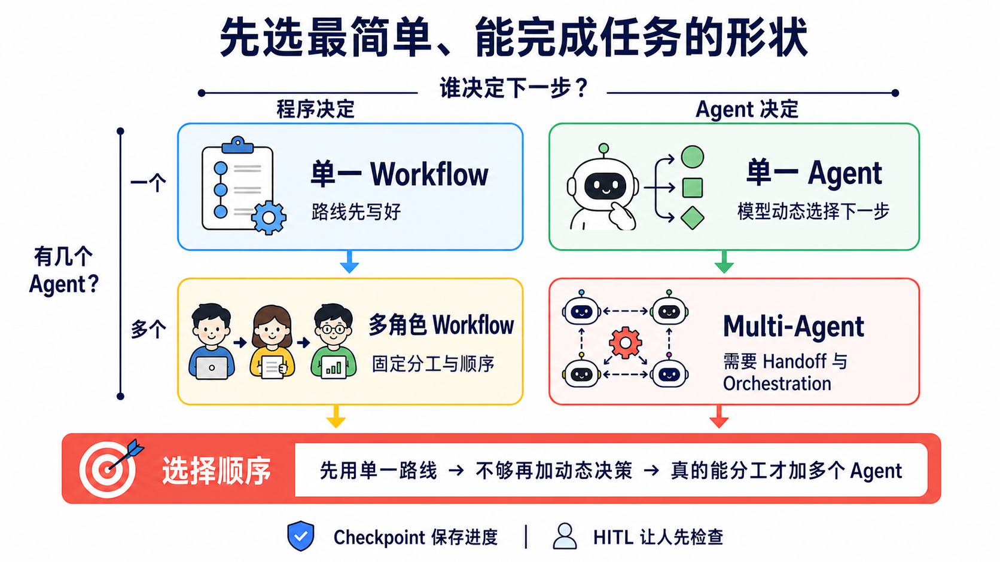

# Stage 4 — Workflow Graph 与 Agent 框架

> [繁体中文](./04-agent-frameworks.md) | **简体中文** | [English](./04-agent-frameworks.en.md)

你在 Stage 3 已经自己写过 **Agent Loop**。这一关先把多步工作画成 **Workflow Graph**，再选 **Framework（框架）** 来帮你接线。先看懂工作地图，再选工具箱，才不会因为某个框架很流行就硬把事情变复杂。

<!-- freshness: canonical=stages/04-agent-frameworks.md; verified_on=2026-08-27; scope=frameworks,releases,maintenance,licenses,security; max_age_days=90 -->

## 📌 学习目标

完成这一关后，你可以：

- 用自己的话分清 Agent Loop、Workflow Graph、Agent framework 与多角色系统。
- 先选最简单能完成任务的工具，不为了流行硬加角色。
- 跑完五个练习，亲手比较 LangGraph、CrewAI、Smolagents 与 Pydantic AI。
- 说出交接、存档与人工批准各自解决什么问题。

## 🧩 先认识八个核心词

- **Workflow（工作流程）／Workflow Graph（工作流程图）**：像照食谱做菜，再把每一步和下一站画出来。程序先写好 node、edge 与分支，模型只完成其中需要判断的工作。
- **Framework（框架）**：一盒已经整理好的积木。它帮你接好循环、工具、记录与错误处理；但盒子越大，藏起来的细节也越多。
- **Agent（智能体）**：像拿到目标的助手。模型可以根据当前结果决定下一步，但真正的权限、验证与停止条件仍由程序控制。
- **Orchestration（编排）**：像交通指挥。它安排谁先做、谁后做、数据交给谁，以及失败时怎么回来。
- **State（状态）**：像工作中的笔记本。它记住当前输入、工具结果、进度与下一步需要的数据。
- **Checkpoint（检查点）**：像游戏存档。流程中断后，可以从已保存的位置继续，不必全部重来。
- **Handoff（交接）**：像把工作单交给另一位同学。新的 Agent 接手后，需要拿到足够背景，也不能得到不需要的权限。
- **Human-in-the-loop（HITL，人在循环中）**：像先举手请老师看。程序在花钱、寄信、删除数据或发布前暂停，等人批准才继续。

<a id="-先分清loopframework-与-graph"></a>
## 🧭 先分清：Loop、Graph 与 Framework

| 名称 | 五岁也懂的说法 | 正确边界与学习位置 |
|---|---|---|
| **Agent Loop** | 助手做一步、看结果，再决定下一步 | Stage 3 的一次执行内循环：model → tool call → execute → tool result → model |
| **Workflow Graph** | 把每一站和道路画出来 | 用 node、edge、branch 与 state 表示工作顺序；格子里可以是 Agent、工具、检查或人工批准 |
| **Agent Framework** | 一盒帮你接线的工具积木 | 提供 runner、tool、state、handoff、checkpoint 等零件；一个 Agent 也能使用 |
| **Loop Engineering** | 设计它怎么反复做、怎么验证、何时停 | Stage 7 才加入预算、验证、恢复与人工升级 |
| **Production orchestration（上线编排）** | 把整张工作地图做成真的能安全运行 | Stage 7 才为多个 loop、工具和人工批准加上观测、恢复与停止规则；新兴文章也可能称为 Graph Engineering |

**Framework 是工具箱；Workflow Graph 是你画出的工作地图；Production orchestration 是让地图能安全运行的工程工作。** **Graph Engineering** 是新兴但还未统一的称呼，不是 Framework 的另一个名字。**Multi-Agent** 可以放进图里，但不是每张图都需要多个 Agent，也不是每个 node 都必须是 Agent。

## 🗺️ 先看一张选择地图



先问两题：**谁决定下一步？需要几个 Agent？** 如果固定路线已经能完成，就停在左上角；多一个 Agent 会多一份 context、测试与失败方式。

## 🚪 进入条件

先完成 Stage 3 的六道练习，至少能说出 `schema → call → execute → result → answer`。会读 `async`／`await` 很有帮助，但不是开始第一题的门槛。

<details markdown="1">
<summary>⏱ 展开时间、环境与预算</summary>

- 建议时间：`2–3 周`，约 `10–15 小时`。不用一次看完 18 个项目。
- Python：现有示例先用 `3.11`。CrewAI `1.15.18` 当前要求 Python `>=3.10,<3.14`；Python 3.14 用户请另外建立 3.11 环境。紧接着的 stacked 04B 会把五个示例迁移到当前 major，并在干净环境中验收；本内容层不把旧 requirements 说成已经升级。
- Path A：Ollama 练习不收 API 费；你的硬件、电力与下载时间仍有成本。
- Path B：本章用 Anthropic Haiku 比较。单次成本公式是 `输入 tokens ÷ 1,000,000 × $1 + 输出 tokens ÷ 1,000,000 × $5`；五题总成本是五次实际用量相加，不先猜固定小数。

</details>

## 📚 必修阅读

先读“怎么选简单形状”，再从第 4 步的两个 framework Quickstart 中挑一个。下面共有 4 个阅读步骤、5 个官方链接；先按顺序读，不必一次读完每一页。

1. [Anthropic — Building Effective Agents](https://www.anthropic.com/engineering/building-effective-agents)：先分清 workflow 与 agent，也看懂为什么要从简单方案开始。
2. [LangGraph — Workflows and Agents](https://docs.langchain.com/oss/python/langgraph/workflows-agents)：看固定路线与动态路线怎么写成图。
3. [OpenAI Agents SDK — Multi-agent orchestration](https://openai.github.io/openai-agents-python/multi_agent/)：比较 manager-as-tools 与 handoff。
4. Quickstart 二选一：[LangGraph](https://docs.langchain.com/oss/python/langgraph/overview) 或 [CrewAI](https://docs.crewai.com/)；只要先深入一个。

第三方排行榜可以提供候选名单，但不能证明版本、授权、可用性或哪个“最强”。这些事以官方文件与你自己的 eval 为准。

<a id="-什么是-multi-agent-framework"></a>
## 🤔 什么是 Agent framework？

Agent framework 是帮一个或多个 Agent 接好模型、工具、state、重试、存档与人工批准的工具箱。**一个 Agent 也能使用 framework；Multi-Agent 只是后面的一种系统形状，不是 framework 的定义。** Framework 不是魔法，也不是每个项目的默认答案。

<a id="两个维度先分清楚workflow-vs-agent--single-vs-multi"></a>
### 两个维度先分清楚（workflow vs agent / single vs multi）

| | **Workflow**：程序先写好路线 | **Agent**：模型动态选下一步 |
|---|---|---|
| **一个 Agent** | 线性流程或固定分支 | Stage 3 写过的工具循环 |
| **多个 Agent** | 固定角色与顺序 | 动态 handoff、supervisor 或辩论 |

这四格会重叠。例如 LangGraph 的 conditional edge 可以同时有固定规则与模型决策。表格是帮你问问题，不是把所有系统硬塞进盒子。

<a id="什么时候真的需要-multi-agent不要硬上"></a>
### 什么时候**真的**需要 Multi-Agent（不要硬上）

先用一个 Agent。只有出现下面的证据，再考虑增加角色：

- 任务真的能拆成彼此较独立的工作，而且每份工作有清楚输出。
- 不同角色需要不同工具、权限或 context，分开能降低混乱。
- 多个方向可以同时探索，最后也有明确的合并与验证方法。
- 你的 eval 显示多 Agent 比单 Agent 更可靠，增加的 token、延迟与调试成本值得。

没有这些证据时，一个 Agent 加好工具、好 context 与有限循环通常更容易测试。多 Agent 不保证比较准，也不保证比较快。

<details markdown="1">
<summary>展开 Anthropic／Cognition 证据与成本限制</summary>

- [Anthropic — Building Effective Agents](https://www.anthropic.com/engineering/building-effective-agents) 建议先从最简单可行方案开始；framework 可能遮住 prompt 与 response，用户仍要懂底层。
- [Anthropic — Multi-agent Research System](https://www.anthropic.com/engineering/multi-agent-research-system) 说明 multi-agent 适合 breadth-first、可平行的研究。文中的 `90.2%` 是特定 research eval 的相对提升，不是“90% 用例”通则；该系统约使用一般 chat 的 `15×` tokens，也不能套到所有任务。
- [Cognition — Don't Build Multi-Agents](https://cognition.ai/blog/dont-build-multi-agents) 强调 context fragmentation：细节散在不同 Agent 后，整体判断可能变差。文章没有提出“90% 用例不该使用”的统计。
- 平行分支的完成时间取决于最慢分支、rate limit、重试与最后整合，不是固定 `1/N`。

</details>

### 五种协作 pattern

**Supervisor（主管 Agent）** 像班长，负责拆工作与合并答案。**Worker（工作 Agent）** 像组员，只拿完成自己任务所需的数据与工具。

| Pattern | 一句话形状 | 适合什么 | 先注意什么 |
|---|---|---|---|
| **Routing／Handoff** | A 判断后交给 B | 客服分类、专家转接 | 交接数据与权限 |
| **Sequential** | A 做完才轮到 B | 有固定先后的流程 | 前一步错误会往后传 |
| **Parallel** | 多份工作同时做 | 可独立搜索或检查 | 最慢分支与合并规则 |
| **Supervisor–Worker** | 一位主管分派多位工作者 | 大任务拆解与汇总 | 主管可能成为瓶颈 |
| **Debate／Peer Review** | 多个角色互相批评 | 高风险判断与复查 | 角色多不等于事实正确 |

<details markdown="1">
<summary>展开完整 pattern、论文与 Claude Code subagent 对照</summary>

- Routing／Handoff：[OpenAI Agents SDK handoffs](https://openai.github.io/openai-agents-python/handoffs/) 是现行官方入口。[OpenAI Swarm](https://github.com/openai/swarm) 只保留作为教育用 source reading；官方已建议 production 迁移到 Agents SDK。
- Sequential／Supervisor–Worker：[LangGraph](https://docs.langchain.com/oss/python/langgraph/overview) 可以把 node、edge、state 与 checkpoint 明确画出。
- Parallel：适合彼此独立的研究方向；若工作共享大量 context 或紧密依赖，分开反而会丢失信息。
- Debate／Society：可延伸阅读 [AutoGen paper](https://arxiv.org/abs/2308.08155)、[CAMEL](https://arxiv.org/abs/2303.17760)、[ChatDev](https://arxiv.org/abs/2307.07924) 与 [Generative Agents](https://arxiv.org/abs/2304.03442)。论文证明一种设计能被研究，不代表它是你的 production 默认方案。
- Claude Code subagent 是 runtime 内置的另一条路：用配置文件隔离 context 与工具，不必自己写 Python orchestration。完整比较留在 [Stage 5.5](05-claude-code-ecosystem.zh-Hans.md#55--subagentsclaude-code-原生-multi-agent-机制-2025-新功能)。

</details>

### 依需求选工具

| 你现在的情况 | 先看什么 | 为什么 |
|---|---|---|
| 一个简单工具循环已经够用 | Raw SDK／Stage 3 写法 | 最透明、最容易调试 |
| 要图式 state、checkpoint、HITL | **LangGraph** | 低阶 orchestration runtime，控制清楚 |
| 要快速做角色式雏形 | **CrewAI** | Agent、Task、Crew 容易上手；Flows 也支持 persistence 与 human feedback |
| 已使用 OpenAI 生态、需要 handoff 与 tracing | **OpenAI Agents SDK** | 官方 SDK；Sandbox Agents 当前仍是 beta |
| Python／.NET 的 Microsoft 团队 | **Microsoft Agent Framework** | 已 stable，并有 AutoGen／Semantic Kernel 迁移指南 |

Ollama 练习先从 LangGraph 或 CrewAI 路线开始。不要因为工具清单超过某个固定数字就换框架；先用 eval 看 context、选错率与延迟是否真的恶化。

<details markdown="1">
<summary>展开进阶 tool patterns</summary>

- **Dynamic tool selection**：先搜索或路由出少量相关工具，再交给模型。可看 [LlamaIndex tools](https://docs.llamaindex.ai/en/stable/module_guides/deploying/agents/tools/)。
- **Tool composition**：把 A 的输出直接接到 B 的输入，减少不必要的中间文字。
- **Tool-augmented retrieval**：把 retriever 当工具，再让 Agent 根据结果决定下一步；完整 RAG 留到 Stage 6。

这三种做法不一定要用 framework。Framework 的价值是少写重复程序、留下 state 与 trace；raw SDK 也能实现。

</details>

## 🛠 动手练习

每题先安装该文件夹的 requirements，再运行离线测试。看到成功后，再按同一文件夹里的 README 选择 Ollama Path A 或 Anthropic Path B。

### 练习 1：同一个 agent、两个 framework

**成果**：同一个搜索加摘要任务各走 LangGraph 与 CrewAI，说出两者藏起来的工作有什么不同。

```powershell
Set-Location examples/stage-4/01-same-agent-two-frameworks
py -3.11 -m pip install -r requirements.txt
py -3.11 test.py
```

预算：Path A 单次 API 费 `$0`；Path B 依 `$1／$5` 每百万输入／输出 tokens 计算。若五题各跑一次，本章总额就是五次实际 token 成本相加。

### 练习 2：多 agent 角色分配

**成果**：让 researcher、writer 与 reviewer 各做一件清楚的事，并看见每次交接的输出。

```powershell
Set-Location examples/stage-4/02-multi-agent-roles
py -3.11 -m pip install -r requirements.txt
py -3.11 test.py
```

预算：Path A 单次 API 费 `$0`；Path B 使用同一公式。角色越多，通常会多出 prompt 与调用，但没有固定倍数，请记录实际 tokens。

### 练习 3：图式 workflow

**成果**：在 LangGraph 建立分支、checkpoint 与 HITL 暂停点，再从保存位置继续。

```powershell
Set-Location examples/stage-4/03-graph-workflow
py -3.11 -m pip install -r requirements.txt
py -3.11 test.py
```

预算：Path A 单次 API 费 `$0`；Path B 依实际 tokens 计算。Checkpoint 保存的是进度，不会自动降低模型费用。

### 练习 4：CodeAct vs JSON tool

**CodeAct** 是让模型写代码当 action。它像请助手自己写一把临时工具，灵活性高，但模型生成的程序一律视为不可信，必须放在 sandbox 或受限环境，不能直接在主机任意执行。

**成果**：用同一题比较受限 CodeAct 与 JSON tool call，说出哪一条更容易验证。

```powershell
Set-Location examples/stage-4/04-codeact-vs-json-tool
py -3.11 -m pip install -r requirements.txt
py -3.11 test.py
```

预算：Path A 单次 API 费 `$0`；Path B 依实际 tokens 计算。Sandbox、容器或受管执行环境可能另收费。

### 练习 5：类型安全 agent

**Type-safe（类型安全）** 像先画好表格格子，再检查每格放对数据。Pydantic 可以验证 Structured Output 的形状与范围；它不能保证答案内容一定是真的。

**成果**：让 Pydantic AI 返回 `answer`、`confidence` 与 `sources`，并亲眼看到不合规数据被拒绝。

```powershell
Set-Location examples/stage-4/05-typed-agent
py -3.11 -m pip install -r requirements.txt
py -3.11 test.py
```

预算：Path A 单次 API 费 `$0`；Path B 依实际 tokens 计算。Schema 验证失败后的重试也会产生 token 成本。

<details markdown="1">
<summary>展开五题的 Path A／Path B 与排错入口</summary>

每个文件夹都有三语 README、`starter.py`、`starter_anthropic.py`、`test.py` 与 `test_anthropic.py`。先安装 requirements，再运行 mock test；成功后才按 README 启动真实模型：

1. [练习 1 README](../examples/stage-4/01-same-agent-two-frameworks/README.zh-Hans.md)
2. [练习 2 README](../examples/stage-4/02-multi-agent-roles/README.zh-Hans.md)
3. [练习 3 README](../examples/stage-4/03-graph-workflow/README.zh-Hans.md)
4. [练习 4 README](../examples/stage-4/04-codeact-vs-json-tool/README.zh-Hans.md)
5. [练习 5 README](../examples/stage-4/05-typed-agent/README.zh-Hans.md)

如果 `py -3.11` 找不到 Python，先跑 `py -0p` 看已安装版本。不要在 Python 3.14 强装 CrewAI 1.15.18；建立 Python 3.11 virtual environment。

</details>

## 🎒 推荐小项目：有人先检查的研究摘要流程

把五题合成一个小作品：一位 researcher 找数据，一位 writer 写摘要；程序保存 state，最后停在 HITL，等你检查来源后才输出。先用两个角色就好，不要一开始做十人团队。

成功标准：你能重新启动程序并从 checkpoint 继续；没有人的批准，流程不会进入最后发布步骤。

## 🎯 精选 Projects

第一个入口先看 [LangGraph](https://github.com/langchain-ai/langgraph) ⭐⭐⭐⭐⭐：你能直接看到 state、edge、checkpoint 与中断点。其余 17 条已按用途分组放在下面；推荐度是本章学习顺序，不是人气排行榜。

<small>框架信息核查：2026-08-27 UTC</small>

<table>
  <thead>
    <tr>
      <th scope="col">分类</th>
      <th scope="col">Project</th>
      <th scope="col">适合谁</th>
      <th scope="col">状态／授权与限制</th>
      <th scope="col">推荐度</th>
    </tr>
  </thead>
  <tbody>
    <tr><th scope="rowgroup" rowspan="4">Production orchestration</th><td><a href="https://github.com/langchain-ai/langgraph">LangGraph</a></td><td>要 state、checkpoint、HITL 与可重播流程。</td><td>维护中；MIT。低阶 runtime，需要自己做较多设计。</td><td>⭐⭐⭐⭐⭐</td></tr>
    <tr><td><a href="https://github.com/microsoft/semantic-kernel">Microsoft Semantic Kernel</a></td><td>既有 .NET／Java／Python Microsoft 技术栈。</td><td>维护中；MIT。Microsoft 另提供迁移到 Agent Framework 的指南。</td><td>⭐⭐⭐⭐</td></tr>
    <tr><td><a href="https://github.com/agno-agi/agno">Agno</a></td><td>要把 Agent、Team、Workflow 接到 AgentOS 管理。</td><td>维护中；Apache-2.0。平台范围大，先确认是否真的需要整套。</td><td>⭐⭐⭐⭐</td></tr>
    <tr><td><a href="https://github.com/microsoft/agent-framework">Microsoft Agent Framework</a></td><td>新建 Python／.NET Microsoft Agent 项目。</td><td>Python 1.x stable；MIT。有 AutoGen／Semantic Kernel 官方迁移路径。</td><td>⭐⭐⭐⭐</td></tr>
  </tbody>
  <tbody>
    <tr><th scope="rowgroup" rowspan="6">快速雏形／多 Agent</th><td><a href="https://github.com/crewAIInc/crewAI">CrewAI</a></td><td>快速做 researcher → writer → reviewer 角色流程。</td><td>维护中；MIT。Flows 已支持 persistence、resume 与 human feedback。</td><td>⭐⭐⭐⭐</td></tr>
    <tr><td><a href="https://github.com/microsoft/autogen">Microsoft AutoGen</a></td><td>维护现有 group-chat、辩论或 peer-review 项目。</td><td>Maintenance mode，由社区维护；CC-BY-4.0。现有 Python 项目使用 <code>autogen-agentchat</code> 0.7.x；新的 Microsoft 项目改用 Agent Framework，并避开旧 0.2 教程。</td><td>⭐⭐⭐⭐</td></tr>
    <tr><td><a href="https://github.com/openai/openai-agents-python">OpenAI Agents SDK</a></td><td>已使用 OpenAI 生态，需要 handoff、guardrail 与 tracing。</td><td>维护中；MIT。Sandbox Agents 是 beta，不等于所有 production 问题已解决。</td><td>⭐⭐⭐⭐⭐</td></tr>
    <tr><td><a href="https://github.com/langchain-ai/deepagents">Deep Agents</a></td><td>要 planning、filesystem、subagent、memory 与 permissions 的完整 harness。</td><td>维护中；MIT。建在 LangGraph 上；简单 Agent 用它可能太重。</td><td>⭐⭐⭐⭐</td></tr>
    <tr><td><a href="https://github.com/openai/swarm">OpenAI Swarm</a></td><td>想读小型 source，理解 Agent 与 handoff。</td><td>冻结／历史教育用途；MIT。官方已由 Agents SDK 取代，不用于新 production 项目。</td><td>⭐⭐⭐⭐（教育）</td></tr>
    <tr><td><a href="https://github.com/strands-agents/harness-sdk">Strands Agents</a></td><td>AWS／Bedrock 团队，或需要 Python／TypeScript SDK。</td><td>维护中；Apache-2.0。canonical repo 已由旧 <code>sdk-python</code> 移到 <code>harness-sdk</code>。</td><td>⭐⭐⭐⭐</td></tr>
  </tbody>
  <tbody>
    <tr><th scope="rowgroup" rowspan="4">特殊路线</th><td><a href="https://github.com/huggingface/smolagents">Hugging Face Smolagents</a></td><td>想比较 CodeAct 与 tool calling，或使用 Hugging Face 生态。</td><td>维护中；Apache-2.0。模型生成 code 必须隔离执行。</td><td>⭐⭐⭐⭐</td></tr>
    <tr><td><a href="https://github.com/pydantic/pydantic-ai">Pydantic AI</a></td><td>重视 typed dependency、structured output 与 validation。</td><td>维护中；MIT。Schema 验证外形，不保证语意正确。</td><td>⭐⭐⭐</td></tr>
    <tr><td><a href="https://github.com/letta-ai/letta">Letta</a></td><td>长 session、跨日记忆与 persona-stable 助手。</td><td>维护中；Apache-2.0。Memory-first，完整记忆观念留到 Stage 6。</td><td>⭐⭐⭐⭐</td></tr>
    <tr><td><a href="https://github.com/vercel/eve">Vercel Eve</a></td><td>TypeScript／Vercel 团队，需要 durable workflow、sandbox 与 approvals。</td><td>Public Preview；Apache-2.0。2026-06 才公开，API 仍可能快速变动。</td><td>⭐⭐⭐</td></tr>
  </tbody>
  <tbody>
    <tr><th scope="rowgroup" rowspan="3">特化</th><td><a href="https://github.com/run-llama/llama_index">LlamaIndex Agents</a></td><td>文件密集、retrieval 与知识工作流程。</td><td>维护中；MIT。强项是数据与 retrieval，不是所有 orchestration 场景。</td><td>⭐⭐⭐</td></tr>
    <tr><td><a href="https://github.com/agentscope-ai/agentscope">AgentScope</a></td><td>研究多 Agent、需要可视化与 studio 工具。</td><td>维护中；Apache-2.0。先确认社区、部署与语言需求。</td><td>⭐⭐⭐</td></tr>
    <tr><td><a href="https://github.com/langchain-ai/langchain">LangChain</a></td><td>要模型、retrieval、tool 与 middleware 的高阶积木。</td><td>维护中；MIT。复杂 orchestration 可下沉到 LangGraph。</td><td>⭐⭐⭐</td></tr>
  </tbody>
  <tbody>
    <tr><th scope="rowgroup" rowspan="1">基础设施</th><td><a href="https://github.com/BerriAI/litellm">LiteLLM</a></td><td>用同一接口切换多家 provider，或建立 AI gateway。</td><td>维护中；根目录 LICENSE 说明 enterprise 以外采用 MIT，<code>enterprise/</code> 另有授权。它不是 Agent framework。</td><td>⭐⭐⭐⭐</td></tr>
  </tbody>
</table>

## ✅ 进 Stage 5 前的自我检查

- [ ] 我能分清 Agent Loop、Agent framework、Workflow Graph 与 Multi-Agent，不把它们当同一件事。
- [ ] 我会先用最简单方案，只有看到可量化证据才增加 Agent。
- [ ] 我能说明 State、Checkpoint、Handoff 与 HITL 各自保存或控制什么。
- [ ] 我跑过五题的离线测试，并完成至少一条 Ollama Path A。
- [ ] 我知道 CodeAct 要隔离执行，type-safe output 也仍需检查内容。

都做到后，进入 [Stage 5 — Claude Code Ecosystem](05-claude-code-ecosystem.zh-Hans.md)。如果还分不清四格，回到上面的选择地图；不必重读 18 笔表格。

<details markdown="1">
<summary>💡 展开疑难排解与后续路由</summary>

- 想了解 Claude Code subagent：到 Stage 5.5。
- 想了解 checkpoint 与长期记忆：到 Stage 6。
- 想把 multi-agent 上线、做 eval 与 observability：到 Stage 7。
- 想看更前沿的 harness、dynamic workflow 与失败研究：到 Stage 7.5。
- 想让 Agent 操作浏览器、电脑或 sandbox：到 Stage 8。

</details>
