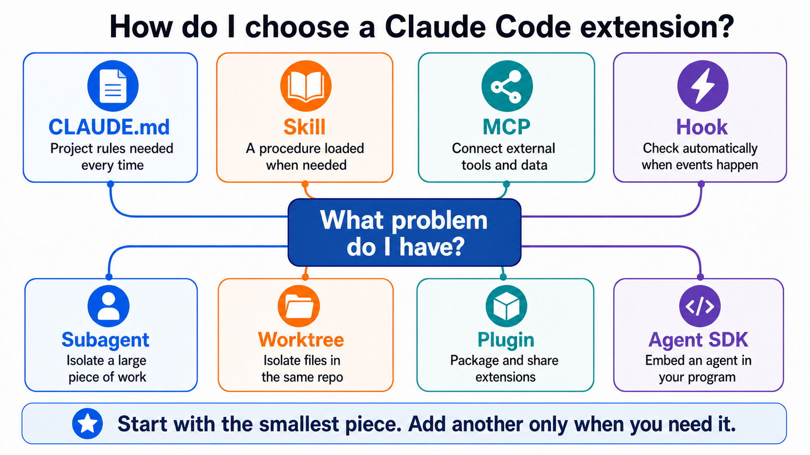
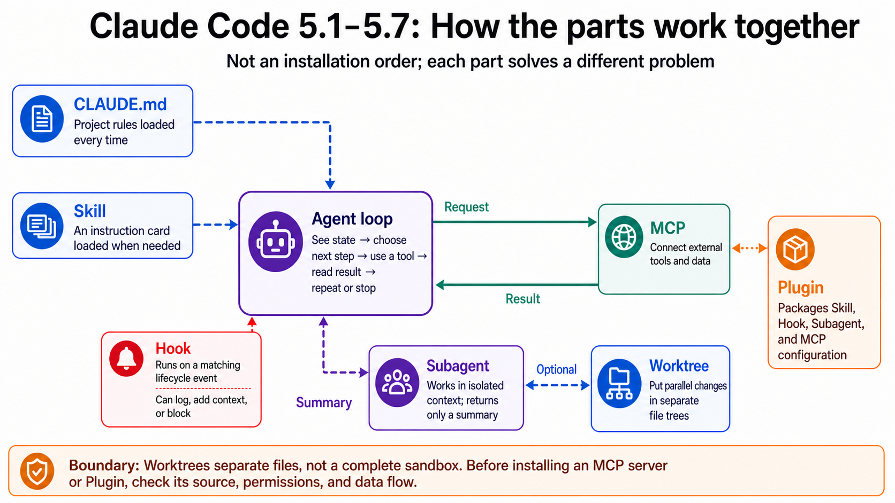

# Stage 5 — Claude Code Ecosystem ⭐⭐

> [Traditional Chinese](./05-claude-code-ecosystem.md) | [Simplified Chinese](./05-claude-code-ecosystem.zh-Hans.md) | **English**

<!-- freshness: canonical=stages/05-claude-code-ecosystem.md; verified_on=2026-08-29; scope=claude-code,mcp,skills,plugins,subagents,workflows,agent-sdk,security; max_age_days=90 -->

**Claude Code** is an assistant that can use files and a terminal. This chapter shows you how to give it rules, tools, and safety boundaries—not how to install everything at once.

## 📌 Learning goals

By the end of this chapter, you can:

- Explain what **CLAUDE.md**, **Skill**, **MCP**, **Hook**, **Plugin**, and **Subagent** each do.
- Choose the smallest useful component instead of making simple work complex just to look sophisticated.
- Create a shareable, inspectable, safe-by-default Claude Code project configuration.
- Know when Claude Code alone is enough, and when a **Worktree** or the **Claude Agent SDK** is warranted.

## 🧩 Meet the core terms first

### **Claude Code**

It is a coding agent that can read and edit files and run commands. Think of it as an assistant sitting beside your terminal; this chapter teaches you how to constrain it rather than grant every permission at once.

### **CLAUDE.md**

It is the project rulebook that Claude reads for every task. Think of it as a short rule card on your desk; it is a good place for test commands, naming conventions, and prohibitions.

### **Skill (`SKILL.md`)**

It is a procedure card you bring out only when needed. Think of it as a checklist you open for a fire drill; it is suitable for repeatable work such as deployment, review, or data processing.

### **MCP (Model Context Protocol)**

It is the common connector that lets a coding agent use external tools and data. Think of it as a standardized socket: once connected to GitHub, a database, or a browser, the agent can actually use that service.

### **Hook**

It is a check that runs automatically when an event happens. Think of it as an alarm at the door: before Claude runs a dangerous command, a Hook can intervene.

### **Plugin and Marketplace**

A **Plugin** packages Skills, Hooks, Subagents, or MCP configuration into one box; a **Marketplace** is a directory containing many boxes. The former is like an app, the latter like an app store.

### **Subagent**

It is a helper with its own context window. Think of it as a colleague sent to investigate: it keeps the bulky intermediate material, then returns only its result.

### **Worktree**

It is another working directory for the same Git repository. Think of it as another desk with separate sheets of paper; when multiple agents edit files at once, it prevents them from stepping on each other.

### **Claude Agent SDK**

It is a toolkit that lets your Python or TypeScript program control an agent. Think of it as embedding Claude Code’s working abilities into your own app; you need it only when building a product or service.



## Choose the right component with one table

<a id="-7-layer-architecture-map-read-this-first-then-51-57"></a>

| Your problem | Start with | Do not start by |
|---|---|---|
| Remembering the same project rule every time | `CLAUDE.md` | Putting an entire manual into it |
| A workflow is needed only in a particular situation | Skill | Pasting the same long prompt every time |
| Connecting to GitHub, a database, or a browser | MCP | Connecting an unreviewed server to a high-privilege account |
| Checking automatically whenever an event occurs | Hook | Treating an unfamiliar shell script as a security tool |
| A large search would crowd the current conversation | Subagent | Spawning agents for a tiny question |
| Multiple tasks will modify the same repository | Worktree | Letting multiple agents share the same uncommitted files |
| Sharing a configuration with a team | Plugin | Building a marketplace for the first question |
| Embedding an agent in a product | Agent SDK | Rewriting as a service what the CLI can already do |

> Want to distinguish OpenRouter, Pi, OpenCode, and Ollama? OpenRouter is a **router**, Ollama is a **local runtime**, and Claude Code, OpenCode, and Pi are **coding agents/harnesses**. The full selection table is in [Track A1](../tracks/cli/A1-cli-intro.en.md).

## 🚪 Entry requirements and reading paths

- **Track A (CLI user):** After [A2](../tracks/cli/A2-cli-workflow.en.md), read 5.1–5.4 to learn project instructions, Skills, MCP, and Plugins, then continue to [A3](../tracks/cli/A3-cli-production.en.md).
- **Track B (agent developer):** Complete [Stage 3](03-tool-use-and-hello-agent.en.md) and [Stage 4](04-agent-frameworks.en.md), then read 5.5–5.8.

<details markdown="1">
<summary>⏱ Before you begin: time, environment, authentication, and cost</summary>

- **Time:** The main path takes about 6–10 hours; completing every optional item and project takes about 15–25 hours.
- **Environment:** Git, a terminal, and a practice repository without sensitive data.
- **Authentication:** Claude Code can use an Anthropic account/API and has official paths for Amazon Bedrock, Google Vertex AI, and Microsoft Foundry. It is not a general frontend for arbitrary local models.
- **Cost:** Start with file and configuration checks that do not call a model. Before actually running Claude Code, check `/cost` or your account usage. Do not guess a fixed price for an exercise.
- **Safety:** For the first pass, use only a demo repository, read-only MCP, and least privilege. Do not put production tokens, SSH keys, or real customer data into practice work.

</details>

## 📚 Required reading

Read only two starting points before you begin: [Claude Code quickstart](https://code.claude.com/docs/en/quickstart) helps you install and open a first session, while [How Claude remembers your project](https://code.claude.com/docs/en/memory) helps you write the `CLAUDE.md` used in Exercise 1. Return to the other documents only when you meet the matching term; you do not need to read everything at once.

1. [Claude Code quickstart](https://code.claude.com/docs/en/quickstart) — installation and your first session.
2. [Extend Claude Code](https://code.claude.com/docs/en/features-overview) — one official table distinguishing CLAUDE.md, Skills, MCP, Hooks, Plugins, and Subagents.
3. [How Claude remembers your project](https://code.claude.com/docs/en/memory) — the boundaries among `CLAUDE.md`, Rules, and auto memory.
4. [Skills](https://code.claude.com/docs/en/skills) — the older `.claude/commands/` remains compatible; new instruction starts with `SKILL.md`.
5. [MCP specification](https://modelcontextprotocol.io/specification) — check the dated revision when consulting the protocol.
6. [Hooks reference](https://code.claude.com/docs/en/hooks) — events, input/output, and blocking rules.
7. [Plugins](https://code.claude.com/docs/en/plugins) — packaging and sharing extensions.
8. [Subagents](https://code.claude.com/docs/en/sub-agents), [parallel agents](https://code.claude.com/docs/en/agents), and [Dynamic workflows](https://code.claude.com/docs/en/workflows) — isolation, collaboration, and large-scale scripted orchestration.
9. [Agent SDK overview](https://code.claude.com/docs/en/agent-sdk/overview) — read only when you need to embed it in a program.

## 🛠 Hands-on exercises

The main project is a “safe Claude Code practice repository.” Each exercise adds only one component; complete the preceding exercise before moving to the next.

### Exercise 1: Write a minimal project rulebook

When you finish, you will have a short `CLAUDE.md` containing only its purpose, prohibitions, a verification command, and a delivery format.

```text
Read this repository first, then reply only with: its purpose, the three most important directories, and the first read-only check you would run. Do not modify files.
```

<details markdown="1">
<summary>Expand Exercise 1 steps and checks</summary>

1. Create `CLAUDE.md` in the root of a practice repository that has no sensitive data.
2. Write only four sections: `Purpose`, `Do not`, `Verify`, and `Deliver`.
3. Read it yourself first, then ask Claude to explain what it understood with the prompt above.
4. Success condition: Claude makes no edits, and the verification command it names matches `CLAUDE.md`.

Keep `CLAUDE.md` under 200 lines when possible. An `@path` import can organize files, but imported content still enters the context; to defer loading by path, use `.claude/rules/` with `paths` frontmatter.

</details>

### Exercise 2: Turn a repeated workflow into a Skill

When you finish, you can give Claude a short request and have it check a README against a fixed checklist.

```powershell
New-Item -ItemType Directory -Force .claude\skills\readme-check
```

<details markdown="1">
<summary>Expand Exercise 2 steps, macOS/Linux command, and example</summary>

Create `.claude/skills/readme-check/SKILL.md`:

```markdown
---
name: readme-check
description: Check a README for a clear purpose, install steps, one example, and a license link. Use when the user asks to review README onboarding.
disable-model-invocation: true
---

1. Read the README without changing it.
2. Check: purpose, install steps, one runnable example, license link.
3. Return PASS or a short list of missing items with line references.
```

macOS/Linux:

```bash
mkdir -p .claude/skills/readme-check
```

Check the YAML frontmatter manually first, then enter `/readme-check` in Claude Code. `disable-model-invocation: true` means only you can invoke it proactively, which suits workflows with side effects or a controlled timing requirement.

This repository’s full meta-example is [`examples/stage-5/tool-calling-tutor/`](../examples/stage-5/tool-calling-tutor/).

</details>

<a id="exercise-3-add-a-read-only-hook"></a>

### Exercise 3: Add an observation-only, non-blocking Hook

When you finish, every time Claude wants to write or edit a file, the Hook records the event and tool names. It does not retain prompts, approve actions for you, or block actions.

```powershell
New-Item -ItemType Directory -Force .claude/hooks
```

<details markdown="1">
<summary>Expand Exercise 3: copy the Hook, configuration, and verification steps</summary>

Save this as `.claude/hooks/log-tool.py`:

```python
import json
import sys
from datetime import datetime, timezone
from pathlib import Path


event = json.load(sys.stdin)
record = {
    "checked_at": datetime.now(timezone.utc).isoformat(),
    "hook_event_name": event.get("hook_event_name"),
    "tool_name": event.get("tool_name"),
}
log_path = Path(__file__).with_name("events.jsonl")
with log_path.open("a", encoding="utf-8") as handle:
    handle.write(json.dumps(record, ensure_ascii=False) + "\n")
```

If the demo repository does not yet have `.claude/settings.json`, create it:

```json
{
  "hooks": {
    "PreToolUse": [
      {
        "matcher": "Edit|Write",
        "hooks": [
          {
            "type": "command",
            "command": "python",
            "args": [
              "${CLAUDE_PROJECT_DIR}/.claude/hooks/log-tool.py"
            ]
          }
        ]
      }
    ]
  }
}
```

If the file already exists, add only `PreToolUse` to its existing `hooks`; do not overwrite other settings. Add `.claude/hooks/events.jsonl` to `.gitignore` so local operation logs are not committed.

Test the script with fake data first:

```powershell
'{"hook_event_name":"PreToolUse","tool_name":"Write"}' | python .claude/hooks/log-tool.py
Get-Content .claude/hooks/events.jsonl
```

Then enter `/hooks` in Claude Code and confirm that `PreToolUse` shows one Hook. Ask Claude to create `hook-demo.txt` in the demo repository. The last line should contain `"hook_event_name": "PreToolUse"` and `"tool_name": "Write"`.

- A Hook can be a shell command, HTTP endpoint, prompt, agent, or MCP tool; not every event supports every handler type.
- Exit code `2` from `PreToolUse` can block a tool call, but exit code `2` does not have the same effect for every event; consult the official event matrix.
- This example records only the event and tool names, not full prompts, tool input, tokens, or secret values; exit code `0` means it does not block.
- Success condition: both the fake-data test and one real `Write` add a line, and the log contains neither a prompt nor file contents.

</details>

### Exercise 4: Connect a restricted MCP server

When you finish, Claude can read only the demo directory you specify; it cannot access your whole computer.

```text
I want to connect a filesystem MCP server. First explain which directory it will see, which tools it has, and how to remove it; then wait for my approval. Do not install it directly.
```

<details markdown="1">
<summary>Expand Exercise 4 and the MCP 2026 note</summary>

1. Create a directory containing only fake data.
2. Follow the [Claude Code MCP documentation](https://code.claude.com/docs/en/mcp) to add a filesystem server scoped only to that directory.
3. List the tools first, then read one fake file, and finally remove the server.
4. Success condition: reading the specified directory succeeds; requesting a path outside it fails.

MCP has three core abstractions: **Tools** are actions the model can call, **Resources** are readable data, and **Prompts** are prompt templates supplied by a server. Most beginner servers start with Tools.

The `2026-07-28` specification makes the core stateless request/response, removes `initialize`/`initialized` and `Mcp-Session-Id`, and uses MRTR for multi-turn requests that need more information. This migration detail is primarily for SDK/server authors; readers connecting an existing server should first confirm that its host and server support the same version.

</details>

### Exercise 5: Use a Subagent for a read-only check

When you finish, large searches stay in an isolated context and the main conversation receives only a summary.

```text
Use the Explore subagent to find where tests are documented. Read only. Return the three most useful file paths and one sentence for each.
```

<details markdown="1">
<summary>Expand Exercise 5 and the custom Subagent example</summary>

The primary built-in Claude Code Subagents are `Explore`, `Plan`, and `general-purpose`. Other names may come from a plugin, organization setting, or your own `.claude/agents/<name>.md`; do not assume every machine has them.

```markdown
---
name: docs-finder
description: Find documentation related to a named feature and return file paths. Use for read-only documentation discovery.
tools: Read, Glob, Grep
model: haiku
---

Search only. Return up to five file paths with one-sentence reasons. Do not edit files or run shell commands.
```

A Subagent is dispatched through the current `Agent` tool. It has an independent context and permission configuration, receives a self-contained task, and returns a summary to the main conversation. Small questions, work needing frequent back-and-forth, or work sharing substantial context are simpler to keep in the main conversation.

</details>

## See how 5.1–5.7 fit together

This diagram organizes relationships, not an installation order. Read the bold definitions above first, then use the diagram to locate the context, action, event-check, isolation, and packaging boundaries.



## 5.1 — Claude Code fundamentals

<a id="51--claude-code-basics"></a>
<a id="-claudemd-design-prompts-using-the-5-principles"></a>

The outcome of this section: you can start safely and know that “configuration” and “instructions” are not the same thing.

<details markdown="1">
<summary>Expand 5.1: installation, CLAUDE.md, the Skills compatibility layer, and configuration locations</summary>

Claude Code is available on surfaces including the CLI, Desktop, VS Code, and JetBrains. It can operate files and tools, but remains constrained by permissions, sandboxing, Hooks, and organizational policy; do not mistake “can run shell commands” for “should have every permission.”

| Scope | Common location | What belongs there |
|---|---|---|
| Managed | Operating-system managed path | Organization policy |
| User | `~/.claude/CLAUDE.md` | Personal cross-project preferences |
| Project | `./CLAUDE.md` or `./.claude/CLAUDE.md` | Team-shared rules |
| Local | `./CLAUDE.local.md` | Local configuration not committed to Git |

`.claude/rules/*.md` can be loaded later based on `paths`. `.claude/skills/<name>/SKILL.md` is knowledge or a workflow loaded on demand. The old `.claude/commands/*.md` can still create slash commands, but new material should teach Skills first.

Refer to the current [Commands reference](https://code.claude.com/docs/en/commands) for common entry points. At first, remember only `/help`, `/model`, `/permissions`, `/memory`, `/agents`, and `/cost`; features change, so do not treat a fixed “top ten commands” list as a lasting standard.

</details>

## 5.2 — MCP (Model Context Protocol) fundamentals

<a id="52--mcp-model-context-protocol--foundation"></a>

The outcome of this section: you can describe MCP as a “shared socket” and distinguish Tool Use from MCP.

<details markdown="1">
<summary>Expand 5.2: Tools, Resources, Prompts, versions, and safety</summary>

- **Tool Use:** the model proposes a structured call, and your program or host executes it.
- **MCP:** a cross-host protocol for exchanging tools, data, and prompts.
- **Skill:** teaches an agent when and how to use a capability; it does not create an external connection by itself.
- **Plugin:** packages and shares Skills, Hooks, Subagents, MCP configuration, and more.

The official [`modelcontextprotocol/servers`](https://github.com/modelcontextprotocol/servers) repository contains reference implementations; it is not a guarantee that a server is production-ready. Before connecting a third-party server, inspect its source, permissions, data flow, and removal procedure. Tool results are also untrusted input and must not be treated directly as high-privilege instructions.

`2026-07-28` is the currently verified formal specification revision. It uses a stateless core, header routing, MRTR, and an extensions framework; older capabilities have a deprecation window of at least 12 months. Do not paste 2025 initialization flows directly into a new server.

</details>

## 5.3 — Skills: on-demand procedure cards

<a id="53--skills-claude-codes-behavior-layer--the-most-critical-layer-of-the-claude-code-ecosystem"></a>
<a id="-skillmd-design-prompts-including-skill-creator-as-the-alternative"></a>

The outcome of this section: you can write a short, triggerable, verifiable `SKILL.md`.

<details markdown="1">
<summary>Expand 5.3: frontmatter, loading, prompt design, and evaluation</summary>

A Skill’s description is like the title of an index card: state “when to use it,” not merely an attractive feature description. The Skill body loads on demand by default; supporting files can go in `references/`, `scripts/`, and other directories.

- `disable-model-invocation: true`: only a user can invoke it proactively; suitable for deployment, commits, or workflows that have external side effects.
- `user-invocable: false`: it does not appear as a user slash command, but Claude can still use it in an appropriate situation.

An audit prompt you can copy directly:

```text
Please inspect this SKILL.md:
1. Does its description clearly state “when to use” and “when not to use” it?
2. Does the main file contain only the necessary workflow, with details moved to references/?
3. Does every step have a verifiable success condition?
4. Do workflows with side effects prevent automatic model invocation?
5. Do relative links, scripts, and examples really exist?
For each item, reply PASS/FAIL, the evidence location, and the smallest fix; do not overwrite the file directly.
```

Current Skills follow the open Agent Skills standard; Claude Code additionally provides invocation control, Subagent execution, and dynamic context. The core content can be shared across tools, but directory layouts, frontmatter, permissions, and tool names must be verified separately.

</details>

## 5.4 — Plugins and Marketplaces

<a id="54--plugins--marketplaces"></a>

The outcome of this section: you can explain that “a Plugin is one box of parts, and a Marketplace is a directory containing many boxes.”

<details markdown="1">
<summary>Expand 5.4: plugin structure, installation, sharing, and supply-chain safety</summary>

```text
my-plugin/
├── .claude-plugin/plugin.json
├── skills/<name>/SKILL.md
├── agents/<name>.md
├── hooks/hooks.json
└── .mcp.json
```

Follow the actual schema in the [Plugins reference](https://code.claude.com/docs/en/plugins-reference); current components can also include LSP servers and monitors. Do not treat this minimal teaching tree as the complete schema.

Adding a Marketplace only makes Plugins visible in a directory; it does not install all of them. Before installing, inspect the repository, publisher, permissions, Hooks, MCP servers, license, and update path. Refer to the official configuration documentation for precedence and consent rules among managed, project, and local settings.

</details>

## 5.5 — Subagents: isolate the bulky work

<a id="55--subagents-claude-codes-native-multi-agent-mechanism--2025-new-feature"></a>
<a id="which-subagents-can-you-dispatch"></a>

The outcome of this section: you can decide when independent context is useful and write a self-contained delegation brief.

<details markdown="1">
<summary>Expand 5.5: built-in types, differences from Skills, permissions, cost, and common errors</summary>

| | Skill | Subagent |
|---|---|---|
| Core purpose | Reuse knowledge or a workflow | Isolate a portion of work |
| Context | Usually loaded in the current conversation; can also be configured to fork | A new independent context by default |
| Result | Changes how Claude handles a task | Returns a result or summary |
| Best for | Rules, reference material, fixed workflows | Large searches, parallel analysis, specialist workers |

A custom Subagent’s `description` is a routing hint, not a code-level `if`. Make the prompt self-contained: state the task, scope, tools, output, and stopping condition. The current official configuration also supports `skills`, `mcpServers`, permissions, hooks, and settings such as `isolation: worktree`; add them only when truly needed.

More agents increase token use, latency, and integration work. Do not claim a fixed multiplier; measure with your task, model, and usage records.

Fifteen advanced, reusable recipes: [`resources/subagent-cookbook.en.md`](../resources/subagent-cookbook.en.md). Composition and debugging: [`resources/subagent-advanced.en.md`](../resources/subagent-advanced.en.md).

</details>

## 5.6 — Parallel work and Worktrees

<a id="56--dynamic-workflows-when-claude-writes-its-own-workflow--opus-48-feature"></a>

The outcome of this section: you can distinguish who coordinates work from who isolates files.

<details markdown="1">
<summary>Expand 5.6: Subagents, agent view, agent teams, Dynamic workflows, Worktrees, and /batch</summary>

| Approach | Who coordinates | Best for | Current status/boundary |
|---|---|---|---|
| Subagent | Main conversation | Isolated search or specialist task | Returns results in the same session |
| Agent view | User | Monitoring multiple independent background sessions | Research preview |
| Agent teams | Lead and teammates | Workers need to share tasks and message one another | Experimental, disabled by default |
| [**Dynamic workflows**](https://code.claude.com/docs/en/workflows) | Coordinator script/runtime | Large audits, migrations, or cross-checked research | Readable, rerunnable JavaScript orchestration; uses extra tokens |
| Worktree | Git/user | Isolating file changes in the same repository | Does not coordinate agent communication |
| `/batch` | Claude plans, then delegates | 5–30 separable mechanical changes | Each worker needs its own scope and review |

A Worktree solves “do not edit the same files”; a Subagent or team solves “who does which task.” They can be used together, but are not the same feature. Agent teams do not automatically create a Worktree for every teammate, so file ownership must still be divided clearly.

**Dynamic workflows** put the plan in a readable JavaScript script, not in a particular Claude model; use `/workflows` to see progress. They require Claude Code v2.1.154+ and are available on paid plans, through the API, and on Bedrock, Google Cloud Agent Platform, and Foundry. On Pro, enable them from their row in `/config`.

</details>

## 5.7 — Dissecting the agent loop

<a id="57--dissecting-claude-code-source-reference-harness-implementation-track-b-must-read"></a>
<a id="57--dissecting-claude-code-source-reference-harness-implementation--a-must-read-for-track-b"></a>

The outcome of this section: you can draw the loop “read context → model decides → tool executes → result returns → decide again.”

<details markdown="1">
<summary>Expand 5.7: official agent-loop reading exercise</summary>

First read [How the agent loop works](https://code.claude.com/docs/en/agent-sdk/agent-loop), then answer:

1. What data enters the context before it is sent to the model?
2. After the model proposes a tool call, who checks permissions?
3. How does a tool result return to the next turn?
4. How does the loop stop on success, error, refusal, or a reached limit?
5. Where do Hooks, MCP, Skills, and Subagents fit into the loop?

Draw the answers as a six-box arrow diagram, then compare it in 100–150 words with the minimal ReAct loop in [Stage 3](03-tool-use-and-hello-agent.en.md), explaining which control boundaries are added.

`anthropics/claude-agent-sdk-python` is useful reading, but it is an SDK client/wrapper, not the complete Claude Code runtime source. You can inspect its message types, transport, query options, and error handling; do not conclude you missed something when `_internal/client.py` does not contain a complete LLM loop.

</details>

## 5.8 — Claude Agent SDK (optional)

<a id="58--sdk-take-claude-code-apart-and-rebuild-it-your-way-track-b-optional-production-only"></a>

The outcome of this section: you can decide whether the CLI is enough or you truly need to embed an agent in a program.

<details markdown="1">
<summary>Expand 5.8: Python quickstart, providers, and safe hosting</summary>

Situations that need the SDK:

- Users will not open a terminal, and you need to put an agent in your own app.
- You need programmatic input/output, scheduling, auditing, quotas, or multi-tenancy.
- A service must control allowed tools, sessions, and result formats.

```python
import asyncio
from claude_agent_sdk import AssistantMessage, ClaudeAgentOptions, TextBlock, query


async def main() -> None:
    options = ClaudeAgentOptions(allowed_tools=["Read", "Glob"])
    async for message in query(prompt="Summarize this project without editing files.", options=options):
        if isinstance(message, AssistantMessage):
            for block in message.content:
                if isinstance(block, TextBlock):
                    print(block.text)


asyncio.run(main())
```

The package names are `claude-agent-sdk` and `@anthropic-ai/claude-agent-sdk`; the old `claude-code-sdk` name has migrated. The SDK supports the Anthropic API and has official authentication paths for Bedrock, Vertex AI, and Foundry.

The SDK can execute commands and retain session state, so it is not an ordinary stateless text API. Before deployment, implement containers/sandboxing, network controls, credential isolation, resource limits, audit logs, and human approval. Read [Hosting](https://code.claude.com/docs/en/agent-sdk/hosting) and the secure deployment documentation first.

</details>

## 🎯 Curated projects and learning resources

On your first pass, choose only one entry that matches the exercise at hand. Five stars are this learning map’s editorial guidance, not a popularity ranking.

**Start with this chapter project:** [`tool-calling-tutor`](../examples/stage-5/tool-calling-tutor/README.en.md) ⭐⭐⭐⭐⭐ — it is a Skill example in this repository that you can follow directly. For Claude Code releases and issues, use [`anthropics/claude-code`](https://github.com/anthropics/claude-code) ⭐⭐⭐⭐⭐.

<small>Information checked: 2026-08-29 UTC</small>

<table>
<thead>
<tr><th scope="col">Topic</th><th scope="col">Resource</th><th scope="col">Rating</th><th scope="col">Who it is for / what to read</th></tr>
</thead>
<tbody>
<tr><th scope="rowgroup" rowspan="4">Claude Code fundamentals</th><td><a href="https://github.com/anthropics/claude-code">anthropics/claude-code</a></td><td>⭐⭐⭐⭐⭐</td><td>Follow official releases, issues, and current features.</td></tr>
<tr><td><a href="https://code.claude.com/docs/en/overview">Official Claude Code documentation</a></td><td>⭐⭐⭐⭐⭐</td><td>The primary source for configuration, permissions, or command questions.</td></tr>
<tr><td><a href="https://github.com/hesreallyhim/awesome-claude-code">awesome-claude-code</a></td><td>⭐⭐⭐⭐</td><td>Explore community extensions after completing the official quickstart.</td></tr>
<tr><td><a href="https://github.com/KimYx0207/AI-Coding-Guide-Zh">AI-Coding-Guide-Zh</a></td><td>⭐⭐⭐⭐</td><td>For readers who want a step-by-step Simplified Chinese guide.</td></tr>
</tbody>
<tbody>
<tr><th scope="rowgroup" rowspan="8">MCP</th><td><a href="https://github.com/modelcontextprotocol/servers">modelcontextprotocol/servers</a></td><td>⭐⭐⭐⭐⭐</td><td>Official reference implementations; read them for the protocol, not as a production guarantee.</td></tr>
<tr><td><a href="https://github.com/modelcontextprotocol/python-sdk">modelcontextprotocol/python-sdk</a></td><td>⭐⭐⭐⭐⭐</td><td>Write a client/server in Python; compare it with the current specification revision first.</td></tr>
<tr><td><a href="https://github.com/modelcontextprotocol/typescript-sdk">modelcontextprotocol/typescript-sdk</a></td><td>⭐⭐⭐⭐</td><td>The official SDK for the TypeScript path.</td></tr>
<tr><td><a href="https://github.com/wong2/awesome-mcp-servers">wong2/awesome-mcp-servers</a></td><td>⭐⭐⭐⭐⭐</td><td>Look for an existing option before writing a server; review each publisher and permission.</td></tr>
<tr><td><a href="https://github.com/punkpeye/awesome-mcp-servers">punkpeye/awesome-mcp-servers</a></td><td>⭐⭐⭐⭐</td><td>Use a different classification to find servers; listing is not a safety endorsement.</td></tr>
<tr><td><a href="https://github.com/github/github-mcp-server">github/github-mcp-server</a></td><td>⭐⭐⭐⭐</td><td>Study the tool and permission design of a large official MCP server.</td></tr>
<tr><td><a href="https://github.com/21st-dev/magic-mcp">21st-dev/magic-mcp</a></td><td>⭐⭐⭐</td><td>A nontrivial MCP case for generated UI; separately check its license and maintenance status before use.</td></tr>
<tr><td><a href="https://github.com/yamadashy/repomix">yamadashy/repomix</a></td><td>⭐⭐⭐⭐⭐</td><td>Learn repository packaging, sensitive-data filtering, and the boundaries of MCP mode.</td></tr>
</tbody>
<tbody>
<tr><th scope="rowgroup" rowspan="8">Skills</th><td><a href="https://github.com/anthropics/skills">anthropics/skills</a></td><td>⭐⭐⭐⭐⭐</td><td>Official templates, specification, and document-processing Skills; read these before creating your own Skill.</td></tr>
<tr><td><a href="https://github.com/anthropics/claude-code">anthropics/claude-code</a></td><td>⭐⭐⭐⭐</td><td>Follow Claude Code’s current support for Skills.</td></tr>
<tr><td><a href="https://github.com/mattpocock/skills">mattpocock/skills</a></td><td>⭐⭐⭐⭐</td><td>Observe concise, task-oriented community Skill writing.</td></tr>
<tr><td><a href="https://github.com/obra/superpowers">obra/superpowers</a></td><td>⭐⭐⭐⭐</td><td>Learn how TDD, debugging, and planning Skills can be combined.</td></tr>
<tr><td><a href="https://github.com/wshobson/agents">wshobson/agents</a></td><td>⭐⭐⭐⭐</td><td>See how Skills and Subagents divide work; do not copy permissions wholesale.</td></tr>
<tr><td><a href="https://github.com/travisvn/awesome-claude-skills">awesome-claude-skills</a></td><td>⭐⭐⭐⭐</td><td>An entry point to community Skills; review each one before installation.</td></tr>
<tr><td><a href="https://github.com/VoltAgent/awesome-agent-skills">awesome-agent-skills</a></td><td>⭐⭐⭐</td><td>Compare the compatible scope of Agent Skills across tools.</td></tr>
<tr><td><a href="https://github.com/alirezarezvani/claude-skills">alirezarezvani/claude-skills</a></td><td>⭐⭐⭐</td><td>Find domain examples; treat this as a case library, not an official standard.</td></tr>
</tbody>
<tbody>
<tr><th scope="rowgroup" rowspan="7">Plugins / Marketplaces</th><td><a href="https://github.com/anthropics/claude-plugins-official">claude-plugins-official</a></td><td>⭐⭐⭐⭐⭐</td><td>The primary official example of Plugin and Marketplace structure.</td></tr>
<tr><td><a href="https://github.com/anthropics/knowledge-work-plugins">knowledge-work-plugins</a></td><td>⭐⭐⭐⭐⭐</td><td>See how bundles for multiple domains divide work and package components.</td></tr>
<tr><td><a href="https://github.com/obra/superpowers-marketplace">superpowers-marketplace</a></td><td>⭐⭐⭐⭐</td><td>Learn a minimal Marketplace that only curates while Plugins live in external repositories.</td></tr>
<tr><td><a href="https://github.com/trailofbits/skills-curated">trailofbits/skills-curated</a></td><td>⭐⭐⭐</td><td>Observe how a Marketplace can add human security review and trust information.</td></tr>
<tr><td><a href="https://github.com/rohitg00/awesome-claude-code-toolkit">awesome-claude-code-toolkit</a></td><td>⭐⭐⭐</td><td>A community entry point for agents, Skills, Hooks, and templates.</td></tr>
<tr><td><a href="https://github.com/anthropics/life-sciences">anthropics/life-sciences</a></td><td>⭐⭐⭐</td><td>Study the structure of a single-domain Marketplace; the content itself is life-science focused.</td></tr>
<tr><td><a href="https://github.com/anthropics/claude-for-legal">anthropics/claude-for-legal</a></td><td>⭐⭐⭐⭐</td><td>See a large vertical suite’s Skills, Agents, MCP, and responsibility boundaries.</td></tr>
</tbody>
<tbody>
<tr><th scope="rowgroup" rowspan="4">Subagents</th><td><a href="https://github.com/anthropics/claude-cookbooks">anthropics/claude-cookbooks</a></td><td>⭐⭐⭐⭐⭐</td><td>Read official tool-use and orchestration notebooks.</td></tr>
<tr><td><a href="https://github.com/wshobson/agents">wshobson/agents</a></td><td>⭐⭐⭐⭐⭐</td><td>Study naming and division of work across many agent definitions; begin with a small number of files.</td></tr>
<tr><td><a href="https://github.com/obra/superpowers">obra/superpowers</a></td><td>⭐⭐⭐⭐</td><td>Compare when to use a Skill and when to isolate a worker.</td></tr>
<tr><td><a href="https://github.com/anthropics/claude-plugins-official">claude-plugins-official</a></td><td>⭐⭐⭐⭐</td><td>See how a Plugin packages Agents.</td></tr>
</tbody>
<tbody>
<tr><th scope="rowgroup" rowspan="4">Agent loop / SDK</th><td><a href="https://github.com/anthropics/claude-agent-sdk-python">claude-agent-sdk-python</a></td><td>⭐⭐⭐⭐⭐</td><td>Python SDK client, message types, and options; not the complete Claude Code runtime source.</td></tr>
<tr><td><a href="https://github.com/ZhangHanDong/harness-engineering-from-cc-to-ai-coding">harness-engineering-from-cc-to-ai-coding</a></td><td>⭐⭐⭐⭐</td><td>A Chinese explanation of harnesses; verify facts against official documentation.</td></tr>
<tr><td><a href="https://github.com/ai-boost/awesome-harness-engineering">awesome-harness-engineering</a></td><td>⭐⭐⭐⭐</td><td>Expand into eval, memory, observability, and runtime resources.</td></tr>
<tr><td><a href="https://github.com/wshobson/agents">wshobson/agents</a></td><td>⭐⭐⭐⭐</td><td>Observe the readability and permission surface of a harness through actual Agent definitions.</td></tr>
</tbody>
</table>

<a id="-self-check-before-stage-6"></a>

## ✅ Self-check before your next stop

Can you:

- [ ] Distinguish `CLAUDE.md`, Skills, MCP, Hooks, Plugins, and Subagents in one sentence each?
- [ ] Complete at least the first three exercises without directly giving an agent an unfamiliar script or a high-privilege token?
- [ ] Explain that a Subagent and a Worktree solve two different problems?
- [ ] Identify the categories of Claude Code, OpenRouter, OpenCode/Pi, and Ollama?
- [ ] Decide whether your need is “use the CLI” or “actually need the Agent SDK”?

If yes, follow your route: **Track A** continues to [A3 — Safe team workflows](../tracks/cli/A3-cli-production.en.md); **Track B** continues to [Stage 6 — Memory & RAG](06-memory-rag.en.md). If not, return to “Choose the right component with one table” and redo only the row you cannot distinguish.
