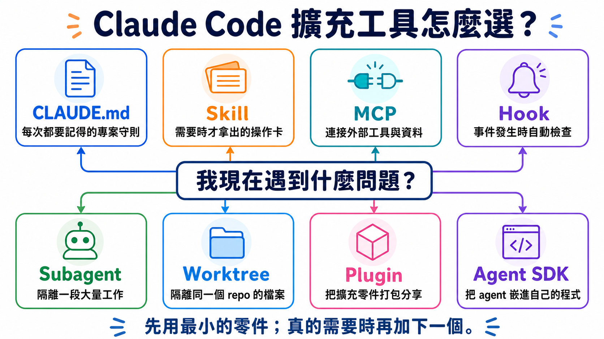
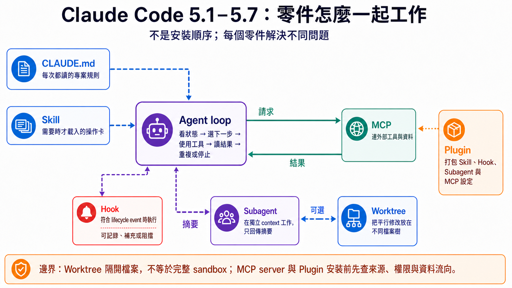

# Stage 5 — Claude Code 生態系（Claude Code Ecosystem）⭐⭐

> **繁體中文** | [简体中文](./05-claude-code-ecosystem.zh-Hans.md) | [English](./05-claude-code-ecosystem.en.md)

<!-- freshness: canonical=stages/05-claude-code-ecosystem.md; verified_on=2026-08-29; scope=claude-code,mcp,skills,plugins,subagents,workflows,agent-sdk,security; max_age_days=90 -->

**Claude Code** 像一位會使用檔案和終端機的助手。本章教你怎麼給它規則、工具和安全邊界，不是叫你一次裝完所有東西。

## 📌 學習目標

完成這一章後，你可以：

- 說出 **CLAUDE.md**、**Skill**、**MCP**、**Hook**、**Plugin** 和 **Subagent** 各自做什麼。
- 先選最小的零件，不為了「看起來厲害」把簡單工作做複雜。
- 做出一套可分享、可檢查、預設安全的 Claude Code 專案設定。
- 知道何時只用 Claude Code，何時才需要 **Worktree** 或 **Claude Agent SDK**。

## 🧩 先認識核心詞

### **Claude Code**

它是會讀檔、改檔和執行指令的 coding agent。它像坐在終端機旁的助手；這章會教你怎麼約束它，而不是把所有權限一次打開。

### **CLAUDE.md**

它是每次工作都要看的專案守則。它像貼在工作桌前的短規則卡；適合放測試指令、命名規則和不能做的事。

### **Skill（`SKILL.md`）**

它是需要時才拿出來的操作卡。它像「遇到火警才打開」的流程卡；適合放部署、審查或資料處理等可重複步驟。

### **MCP（Model Context Protocol）**

它是 coding agent 接外部工具和資料的共用接頭。它像統一規格的插座；接上 GitHub、資料庫或瀏覽器後，agent 才真的能使用那些服務。

### **Hook**

它是在某件事發生時自動執行的檢查。它像門口警鈴；例如 Claude 要跑危險指令前，Hook 可以先擋住。

### **Plugin 與 Marketplace**

**Plugin** 是把 Skills、Hooks、Subagents 或 MCP 設定包成一盒；**Marketplace** 是放很多盒子的目錄。前者像 App，後者像 App 商店。

### **Subagent**

它是有自己 context window 的小幫手。它像被派去查資料的同事；中間的大量內容留在它那邊，最後只把結果帶回來。

### **Worktree**

它是同一個 Git repo 的另一個工作目錄。它像在旁邊多開一張不共用紙張的工作桌；多個 agent 同時改檔時，用它避免互相踩到。

### **Claude Agent SDK**

它是讓你的 Python 或 TypeScript 程式控制 agent 的工具包。它像把 Claude Code 的工作能力裝進自己的 App；只有要做產品或服務時才需要。



## 一張表先選對零件

<a id="-7-layer-architecture-map先看這張圖再讀-51-57"></a>

| 你的問題 | 先用什麼 | 先不要做什麼 |
|---|---|---|
| 每次都要記得同一條專案規則 | `CLAUDE.md` | 把整本手冊都塞進去 |
| 某個情境才需要一套步驟 | Skill | 每次重新貼同一大段 prompt |
| 要連 GitHub、資料庫或瀏覽器 | MCP | 把未審查的 server 直接接上高權限帳號 |
| 每次發生事件都要自動檢查 | Hook | 把陌生 shell script 當安全工具 |
| 大量搜尋會塞滿目前對話 | Subagent | 為一個小問題多開 agent |
| 多個工作會改到同一個 repo | Worktree | 讓多個 agent 共用同一份未提交檔案 |
| 要把設定分享給團隊 | Plugin | 第一題就自建 marketplace |
| 要把 agent 嵌進產品 | Agent SDK | 把可用 CLI 完成的事重寫成服務 |

> 想分清 OpenRouter、Pi、OpenCode 和 Ollama？OpenRouter 是 **Router**，Ollama 是 **Local runtime**，Claude Code、OpenCode 和 Pi 是 **Coding agent／harness**。完整選擇表在 [Track A1](../tracks/cli/A1-cli-intro.md)。

## 🚪 進入條件與閱讀路線

- **Track A（CLI 使用者）**：完成 [A2](../tracks/cli/A2-cli-workflow.md) 後讀 5.1–5.4，學會專案守則、Skill、MCP 和 Plugin，再前往 [A3](../tracks/cli/A3-cli-production.md)。
- **Track B（Agent 開發者）**：完成 [Stage 3](03-tool-use-and-hello-agent.md) 與 [Stage 4](04-agent-frameworks.md) 後，再讀 5.5–5.8。

<details markdown="1">
<summary>⏱ 開始前先看：時間、環境、認證與費用</summary>

- **時間**：主線約 6–10 小時；把所有選讀與專案都做完約 15–25 小時。
- **環境**：Git、終端機和一個不含私密資料的練習 repo。
- **認證**：Claude Code 可使用 Anthropic 帳號／API，也有 Amazon Bedrock、Google Vertex AI 與 Microsoft Foundry 的官方路徑。它不是任意本機模型的通用前端。
- **費用**：先做不呼叫模型的檔案與設定檢查；真正執行 Claude Code 前，再看 `/cost` 或帳戶用量。不要用固定金額猜一次練習會花多少。
- **安全**：第一輪只用示範 repo、唯讀 MCP 和最小權限。不要把 production token、SSH key 或真實客戶資料放進練習。

</details>

## 📚 必修閱讀

開始前只看兩個入口：[Claude Code quickstart](https://code.claude.com/docs/en/quickstart) 幫你安裝並開啟第一個工作階段；[How Claude remembers your project](https://code.claude.com/docs/en/memory) 幫你寫第一題的 `CLAUDE.md`。其他文件遇到對應名詞時再查，不用一次讀完。

1. [Claude Code quickstart](https://code.claude.com/docs/en/quickstart) — 安裝與第一個工作階段。
2. [Extend Claude Code](https://code.claude.com/docs/en/features-overview) — 一張官方表分清 CLAUDE.md、Skill、MCP、Hook、Plugin 與 Subagent。
3. [How Claude remembers your project](https://code.claude.com/docs/en/memory) — `CLAUDE.md`、Rules 和 auto memory 的邊界。
4. [Skills](https://code.claude.com/docs/en/skills) — 舊 `.claude/commands/` 仍相容；新教學先用 `SKILL.md`。
5. [MCP specification](https://modelcontextprotocol.io/specification) — 查協定時看日期版號。
6. [Hooks reference](https://code.claude.com/docs/en/hooks) — 事件、輸入輸出與阻擋規則。
7. [Plugins](https://code.claude.com/docs/en/plugins) — 打包與分享擴充元件。
8. [Subagents](https://code.claude.com/docs/en/sub-agents)、[parallel agents](https://code.claude.com/docs/en/agents) 與 [Dynamic workflows](https://code.claude.com/docs/en/workflows) — 隔離、協作與大規模腳本編排。
9. [Agent SDK overview](https://code.claude.com/docs/en/agent-sdk/overview) — 只有要嵌進程式時再讀。

## 🛠 動手練習

主專案是一個「安全的 Claude Code 練習 repo」。每題只加一個零件；前一題成功再做下一題。

### 練習 1：寫一張最小專案守則

完成後，你會有一份短 `CLAUDE.md`，裡面只有用途、禁止事項、驗證指令和交付格式。

```text
請先閱讀這個 repo，只回覆：用途、最重要的 3 個目錄，以及你會先跑哪個唯讀檢查。不要修改檔案。
```

<details markdown="1">
<summary>展開練習 1 步驟與檢查</summary>

1. 在不含私密資料的練習 repo 根目錄建立 `CLAUDE.md`。
2. 只寫四區：`Purpose`、`Do not`、`Verify`、`Deliver`。
3. 先人工讀一遍，再請 Claude 依上面的 prompt 說明它理解到什麼。
4. 成功條件：Claude 沒改檔，且說出的驗證指令跟 `CLAUDE.md` 一致。

`CLAUDE.md` 建議低於 200 行。`@path` import 可以整理檔案，但被 import 的內容仍會進 context；要按路徑延後載入，使用 `.claude/rules/` 的 `paths` frontmatter。

</details>

### 練習 2：把重複流程做成 Skill

完成後，你可以輸入一個簡短需求，讓 Claude 依固定清單檢查 README。

```powershell
New-Item -ItemType Directory -Force .claude\skills\readme-check
```

<details markdown="1">
<summary>展開練習 2 步驟、macOS/Linux 指令與範例</summary>

建立 `.claude/skills/readme-check/SKILL.md`：

```markdown
---
name: readme-check
description: Check a README for a clear purpose, install steps, one example, and a license link. Use when the user asks to review README onboarding.
disable-model-invocation: true
---

1. Read the README without changing it.
2. Check: purpose, install steps, one runnable example, license link.
3. Return PASS or a short list of missing items with line references.
```

macOS/Linux：

```bash
mkdir -p .claude/skills/readme-check
```

先人工檢查 YAML frontmatter，再在 Claude Code 輸入 `/readme-check`。`disable-model-invocation: true` 表示只有你能主動叫它，適合有副作用或需要控制時機的流程。

本 repo 的完整 meta-example：[`examples/stage-5/tool-calling-tutor/`](../examples/stage-5/tool-calling-tutor/)。

</details>

<a id="練習-3加一個唯讀-hook"></a>

### 練習 3：加一個只記錄、不阻擋的 Hook

完成後，每次 Claude 想寫檔或改檔時，Hook 都會留下 event 名稱與 tool 名稱；它不保存 prompt，也不替你批准或阻擋動作。

```powershell
New-Item -ItemType Directory -Force .claude/hooks
```

<details markdown="1">
<summary>展開練習 3：直接複製 Hook、設定與驗證步驟</summary>

把這段存成 `.claude/hooks/log-tool.py`：

```python
import json
import sys
from datetime import datetime, timezone
from pathlib import Path


event = json.load(sys.stdin)
record = {
    "checked_at": datetime.now(timezone.utc).isoformat(),
    "hook_event_name": event.get("hook_event_name"),
    "tool_name": event.get("tool_name"),
}
log_path = Path(__file__).with_name("events.jsonl")
with log_path.open("a", encoding="utf-8") as handle:
    handle.write(json.dumps(record, ensure_ascii=False) + "\n")
```

如果 demo repo 還沒有 `.claude/settings.json`，直接建立：

```json
{
  "hooks": {
    "PreToolUse": [
      {
        "matcher": "Edit|Write",
        "hooks": [
          {
            "type": "command",
            "command": "python",
            "args": [
              "${CLAUDE_PROJECT_DIR}/.claude/hooks/log-tool.py"
            ]
          }
        ]
      }
    ]
  }
}
```

如果檔案已存在，只把 `PreToolUse` 加進原本的 `hooks`，不要覆蓋其他設定。把 `.claude/hooks/events.jsonl` 加進 `.gitignore`，避免把本機操作紀錄提交出去。

先用假資料測試 script：

```powershell
'{"hook_event_name":"PreToolUse","tool_name":"Write"}' | python .claude/hooks/log-tool.py
Get-Content .claude/hooks/events.jsonl
```

接著在 Claude Code 輸入 `/hooks`，確認 `PreToolUse` 顯示一個 Hook；再請 Claude 在 demo repo 建立 `hook-demo.txt`。最後一行應包含 `"hook_event_name": "PreToolUse"` 與 `"tool_name": "Write"`。

- Hook 可以是 shell command、HTTP endpoint、prompt、agent 或 MCP tool；不是每一種 event 都支援每一種 handler。
- `PreToolUse` 的 exit code `2` 可以擋 tool call；但 exit code `2` 對所有 event 的效果並不相同，要查官方 event matrix。
- 這個範例只記錄 event 與 tool 名稱，不保存完整 prompt、tool input、token 或秘密值；exit code `0` 代表不阻擋。
- 成功條件：假資料測試與一次真正的 `Write` 都新增一行，而且紀錄中沒有 prompt 或檔案內容。

</details>

### 練習 4：接一個受限 MCP server

完成後，Claude 只能讀你指定的示範資料夾，不能碰整台電腦。

```text
我要連一個 filesystem MCP server。請先解釋它會看到哪個目錄、有哪些 tools、如何移除，再等我批准；不要直接安裝。
```

<details markdown="1">
<summary>展開練習 4 與 MCP 2026 補充</summary>

1. 建立一個只放假資料的資料夾。
2. 依 [Claude Code MCP 文件](https://code.claude.com/docs/en/mcp) 加入 filesystem server，scope 只指向該資料夾。
3. 先列 tools，再讀一個假檔案，最後移除 server。
4. 成功條件：讀指定資料夾成功；要求讀外面路徑時失敗。

MCP 的三個核心抽象：**Tools** 是模型可呼叫的動作，**Resources** 是可讀資料，**Prompts** 是 server 提供的 prompt 樣板。多數入門 server 先用 Tools。

`2026-07-28` 規格把核心改為 stateless request／response，移除 `initialize`／`initialized` 與 `Mcp-Session-Id`，並用 MRTR 處理需要補資料的多回合請求。這是 SDK／server 作者才需要深入的遷移內容；只連現成 server 的讀者先確認 host 與 server 支援同一版即可。

</details>

### 練習 5：用一個 Subagent 做唯讀檢查

完成後，大量搜尋留在獨立 context，主對話只收到摘要。

```text
Use the Explore subagent to find where tests are documented. Read only. Return the three most useful file paths and one sentence for each.
```

<details markdown="1">
<summary>展開練習 5 與自訂 Subagent 範例</summary>

Claude Code 內建的主要 Subagents 是 `Explore`、`Plan` 和 `general-purpose`。其他名稱可能來自 plugin、組織設定或你自己寫的 `.claude/agents/<name>.md`，不能假設每台機器都有。

```markdown
---
name: docs-finder
description: Find documentation related to a named feature and return file paths. Use for read-only documentation discovery.
tools: Read, Glob, Grep
model: haiku
---

Search only. Return up to five file paths with one-sentence reasons. Do not edit files or run shell commands.
```

Subagent 由現行 `Agent` tool 派遣。它有獨立 context 與權限設定，會收到一份自足任務，最後把摘要交回主對話。小問題、需要頻繁來回或高度共享 context 的工作，留在主對話比較簡單。

</details>

## 先看 5.1–5.7 怎麼接在一起

這張圖整理各零件的關係，不是安裝順序。先讀上面的粗體定義，再用圖找 context、動作、檢查、隔離與打包的邊界。



## 5.1 — Claude Code 基礎

<a id="-claudemd-設計-prompts依-5-原則"></a>

這一節的成果：你能安全開始工作，並知道「設定」和「指示」不是同一件事。

<details markdown="1">
<summary>展開 5.1：安裝、CLAUDE.md、Skills 相容層與設定位置</summary>

Claude Code 可在 CLI、Desktop、VS Code 與 JetBrains 等 surface 使用。它能操作檔案與工具，但仍受 permission、sandbox、Hook 和組織政策限制；不要把「能執行 shell」誤解成「應該給全部權限」。

| Scope | 常見位置 | 適合放什麼 |
|---|---|---|
| Managed | 作業系統的管理路徑 | 組織政策 |
| User | `~/.claude/CLAUDE.md` | 個人跨專案偏好 |
| Project | `./CLAUDE.md` 或 `./.claude/CLAUDE.md` | 團隊共享規則 |
| Local | `./CLAUDE.local.md` | 不進 Git 的本機設定 |

`.claude/rules/*.md` 可依 `paths` 延後載入。`.claude/skills/<name>/SKILL.md` 則是按需知識或流程。舊 `.claude/commands/*.md` 仍能產生 slash command，但新內容優先教 Skills。

常用入口以現行 [Commands reference](https://code.claude.com/docs/en/commands) 為準。第一次只記 `/help`、`/model`、`/permissions`、`/memory`、`/agents` 和 `/cost`；功能會更新，不把固定「十大指令」當長期標準。

</details>

## 5.2 — MCP（Model Context Protocol）基礎

<a id="52--mcpmodel-context-protocol-基礎"></a>

這一節的成果：你能用「共用插座」比喻 MCP，也能說出 Tool Use 和 MCP 的差別。

<details markdown="1">
<summary>展開 5.2：Tools、Resources、Prompts、版本與安全</summary>

- **Tool Use**：模型提出結構化呼叫，由你的程式或 host 執行。
- **MCP**：把工具、資料與 prompt 的交換方式做成跨 host 的協定。
- **Skill**：教 agent 何時、如何使用能力；它不會憑空建立外部連線。
- **Plugin**：把 Skill、Hook、Subagent、MCP 設定等打包分享。

官方 [`modelcontextprotocol/servers`](https://github.com/modelcontextprotocol/servers) 是 reference implementations，不等於 production-ready server。連第三方 server 前要看來源、權限、資料流向與移除方式。Tool result 也是不可信輸入，不能直接當成高權限指令。

`2026-07-28` 是目前查核到的正式規格版。它採 stateless core、header routing、MRTR 和 extensions framework；舊版功能有至少 12 個月 deprecation window。不要把 2025 的初始化流程直接貼進新 server。

</details>

## 5.3 — Skills：按需操作卡

<a id="53--skillsclaude-code-的行為層-claude-code-生態最關鍵的一層"></a>
<a id="-skillmd-設計-prompts含-skill-creator-替代"></a>

這一節的成果：你能寫出一份短、可觸發、可驗證的 `SKILL.md`。

<details markdown="1">
<summary>展開 5.3：frontmatter、載入方式、設計 prompt 與 eval</summary>

Skill 的 description 像索引卡標題：要寫「什麼時候使用」，不能只寫漂亮的功能介紹。Skill body 預設按需載入；Supporting files 可放 `references/`、`scripts/` 與其他資料夾。

- `disable-model-invocation: true`：只能由使用者主動叫，適合 deploy、commit 或會產生外部副作用的流程。
- `user-invocable: false`：不當作使用者 slash command，但 Claude 仍可在相關情境使用。

直接複製的 audit prompt：

```text
請檢查這份 SKILL.md：
1. description 是否寫清楚「何時使用」與「何時不用」？
2. 主檔是否只留必要流程，細節是否移到 references/？
3. 每一步是否有可驗證的成功條件？
4. 有副作用的流程是否禁止 model 自動觸發？
5. 相對連結、腳本和範例是否真的存在？
請逐項回覆 PASS／FAIL、證據位置與最小修正；不要直接覆寫檔案。
```

現行 Skills 遵循 Agent Skills 開放標準；Claude Code 另加 invocation control、subagent execution 與 dynamic context 等能力。跨工具共用時，內容核心可以相同，但資料夾、frontmatter、權限和工具名稱要分開驗證。

</details>

## 5.4 — Plugins 與 Marketplaces

這一節的成果：你能說出「Plugin 是一盒零件，Marketplace 是放很多盒子的目錄」。

<details markdown="1">
<summary>展開 5.4：plugin 結構、安裝、分享與供應鏈安全</summary>

```text
my-plugin/
├── .claude-plugin/plugin.json
├── skills/<name>/SKILL.md
├── agents/<name>.md
├── hooks/hooks.json
└── .mcp.json
```

實際 schema 以 [Plugins reference](https://code.claude.com/docs/en/plugins-reference) 為準；現行元件還可包含 LSP servers 與 monitors。不要把教學用的最小樹狀圖當完整 schema。

加 Marketplace 只是在目錄裡看得到 Plugins，不代表全部已安裝。安裝前檢查 repo、publisher、權限、Hook、MCP server、license 與更新方式。Managed／project／local settings 的優先與 consent 規則要以官方設定文件為準。

</details>

## 5.5 — Subagents：把大段工作隔離出去

<a id="55--subagentsclaude-code-原生-multi-agent-機制-2025-新功能"></a>
<a id="可派遣的-subagent-有哪些"></a>

這一節的成果：你能判斷何時要獨立 context，並寫出一份自足 delegation brief。

<details markdown="1">
<summary>展開 5.5：內建類型、Skill 差異、權限、成本與常見錯誤</summary>

| | Skill | Subagent |
|---|---|---|
| 核心用途 | 重用知識或流程 | 隔離一段工作 |
| Context | 通常在目前對話載入；也可設定 fork | 預設是新的獨立 context |
| 結果 | 改變 Claude 處理任務的方式 | 回傳一份結果或摘要 |
| 適合 | 規則、參考資料、固定流程 | 大量搜尋、平行分析、專門 worker |

自訂 Subagent 的 `description` 是路由提示，不是程式碼層的 `if`。Prompt 要 self-contained，明寫任務、範圍、工具、輸出和停止條件。現行官方也支援 `skills`、`mcpServers`、permissions、hooks 與 `isolation: worktree` 等設定；只在真的需要時加。

多開 agent 會增加 token、延遲與整合工作。不要宣稱固定倍數；用你的任務、模型和用量記錄實測。

進階 15 個可複製 recipe：[`resources/subagent-cookbook.md`](../resources/subagent-cookbook.md)。組合與排錯：[`resources/subagent-advanced.md`](../resources/subagent-advanced.md)。

</details>

## 5.6 — 平行工作與 Worktree

<a id="56--dynamic-workflows讓-claude-自己寫出-workflow-opus-48-新機制"></a>

這一節的成果：你能分清「誰協調工作」和「誰隔離檔案」。

<details markdown="1">
<summary>展開 5.6：Subagent、agent view、agent teams、Dynamic workflows、Worktree 與 /batch</summary>

| 做法 | 誰協調 | 適合什麼 | 現行狀態／邊界 |
|---|---|---|---|
| Subagent | 主對話 | 隔離搜尋或專門任務 | 同一 session 內回傳結果 |
| Agent view | 使用者 | 監看多個獨立背景 session | Research preview |
| Agent teams | Lead 與 teammates | Workers 要共享任務並互相傳訊 | Experimental、預設關閉 |
| [**Dynamic workflows**](https://code.claude.com/docs/en/workflows) | Script／runtime | 大型 audit、migration、交叉查證研究 | Claude Code v2.1.154+；可讀、可重跑，會增加 token 用量 |
| Worktree | Git／使用者 | 隔離同 repo 的檔案修改 | 不負責 agent 溝通 |
| `/batch` | Claude 規劃後分派 | 5–30 個可切開的機械式改動 | 每個 worker 應有獨立範圍與 review |

**Dynamic workflows** 把「下一步做什麼」寫進 JavaScript 腳本，不綁特定 Claude 型號；用 `/workflows` 看進度。官方文件列出的可用途徑包含 paid plans、Anthropic API、Amazon Bedrock、Google Cloud Agent Platform 與 Microsoft Foundry；Pro 要從 `/config` 開啟。

Worktree 解決「不要改到同一份檔案」；Subagent／team 解決「誰做哪件事」。兩者可以一起用，但不是同一功能。Agent teams 不會自動替每個 teammate 建 Worktree，所以仍要切清楚檔案 ownership。

</details>

## 5.7 — Agent loop 解剖

<a id="57--claude-code-source-解剖reference-harness-implementation-track-b-必看"></a>

這一節的成果：你能畫出「讀取 context → 模型決定 → 工具執行 → 結果回來 → 再決定」的 loop。

<details markdown="1">
<summary>展開 5.7：官方 agent loop 閱讀題</summary>

先讀 [How the agent loop works](https://code.claude.com/docs/en/agent-sdk/agent-loop)，再回答：

1. 哪些資料在送給模型前進入 context？
2. 模型提出 tool call 後，誰檢查 permission？
3. Tool result 如何回到下一輪？
4. Loop 在成功、錯誤、拒絕或達到限制時如何停止？
5. Hook、MCP、Skill 和 Subagent 各插在哪一段？

把答案畫成六格箭頭圖，再用 100–150 字比較 [Stage 3 的最小 ReAct loop](03-tool-use-and-hello-agent.md) 多了哪些控制邊界。

`anthropics/claude-agent-sdk-python` 值得讀，但它是 SDK client／wrapper，不是 Claude Code 完整 runtime source。可以讀 message types、transport、query options 與 error handling；不要在 `_internal/client.py` 找不到完整 LLM loop 時誤以為自己漏看。

</details>

## 5.8 — Claude Agent SDK（選修）

<a id="58--sdk把-claude-code-拆開來自己組-track-b-可選production-才需要"></a>

這一節的成果：你能判斷 CLI 已經夠用，還是真的需要把 agent 嵌進程式。

<details markdown="1">
<summary>展開 5.8：Python quickstart、provider 與安全 hosting</summary>

需要 SDK 的情況：

- 使用者不會開終端機，你要把 agent 放進自己的 App。
- 需要程式化輸入輸出、排程、審計、限額或多租戶。
- 需要由服務控制 allowed tools、session 與結果格式。

```python
import asyncio
from claude_agent_sdk import AssistantMessage, ClaudeAgentOptions, TextBlock, query


async def main() -> None:
    options = ClaudeAgentOptions(allowed_tools=["Read", "Glob"])
    async for message in query(prompt="Summarize this project without editing files.", options=options):
        if isinstance(message, AssistantMessage):
            for block in message.content:
                if isinstance(block, TextBlock):
                    print(block.text)


asyncio.run(main())
```

安裝套件是 `claude-agent-sdk`／`@anthropic-ai/claude-agent-sdk`；舊 `claude-code-sdk` 名稱已遷移。SDK 支援 Anthropic API，也有 Bedrock、Vertex AI 與 Foundry 的官方認證路徑。

SDK 會執行命令並保存 session state，不能把它當成普通 stateless text API。上線前要做容器／sandbox、network control、credential isolation、resource limits、audit log 與人類批准。先讀 [Hosting](https://code.claude.com/docs/en/agent-sdk/hosting) 和 secure deployment 文件。

</details>

## 🎯 精選 Projects 與學習資源

第一次只選一個跟眼前練習相符的入口。五星是本學習地圖的編輯建議，不是人氣排行榜。

**本章先做這個：** [`tool-calling-tutor`](../examples/stage-5/tool-calling-tutor/README.md) ⭐⭐⭐⭐⭐ — 它是 repo 內可直接照著做的 Skill 範例。要查 Claude Code 本身的版本與問題，再看 [`anthropics/claude-code`](https://github.com/anthropics/claude-code) ⭐⭐⭐⭐⭐。

<small>資料查核：2026-08-29 UTC</small>

<table>
<thead>
<tr><th scope="col">主題</th><th scope="col">資源</th><th scope="col">評分</th><th scope="col">適合誰／讀什麼</th></tr>
</thead>
<tbody>
<tr><th scope="rowgroup" rowspan="4">Claude Code 基礎</th><td><a href="https://github.com/anthropics/claude-code">anthropics/claude-code</a></td><td>⭐⭐⭐⭐⭐</td><td>追蹤官方 releases、issues 與目前功能。</td></tr>
<tr><td><a href="https://code.claude.com/docs/en/overview">Claude Code 官方文件</a></td><td>⭐⭐⭐⭐⭐</td><td>遇到設定、權限或命令問題時的第一來源。</td></tr>
<tr><td><a href="https://github.com/hesreallyhim/awesome-claude-code">awesome-claude-code</a></td><td>⭐⭐⭐⭐</td><td>完成官方 quickstart 後探索社群擴充。</td></tr>
<tr><td><a href="https://github.com/KimYx0207/AI-Coding-Guide-Zh">AI-Coding-Guide-Zh</a></td><td>⭐⭐⭐⭐</td><td>想搭配簡中逐步導讀的讀者。</td></tr>
</tbody>
<tbody>
<tr><th scope="rowgroup" rowspan="8">MCP</th><td><a href="https://github.com/modelcontextprotocol/servers">modelcontextprotocol/servers</a></td><td>⭐⭐⭐⭐⭐</td><td>官方 reference implementations；用來讀協定，不當 production 保證。</td></tr>
<tr><td><a href="https://github.com/modelcontextprotocol/python-sdk">modelcontextprotocol/python-sdk</a></td><td>⭐⭐⭐⭐⭐</td><td>用 Python 寫 client／server，先對照目前 spec revision。</td></tr>
<tr><td><a href="https://github.com/modelcontextprotocol/typescript-sdk">modelcontextprotocol/typescript-sdk</a></td><td>⭐⭐⭐⭐</td><td>TypeScript 路線的官方 SDK。</td></tr>
<tr><td><a href="https://github.com/wong2/awesome-mcp-servers">wong2/awesome-mcp-servers</a></td><td>⭐⭐⭐⭐⭐</td><td>自己寫 server 前先找現成選項；逐一審查 publisher 與權限。</td></tr>
<tr><td><a href="https://github.com/punkpeye/awesome-mcp-servers">punkpeye/awesome-mcp-servers</a></td><td>⭐⭐⭐⭐</td><td>用不同分類交叉找 server，不把收錄視為安全背書。</td></tr>
<tr><td><a href="https://github.com/github/github-mcp-server">github/github-mcp-server</a></td><td>⭐⭐⭐⭐</td><td>閱讀大型官方 MCP server 的工具與權限設計。</td></tr>
<tr><td><a href="https://github.com/21st-dev/magic-mcp">21st-dev/magic-mcp</a></td><td>⭐⭐⭐</td><td>看生成 UI 的非平凡 MCP 案例；使用前另查 license 與維護狀態。</td></tr>
<tr><td><a href="https://github.com/yamadashy/repomix">yamadashy/repomix</a></td><td>⭐⭐⭐⭐⭐</td><td>學 repo 打包、敏感資料過濾與 MCP mode 的邊界。</td></tr>
</tbody>
<tbody>
<tr><th scope="rowgroup" rowspan="8">Skills</th><td><a href="https://github.com/anthropics/skills">anthropics/skills</a></td><td>⭐⭐⭐⭐⭐</td><td>官方範本、spec 與文件處理 Skills；寫自己的 Skill 前先看。</td></tr>
<tr><td><a href="https://github.com/anthropics/claude-code">anthropics/claude-code</a></td><td>⭐⭐⭐⭐</td><td>追蹤 Claude Code 對 Skills 的目前支援。</td></tr>
<tr><td><a href="https://github.com/mattpocock/skills">mattpocock/skills</a></td><td>⭐⭐⭐⭐</td><td>觀察短小、工作導向的社群 Skill 寫法。</td></tr>
<tr><td><a href="https://github.com/obra/superpowers">obra/superpowers</a></td><td>⭐⭐⭐⭐</td><td>學 TDD、debugging 與 plan 類 Skills 的組合方式。</td></tr>
<tr><td><a href="https://github.com/wshobson/agents">wshobson/agents</a></td><td>⭐⭐⭐⭐</td><td>看 Skills 與 Subagents 如何分工；不要直接照搬權限。</td></tr>
<tr><td><a href="https://github.com/travisvn/awesome-claude-skills">awesome-claude-skills</a></td><td>⭐⭐⭐⭐</td><td>找社群 Skill 的入口，安裝前逐項審查。</td></tr>
<tr><td><a href="https://github.com/VoltAgent/awesome-agent-skills">awesome-agent-skills</a></td><td>⭐⭐⭐</td><td>比較多家工具對 Agent Skills 的相容範圍。</td></tr>
<tr><td><a href="https://github.com/alirezarezvani/claude-skills">alirezarezvani/claude-skills</a></td><td>⭐⭐⭐</td><td>找領域範例；把它當案例庫，不當官方標準。</td></tr>
</tbody>
<tbody>
<tr><th scope="rowgroup" rowspan="7">Plugins／Marketplaces</th><td><a href="https://github.com/anthropics/claude-plugins-official">claude-plugins-official</a></td><td>⭐⭐⭐⭐⭐</td><td>官方 plugin 與 marketplace 結構的第一範本。</td></tr>
<tr><td><a href="https://github.com/anthropics/knowledge-work-plugins">knowledge-work-plugins</a></td><td>⭐⭐⭐⭐⭐</td><td>看多領域 bundles 如何分工與打包。</td></tr>
<tr><td><a href="https://github.com/obra/superpowers-marketplace">superpowers-marketplace</a></td><td>⭐⭐⭐⭐</td><td>學只負責策展、plugin 放外部 repo 的最小 marketplace。</td></tr>
<tr><td><a href="https://github.com/trailofbits/skills-curated">trailofbits/skills-curated</a></td><td>⭐⭐⭐</td><td>觀察 marketplace 如何加入人工安全審查與信任說明。</td></tr>
<tr><td><a href="https://github.com/rohitg00/awesome-claude-code-toolkit">awesome-claude-code-toolkit</a></td><td>⭐⭐⭐</td><td>探索 agents、skills、hooks 與 templates 的社群入口。</td></tr>
<tr><td><a href="https://github.com/anthropics/life-sciences">anthropics/life-sciences</a></td><td>⭐⭐⭐</td><td>讀單一領域 marketplace 的結構；內容本身偏生科。</td></tr>
<tr><td><a href="https://github.com/anthropics/claude-for-legal">anthropics/claude-for-legal</a></td><td>⭐⭐⭐⭐</td><td>看大型 vertical suite 的 Skills、Agents、MCP 與責任邊界。</td></tr>
</tbody>
<tbody>
<tr><th scope="rowgroup" rowspan="4">Subagents</th><td><a href="https://github.com/anthropics/claude-cookbooks">anthropics/claude-cookbooks</a></td><td>⭐⭐⭐⭐⭐</td><td>讀官方 tool-use 與 orchestration notebooks。</td></tr>
<tr><td><a href="https://github.com/wshobson/agents">wshobson/agents</a></td><td>⭐⭐⭐⭐⭐</td><td>看大量 agent 定義的命名與分工；先從少數檔案開始。</td></tr>
<tr><td><a href="https://github.com/obra/superpowers">obra/superpowers</a></td><td>⭐⭐⭐⭐</td><td>比較何時用 Skill、何時隔離成 worker。</td></tr>
<tr><td><a href="https://github.com/anthropics/claude-plugins-official">claude-plugins-official</a></td><td>⭐⭐⭐⭐</td><td>看 Plugin 如何打包 Agents。</td></tr>
</tbody>
<tbody>
<tr><th scope="rowgroup" rowspan="4">Agent loop／SDK</th><td><a href="https://github.com/anthropics/claude-agent-sdk-python">claude-agent-sdk-python</a></td><td>⭐⭐⭐⭐⭐</td><td>Python SDK client、message types 與 options；不是 Claude Code 完整 runtime source。</td></tr>
<tr><td><a href="https://github.com/ZhangHanDong/harness-engineering-from-cc-to-ai-coding">harness-engineering-from-cc-to-ai-coding</a></td><td>⭐⭐⭐⭐</td><td>中文 harness 解讀；事實仍要回官方文件核對。</td></tr>
<tr><td><a href="https://github.com/ai-boost/awesome-harness-engineering">awesome-harness-engineering</a></td><td>⭐⭐⭐⭐</td><td>擴展到 eval、memory、observability 與 runtime 資源。</td></tr>
<tr><td><a href="https://github.com/wshobson/agents">wshobson/agents</a></td><td>⭐⭐⭐⭐</td><td>從實際 Agent 定義觀察 harness 的可讀性與權限表面。</td></tr>
</tbody>
</table>

<a id="-進入-stage-6-前的自我檢查"></a>

## ✅ 進入下一站前的自我檢查

你能不能：

- [ ] 用一句話分清 `CLAUDE.md`、Skill、MCP、Hook、Plugin 和 Subagent？
- [ ] 完成至少前三題，且沒有把陌生 script 或高權限 token 直接交給 agent？
- [ ] 說出 Subagent 和 Worktree 解決的是兩個不同問題？
- [ ] 說出 Claude Code、OpenRouter、OpenCode／Pi 和 Ollama 各是哪一類東西？
- [ ] 判斷自己的需求是「使用 CLI」還是「真的需要 Agent SDK」？

如果可以，依你的路線前進：**Track A** 前往 [A3 — 安全的團隊流程](../tracks/cli/A3-cli-production.md)；**Track B** 前往 [Stage 6 — Memory & RAG](06-memory-rag.md)。如果還不行，回到「一張表先選對零件」，只重做你分不清的那一列。
