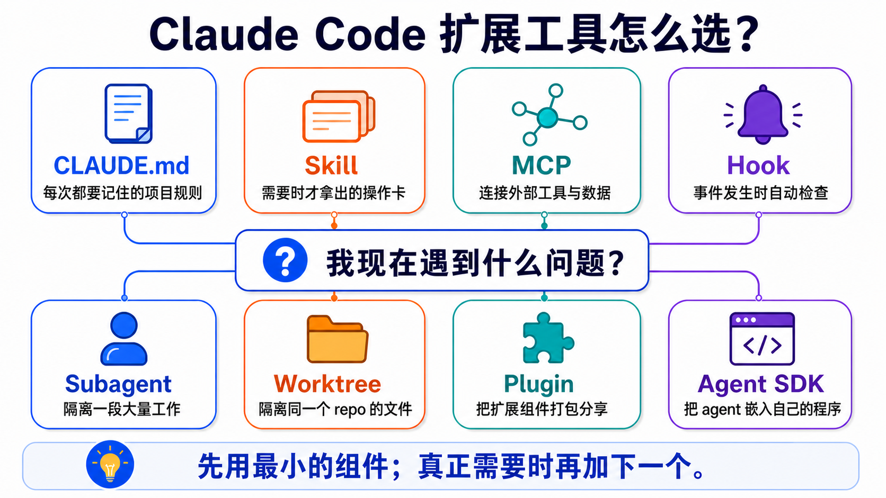
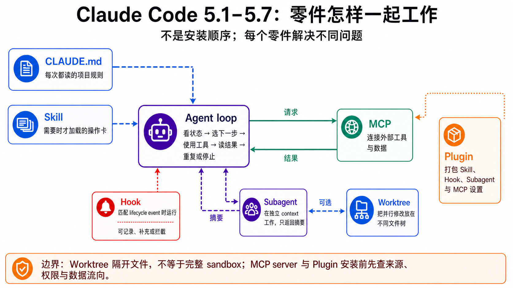

# Stage 5 — Claude Code 生态系统 ⭐⭐

> [繁體中文](./05-claude-code-ecosystem.md) | **简体中文** | [English](./05-claude-code-ecosystem.en.md)

<!-- freshness: canonical=stages/05-claude-code-ecosystem.md; verified_on=2026-08-29; scope=claude-code,mcp,skills,plugins,subagents,workflows,agent-sdk,security; max_age_days=90 -->

**Claude Code** 是一位会使用文件和终端的助手。本章教你如何为它设置规则、工具和安全边界，而不是让你一次装完所有东西。

## 📌 学习目标

完成本章后，你可以：

- 说明 **CLAUDE.md**、**Skill**、**MCP**、**Hook**、**Plugin** 和 **Subagent** 分别做什么。
- 先选择最小的组件，不为“看起来厉害”而把简单任务复杂化。
- 做出一套可共享、可检查、默认安全的 Claude Code 项目配置。
- 知道何时只用 Claude Code，何时才需要 **Worktree** 或 **Claude Agent SDK**。

## 🧩 先认识核心术语

### **Claude Code**

它是能读写文件并执行命令的编码代理。它像坐在终端旁的助手；本章教你约束它，而不是一次开放所有权限。

### **CLAUDE.md**

它是每次工作都要读取的项目守则，适合写测试命令、命名规范和禁止事项。

### **Skill（`SKILL.md`）**

它是需要时才拿出来的操作卡，适合部署、审查和数据处理等可重复流程。

### **MCP（Model Context Protocol）**

它是让编码代理连接外部工具和数据的通用接口。连上 GitHub、数据库或浏览器后，代理才能实际使用这些服务。

### **Hook**

它是在事件发生时自动执行的检查。例如 Claude 要运行危险命令前，Hook 可以先拦截。

### **Plugin 与 Marketplace**

**Plugin** 把 Skills、Hooks、Subagents 或 MCP 配置打包成一盒；**Marketplace** 是摆放许多盒子的目录。前者像应用，后者像应用商店。

### **Subagent**

它是拥有独立 context window 的小助手。大量中间内容留在它那里，最后只把结论带回主对话。

### **Worktree**

它是同一 Git 仓库的另一个工作目录。多个代理同时改文件时，它能避免彼此踩到同一份未提交内容。

### **Claude Agent SDK**

它让你的 Python 或 TypeScript 程序控制代理。只有要把代理嵌入产品或服务时才需要它。



## 一张表先选对组件

<a id="-7-layer-architecture-map先看这张图再读-51-57"></a>

| 你的问题 | 先用什么 | 先不要做什么 |
|---|---|---|
| 每次都要记住同一条项目规则 | `CLAUDE.md` | 把整本手册塞进去 |
| 只在特定场景需要一套流程 | Skill | 每次都粘贴同一大段 prompt |
| 要连接 GitHub、数据库或浏览器 | MCP | 直接把未审查 server 接到高权限账户 |
| 事件发生时都要自动检查 | Hook | 把陌生 shell script 当作安全工具 |
| 大量搜索会挤满当前对话 | Subagent | 为一个小问题多开代理 |
| 多项工作会修改同一仓库 | Worktree | 让多个代理共享未提交文件 |
| 要与团队共享配置 | Plugin | 第一题就自建 marketplace |
| 要把代理嵌进产品 | Agent SDK | 把 CLI 已能完成的工作重写成服务 |

> 想分清 OpenRouter、Pi、OpenCode 和 Ollama？OpenRouter 是 **Router**，Ollama 是 **本地运行时**，Claude Code、OpenCode 和 Pi 是 **编码代理／harness**。完整选择表见 [Track A1](../tracks/cli/A1-cli-intro.zh-Hans.md)。

## 🚪 进入条件与阅读路径

- **Track A（CLI 用户）**：完成 [A2](../tracks/cli/A2-cli-workflow.zh-Hans.md) 后读 5.1–5.4，掌握项目守则、Skill、MCP 和 Plugin，再前往 [A3](../tracks/cli/A3-cli-production.zh-Hans.md)。
- **Track B（代理开发者）**：完成 [Stage 3](03-tool-use-and-hello-agent.zh-Hans.md) 和 [Stage 4](04-agent-frameworks.zh-Hans.md) 后，再读 5.5–5.8。

<details markdown="1">
<summary>⏱ 开始前：时间、环境、认证与费用</summary>

- **时间**：主线约 6–10 小时；完成全部选读和项目约 15–25 小时。
- **环境**：Git、终端，以及一个不含敏感数据的练习仓库。
- **认证**：Claude Code 可使用 Anthropic 账户/API，也有 Amazon Bedrock、Google Vertex AI 和 Microsoft Foundry 的官方路径；它不是任意本地模型的通用前端。
- **费用**：先做不调用模型的文件与配置检查；真正运行 Claude Code 前查看 `/cost` 或账户用量，不要猜测每项练习的固定费用。
- **安全**：第一轮只用示例仓库、只读 MCP 和最小权限；不要放入生产 token、SSH key 或真实客户数据。

</details>

## 📚 必修阅读

开始前只看两个入口：[Claude Code quickstart](https://code.claude.com/docs/en/quickstart) 帮你安装并打开第一个会话；[How Claude remembers your project](https://code.claude.com/docs/en/memory) 帮你编写练习 1 使用的 `CLAUDE.md`。其他文档等遇到对应术语时再查，不必一次读完。

1. [Claude Code quickstart](https://code.claude.com/docs/en/quickstart) — 安装与第一个会话。
2. [Extend Claude Code](https://code.claude.com/docs/en/features-overview) — 一张官方表区分 CLAUDE.md、Skill、MCP、Hook、Plugin 和 Subagent。
3. [How Claude remembers your project](https://code.claude.com/docs/en/memory) — `CLAUDE.md`、Rules 和 auto memory 的边界。
4. [Skills](https://code.claude.com/docs/en/skills) — 旧 `.claude/commands/` 仍兼容；新教程先用 `SKILL.md`。
5. [MCP specification](https://modelcontextprotocol.io/specification) — 查协议时看带日期的版本。
6. [Hooks reference](https://code.claude.com/docs/en/hooks) — 事件、输入输出和拦截规则。
7. [Plugins](https://code.claude.com/docs/en/plugins) — 打包与共享扩展。
8. [Subagents](https://code.claude.com/docs/en/sub-agents)、[parallel agents](https://code.claude.com/docs/en/agents) 与 [Dynamic workflows](https://code.claude.com/docs/en/workflows) — 隔离、协作与大规模脚本编排。
9. [Agent SDK overview](https://code.claude.com/docs/en/agent-sdk/overview) — 仅在要嵌入程序时再读。

## 🛠 动手练习

主项目是一个“安全的 Claude Code 练习仓库”。每题只添加一个组件；前一题成功后再做下一题。

### 练习 1：写一张最小项目守则

完成后，你会有一份短 `CLAUDE.md`，其中只有用途、禁止事项、验证命令和交付格式。

```text
请先阅读这个仓库，只回复：用途、最重要的 3 个目录，以及你会先运行哪个只读检查。不要修改文件。
```

<details markdown="1">
<summary>展开练习 1 的步骤与检查</summary>

1. 在不含敏感数据的练习仓库根目录创建 `CLAUDE.md`。
2. 只写四部分：`Purpose`、`Do not`、`Verify`、`Deliver`。
3. 先人工阅读一遍，再请 Claude 按上面的 prompt 说明它理解到什么。
4. 成功条件：Claude 没有改文件，且它说出的验证命令与 `CLAUDE.md` 一致。

`CLAUDE.md` 最好少于 200 行。`@path` import 可以整理文件，但被 import 的内容仍会进入 context；需要按路径延后加载时，使用 `.claude/rules/` 的 `paths` frontmatter。

</details>

### 练习 2：把重复流程做成 Skill

完成后，你可以输入一条简短需求，让 Claude 按固定清单检查 README。

```powershell
New-Item -ItemType Directory -Force .claude\skills\readme-check
```

<details markdown="1">
<summary>展开练习 2 的步骤、macOS/Linux 命令与示例</summary>

创建 `.claude/skills/readme-check/SKILL.md`：

```markdown
---
name: readme-check
description: Check a README for a clear purpose, install steps, one example, and a license link. Use when the user asks to review README onboarding.
disable-model-invocation: true
---

1. Read the README without changing it.
2. Check: purpose, install steps, one runnable example, license link.
3. Return PASS or a short list of missing items with line references.
```

macOS/Linux：

```bash
mkdir -p .claude/skills/readme-check
```

先人工检查 YAML frontmatter，再在 Claude Code 输入 `/readme-check`。`disable-model-invocation: true` 表示只有你能主动调用它，适合有副作用或需要控制时机的流程。

本仓库的完整 meta-example：[`examples/stage-5/tool-calling-tutor/`](../examples/stage-5/tool-calling-tutor/)。

</details>

<a id="练习-3添加一个只读-hook"></a>

### 练习 3：添加一个只观察、不拦截的 Hook

完成后，每次 Claude 想写文件或改文件时，Hook 都会记录 event 名称和 tool 名称；它不保存 prompt，也不替你批准或拦截操作。

```powershell
New-Item -ItemType Directory -Force .claude/hooks
```

<details markdown="1">
<summary>展开练习 3：直接复制 Hook、配置与验证步骤</summary>

将下面内容保存为 `.claude/hooks/log-tool.py`：

```python
import json
import sys
from datetime import datetime, timezone
from pathlib import Path


event = json.load(sys.stdin)
record = {
    "checked_at": datetime.now(timezone.utc).isoformat(),
    "hook_event_name": event.get("hook_event_name"),
    "tool_name": event.get("tool_name"),
}
log_path = Path(__file__).with_name("events.jsonl")
with log_path.open("a", encoding="utf-8") as handle:
    handle.write(json.dumps(record, ensure_ascii=False) + "\n")
```

如果示例仓库还没有 `.claude/settings.json`，直接创建：

```json
{
  "hooks": {
    "PreToolUse": [
      {
        "matcher": "Edit|Write",
        "hooks": [
          {
            "type": "command",
            "command": "python",
            "args": [
              "${CLAUDE_PROJECT_DIR}/.claude/hooks/log-tool.py"
            ]
          }
        ]
      }
    ]
  }
}
```

如果文件已存在，只把 `PreToolUse` 加入原有的 `hooks`，不要覆盖其他设置。将 `.claude/hooks/events.jsonl` 加入 `.gitignore`，避免提交本机操作日志。

先用假数据测试 script：

```powershell
'{"hook_event_name":"PreToolUse","tool_name":"Write"}' | python .claude/hooks/log-tool.py
Get-Content .claude/hooks/events.jsonl
```

接着在 Claude Code 输入 `/hooks`，确认 `PreToolUse` 显示一个 Hook；再请 Claude 在示例仓库创建 `hook-demo.txt`。最后一行应包含 `"hook_event_name": "PreToolUse"` 和 `"tool_name": "Write"`。

- Hook 可以是 shell command、HTTP endpoint、prompt、agent 或 MCP tool；并非每种 event 都支持每种 handler。
- `PreToolUse` 的 exit code `2` 可以拦截 tool call，但它对所有 event 的效果并不相同；应查官方 event matrix。
- 本示例只记录 event 和 tool 名称，不保存完整 prompt、tool input、token 或秘密值；exit code `0` 表示不拦截。
- 成功条件：假数据测试和一次真实 `Write` 都新增一行，且日志中没有 prompt 或文件内容。

</details>

### 练习 4：连接受限的 MCP server

完成后，Claude 只能读取你指定的示例文件夹，不能访问整台电脑。

```text
我要连接一个 filesystem MCP server。请先解释它能看到哪个目录、有哪些 tools、如何移除，然后等我批准；不要直接安装。
```

<details markdown="1">
<summary>展开练习 4 与 MCP 2026 补充</summary>

1. 创建一个只放虚构数据的文件夹。
2. 按 [Claude Code MCP 文档](https://code.claude.com/docs/en/mcp) 添加 filesystem server，scope 只指向该文件夹。
3. 先列出 tools，再读取一个假文件，最后移除 server。
4. 成功条件：读取指定文件夹成功；请求读取外部路径时失败。

MCP 的三项核心抽象：**Tools** 是模型可调用的动作，**Resources** 是可读数据，**Prompts** 是 server 提供的 prompt 模板。多数入门 server 先使用 Tools。

`2026-07-28` 规范将核心改为 stateless request/response，移除 `initialize`/`initialized` 和 `Mcp-Session-Id`，并用 MRTR 处理需要补充信息的多轮请求。这是 SDK/server 作者才需深入的迁移内容；连接现成 server 的读者先确认 host 与 server 支持同一版本即可。

</details>

### 练习 5：用 Subagent 做只读检查

完成后，大量搜索会留在独立 context，主对话只收到摘要。

```text
Use the Explore subagent to find where tests are documented. Read only. Return the three most useful file paths and one sentence for each.
```

<details markdown="1">
<summary>展开练习 5 与自定义 Subagent 示例</summary>

Claude Code 内置的主要 Subagent 是 `Explore`、`Plan` 和 `general-purpose`。其他名称可能来自 plugin、组织设置或你自己的 `.claude/agents/<name>.md`，不要假设每台机器都有。

```markdown
---
name: docs-finder
description: Find documentation related to a named feature and return file paths. Use for read-only documentation discovery.
tools: Read, Glob, Grep
model: haiku
---

Search only. Return up to five file paths with one-sentence reasons. Do not edit files or run shell commands.
```

Subagent 由现行 `Agent` tool 派遣。它有独立的 context 与权限设置，接收一份自足任务，最后向主对话交回摘要。小问题、需要频繁来回或高度共享 context 的工作，留在主对话更简单。

</details>

## 先看 5.1–5.7 怎样连在一起

这张图整理各组件的关系，不是安装顺序。先读上面的粗体定义，再用图找 context、动作、检查、隔离与打包的边界。



## 5.1 — Claude Code 基础

<a id="-claudemd-设计-prompts依-5-原则"></a>

本节成果：你能安全开始工作，并知道“配置”与“指示”不是一回事。

<details markdown="1">
<summary>展开 5.1：安装、CLAUDE.md、Skills 兼容层与配置位置</summary>

Claude Code 可在 CLI、Desktop、VS Code 与 JetBrains 等 surface 使用。它能操作文件和工具，但仍受 permission、sandbox、Hook 与组织策略限制；“能执行 shell”不等于“应授予全部权限”。

| Scope | 常见位置 | 适合放什么 |
|---|---|---|
| Managed | 操作系统的管理路径 | 组织策略 |
| User | `~/.claude/CLAUDE.md` | 个人跨项目偏好 |
| Project | `./CLAUDE.md` 或 `./.claude/CLAUDE.md` | 团队共享规则 |
| Local | `./CLAUDE.local.md` | 不提交 Git 的本地配置 |

`.claude/rules/*.md` 可按 `paths` 延后加载；`.claude/skills/<name>/SKILL.md` 是按需知识或流程。旧 `.claude/commands/*.md` 仍可生成 slash command，但新内容优先教 Skills。

常用入口以现行 [Commands reference](https://code.claude.com/docs/en/commands) 为准。第一次只记 `/help`、`/model`、`/permissions`、`/memory`、`/agents` 与 `/cost`；功能会更新，不要把固定“十大命令”当长期标准。

</details>

## 5.2 — MCP（Model Context Protocol）基础

<a id="52--mcpmodel-context-protocol-基础"></a>

本节成果：你能用“通用插座”解释 MCP，也能说出 Tool Use 与 MCP 的区别。

<details markdown="1">
<summary>展开 5.2：Tools、Resources、Prompts、版本与安全</summary>

- **Tool Use**：模型提出结构化调用，由程序或 host 执行。
- **MCP**：把工具、数据与 prompt 的交换方式做成跨 host 协议。
- **Skill**：教代理何时、如何使用能力；它不会凭空建立外部连接。
- **Plugin**：把 Skill、Hook、Subagent、MCP 配置等打包共享。

官方 [`modelcontextprotocol/servers`](https://github.com/modelcontextprotocol/servers) 是 reference implementations，不等于 production-ready server。连接第三方 server 前要检查来源、权限、数据流向和移除方式；tool result 也是不可信输入，不能直接当作高权限指令。

`2026-07-28` 是当前查核到的正式规范版本。它采用 stateless core、header routing、MRTR 与 extensions framework；旧功能至少有 12 个月 deprecation window。不要把 2025 的初始化流程直接粘到新 server。

</details>

## 5.3 — Skills：按需操作卡

<a id="53--skillsclaude-code-的行为层-claude-code-生态最关键的一层"></a>
<a id="-skillmd-设计-prompts含-skill-creator-替代"></a>

本节成果：你能写出短小、可触发、可验证的 `SKILL.md`。

<details markdown="1">
<summary>展开 5.3：frontmatter、加载、prompt 设计与 eval</summary>

Skill 的 description 像索引卡标题：应写清“何时使用”，不能只写漂亮的功能介绍。Skill body 默认按需加载；Supporting files 可放在 `references/`、`scripts/` 等目录。

- `disable-model-invocation: true`：只能由用户主动调用，适合 deploy、commit 或有外部副作用的流程。
- `user-invocable: false`：不作为用户 slash command，但 Claude 仍可在适当场景使用。

可直接复制的审查 prompt：

```text
请检查这份 SKILL.md：
1. description 是否写清“何时使用”与“何时不用”？
2. 主文件是否只留必要流程，细节是否移到 references/？
3. 每一步是否有可验证的成功条件？
4. 有副作用的流程是否禁止 model 自动触发？
5. 相对链接、脚本和示例是否真的存在？
请逐项回复 PASS/FAIL、证据位置与最小修正；不要直接覆盖文件。
```

现行 Skills 遵循开放 Agent Skills 标准；Claude Code 另加 invocation control、Subagent execution 与 dynamic context。跨工具共用时，内容核心可以相同，但目录、frontmatter、权限和工具名必须分别验证。

</details>

## 5.4 — Plugins 与 Marketplaces

本节成果：你能说明“Plugin 是一盒组件，Marketplace 是摆放许多盒子的目录”。

<details markdown="1">
<summary>展开 5.4：plugin 结构、安装、共享与供应链安全</summary>

```text
my-plugin/
├── .claude-plugin/plugin.json
├── skills/<name>/SKILL.md
├── agents/<name>.md
├── hooks/hooks.json
└── .mcp.json
```

实际 schema 以 [Plugins reference](https://code.claude.com/docs/en/plugins-reference) 为准；现行组件还可包含 LSP servers 与 monitors。不要把教学用的最小树状图当完整 schema。

添加 Marketplace 只会让目录看见 Plugins，不代表全部已安装。安装前检查仓库、publisher、权限、Hook、MCP server、license 与更新方式；managed、project、local settings 的优先级和 consent 规则以官方配置文档为准。

</details>

## 5.5 — Subagents：隔离大段工作

<a id="55--subagentsclaude-code-原生-multi-agent-机制-2025-新功能"></a>
<a id="可派遣的-subagent-有哪些"></a>

本节成果：你能判断何时需要独立 context，并写出一份自足的 delegation brief。

<details markdown="1">
<summary>展开 5.5：内置类型、Skill 差异、权限、费用与常见错误</summary>

| | Skill | Subagent |
|---|---|---|
| 核心用途 | 重用知识或流程 | 隔离一段工作 |
| Context | 通常在当前对话加载；也可设置 fork | 默认新建独立 context |
| 结果 | 改变 Claude 处理任务的方式 | 返回结果或摘要 |
| 适合 | 规则、参考资料、固定流程 | 大量搜索、并行分析、专业 worker |

自定义 Subagent 的 `description` 是路由提示，不是代码层的 `if`。prompt 应自足，明确任务、范围、工具、输出和停止条件。现行官方还支持 `skills`、`mcpServers`、permissions、hooks 与 `isolation: worktree` 等设置；只在确有需要时添加。

多开代理会增加 token、延迟与集成工作。不要声称固定倍数；应按任务、模型和用量记录实测。

15 个进阶可复制 recipe：[`resources/subagent-cookbook.zh-Hans.md`](../resources/subagent-cookbook.zh-Hans.md)。组合与排错：[`resources/subagent-advanced.zh-Hans.md`](../resources/subagent-advanced.zh-Hans.md)。

</details>

## 5.6 — 并行工作与 Worktree

<a id="56--dynamic-workflows让-claude-自己写出-workflow-opus-48-新机制"></a>

本节成果：你能分清“谁协调工作”与“谁隔离文件”。

<details markdown="1">
<summary>展开 5.6：Subagent、agent view、agent teams、Dynamic workflows、Worktree 与 /batch</summary>

| 做法 | 谁协调 | 适合什么 | 当前状态／边界 |
|---|---|---|---|
| Subagent | 主对话 | 隔离搜索或专业任务 | 同一 session 内返回结果 |
| Agent view | 用户 | 监看多个独立后台 session | Research preview |
| Agent teams | Lead 与 teammates | Workers 要共享任务并互相传讯 | Experimental，默认关闭 |
| [**Dynamic workflows**](https://code.claude.com/docs/en/workflows) | 协调脚本／运行时 | 大型审计、迁移或交叉核验研究 | 可读、可重跑的 JavaScript 编排；会增加 token 用量 |
| Worktree | Git／用户 | 隔离同一仓库的文件修改 | 不负责代理通信 |
| `/batch` | Claude 规划后分派 | 5–30 个可切开的机械改动 | 每个 worker 都要独立范围与 review |

Worktree 解决“不要改同一份文件”；Subagent/team 解决“谁做哪件事”。两者可一起使用，但不是同一功能。Agent teams 不会自动为每个 teammate 建 Worktree，所以仍要清楚划分文件 ownership。

**Dynamic workflows** 会把计划放进可读的 JavaScript 脚本，而不是绑定到某个特定 Claude 模型；用 `/workflows` 查看进度。它要求 Claude Code v2.1.154+，可用于付费方案、API、Bedrock、Google Cloud Agent Platform 与 Foundry；Pro 需从 `/config` 的对应项目开启。

</details>

## 5.7 — 剖析 agent loop

<a id="57--claude-code-source-解剖reference-harness-implementation-track-b-必看"></a>

本节成果：你能画出“读取 context → 模型决定 → 工具执行 → 结果返回 → 再决定”的 loop。

<details markdown="1">
<summary>展开 5.7：官方 agent loop 阅读题</summary>

先读 [How the agent loop works](https://code.claude.com/docs/en/agent-sdk/agent-loop)，再回答：

1. 哪些数据在送给模型前进入 context？
2. 模型提出 tool call 后，谁检查 permission？
3. tool result 如何返回下一轮？
4. loop 在成功、错误、拒绝或达到限制时如何停止？
5. Hook、MCP、Skill 和 Subagent 分别插在什么位置？

把答案画成六格箭头图，再用 100–150 字比较 [Stage 3 的最小 ReAct loop](03-tool-use-and-hello-agent.zh-Hans.md) 增加了哪些控制边界。

`anthropics/claude-agent-sdk-python` 值得阅读，但它是 SDK client/wrapper，不是 Claude Code 完整 runtime source。可以查看 message types、transport、query options 与 error handling；不要因为 `_internal/client.py` 没有完整 LLM loop 就误以为漏看。

</details>

## 5.8 — Claude Agent SDK（选修）

<a id="58--sdk把-claude-code-拆开来自己组-track-b-可选production-才需要"></a>

本节成果：你能判断 CLI 已够用，还是确实需要把代理嵌入程序。

<details markdown="1">
<summary>展开 5.8：Python quickstart、provider 与安全 hosting</summary>

需要 SDK 的情况：

- 用户不会打开终端，你要把代理放进自己的 App。
- 需要程序化输入输出、调度、审计、限额或多租户。
- 服务需要控制 allowed tools、session 与结果格式。

```python
import asyncio
from claude_agent_sdk import AssistantMessage, ClaudeAgentOptions, TextBlock, query


async def main() -> None:
    options = ClaudeAgentOptions(allowed_tools=["Read", "Glob"])
    async for message in query(prompt="Summarize this project without editing files.", options=options):
        if isinstance(message, AssistantMessage):
            for block in message.content:
                if isinstance(block, TextBlock):
                    print(block.text)


asyncio.run(main())
```

安装包是 `claude-agent-sdk`／`@anthropic-ai/claude-agent-sdk`；旧 `claude-code-sdk` 名称已经迁移。SDK 支持 Anthropic API，也有 Bedrock、Vertex AI 与 Foundry 的官方认证路径。

SDK 会执行命令并保存 session state，不能把它当普通 stateless text API。上线前应实施容器／sandbox、network control、credential isolation、resource limits、audit log 与人工批准；先读 [Hosting](https://code.claude.com/docs/en/agent-sdk/hosting) 与 secure deployment 文档。

</details>

## 🎯 精选项目与学习资源

第一次只选一个与眼前练习相符的入口。五星是本学习地图的编辑建议，不是人气排行榜。

**本章先做这个：** [`tool-calling-tutor`](../examples/stage-5/tool-calling-tutor/README.zh-Hans.md) ⭐⭐⭐⭐⭐ — 它是仓库内可直接照着做的 Skill 示例。要查看 Claude Code 本身的版本与问题，再看 [`anthropics/claude-code`](https://github.com/anthropics/claude-code) ⭐⭐⭐⭐⭐。

<small>资料查核：2026-08-29 UTC</small>

<table>
<thead><tr><th scope="col">主题</th><th scope="col">资源</th><th scope="col">评分</th><th scope="col">适合谁／读什么</th></tr></thead>
<tbody>
<tr><th scope="rowgroup" rowspan="4">Claude Code 基础</th><td><a href="https://github.com/anthropics/claude-code">anthropics/claude-code</a></td><td>⭐⭐⭐⭐⭐</td><td>跟踪官方 releases、issues 与现行功能。</td></tr>
<tr><td><a href="https://code.claude.com/docs/en/overview">Claude Code 官方文档</a></td><td>⭐⭐⭐⭐⭐</td><td>设置、权限与命令问题的第一来源。</td></tr>
<tr><td><a href="https://github.com/hesreallyhim/awesome-claude-code">awesome-claude-code</a></td><td>⭐⭐⭐⭐</td><td>完成官方 quickstart 后探索社区扩展。</td></tr>
<tr><td><a href="https://github.com/KimYx0207/AI-Coding-Guide-Zh">AI-Coding-Guide-Zh</a></td><td>⭐⭐⭐⭐</td><td>适合想配合简体中文逐步导读的读者。</td></tr>
</tbody>
<tbody>
<tr><th scope="rowgroup" rowspan="8">MCP</th><td><a href="https://github.com/modelcontextprotocol/servers">modelcontextprotocol/servers</a></td><td>⭐⭐⭐⭐⭐</td><td>官方 reference implementations；用于读协议，不是生产保证。</td></tr>
<tr><td><a href="https://github.com/modelcontextprotocol/python-sdk">modelcontextprotocol/python-sdk</a></td><td>⭐⭐⭐⭐⭐</td><td>用 Python 写 client/server，先对照现行 spec revision。</td></tr>
<tr><td><a href="https://github.com/modelcontextprotocol/typescript-sdk">modelcontextprotocol/typescript-sdk</a></td><td>⭐⭐⭐⭐</td><td>TypeScript 路线的官方 SDK。</td></tr>
<tr><td><a href="https://github.com/wong2/awesome-mcp-servers">wong2/awesome-mcp-servers</a></td><td>⭐⭐⭐⭐⭐</td><td>写 server 前先找现成选项；逐个审查 publisher 与权限。</td></tr>
<tr><td><a href="https://github.com/punkpeye/awesome-mcp-servers">punkpeye/awesome-mcp-servers</a></td><td>⭐⭐⭐⭐</td><td>用不同分类交叉找 server；收录不是安全背书。</td></tr>
<tr><td><a href="https://github.com/github/github-mcp-server">github/github-mcp-server</a></td><td>⭐⭐⭐⭐</td><td>阅读大型官方 MCP server 的工具与权限设计。</td></tr>
<tr><td><a href="https://github.com/21st-dev/magic-mcp">21st-dev/magic-mcp</a></td><td>⭐⭐⭐</td><td>生成 UI 的非平凡 MCP 案例；使用前另查 license 与维护状态。</td></tr>
<tr><td><a href="https://github.com/yamadashy/repomix">yamadashy/repomix</a></td><td>⭐⭐⭐⭐⭐</td><td>学习仓库打包、敏感数据过滤与 MCP mode 的边界。</td></tr>
</tbody>
<tbody>
<tr><th scope="rowgroup" rowspan="8">Skills</th><td><a href="https://github.com/anthropics/skills">anthropics/skills</a></td><td>⭐⭐⭐⭐⭐</td><td>官方模板、规范与文档处理 Skills；写自己的 Skill 前先读。</td></tr>
<tr><td><a href="https://github.com/anthropics/claude-code">anthropics/claude-code</a></td><td>⭐⭐⭐⭐</td><td>跟踪 Claude Code 对 Skills 的现行支持。</td></tr>
<tr><td><a href="https://github.com/mattpocock/skills">mattpocock/skills</a></td><td>⭐⭐⭐⭐</td><td>观察短小、任务导向的社区 Skill 写法。</td></tr>
<tr><td><a href="https://github.com/obra/superpowers">obra/superpowers</a></td><td>⭐⭐⭐⭐</td><td>学习 TDD、debugging 与 plan 类 Skills 的组合。</td></tr>
<tr><td><a href="https://github.com/wshobson/agents">wshobson/agents</a></td><td>⭐⭐⭐⭐</td><td>看 Skills 与 Subagents 如何分工；不要照搬权限。</td></tr>
<tr><td><a href="https://github.com/travisvn/awesome-claude-skills">awesome-claude-skills</a></td><td>⭐⭐⭐⭐</td><td>社区 Skill 入口，安装前逐项审查。</td></tr>
<tr><td><a href="https://github.com/VoltAgent/awesome-agent-skills">awesome-agent-skills</a></td><td>⭐⭐⭐</td><td>比较多家工具对 Agent Skills 的兼容范围。</td></tr>
<tr><td><a href="https://github.com/alirezarezvani/claude-skills">alirezarezvani/claude-skills</a></td><td>⭐⭐⭐</td><td>寻找领域案例；当作案例库，不是官方标准。</td></tr>
</tbody>
<tbody>
<tr><th scope="rowgroup" rowspan="7">Plugins／Marketplaces</th><td><a href="https://github.com/anthropics/claude-plugins-official">claude-plugins-official</a></td><td>⭐⭐⭐⭐⭐</td><td>官方 plugin 与 marketplace 结构的第一范本。</td></tr>
<tr><td><a href="https://github.com/anthropics/knowledge-work-plugins">knowledge-work-plugins</a></td><td>⭐⭐⭐⭐⭐</td><td>看多领域 bundles 如何分工与打包。</td></tr>
<tr><td><a href="https://github.com/obra/superpowers-marketplace">superpowers-marketplace</a></td><td>⭐⭐⭐⭐</td><td>学习只负责策展、plugin 放在外部仓库的最小 marketplace。</td></tr>
<tr><td><a href="https://github.com/trailofbits/skills-curated">trailofbits/skills-curated</a></td><td>⭐⭐⭐</td><td>观察 marketplace 如何加入人工安全审查与信任说明。</td></tr>
<tr><td><a href="https://github.com/rohitg00/awesome-claude-code-toolkit">awesome-claude-code-toolkit</a></td><td>⭐⭐⭐</td><td>探索 agents、skills、hooks 与 templates 的社区入口。</td></tr>
<tr><td><a href="https://github.com/anthropics/life-sciences">anthropics/life-sciences</a></td><td>⭐⭐⭐</td><td>读单领域 marketplace 的结构；内容偏生命科学。</td></tr>
<tr><td><a href="https://github.com/anthropics/claude-for-legal">anthropics/claude-for-legal</a></td><td>⭐⭐⭐⭐</td><td>看大型 vertical suite 的 Skills、Agents、MCP 与责任边界。</td></tr>
</tbody>
<tbody>
<tr><th scope="rowgroup" rowspan="4">Subagents</th><td><a href="https://github.com/anthropics/claude-cookbooks">anthropics/claude-cookbooks</a></td><td>⭐⭐⭐⭐⭐</td><td>阅读官方 tool-use 与 orchestration notebooks。</td></tr>
<tr><td><a href="https://github.com/wshobson/agents">wshobson/agents</a></td><td>⭐⭐⭐⭐⭐</td><td>看大量 agent 定义的命名与分工；先从少量文件开始。</td></tr>
<tr><td><a href="https://github.com/obra/superpowers">obra/superpowers</a></td><td>⭐⭐⭐⭐</td><td>比较何时用 Skill、何时隔离成 worker。</td></tr>
<tr><td><a href="https://github.com/anthropics/claude-plugins-official">claude-plugins-official</a></td><td>⭐⭐⭐⭐</td><td>看 Plugin 如何打包 Agents。</td></tr>
</tbody>
<tbody>
<tr><th scope="rowgroup" rowspan="4">Agent loop／SDK</th><td><a href="https://github.com/anthropics/claude-agent-sdk-python">claude-agent-sdk-python</a></td><td>⭐⭐⭐⭐⭐</td><td>Python SDK client、message types 与 options；不是完整 runtime source。</td></tr>
<tr><td><a href="https://github.com/ZhangHanDong/harness-engineering-from-cc-to-ai-coding">harness-engineering-from-cc-to-ai-coding</a></td><td>⭐⭐⭐⭐</td><td>中文 harness 解读；事实仍需与官方文档核对。</td></tr>
<tr><td><a href="https://github.com/ai-boost/awesome-harness-engineering">awesome-harness-engineering</a></td><td>⭐⭐⭐⭐</td><td>扩展到 eval、memory、observability 与 runtime 资源。</td></tr>
<tr><td><a href="https://github.com/wshobson/agents">wshobson/agents</a></td><td>⭐⭐⭐⭐</td><td>从实际 Agent 定义观察 harness 的可读性与权限表面。</td></tr>
</tbody>
</table>

<a id="-进入-stage-6-前的自我检查"></a>

## ✅ 进入下一站前的自我检查

你能否：

- [ ] 用一句话分清 `CLAUDE.md`、Skill、MCP、Hook、Plugin 和 Subagent？
- [ ] 完成至少前三题，且没有把陌生 script 或高权限 token 直接交给代理？
- [ ] 说明 Subagent 和 Worktree 解决的是两个不同问题？
- [ ] 说明 Claude Code、OpenRouter、OpenCode／Pi 与 Ollama 各是哪一类工具？
- [ ] 判断自己的需求是“使用 CLI”还是“确实需要 Agent SDK”？

如果可以，按你的路线前进：**Track A** 前往 [A3 — 安全的团队流程](../tracks/cli/A3-cli-production.zh-Hans.md)；**Track B** 前往 [Stage 6 — Memory & RAG](06-memory-rag.zh-Hans.md)。如果还不行，回到“一张表先选对组件”，只重做你分不清的那一行。
