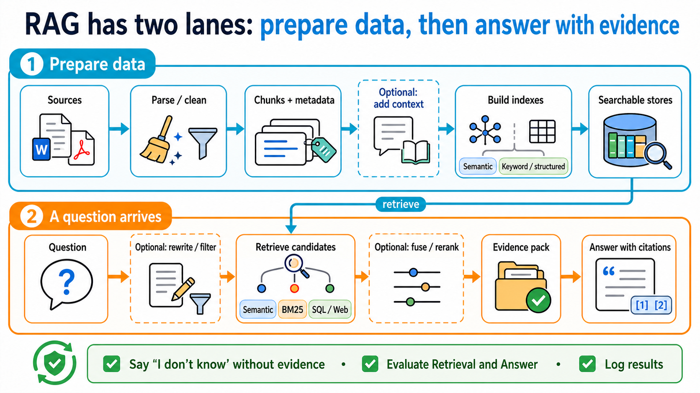

# Stage 6 — RAG and Memory: find the source first, then remember what matters

> [繁體中文](./06-memory-rag.md) | [简体中文](./06-memory-rag.zh-Hans.md) | **English**

<!-- freshness: canonical=stages/06-memory-rag.md; verified_on=2026-08-30; scope=rag,retrieval,embeddings,vector-stores,memory,evaluation,project-status; max_age_days=90 -->

Models do not know everything. **RAG** asks a model to consult a book before it answers; **Memory** gives it a notebook for things it will need next time. This stage separates the two and then builds both step by step.

<a id="the-two-context-capabilities-an-agent-needs"></a>
<a id="-what-is-context-engineering-positioning"></a>
<a id="where-it-sits-in-the-five-layer-stack"></a>
<a id="this-stage-covers-2-of-the-4-sub-problems-lance-martin-2025-framing"></a>
<a id="four-concepts-commonly-mixed-up"></a>
<a id="rag-vs-long-context-vs-fine-tuning--when-to-use-what"></a>
<a id="-learning-objectives"></a>
<a id="-prerequisites"></a>
<a id="-unit-guide-progressive-flow"></a>
<a id="-adaptive--agentic-rag--self-rag--crag--adaptive-rag-2024-focus"></a>
<a id="3-design-patterns-when-to-use-what--essential-for-track-b"></a>
<a id="-want-to-implement--dive-deeper"></a>
## 📌 Learning goals

By the end of this stage, you can:

1. State the difference between RAG and Memory in one sentence.
2. Explain how data becomes **chunks** and **embeddings**, then gets retrieved.
3. Build a minimal RAG pipeline whose answers include sources.
4. Know what data is worth remembering and what should not be stored.
5. Compare two approaches with a small test instead of relying on “it feels better.”

## 🧩 Meet seven core terms first

| Core term | Plain-language picture | Precise meaning |
|---|---|---|
| **Retrieval** | Find pages that may contain an answer | Find relevant content from external data after receiving a question. |
| **RAG (Retrieval-Augmented Generation)** | Look in a book, then answer | Retrieve first, then give the found content to the model to generate an answer. |
| **Embedding** | A coordinate card for a sentence’s meaning | A sequence of numbers that places semantically similar text near each other in vector space. |
| **Vector Store / Vector Database** | A drawer that finds cards by meaning | Stores embeddings and retrieves related data by similarity. |
| **Chunk** | A small card cut from a large book | A smaller piece of a long document for search and for fitting into context. |
| **Reranking** | Reorder first-pass cards | Score candidates again so more useful chunks rank first. |
| **Memory** | The assistant’s notebook | State needed across messages or sessions; it is not another name for chat history. |


### Choose the right method with one table

| Problem | Consider first | Why |
|---|---|---|
| The data is short and needed only for this answer | **Long context** | Put it directly in this request for the shortest flow. |
| There are many documents and you only know which passages matter after the question arrives | **RAG** | Retrieve relevant passages instead of sending every document every time. |
| The assistant must remember preferences, task state, or results next time | **Memory** | Write reusable information to a storage layer that can be read again. |
| You want to consistently change model behavior or a capability | [**Fine-tuning**](../resources/model-training-guide.en.md) | It adjusts model weights and behavior; it does not automatically provide current documents. |

No option is always best. Evaluate using your own data, questions, and success criteria.

## 🚪 Entry requirements and reading paths

- **First time learning:** read the seven terms, complete Exercises 1–4, then do the short self-check.
- **Building a long-term assistant:** complete Exercise 5, then open the Memory design path.
- **Researching or deploying:** finally explore advanced RAG, chunking, evaluation, and research entry points.

<details markdown="1">
<summary>Time, environment, cost, and data safety</summary>

- Plan two or three sessions; complete one runnable exercise each time.
- You need Python, Git, and a terminal. Follow each exercise README for installation.
- Path A uses OpenAI-compatible examples; Path B uses Anthropic. Model and embedding calls can cost money.
- Test with small documents. Do not send passwords, tokens, medical data, or unauthorized company documents to external services.
- Keep API keys in environment variables, never in code or commits.

</details>

## 📚 Required reading

1. [LangChain Retrieval](https://docs.langchain.com/oss/python/deepagents/retrieval) — see how loaders, splitters, embeddings, vector stores, and retrievers work together.
2. [LlamaIndex concepts](https://developers.llamaindex.ai/python/framework/getting_started/concepts/) — understand indexing and querying from a document-oriented view.
3. [Chroma getting started](https://docs.trychroma.com/docs/overview/getting-started) — see the smallest local vector-database workflow.
4. [LangGraph Agentic RAG](https://docs.langchain.com/oss/python/langgraph/agentic-rag) — after basic RAG, see how an agent decides whether to retrieve.

<a id="-hands-on-exercises-illustrative-basics"></a>
## 🛠 Hands-on exercises

Each exercise has a starter. Copy the commands and run them; you do not need to write an empty answer from scratch.

<a id="exercise-1-embeddings"></a>
### Exercise 1: Turn two sentences into embeddings

**Result:** semantically similar sentences appear closer than unrelated ones.

```powershell
cd examples/stage-6/01-embeddings
python starter.py
python starter_anthropic.py
```

[Open the full instructions and checks](../examples/stage-6/01-embeddings/README.en.md). Start with only a few sentences to avoid unnecessary API costs.

<a id="exercise-2-vector-db"></a>
### Exercise 2: Put embeddings in a vector database

**Result:** store text in Chroma, then retrieve a relevant chunk with one question.

```powershell
cd examples/stage-6/02-vector-db
python starter.py
python starter_anthropic.py
```

[Open the full instructions and checks](../examples/stage-6/02-vector-db/README.en.md). Exercise data must not contain secrets or personal information.

<a id="exercise-3-chunking-comparison"></a>
### Exercise 3: Compare three chunking methods

**Result:** see what happens when chunks are too large, too small, or overlap too much.

```powershell
cd examples/stage-6/03-chunking-comparison
python starter.py
python starter_anthropic.py
```

[Open the full instructions and checks](../examples/stage-6/03-chunking-comparison/README.en.md). Do not memorize a “standard size”; begin with document structure and test results.

<a id="exercise-4-full-rag-pipeline"></a>
### Exercise 4: Connect a complete RAG pipeline

**Result:** the program retrieves information, answers, and shows the source chunks it used.

```powershell
cd examples/stage-6/04-full-rag-pipeline
python starter.py
python starter_anthropic.py
```

[Open the full instructions and checks](../examples/stage-6/04-full-rag-pipeline/README.en.md). Start with a small dataset; “the program runs” does not mean the answer is correct.

<a id="exercise-5-long-term-memory"></a>
### Exercise 5: Remember a preference

**Result:** This exercise only adds, searches, and reads one preference while the program is running; temporary storage is not long-term persistence.

```powershell
cd examples/stage-6/05-long-term-memory
python starter.py
python starter_anthropic.py
```

[Open the full instructions and checks](../examples/stage-6/05-long-term-memory/README.en.md). Save only data needed to finish a task and provide ways to view, change, and delete it.

### Recommended mini-project: an assistant that retrieves and remembers

Choose three to five small documents you are allowed to use. Have the assistant list sources when it answers, then remember one non-sensitive preference, such as “give the short answer first.” It succeeds when it says it does not know without evidence, reads the preference after a restart, and lets you delete it.

## 🌐 Basic RAG pipeline

<details markdown="1">
<summary>Basic RAG pipeline: how data goes in and answers come out</summary>

RAG has two paths: one prepares the data, and the other retrieves it when a question arrives.



Start with **2-step RAG**: every question retrieves first and answers second, so it is easiest to test. **Agentic RAG** lets the model decide whether to retrieve, rewrite a question, or search again. **Hybrid RAG** combines fixed steps with agent decisions. It differs from **Hybrid Search**, which only combines candidate sets during retrieval.

| Stage | What it does | Plain-language picture |
|---|---|---|
| Load | Read PDFs, web pages, or database content | Bring books to the table |
| Split | Divide into chunks | Cut books into cards |
| Embed | Turn each card into a vector | Give meanings coordinates |
| Store | Save vectors and source metadata | Put labelled cards in drawers |
| Retrieve | Find candidate chunks for a question | Take out cards that may answer it |
| Rerank (optional) | Reorder candidates | Check which card is most useful |
| Generate | Give the model the question and evidence | Answer while looking at the cards |
| Cite/Evaluate | Show sources and inspect results | Tell people where the answer came from |

A **Retriever** returns related documents for a question. It need not use a vector database: BM25, SQL, web search, and hybrid search can also be retrievers.
**Citations** show which sources support the answer.

</details>

<a id="-advanced-rag-techniques-read-after-basic-rag"></a>
<a id="-overview-of-advanced-rag-techniques--2025-2026-main-themes-"></a>
<a id="-graphrag--knowledge-graph--rag"></a>
<a id="-contextual-retrieval--anthropics-prompt-caching-solution"></a>
<a id="-hybrid-search--reranking--two-common-reinforcement-components-for-production-rag"></a>
<a id="-recommended-tools-for-common-memory--rag-use-cases-categorized-by-purpose"></a>
<a id="query-transformations--hyde--multi-query--rag-fusion"></a>
<a id="-raptor--hierarchical-recursive-retrieval-iclr-2024"></a>
<a id="-dspy--programmatic-optimization-without-prompting-path-3-paradigm"></a>
<a id="stage-6--context-engineering-rag-and-memory"></a>
<a id="separate-the-terms-first-retrieval--rag--vector-store--memory-are-not-the-same-thing"></a>
<a id="-from-rag-to-memory--why-rag-isnt-enough"></a>
<a id="-5-mainstream-memory-layers-that-can-ship-choose-by-use-case"></a>
<a id="2024-2026-latest-memory-works--3-main-themes"></a>
<a id="advanced-generative-agents--triple-score-weighting-classic-case-study"></a>
<a id="-advanced-reasoning--reflection--2024-2026-trends--covers-both-tracks"></a>
<a id="path-1-prompt-based-reflection--reasoning-traditional-approach"></a>
<a id="path-2-trained-in-reasoning--reflection-major-shift-in-2024-2026"></a>
<a id="how-to-choose-between-the-two-paths"></a>
<a id="-rag--memory-eval--running-is-not-running-accurately"></a>
<a id="-featured-projects-templates--specs--example-collections"></a>
<a id="-what-is-memory--how-to-design-it"></a>
<a id="advanced-coala-framework--a-4-layer-taxonomy-for-agent-memory"></a>
<a id="-advanced-full-reflexion-with-persistent-memory--track-b-elective"></a>
## 🧭 Want to go deeper? Learn RAG and Memory separately

These are advanced Stage 6 branches, not new prerequisites. Complete the basic exercises above, then choose the path that fits your problem.

### [Advanced RAG: find the broken step before adding new techniques](../resources/advanced-rag.en.md)

For people who have built a minimal RAG system but face missed documents, bad ranking, or hard cross-document relationships. It explains **Hybrid Search**, **Reranking**, **HyDE**, **Multi-Query**, **RAG Fusion**, **Contextual Retrieval**, **GraphRAG**, **Self-RAG**, **CRAG**, **Adaptive RAG**, **Agentic RAG**, **RAPTOR**, and **DSPy**, with required reading and the rated resource table kept visible.

### [Agent Memory: save only what is useful, permitted, and removable](../resources/agent-memory.en.md)

For cross-session assistants, personalization, or long-running tasks. It explains short-term/long-term memory plus **Semantic**, **Episodic**, and **Procedural Memory**, then covers write, search, update, deletion, expiry, and user isolation; Mem0, Letta Code, LangMem, Graphiti, and research resources stay directly visible.

**How to choose:** if an answer needs better external evidence, take the Advanced RAG path; if an assistant must read its own state next time, take the Agent Memory path. When you need both, test them separately before connecting them.

## 🎯 Curated projects and learning resources

This table keeps only the tools needed for a Stage 6 baseline. Advanced techniques and memory projects have moved to the two separate pages above so one table does not mix them.

<small>Verified: 2026-08-30 UTC</small>

<table>
  <thead><tr><th scope="col">Category</th><th scope="col">Project</th><th scope="col">Editorial rating</th><th scope="col">Best for</th><th scope="col">What you can learn</th><th scope="col">Status/limits</th></tr></thead>
  <tbody>
    <tr><th scope="rowgroup" rowspan="3">RAG framework</th><td><a href="https://github.com/run-llama/llama_index">LlamaIndex</a></td><td>⭐⭐⭐⭐⭐</td><td>Beginners building document applications</td><td>indexes, retrievers, query engines</td><td>MIT; use the official starter first</td></tr>
    <tr><td><a href="https://github.com/deepset-ai/haystack">Haystack</a></td><td>⭐⭐⭐⭐</td><td>People comparing modular pipelines</td><td>components, pipelines, routing</td><td>Apache-2.0; choose one framework to practice first</td></tr>
    <tr><td><a href="https://github.com/infiniflow/ragflow">RAGFlow</a></td><td>⭐⭐⭐⭐</td><td>Teams studying a complete web product</td><td>document parsing, retrieval, UI</td><td>Apache-2.0; heavier than a teaching example</td></tr>
  </tbody>
  <tbody>
    <tr><th scope="rowgroup" rowspan="4">Vector data</th><td><a href="https://github.com/chroma-core/chroma">Chroma</a></td><td>⭐⭐⭐⭐⭐</td><td>First local vector search</td><td>collections, add, query</td><td>Apache-2.0; practice and production settings differ</td></tr>
    <tr><td><a href="https://github.com/qdrant/qdrant">Qdrant</a></td><td>⭐⭐⭐⭐⭐</td><td>Teams needing self-hosted or managed service</td><td>dense, sparse, hybrid queries</td><td>Apache-2.0; plan service operation and backups</td></tr>
    <tr><td><a href="https://github.com/weaviate/weaviate">Weaviate</a></td><td>⭐⭐⭐⭐</td><td>Teams needing schema and hybrid search</td><td>BM25 + vector search</td><td>BSD-3-Clause; start with a small baseline</td></tr>
    <tr><td><a href="https://github.com/pgvector/pgvector">pgvector</a></td><td>⭐⭐⭐⭐</td><td>Teams already using PostgreSQL</td><td>SQL and vectors in one database</td><td>PostgreSQL extension; still needs indexes and tuning</td></tr>
  </tbody>
  <tbody>
    <tr><th scope="rowgroup" rowspan="2">Evaluation and complete products</th><td><a href="https://github.com/vibrantlabsai/ragas">Ragas</a></td><td>⭐⭐⭐⭐⭐</td><td>Teams building rerunnable evaluations</td><td>datasets, metrics, experiments</td><td>Apache-2.0; metrics still need human calibration</td></tr>
    <tr><td><a href="https://github.com/onyx-dot-app/onyx">Onyx</a></td><td>⭐⭐⭐⭐</td><td>People studying a complete AI assistant architecture</td><td>ingest, retrieval, chat, administration</td><td>Large product; use as an architecture reference, not a starter</td></tr>
  </tbody>
</table>

<a id="-self-check-before-entering-stage-7"></a>
## ✅ Self-check before Stage 7

- [ ] I can state what Retrieval, RAG, and Memory each do.
- [ ] I can explain how chunks, embeddings, and a vector database fit together.
- [ ] My RAG answers show sources and say they do not know when no evidence exists.
- [ ] I can compare changes with a small question set instead of one attractive answer.
- [ ] Memory saves only necessary, permitted data and lets users view, change, and delete it.

When you can do these, go to [Stage 7 — Agent Production Engineering: Harness, Loops, and Graphs](07-multi-agent-production.en.md).
