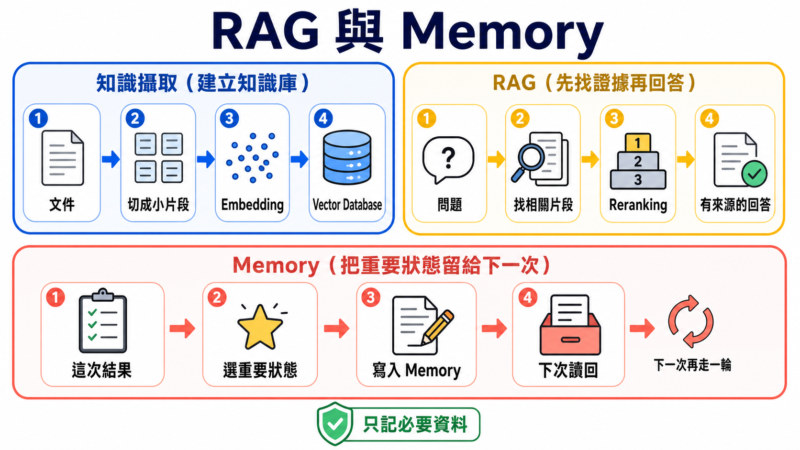
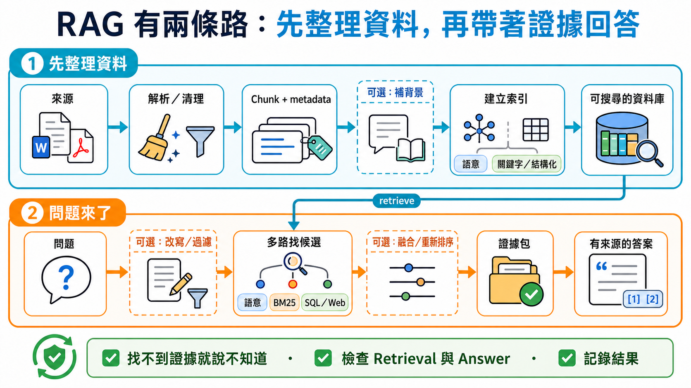

# Stage 6 — RAG 與 Memory：先找資料，再記住重要的事

> **繁體中文** | [简体中文](./06-memory-rag.zh-Hans.md) | [English](./06-memory-rag.en.md)

<!-- freshness: canonical=stages/06-memory-rag.md; verified_on=2026-08-30; scope=rag,retrieval,embeddings,vector-stores,memory,evaluation,project-status; max_age_days=90 -->

模型不是什麼都知道。**RAG** 像叫它先翻書再回答；**Memory** 像給它一本筆記本，記住下次還會用到的事。這一關會把兩者分清楚，再帶你一步一步做出來。

<a id="agent-需要的兩種-context-能力"></a>
<a id="-context-engineering-是什麼先定位"></a>
<a id="五層-stack-中的位置"></a>
<a id="本-stage-處理-4-個-sub-problem-中的-2-個lance-martin-2025-framework"></a>
<a id="4-個常被搞混的概念--一張表分清楚"></a>
<a id="rag-vs-long-context-vs-fine-tuning--何時用什麼"></a>
<a id="-進入條件"></a>
<a id="-單元指引漸進式-flow"></a>
<a id="-adaptive--agentic-rag--self-rag--crag--adaptive-rag讓-retrieval-變成可判斷的流程"></a>
## 📌 學習目標

完成這一關後，你可以：

1. 用一句話說出 RAG 與 Memory 的差別。
2. 看懂資料如何變成 **Chunk**、**Embedding**，再被找回來。
3. 做出一條最小 RAG 流水線，並讓回答附上來源。
4. 知道什麼資料值得記住，什麼資料不該保存。
5. 用小型測試比較兩個做法，不靠「感覺比較好」。

## 🧩 先認識七個核心詞

| 核心詞 | 像什麼 | 正確意思 |
|---|---|---|
| **Retrieval（檢索）** | 去書架找幾頁可能有答案的書 | 收到問題後，從外部資料找出相關內容。 |
| **RAG（Retrieval-Augmented Generation）** | 先翻書，再用自己的話回答 | 先 retrieval，再把找到的內容交給模型生成答案。 |
| **Embedding（嵌入向量）** | 幫句子的意思做一張座標卡 | 把文字轉成一串數字，讓意思接近的文字在向量空間裡靠近。 |
| **Vector Store／Vector Database** | 會按「意思」找卡片的抽屜 | 保存 embedding，並用相似度找回相關資料；不同產品的儲存與維運能力不同。 |
| **Chunk（文字片段）** | 把大書切成可拿取的小頁卡 | 為了搜尋與放進 context，把長文件切成較小片段。 |
| **Reranking（重新排序）** | 把第一次找來的卡片再排一次 | 用第二個方法重新評分候選內容，讓更可能有用的片段排前面。 |
| **Memory（記憶）** | 助理自己的筆記本 | 把跨訊息或跨 session 還需要的狀態寫下來，之後再讀回來；它不是聊天紀錄的別名。 |



### 一張表先選對方法

| 你遇到的問題 | 先考慮 | 為什麼 |
|---|---|---|
| 資料不長，而且這次回答用完就好 | **Long context** | 直接把資料放進這次請求，流程最短。 |
| 文件很多，問題來了才知道要找哪幾段 | **RAG** | 先找相關片段，不必每次塞入全部文件。 |
| 助理下次仍要記得偏好、任務狀態或過往結果 | **Memory** | 把值得保留的資訊寫入可再次讀取的儲存層。 |
| 想穩定改變模型的行為或特定能力 | [**Fine-tuning**](../resources/model-training-guide.md) | 調整模型權重與行為；它不會自動替你提供最新文件。 |

沒有一個選項永遠最好。請用自己的資料、問題與成功條件做評測。

## 🚪 進入條件與閱讀路線

- **第一次學：**先讀七個核心詞，完成練習 1–4，再做短版自我檢查。
- **要做長期助理：**接著完成練習 5，再閱讀 Memory 設計。
- **要研究或上線：**最後進入進階 RAG、Chunking、評測與研究入口。

<details markdown="1">
<summary>時間、環境、費用與資料安全</summary>

- 建議分兩到三次完成；每次先做一個能跑的練習。
- 需要 Python、Git 與終端機。安裝方式以各練習 README 為準。
- Path A 使用 OpenAI 相容範例；Path B 使用 Anthropic 路徑。模型與 embedding 呼叫可能產生費用。
- 先用小文件測試。不要把密碼、token、醫療資料或未獲授權的公司文件送到外部服務。
- API key 放在環境變數，不要寫進程式或 commit。

</details>

## 📚 必修閱讀

先看「RAG 的零件怎麼接起來」，再開始第一個練習。

1. [LangChain Retrieval](https://docs.langchain.com/oss/python/deepagents/retrieval) — 看 loader、splitter、embedding、vector store 與 retriever 怎麼合作。
2. [LlamaIndex concepts](https://developers.llamaindex.ai/python/framework/getting_started/concepts/) — 用文件導向的方式理解 indexing 與 querying。
3. [Chroma getting started](https://docs.trychroma.com/docs/overview/getting-started) — 看本地 vector database 的最小使用方式。
4. [LangGraph Agentic RAG](https://docs.langchain.com/oss/python/langgraph/agentic-rag) — 完成基礎 RAG 後，再看 agent 如何決定要不要查資料。

<a id="-動手練習基礎-illustrative-練習"></a>
## 🛠 動手練習

每題都已經有 starter。直接複製命令執行，不需要先抄一份空白答案。

<a id="練習-1embeddings"></a>
### 練習 1：把兩句話變成 Embedding

**成果：**你會看到意思相近的兩句話，比不相關的句子更靠近。

```powershell
cd examples/stage-6/01-embeddings
python starter.py
python starter_anthropic.py
```

[打開完整說明與檢查方式](../examples/stage-6/01-embeddings/README.md)。先用很少的句子，避免不必要的 API 費用。

<a id="練習-2vector-db"></a>
### 練習 2：把 Embedding 放進 Vector Database

**成果：**你能把文字放進 Chroma，再用一句問題找回相關片段。

```powershell
cd examples/stage-6/02-vector-db
python starter.py
python starter_anthropic.py
```

[打開完整說明與檢查方式](../examples/stage-6/02-vector-db/README.md)。練習資料不得包含秘密或個資。

<a id="練習-3chunking-對照"></a>
### 練習 3：比較三種 Chunking 方法

**成果：**你會看到切得太大、太小或重疊太多，各自會發生什麼事。

```powershell
cd examples/stage-6/03-chunking-comparison
python starter.py
python starter_anthropic.py
```

[打開完整說明與檢查方式](../examples/stage-6/03-chunking-comparison/README.md)。不要先背一個「標準大小」；先看文件結構與測試結果。

<a id="練習-4完整-rag-流水線"></a>
### 練習 4：串起完整 RAG

**成果：**程式會先找資料，再回答，並顯示它使用了哪些來源片段。

```powershell
cd examples/stage-6/04-full-rag-pipeline
python starter.py
python starter_anthropic.py
```

[打開完整說明與檢查方式](../examples/stage-6/04-full-rag-pipeline/README.md)。先用小型資料集；不要把「程式能跑」當成「回答一定正確」。

<a id="練習-5long-term-memory"></a>
### 練習 5：記住一項偏好

**成果：**本練習只會在程式仍執行時新增、搜尋並讀回一項偏好；暫存資料不代表長期持久記憶。

```powershell
cd examples/stage-6/05-long-term-memory
python starter.py
python starter_anthropic.py
```

[打開完整說明與檢查方式](../examples/stage-6/05-long-term-memory/README.md)。只保存完成任務需要的資料，並提供查看、修改與刪除的方法。

### 推薦小專案：會翻資料、也會記偏好的助理

選三到五份你有權使用的小文件。讓助理回答問題時列出來源，再只記住一項無敏感性的偏好，例如「回答先給短版」。成功條件是：找不到證據時會說不知道；重新啟動後仍能讀回偏好；你可以刪掉這項記憶。

## 🌐 RAG 基礎流水線

<details markdown="1">
<summary>RAG 基礎流水線：資料怎麼進去，答案怎麼出來</summary>

RAG 有兩條路：一條先整理資料，一條在問題來時找資料。



先從 **2-step RAG** 開始：每個問題都先檢索，再回答，流程最容易測。**Agentic RAG** 讓模型決定要不要找資料、是否改寫問題或再找一次；**Hybrid RAG** 混合固定步驟與 agent 決策。它和 **Hybrid Search** 不同：Hybrid Search 只是在 retrieval 這一步合併語意與關鍵字等候選。

| 階段 | 做什麼 | 小孩版比喻 |
|---|---|---|
| Load | 讀入 PDF、網頁或資料庫內容 | 把書搬到桌上 |
| Split | 切成 chunks | 把書分成小卡 |
| Embed | 把每張卡轉成向量 | 幫意思做座標 |
| Store | 保存向量與來源 metadata | 卡片放進有標籤的抽屜 |
| Retrieve | 依問題找候選 chunks | 先拿出可能有答案的卡 |
| Rerank（可選） | 重新排候選內容 | 再檢查哪張卡最有用 |
| Generate | 把問題與證據交給模型 | 看著卡片回答 |
| Cite／Evaluate | 顯示來源並檢查結果 | 告訴別人答案從哪裡來 |

**Retriever** 是「收到問題後，回傳相關文件」的介面。它不一定使用 vector database；BM25、SQL、網站搜尋與混合搜尋也能成為 retriever。

</details>

<a id="-rag-進階技巧縱覽--2025-2026-三條主軸"></a>
<a id="-contextual-retrieval--anthropic-的-prompt-caching-解法"></a>
<a id="-hybrid-search--reranking--production-rag-的兩個常見強化元件"></a>
<a id="-常用-memory--rag-工具推薦按用途分類"></a>
<a id="query-transformations--hyde--multi-query--rag-fusion"></a>
<a id="-raptor--階層式遞迴-retrievaliclr-2024"></a>
<a id="-dspy--不寫-prompt用-program-自動-optimizepath-3-paradigm"></a>
<a id="stage-6--上下文管理context-engineeringrag-與-memory"></a>
<a id="先把名詞切開retrieval--rag--vector-store--memory-不是同一件事"></a>
<a id="-5-個可上線使用的-memory-layer按-use-case-挑"></a>
<a id="2024-2026-最新-memory-作品--三條主軸"></a>
<a id="-進階-reasoning--reflection--2024-2026-思潮--兩個-track-都看"></a>
<a id="path-1prompt-based-reflection--reasoning傳統做法"></a>
<a id="path-2trained-in-reasoning--reflection2024-2026-大轉折"></a>
<a id="兩條路怎麼選"></a>
## 🧭 想深入？把 RAG 與 Memory 分開學

這兩條是 Stage 6 的進階支線，不是新的先備條件。先完成上面的基本練習，再依問題選一條。

### [進階 RAG：先找出哪一步壞了，再加新技巧](../resources/advanced-rag.md)

適合已經做出最小 RAG、但遇到「找不到、排序錯、跨文件關係難找」的人。頁面會完整解釋 **Hybrid Search**、**Reranking**、**HyDE**、**Multi-Query**、**RAG Fusion**、**Contextual Retrieval**、**GraphRAG**、**Self-RAG**、**CRAG**、**Adaptive RAG**、**Agentic RAG**、**RAPTOR** 與 **DSPy**，並保留必讀與五星資源表。

### [Agent Memory：只記值得記、允許記、能刪掉的事](../resources/agent-memory.md)

適合要做跨 session 助理、個人化或長期任務的人。頁面會完整解釋短期／長期，以及 **Semantic**、**Episodic**、**Procedural Memory**，再走過寫入、搜尋、更新、刪除、過期與使用者隔離；Mem0、Letta Code、LangMem、Graphiti 與研究資源都直接列在頁面上。

**怎麼選：**答案需要更好的外部證據，走進階 RAG；助理下次還要讀回自身狀態，走 Agent Memory。兩者都需要時，分開測試，最後再接起來。

<a id="-精選-projects範本--spec--範例-collection"></a>

## 🎯 精選 Projects 與學習資源

這裡只保留做出 Stage 6 基線需要的工具。進階技巧與 Memory 專案已移到上方兩個獨立頁面，避免一張表混在一起。

<small>資料查核：2026-08-30 UTC</small>

<table>
  <thead>
    <tr><th scope="col">分類</th><th scope="col">專案</th><th scope="col">編輯評分</th><th scope="col">適合誰</th><th scope="col">能學什麼</th><th scope="col">狀態／限制</th></tr>
  </thead>
  <tbody>
    <tr><th scope="rowgroup" rowspan="3">RAG framework</th><td><a href="https://github.com/run-llama/llama_index">LlamaIndex</a></td><td>⭐⭐⭐⭐⭐</td><td>文件型應用初學者</td><td>Index、retriever、query engine</td><td>MIT；套件多，先用官方 starter</td></tr>
    <tr><td><a href="https://github.com/deepset-ai/haystack">Haystack</a></td><td>⭐⭐⭐⭐</td><td>想比較模組化 pipeline</td><td>components、pipelines、routing</td><td>Apache-2.0；先選一套 framework 練習</td></tr>
    <tr><td><a href="https://github.com/infiniflow/ragflow">RAGFlow</a></td><td>⭐⭐⭐⭐</td><td>想看完整 Web 產品的團隊</td><td>文件解析、retrieval、UI</td><td>Apache-2.0；部署比教學範例重</td></tr>
  </tbody>
  <tbody>
    <tr><th scope="rowgroup" rowspan="4">Vector data</th><td><a href="https://github.com/chroma-core/chroma">Chroma</a></td><td>⭐⭐⭐⭐⭐</td><td>第一次在本機做向量搜尋</td><td>collection、add、query</td><td>Apache-2.0；練習與 production 設定不同</td></tr>
    <tr><td><a href="https://github.com/qdrant/qdrant">Qdrant</a></td><td>⭐⭐⭐⭐⭐</td><td>需要自架或託管服務的團隊</td><td>dense、sparse、hybrid query</td><td>Apache-2.0；需規劃服務與備份</td></tr>
    <tr><td><a href="https://github.com/weaviate/weaviate">Weaviate</a></td><td>⭐⭐⭐⭐</td><td>需要 schema 與 hybrid search</td><td>BM25 + vector search</td><td>BSD-3-Clause；功能多，先做小型基線</td></tr>
    <tr><td><a href="https://github.com/pgvector/pgvector">pgvector</a></td><td>⭐⭐⭐⭐</td><td>已使用 PostgreSQL 的團隊</td><td>SQL 與 vector 同庫</td><td>PostgreSQL extension；仍需索引與查詢調校</td></tr>
  </tbody>
  <tbody>
    <tr><th scope="rowgroup" rowspan="2">評測與完整產品</th><td><a href="https://github.com/vibrantlabsai/ragas">Ragas</a></td><td>⭐⭐⭐⭐⭐</td><td>要建立可重跑 eval 的團隊</td><td>datasets、metrics、experiments</td><td>Apache-2.0；metric 仍需人工校準</td></tr>
    <tr><td><a href="https://github.com/onyx-dot-app/onyx">Onyx</a></td><td>⭐⭐⭐⭐</td><td>想讀完整 AI assistant 架構</td><td>ingest、retrieval、chat、admin</td><td>完整產品很大；當架構參考，不當 starter</td></tr>
  </tbody>
</table>

## ✅ 進入 Stage 7 前的自我檢查

- [ ] 我能說出 Retrieval、RAG 與 Memory 各自做什麼。
- [ ] 我能解釋 chunk、embedding 與 vector database 怎麼接起來。
- [ ] 我的 RAG 回答會顯示來源，找不到證據時會說不知道。
- [ ] 我能用一小組問題比較修改前後，而不是只看一次漂亮回答。
- [ ] Memory 只保存必要且獲准的資料，使用者能查看、修改與刪除。

都能做到後，前往 [Stage 7 — Agent Production Engineering：Harness、Loop 與 Graph](07-multi-agent-production.md)。
