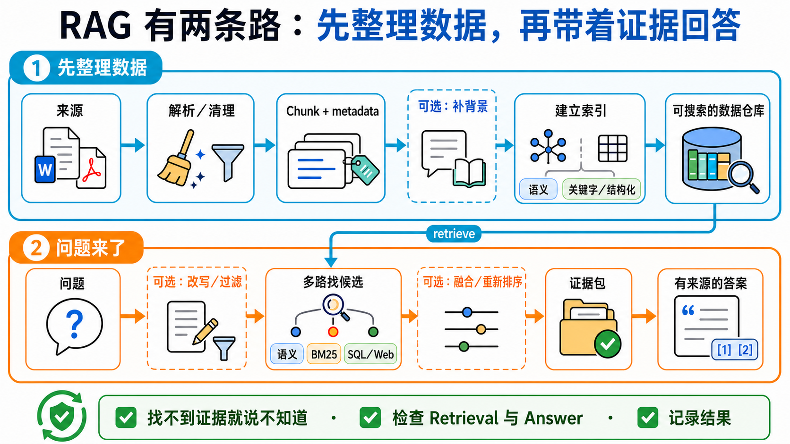

# Stage 6 — RAG 与 Memory：先找数据，再记住重要的事

> [繁體中文](./06-memory-rag.md) | **简体中文** | [English](./06-memory-rag.en.md)

<!-- freshness: canonical=stages/06-memory-rag.md; verified_on=2026-08-30; scope=rag,retrieval,embeddings,vector-stores,memory,evaluation,project-status; max_age_days=90 -->

模型不是什么都知道。**RAG** 像叫它先翻书再回答；**Memory** 像给它一本笔记本，记住下次还会用到的事。这一关会把两者分清楚，再带你一步一步做出来。

<a id="agent-需要的两种-context-能力"></a>
<a id="-context-engineering-是什么先定位"></a>
<a id="在五层-stack-里的位置"></a>
<a id="本-stage-处理-4-个-sub-problem-中的-2-个lance-martin-2025-框架"></a>
<a id="四个常被混淆的概念"></a>
<a id="rag-vs-long-context-vs-fine-tuning--何时用什么"></a>
<a id="-进入条件"></a>
<a id="-必读材料"></a>
<a id="-单元指引渐进式流程"></a>
<a id="-进阶-rag-技巧跑完基础-rag-之后再看"></a>
<a id="-adaptive--agentic-rag--self-rag--crag--adaptive-rag2024-主轴"></a>
## 📌 学习目标

完成这一关后，你可以：

1. 用一句话说出 RAG 与 Memory 的差别。
2. 看懂数据如何变成 **Chunk**、**Embedding**，再被找回来。
3. 做出一条最小 RAG 流水线，并让回答附上来源。
4. 知道什么数据值得记住，什么数据不该保存。
5. 用小型测试比较两个做法，不靠“感觉比较好”。

## 🧩 先认识七个核心术语

| 核心术语 | 好理解的说法 | 正确意思 |
|---|---|---|
| **Retrieval（检索）** | 去书架找几页可能有答案的书 | 收到问题后，从外部资料找出相关内容。 |
| **RAG（Retrieval-Augmented Generation）** | 先翻书，再用自己的话回答 | 先 retrieval，再把找到的内容交给模型生成答案。 |
| **Embedding（嵌入向量）** | 帮句子的意思做一张坐标卡 | 把文字转成一串数字，让意思接近的文字在向量空间里靠近。 |
| **Vector Store／Vector Database** | 会按“意思”找卡片的抽屉 | 保存 embedding，并用相似度找回相关资料。 |
| **Chunk（文字片段）** | 把大书切成可拿取的小页卡 | 为了搜索与放进 context，把长文档切成较小片段。 |
| **Reranking（重新排序）** | 把第一次找来的卡片再排一次 | 用第二个方法重新评分候选内容，让更可能有用的片段排前面。 |
| **Memory（记忆）** | 助理自己的笔记本 | 把跨消息或跨 session 还需要的状态写下来，之后再读回来；它不是聊天记录的别名。 |


### 一张表先选对方法

| 你遇到的问题 | 先考虑 | 为什么 |
|---|---|---|
| 资料不长，而且这次回答用完就好 | **Long context** | 直接把资料放进这次请求，流程最短。 |
| 文档很多，问题来了才知道要找哪几段 | **RAG** | 先找相关片段，不必每次塞入全部文档。 |
| 助理下次仍要记得偏好、任务状态或过往结果 | **Memory** | 把值得保留的信息写入可再次读取的存储层。 |
| 想稳定改变模型的行为或特定能力 | [**Fine-tuning**](../resources/model-training-guide.zh-Hans.md) | 调整模型权重与行为；它不会自动提供最新文档。 |

没有一个选项永远最好。请用自己的资料、问题与成功条件做评测。

## 🚪 进入条件与阅读路径

- **第一次学：**先读七个核心术语，完成练习 1–4，再做短版自我检查。
- **要做长期助理：**接着完成练习 5，再阅读 Memory 设计。
- **要研究或上线：**最后进入进阶 RAG、Chunking、评测与研究入口。

<details markdown="1">
<summary>时间、环境、费用与资料安全</summary>

- 建议分两到三次完成；每次先做一个能跑的练习。
- 需要 Python、Git 与终端。安装方式以各练习 README 为准。
- Path A 使用 OpenAI 兼容示例；Path B 使用 Anthropic 路径。模型与 embedding 调用可能产生费用。
- 先用小文档测试。不要把密码、token、医疗资料或未经授权的公司文档送到外部服务。
- API key 放在环境变量，不要写进程序或 commit。

</details>

## 📚 必修阅读

1. [LangChain Retrieval](https://docs.langchain.com/oss/python/deepagents/retrieval) — 看 loader、splitter、embedding、vector store 与 retriever 如何合作。
2. [LlamaIndex concepts](https://developers.llamaindex.ai/python/framework/getting_started/concepts/) — 用文档导向的方式理解 indexing 与 querying。
3. [Chroma getting started](https://docs.trychroma.com/docs/overview/getting-started) — 看本地 vector database 的最小使用方式。
4. [LangGraph Agentic RAG](https://docs.langchain.com/oss/python/langgraph/agentic-rag) — 完成基础 RAG 后，再看 agent 如何决定要不要查资料。

<a id="-动手练习基础示例性练习"></a>
## 🛠 动手练习

每题都有 starter。直接复制命令执行，不需要先抄一份空白答案。

<a id="练习-1embeddings"></a>
### 练习 1：把两句话变成 Embedding

**成果：**你会看到意思相近的两句话，比不相关的句子更靠近。

```powershell
cd examples/stage-6/01-embeddings
python starter.py
python starter_anthropic.py
```

[打开完整说明与检查方式](../examples/stage-6/01-embeddings/README.zh-Hans.md)。先用很少的句子，避免不必要的 API 费用。

<a id="练习-2vector-db"></a>
### 练习 2：把 Embedding 放进 Vector Database

**成果：**你能把文字放进 Chroma，再用一句问题找回相关片段。

```powershell
cd examples/stage-6/02-vector-db
python starter.py
python starter_anthropic.py
```

[打开完整说明与检查方式](../examples/stage-6/02-vector-db/README.zh-Hans.md)。练习资料不得包含秘密或个人资料。

<a id="练习-3chunking-对照"></a>
### 练习 3：比较三种 Chunking 方法

**成果：**你会看到切得太大、太小或重叠太多，各自会发生什么事。

```powershell
cd examples/stage-6/03-chunking-comparison
python starter.py
python starter_anthropic.py
```

[打开完整说明与检查方式](../examples/stage-6/03-chunking-comparison/README.zh-Hans.md)。不要先背一个“标准大小”；先看文档结构与测试结果。

<a id="练习-4完整-rag-流水线"></a>
### 练习 4：串起完整 RAG

**成果：**程序会先找资料，再回答，并显示它使用了哪些来源片段。

```powershell
cd examples/stage-6/04-full-rag-pipeline
python starter.py
python starter_anthropic.py
```

[打开完整说明与检查方式](../examples/stage-6/04-full-rag-pipeline/README.zh-Hans.md)。先用小型数据集；不要把“程序能跑”当成“回答一定正确”。

<a id="练习-5long-term-memory"></a>
### 练习 5：记住一项偏好

**成果：**本练习只会在程序仍运行时新增、搜索并读回一项偏好；临时存储不代表长期持久记忆。

```powershell
cd examples/stage-6/05-long-term-memory
python starter.py
python starter_anthropic.py
```

[打开完整说明与检查方式](../examples/stage-6/05-long-term-memory/README.zh-Hans.md)。只保存完成任务需要的资料，并提供查看、修改与删除的方法。

### 推荐小项目：会查资料、也会记偏好的助理

选三到五份你有权使用的小文档。让助理回答问题时列出来源，再只记住一项无敏感性的偏好，例如“回答先给短版”。成功条件是：找不到证据时会说不知道；重新启动后仍能读回偏好；你可以删除这项记忆。

## 🌐 RAG 基础流水线

<details markdown="1">
<summary>RAG 基础流水线：资料怎么进去，答案怎么出来</summary>

RAG 有两条路：一条先整理数据，一条在问题来时找资料。



先从 **2-step RAG** 开始：每个问题都先检索，再回答，流程最容易测。**Agentic RAG** 让模型决定要不要找资料、是否改写问题或再找一次；**Hybrid RAG** 混合固定步骤与 agent 决策。它和 **Hybrid Search** 不同：Hybrid Search 只是在 retrieval 这一步合并候选。

| 阶段 | 做什么 | 好理解的说法 |
|---|---|---|
| Load | 读入 PDF、网页或数据库内容 | 把书搬到桌上 |
| Split | 切成 chunks | 把书分成小卡 |
| Embed | 把每张卡转成向量 | 帮意思做坐标 |
| Store | 保存向量与来源 metadata | 卡片放进有标签的抽屉 |
| Retrieve | 依问题找候选 chunks | 先拿出可能有答案的卡 |
| Rerank（可选） | 重新排候选内容 | 再检查哪张卡最有用 |
| Generate | 把问题与证据交给模型 | 看着卡片回答 |
| Cite／Evaluate | 显示来源并检查结果 | 告诉别人答案从哪里来 |

**Retriever** 是“收到问题后，回传相关文档”的接口。它不一定使用 vector database；BM25、SQL、网站搜索与混合搜索也能成为 retriever。

</details>

<a id="-rag-进阶技巧概览--2025-2026-年的三大主线-"></a>
<a id="-contextual-retrieval--anthropic-的-prompt-caching-解决方案"></a>
<a id="-hybrid-search--reranking--production-rag-的两个常见强化组件"></a>
<a id="-常用-memory--rag-工具推荐按用途分类"></a>
<a id="query-transformations--hyde--multi-query--rag-fusion"></a>
<a id="-raptor--阶层式递归检索iclr-2024"></a>
<a id="-dspy--不写-prompt用程序自动优化path-3-范式"></a>
<a id="stage-6--上下文管理context-engineeringrag-与-memory"></a>
<a id="先把名词切开retrieval--rag--vector-store--memory-不是同一件事"></a>
<a id="-5-个可上生产的-memory-layer按-use-case-选"></a>
<a id="2024-2026-最新-memory-作品--三大主线"></a>
<a id="进阶generative-agents--三重评分加权经典案例"></a>
<a id="-进阶-reasoning--reflection--2024-2026-年思潮--覆盖两种路径"></a>
<a id="path-1-prompt-based-reflection--reasoning传统做法"></a>
<a id="path-2-trained-in-reasoning--reflection2024-2026-年重大转变"></a>
<a id="两条路径如何选择"></a>
<a id="-精选-projects模板--规范--示例合集"></a>
<a id="进阶coala-framework--agent-memory-的-4-层分类法"></a>
## 🧭 想深入？把 RAG 与 Memory 分开学

这两条是 Stage 6 的进阶支线，不是新的先备条件。先完成上面的基础练习，再按问题选一条。

### [进阶 RAG：先找出哪一步坏了，再加新技巧](../resources/advanced-rag.zh-Hans.md)

适合已经做出最小 RAG、但遇到“找不到、排序错、跨文档关系难找”的人。页面会完整解释 **Hybrid Search**、**Reranking**、**HyDE**、**Multi-Query**、**RAG Fusion**、**Contextual Retrieval**、**GraphRAG**、**Self-RAG**、**CRAG**、**Adaptive RAG**、**Agentic RAG**、**RAPTOR** 与 **DSPy**，并保持必读与五星资源表直接可见。

### [Agent Memory：只记值得记、允许记、能删掉的事](../resources/agent-memory.zh-Hans.md)

适合要做跨 session 助理、个人化或长期任务的人。页面会完整解释短期／长期，以及 **Semantic**、**Episodic**、**Procedural Memory**，再走过写入、搜索、更新、删除、过期与用户隔离；Mem0、Letta Code、LangMem、Graphiti 与研究资源都直接列在页面上。

**怎么选：**答案需要更好的外部证据，走进阶 RAG；助理下次还要读回自身状态，走 Agent Memory。两者都需要时，分开测试，最后再接起来。

## 🎯 精选项目与学习资源

这里只保留做出 Stage 6 基线需要的工具。进阶技巧与 Memory 项目已移到上方两个独立页面，避免一张表混在一起。

<small>资料核查：2026-08-30 UTC</small>

<table>
  <thead><tr><th scope="col">分类</th><th scope="col">项目</th><th scope="col">编辑评分</th><th scope="col">适合谁</th><th scope="col">能学什么</th><th scope="col">状态／限制</th></tr></thead>
  <tbody>
    <tr><th scope="rowgroup" rowspan="3">RAG framework</th><td><a href="https://github.com/run-llama/llama_index">LlamaIndex</a></td><td>⭐⭐⭐⭐⭐</td><td>文档型应用初学者</td><td>Index、retriever、query engine</td><td>MIT；套件多，先用官方 starter</td></tr>
    <tr><td><a href="https://github.com/deepset-ai/haystack">Haystack</a></td><td>⭐⭐⭐⭐</td><td>想比较模块化 pipeline</td><td>components、pipelines、routing</td><td>Apache-2.0；先选一套 framework 练习</td></tr>
    <tr><td><a href="https://github.com/infiniflow/ragflow">RAGFlow</a></td><td>⭐⭐⭐⭐</td><td>想看完整 Web 产品的团队</td><td>文档解析、retrieval、UI</td><td>Apache-2.0；部署比教学示例重</td></tr>
  </tbody>
  <tbody>
    <tr><th scope="rowgroup" rowspan="4">Vector data</th><td><a href="https://github.com/chroma-core/chroma">Chroma</a></td><td>⭐⭐⭐⭐⭐</td><td>第一次在本机做向量搜索</td><td>collection、add、query</td><td>Apache-2.0；练习与 production 设置不同</td></tr>
    <tr><td><a href="https://github.com/qdrant/qdrant">Qdrant</a></td><td>⭐⭐⭐⭐⭐</td><td>需要自建或托管服务的团队</td><td>dense、sparse、hybrid query</td><td>Apache-2.0；需规划服务与备份</td></tr>
    <tr><td><a href="https://github.com/weaviate/weaviate">Weaviate</a></td><td>⭐⭐⭐⭐</td><td>需要 schema 与 hybrid search</td><td>BM25 + vector search</td><td>BSD-3-Clause；功能多，先做小型基线</td></tr>
    <tr><td><a href="https://github.com/pgvector/pgvector">pgvector</a></td><td>⭐⭐⭐⭐</td><td>已使用 PostgreSQL 的团队</td><td>SQL 与 vector 同库</td><td>PostgreSQL extension；仍需索引与查询调校</td></tr>
  </tbody>
  <tbody>
    <tr><th scope="rowgroup" rowspan="2">评测与完整产品</th><td><a href="https://github.com/vibrantlabsai/ragas">Ragas</a></td><td>⭐⭐⭐⭐⭐</td><td>要建立可重复运行 eval 的团队</td><td>datasets、metrics、experiments</td><td>Apache-2.0；metric 仍需人工校准</td></tr>
    <tr><td><a href="https://github.com/onyx-dot-app/onyx">Onyx</a></td><td>⭐⭐⭐⭐</td><td>想读完整 AI assistant 架构</td><td>ingest、retrieval、chat、admin</td><td>完整产品很大；当架构参考，不当 starter</td></tr>
  </tbody>
</table>

## ✅ 进入 Stage 7 前的自我检查

- [ ] 我能说出 Retrieval、RAG 与 Memory 各自做什么。
- [ ] 我能解释 chunk、embedding 与 vector database 怎么接起来。
- [ ] 我的 RAG 回答会显示来源，找不到证据时会说不知道。
- [ ] 我能用一小组问题比较修改前后，而不是只看一次漂亮回答。
- [ ] Memory 只保存必要且获准的资料，用户能查看、修改与删除。

都能做到后，前往 [Stage 7 — Agent Production Engineering：Harness、Loop 与 Graph](07-multi-agent-production.zh-Hans.md)。
