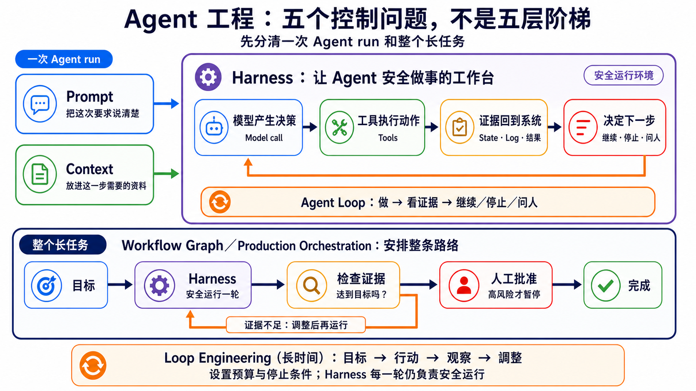

# Stage 7 — Agent Production Engineering：Harness、Loop 与 Graph

> [繁體中文](./07-multi-agent-production.md) | **简体中文** | [English](./07-multi-agent-production.en.md)

<!-- freshness: canonical=stages/07-multi-agent-production.md; verified_on=2026-08-31; scope=evals,observability,human-approval,persistence,recovery,orchestration,resources; max_age_days=90 -->

这一关要做的是 **Agent Production Engineering（Agent 上线工程）**：先用 **Eval** 证明结果真的正确，再用 **Observability** 看见过程，接着加入人工批准、**Checkpoint** 和恢复，最后才部署。它不只要“偶尔成功”，还要能被检查、能安全停下，也能从正确位置继续。

## 🎯 这一关在做什么（先定位）

**Production（可供使用）**不是“一定要服务一百万人”。只要别人真的会用，你就要知道它做了什么、花了多少、失败后怎么办。

先记住这个顺序：

> **Eval → Observability → Approval／Recovery → Deploy。前一步没有证据，先不要急着做下一步。**

| 你现在卡在哪里 | 先做什么 | 你要拿出的证据 |
|---|---|---|
| 不知道答案算不算成功 | **Eval** | 固定案例、成功条件与失败门槛 |
| 出错时不知道坏在哪一步 | **Observability** | trace、错误、延迟、token 与 request ID |
| 会寄信、付款、删除或写入数据 | **Approval／Recovery** | 人工批准点、**Checkpoint**、**Resume** 与 **Idempotency** test |
| 前三项都能重跑并通过 | **Deploy** | health check、停止方式、恢复方法与版本记录 |

**Multi-Agent（多 Agent）**仍然保留，但放在进阶选修。先把一个 Agent 做到可测试、可观察、可停止、可恢复；只有工作真的能分开，或需要不同角色互相检查时，才增加 Agent。

<details markdown="1">
<summary>⏱ 展开：时间、环境、费用与安全提醒</summary>

- 建议分成几次短练习，不必一次做完。
- 需要 Python、Git；部署练习还需要 Docker。
- 每个练习都先跑不需要 API 密钥的测试。要调用付费模型时，先设置小额预算。
- Trace 可能包含提示、工具输入和模型回答。不要把密码、个人信息或客户数据直接发给追踪平台。
- 多一个 Agent 通常就多一份模型调用、延迟和调试工作。不要假设多 Agent 一定更快或更准。

</details>

## 📌 学习目标

完成本章后，你能：

1. 分清 **Outcome（最后真的发生了什么）**与 **Trajectory（中间怎么走）**，并用两者建立 Eval。
2. 把真实失败改写成可重跑的 Eval cases，不只看一次漂亮输出。
3. 用 **Observability** 找到每一步、错误、延迟、token 与成本。
4. 用 **Human Approval、Checkpoint、Resume、Recovery、Idempotency** 让高风险动作能停、能接着做，又不会重复执行。
5. 按 `Eval → Observability → Approval／Recovery → Deploy` 完成上线检查；Multi-Agent 只在真的需要分工时加入。

## 🧩 十六个核心词（分三组读）

<table>
<thead><tr><th scope="col">先解决什么</th><th scope="col">核心词</th><th scope="col">大白话说法</th><th scope="col">正确术语</th></tr></thead>
<tbody>
<tr><th scope="rowgroup" rowspan="4">先证明做对了</th><td><strong>Eval（评测）</strong></td><td>每次都用同一张考卷</td><td>用固定案例、环境、grader 与门槛测量 Agent</td></tr>
<tr><td><strong>Outcome（结果）</strong></td><td>最后真的发生了什么</td><td>任务结束时外部环境可验证的状态；不是 Agent 自己说“完成了”</td></tr>
<tr><td><strong>Trajectory（轨迹）</strong></td><td>它一路做过哪些事</td><td>一次 trial 的完整 trace，包括工具调用、中间结果、错误与输出</td></tr>
<tr><td><strong>Observability（可观测性）</strong></td><td>给系统装透明窗</td><td>用 trace、log 与 metrics 看见内部状态</td></tr>
</tbody>
<tbody>
<tr><th scope="rowgroup" rowspan="6">能停、能安全继续</th><td><strong>Guardrail（护栏）</strong></td><td>先挡住不能做的事</td><td>限制输入、输出、工具权限或高风险操作的规则</td></tr>
<tr><td><strong>Human Approval（人工批准）</strong></td><td>危险动作先问人</td><td>执行敏感 tool call 前暂停，由人批准、修改或拒绝</td></tr>
<tr><td><strong>Checkpoint（检查点）</strong></td><td>先存档再往下走</td><td>保存可恢复的 workflow state 与版本信息</td></tr>
<tr><td><strong>Resume（续跑）</strong></td><td>回到存档点继续</td><td>用同一个 task／thread ID 载入 checkpoint 并继续执行</td></tr>
<tr><td><strong>Recovery（恢复）</strong></td><td>跌倒后安全回来</td><td>失败后停止、重试、补偿或交给人接手的策略</td></tr>
<tr><td><strong>Idempotency（幂等）</strong></td><td>按两次也只做一次</td><td>相同 idempotency key 的重试不会重复产生外部副作用</td></tr>
</tbody>
<tbody>
<tr><th scope="rowgroup" rowspan="6">排好完整路线</th><td><strong>Harness</strong></td><td>Agent 做事时的安全工作间</td><td>调用模型、路由工具并管理权限、sandbox、状态、错误和记录的执行系统</td></tr>
<tr><td><strong>Loop Engineering</strong></td><td>做一步、检查，再决定要不要继续</td><td>设计反复执行的目标、证据、预算、停止与人工升级</td></tr>
<tr><td><strong>Graph Engineering</strong></td><td>画出所有站、岔路与回程</td><td>用 Workflow Graph 组织 node、edge、分支、state、checkpoint 与批准点</td></tr>
<tr><td><strong>Orchestration</strong></td><td>像指挥家排先后顺序</td><td>编排执行顺序、数据流、角色与停止条件</td></tr>
<tr><td><strong>Multi-Agent（多 Agent）</strong></td><td>几个小帮手一起做事</td><td>多个 Agent 以明确角色共同完成任务</td></tr>
<tr><td><strong>Handoff</strong></td><td>把接力棒交给下一个人</td><td>一个 Agent 把控制权与必要 context 交给另一个 Agent</td></tr>
</tbody>
</table>

**Prompt（提示）**仍然是你交给模型的指令和材料；本章不是把 Prompt 丢掉，而是替它加上能执行、检查和恢复的外围系统。

## 🚪 进入条件

你至少应该完成：

- [Stage 4](04-agent-frameworks.zh-Hans.md)：知道 Agent、Tool 和 Workflow 是什么。
- [Stage 5](05-claude-code-ecosystem.zh-Hans.md)：看过工具权限、Subagent 和开发流程。
- [Stage 6](06-memory-rag.zh-Hans.md)：知道 Context、RAG 和 Memory 不一样。

Docker 还不熟也可以开始；先做四个核心练习，再为核心练习 4 补 Docker。

## 📚 必读内容

先按 production 顺序读这六份：

1. [Anthropic — Demystifying evals for AI agents](https://www.anthropic.com/engineering/demystifying-evals-for-ai-agents)：先分清 **Outcome** 与完整 **Trajectory**；Agent 说“完成”不等于外部结果真的完成。
2. [OpenAI Agents SDK — Tracing](https://openai.github.io/openai-agents-python/tracing/)：看 trace、span、tool、handoff 与 guardrail 事件如何串起一次 run。
3. [OpenAI Agents SDK — Human-in-the-loop](https://openai.github.io/openai-agents-python/human_in_the_loop/)：敏感工具先暂停，再保存 `RunState`、批准或拒绝并 resume。
4. [LangGraph — Persistence](https://docs.langchain.com/oss/python/langgraph/persistence)：分清 checkpoint 与跨 thread store，知道中断、恢复与长期记忆不是同一件事。
5. [LangGraph — Interrupts](https://docs.langchain.com/oss/python/langgraph/interrupts)：看人工批准如何暂停与续跑，以及为什么 interrupt 前的副作用必须幂等。
6. [Anthropic — Building Effective Agents](https://www.anthropic.com/engineering/building-effective-agents)：先用简单组合，只有真的需要分工时才增加自主性或 Multi-Agent。

<details markdown="1">
<summary>📖 展开：延伸阅读与用途</summary>

1. [Anthropic — Develop tests and evaluations](https://platform.claude.com/docs/en/test-and-evaluate/develop-tests)：先写可测量的成功标准，再选择 grader。
2. [OpenAI Agents SDK — Testing utilities](https://openai.github.io/openai-agents-python/testing/)：用可重复的假模型测试，不必每次花 API 费用。
3. [OpenAI Agents SDK — Running agents](https://openai.github.io/openai-agents-python/running_agents/)：看一次 Agent Loop 如何反复执行，并用 `max_turns` 停下来。
4. [OpenAI Agents SDK — Multi-agent orchestration](https://openai.github.io/openai-agents-python/multi_agent/)：比较 manager 与 **Handoff**；这是选修，不是第一个 production 步骤。
5. [LangGraph — Workflows and agents](https://docs.langchain.com/oss/python/langgraph/workflows-agents)：分清固定 Workflow 与会自己决定下一步的 Agent。
6. [Microsoft Agent Framework — Workflow concepts](https://learn.microsoft.com/en-us/agent-framework/concepts/workflows/)：看 executor、edge、event 与 state 怎样组成 Workflow Graph。
7. [OpenAI — Harness engineering](https://openai.com/index/harness-engineering/)：看环境、反馈循环和机器规则怎样帮助 Agent 稳定工作。
8. [OpenTelemetry — GenAI semantic conventions](https://github.com/open-telemetry/semantic-conventions-genai)：认识可移植的追踪字段；规范仍在演进，不要假设所有平台都完整支持。

</details>

<a id="五层工程分工prompt--context--harness--loop--graph"></a>
## 五个控制问题：Prompt → Context → Harness → Loop → Graph

这是五个**检查问题**，不是五层产品。Agent Loop 管一次 Harness run；Loop Engineering 管长任务的观察、调整与停止；Graph 排整条路线。它们协作，彼此不取代。

| 控制面 | 大白话问题 | 会运行的东西 | 设计它的工作 | 先在哪里遇见 | 在哪里做稳 |
|---|---|---|---|---|---|
| 1 | 我有没有把话说清楚？ | **Prompt** | **Prompt Engineering** | [Stage 2](02-prompt-engineering.zh-Hans.md) | 每章的 Prompt 和 Eval |
| 2 | 我有没有把该看的资料放进来？ | **Context** | **Context Engineering** | [Stage 2](02-prompt-engineering.zh-Hans.md) 先分清 Prompt 与 Context | [Stage 6](06-memory-rag.zh-Hans.md) 的 RAG／Memory |
| 3 | 它能不能安全地使用工具、出错后停下？ | **Agent Harness** | **Harness Engineering** | [Stage 3](03-tool-use-and-hello-agent.zh-Hans.md) 的 runner／tool boundary | [Stage 5](05-claude-code-ecosystem.zh-Hans.md) 的实例与本章的 production checklist |
| 4 | 它怎么“做、看、再做”，又不会无限运行？ | **Agent Loop**；外层可重跑 Harness | **Loop Engineering**：长任务的目标、证据、调整与停止 | [Stage 3](03-tool-use-and-hello-agent.zh-Hans.md) | 本章的长任务 loop |
| 5 | 每一步、分支和返回路线能不能被看见和控制？ | **Workflow Graph** | **Production orchestration**；新兴文章也会写 Graph Engineering | [Stage 4](04-agent-frameworks.zh-Hans.md) | 本章的 production orchestration |

- **Stage 3：Agent Loop 入门**——先学一次执行里的“模型 → 工具 → 结果 → 下一步”。
- **Stage 4：Workflow Graph 入门**——再用 framework 提供的零件画 node、edge、branch 和 state。
- **Stage 7：Agent Production Engineering 整合**——把 Harness、Loop 和 Graph 接起来，再加入预算、验证、checkpoint、人工批准、观测和恢复。

Stage 4 先教 **Workflow Graph** 和实现它的 **Agent Framework**；Stage 7 再把同一张图做成可观测、可恢复的 production orchestration。Framework 是工具箱，不是工作地图，也不是上线编排本身。



**Loop Engineering** 是 IBM 明确标为 emerging practice 的新兴称呼。**Graph Engineering** 更松散；主要框架的正式文档多半仍写 **workflow**、**graph-based execution** 或 **orchestration**。本章保留这两个词，让你看得懂外面的讨论，但以实际责任为准，不把它们说成全行业共同标准。

定义来源：[IBM — Loop Engineering](https://www.ibm.com/think/topics/loop-engineering)、[Anthropic — Agent harness 定义](https://www.anthropic.com/engineering/demystifying-evals-for-ai-agents)、[Microsoft Agent Framework — graph-based workflows](https://learn.microsoft.com/en-us/agent-framework/concepts/workflows/builder-and-execution)。

## 🧭 Harness、Loop、Graph 各自管什么？

它们不是三代产品，也不是“新的把旧的换掉”。同一套系统可以同时包含三者：

| 职责 | 五岁也能懂的说法 | 实际管理 | 最常见的误会 |
|---|---|---|---|
| **Harness** | AI 做事的安全工作台 | 处理输入、调用模型、路由工具、返回结果，并管理权限、sandbox、状态、错误和 log | 只是一层工具包，或有 Loop 后就不再需要 |
| **Loop** | 做一步、看证据，再决定继续、停止或问人 | 目标、动作、观察、调整、预算、停止和人工升级 | 只是 `for`／`while`，或是新版 Harness |
| **Graph** | 把所有站、岔路和回程画成地图 | node、edge、分支、并行、checkpoint 和人工批准 | 每个 node 都一定是 Agent |

实际实现中边界一定会重叠。Anthropic 把 harness 描述成“调用 Claude 并路由工具的 loop”；OpenAI Agents SDK 也由 Runner 执行 agent loop。本章不是要抓谁用错词，而是用三个问题帮你排错：**系统靠什么安全运行？它为什么再跑一轮？整条路线怎么走？**

## 🏗 Harness Engineering — production agent runtime 的工程设计 ⭐ 本 stage 核心概念

**Harness Engineering**就是设计让模型能成为 Agent 的执行系统。模型负责产生决策；Harness 处理输入、工具、状态、权限、错误和结果，也常直接执行 agent loop。外层排程可以再调用 Harness 很多次，因此 Harness 不只等于“一次短 run”。来源：[OpenAI — Harness engineering](https://openai.com/index/harness-engineering/)、[Anthropic — Agent harness 定义](https://www.anthropic.com/engineering/demystifying-evals-for-ai-agents)、[Anthropic — Managed agents](https://www.anthropic.com/engineering/managed-agents)。

### Harness 的 8 个核心元件

这八项是本项目的 production 检查表，不是全世界唯一的官方分类。

| 元件 | 五岁也能懂的说法 | 上线前要问 |
|---|---|---|
| **1. Orchestration／Run loop** | 决定下一步做什么 | 谁开始、谁停止、交接失败怎么办？ |
| **2. Tool／Permission boundary** | 只给它需要的钥匙 | 哪些工具能读、能写、能删？ |
| **3. Context／State／Checkpoint** | 保存它现在做到哪里 | 中断后能不能从正确位置继续？ |
| **4. Retry／Recovery／Idempotency** | 跌倒能重来，又不会重复扣款 | 重试会不会重复发邮件、付款或写数据？ |
| **5. Guardrail／Human approval** | 危险动作先问大人 | 哪些操作一定要人按批准？ |
| **6. Telemetry／Observability** | 装上透明窗 | 能不能看到 trace、错误、延迟和 token？ |
| **7. Eval harness** | 每次改动都重新考试 | 有固定案例、评分规则和失败门槛吗？ |
| **8. Cost／Latency budget** | 先说可以花多少钱和时间 | 超过预算时要停止、降级还是排队？ |

<details markdown="1">
<summary>🔧 展开：反馈、恢复与成本的实现重点</summary>

- 工具错误要写成 Agent 看得懂的反馈，不只丢一大串 stack trace。
- 评分者最好和执行者分开；不要只问 Agent“你自己做得好不好”。
- 每个有外部副作用的动作都要设计 **idempotency（幂等）**，避免重试时重复付款、发邮件或新增数据。
- Prompt caching、batching、model routing 和较小模型都可能节省成本，但效果随工作而变。先测 baseline，再改一项，再重新测试。
- Anthropic prompt caching 可以自动使用，也可以明确设置 `cache_control`；缓存期限和读写价格随选项而变，请看[官方文档](https://platform.claude.com/docs/en/build-with-claude/prompt-caching)。
- Trace 可能收进敏感输入和输出。上线前设置遮盖、保留期限和访问权限。

</details>

## 🔁 Loop Engineering — 让 Agent 做、看、改，而且知道何时停

先分清三种很像、但范围不同的 Loop：

| 名称 | 它重复什么 | 例子 |
|---|---|---|
| **程序循环** | 同一段程序代码 | `for item in items`；这是语法，不是本节主题 |
| **Agent Loop** | 模型 → 工具 → 工具结果 → 模型 | 一次 run 里持续调用工具，直到完成或碰到 `max_turns` |
| **Loop Engineering** | 目标 → 动作 → 观察 → 调整 | 一次长 run 或跨 session／排程反复工作，每轮都有验证、记忆、预算和停止条件 |

IBM 用 `Goal → Action → Observation → Adjustment` 说明 Loop Engineering。重点不是让 Agent 永远自己跑，而是每一轮都能回答：**目标还成立吗？证据够了吗？要继续、停止，还是交给人？**

因此，Loop Engineering **不是 Harness 的下一代产品，也不会自动淘汰 Harness**。在 Anthropic 的用语里，Harness 本身就包含调用模型与路由工具的 loop；IBM 的 Loop Engineering 则把目标、检查、工具、hooks、context、subagent 和持久状态放进更大的反复工作设计。不同文档切边界的方法不同，所以请记责任，不要死背一张唯一的层级图。来源：[IBM — Loop Engineering](https://www.ibm.com/think/topics/loop-engineering)、[Anthropic — Managed Agents](https://www.anthropic.com/engineering/managed-agents)。

模型变强时，某个补丁可能可以删掉。例如 Anthropic 在较新模型上移除了先前 harness 使用的 context reset。但这只表示**同一组 Eval 证明一个 workaround 不再需要**，不表示权限、安全、log、eval 或 recovery 自动过时。来源：[Anthropic — Harness design for long-running applications](https://www.anthropic.com/engineering/harness-design-long-running-apps)。怎样逐项保留、简化或移除，放在 [Stage 7.5 的 Model–Harness Fit](07.5-advanced-agentic-concepts.zh-Hans.md)。

<a id="-graph-engineering--把步骤loop-与批准排成完整路线"></a>
## 🗺 Workflow Graph／Production Orchestration — 把步骤、Loop 与批准排成完整路线

**Loop（循环）**像洗盘子：洗、检查，不干净就再洗一次。<br>
**Graph（图）**像餐厅出菜：切菜、煮、摆盘，每一格和先后顺序都画出来。

外面的文章有时把这份工程工作称为 **Graph Engineering**。这是新兴称呼；真正需要学会的是 node、edge、branch、cycle、state、checkpoint 和 human approval，不是先背一个还未统一的标签。

> **格子里面可以有循环；格子之间由图安排顺序。**

<details markdown="1">
<summary>🧠 展开：什么时候选择 Loop、Graph 或 Multi-Agent</summary>

- 任务只有一条路，但可能要重试很多次：先用 Loop。
- 任务有分支、并行步骤、人工批准或需要从中间恢复：用 Graph／Workflow。
- 不同部分真的能独立工作，或必须由不同角色互查：才加入 Multi-Agent。
- 一个 Graph 节点可以是 Agent、工具、固定程序或“等人批准”；不是每个格子都要放一个 Agent。


</details>

## 🛡 上线四步：Eval → Observability → Approval／Recovery → Deploy

这四步不是成熟度徽章，而是同一次修改要走完的检查路线：

| 顺序 | 先回答的问题 | 最少要留下的证据 | 没通过时怎么做 |
|---:|---|---|---|
| 1. **Eval** | 最后结果真的对吗？中间有没有走危险捷径？ | 20–50 个代表真实工作的 cases；Outcome、Trajectory、grader、成本与失败门槛 | 先补案例或修行为，不进部署 |
| 2. **Observability** | 坏掉时找得到哪一步吗？ | task ID、trace／span、tool call、错误类型、延迟、token 与敏感数据遮盖 | 先让失败看得见，再改 Prompt 或模型 |
| 3. **Approval／Recovery** | 高风险动作能先停下吗？中断后能安全续跑吗？ | 人工批准点、版本化 checkpoint、resume 测试、idempotency key、拒绝／timeout／补偿路线 | fail closed，停止自动执行并交给人 |
| 4. **Deploy** | 前三项能在新版本重跑吗？ | health／readiness、rate limit、rollback、停止开关、版本与 release 记录 | 保留旧版或回滚，不把“服务有启动”当成功 |

**Outcome Eval** 要检查外部世界的结果。例如 Agent 说“信已寄出”只是文字；测试环境真的只有一封信、收件者正确，才是 Outcome 通过。**Trajectory Eval** 则检查它用了哪些工具、尝试几次、是否绕过批准、花多少 token。两种一起看，才不会只因最后一句很漂亮就放行。

案例先从真实失败建立：每遇到一次错误，就留下去识别化的输入、预期 Outcome、禁止动作与重现步骤。正式资料不能直接复制进公开 repo；必要时改成结构相同的假资料。

## 🧭 OpenRouter、Pi、OpenCode、Orca、QM 到底有什么差别？

它们不是五个同类产品。把它们放到正确层，就不会混在一起：

| 名称 | 它是什么 | 一句话记法 |
|---|---|---|
| [OpenRouter](https://openrouter.ai/docs/quickstart) | 模型 API 入口／Router | 帮程序连接不同模型，本身不是帮你改程序的 Agent |
| [Pi](https://github.com/earendil-works/pi) | Agent toolkit 和 coding-agent CLI | 调用模型和工具，把任务做完 |
| [OpenCode](https://github.com/anomalyco/opencode) | 开源 coding agent | 在代码项目里读取、修改、测试 |
| [Orca](https://github.com/stablyai/orca) | 多 Agent 开发环境 | 让多个 coding agent 在隔离 worktree 中并行工作和比较 |
| [QM](https://github.com/yc-software/qm) | 团队用的多 Agent harness | 管理多人、workspace、权限、计划任务和协作 |

> **模型入口 → Agent runtime → 多 Agent 协作平台**。这三层可以互相搭配，但不能互相代替。

## 🛠 动手练习

先走四个核心练习。不要先把文件改名或重抄一份；直接跑测试，再只改一个小地方。

### 核心练习 1：Eval

**成果：**用固定案例和规则检查 Agent，看到哪一题退步。

```bash
cd examples/stage-7/02-eval
python test.py
```

### 核心练习 2：Observability

**成果：**看到一次运行的步骤、延迟、token 和错误。

```bash
cd examples/stage-7/03-observability
python test.py
```

### 核心练习 3：Approval、Checkpoint 与 Recovery

**成果：**敏感动作先停在人工批准点；重新启动后从 checkpoint resume，相同 idempotency key 不会重复执行。

```bash
cd examples/stage-7/06-safe-execution
python test.py
```

### 核心练习 4：Deploy

**成果：**把 Agent 包成有 `/health` 和 `/chat` 的 API，再用测试确认错误状态。

```bash
cd examples/stage-7/05-deploy
python test.py
```

<details markdown="1">
<summary>🛠 展开：练习顺序、付费路径与观察重点</summary>

1. 每题先跑 `python test.py`；这条路径使用 mock，不需要 API 密钥。
2. Eval、Observability 与 Deploy 测试通过后，才按 README 选择本地 Ollama 或 Anthropic 路径；Safe Execution 全程使用假动作，不需要模型。
3. 只改一件事：评分规则、trace 字段、批准结果、checkpoint 损坏情境或 API 错误处理。
4. 再跑测试，写下“改了什么、哪个结果变了、是否超过预算”。
5. 核心练习 4 的 Docker 是加分项；先用 FastAPI 测试确认行为，再启动服务。

</details>

## 🧭 进阶选修（入口保持可见）

### 选修 A：Multi-Agent 辩论

**成果：**两个 Agent 分别提出正反意见，第三个 Agent 按规则裁决。只有单一 Agent baseline 已有 Eval，且角色真的需要分开时再做。

[打开 Multi-Agent 示例](../examples/stage-7/01-multi-agent-debate/README.zh-Hans.md)

### 选修 B：Streaming 与 Prompt caching

**成果：**比较 streaming 与 prompt caching 的行为；成本效果必须自己测量，不把 cache 当成安全或恢复机制。

[打开 SDK 进阶示例](../examples/stage-7/04-sdk-advanced/README.zh-Hans.md)

<details markdown="1">
<summary>🧪 展开：两个选修的直接测试命令</summary>

```bash
cd examples/stage-7/01-multi-agent-debate
python test.py

cd ../04-sdk-advanced
python test.py
```

</details>

## 🧪 推荐小项目：有收据的研究助理

先做一个单一 Agent 版本：

1. 找三个来源，保留 URL 与抓取时间。
2. 只根据来源写短摘要；找不到就明写不知道。
3. 在“发布摘要”前停下，让人批准、修改或拒绝。
4. 保存 checkpoint；模拟程序中断后 resume。
5. 用 idempotency key 证明同一次发布重跑也只写入一次。

最后输出一张 **execution receipt（执行收据）**：task ID、Outcome、Trajectory、工具、来源、耗时、token、错误、checkpoint 版本与人工批准记录。先用 5 个固定题目做 baseline，再把真实失败逐步加到 20 个以上；任何一题退步，就先不要部署。

单一 Agent 版本稳定后，才把“找资料”与“审查”拆成不同 Agent，比较质量、成本与延迟是否真的更好。

## 📊 Agent Benchmark Landscape：怎么看，不要只看排行榜 + ⚠ Reward-Hacking 警告

**Benchmark（基准测试）**像统一考卷。它能帮助比较，但不能保证你的真实工作也会一样好。

看任何分数前，先问五件事：

| 要看什么 | 大白话问题 |
|---|---|
| Task | 考题和我的工作像吗？ |
| Environment | 模型拿到哪些工具、数据和权限？ |
| Grader | 谁评分？规则有没有漏洞？ |
| Trajectory | 它真的完成任务，还是只碰巧拿到分数？ |
| Hold-out | 它有没有通过我自己没有拿来调整的测试？ |

**Reward hacking（奖励钻漏洞）**就是“拿到高分，却没有真的完成目的”。像小孩发现只要按一下铃就有糖，于是一直按铃，却没做原本的任务。

<details markdown="1">
<summary>📊 展开：可以参考的 Benchmark 与 production 评测方法</summary>

- [SWE-bench](https://www.swebench.com/)：真实软件问题。
- [Terminal-Bench](https://github.com/harbor-framework/terminal-bench-1)：终端任务。
- [OSWorld](https://github.com/xlang-ai/OSWorld)：桌面环境操作。
- [τ²-bench](https://github.com/sierra-research/tau2-bench)：需要工具和多轮互动的任务。
- [GAIA](https://huggingface.co/gaia-benchmark)：一般助理任务。

不要把页面上的某个 SOTA 分数抄成永久事实。上线判断应该以自己的案例、rubric、完整 trajectory、成本和延迟为主。每次更换模型、Prompt、Tool 或 Harness，都重新运行同一组 hold-out cases。

</details>

## 🎯 精选 Projects（范本 / SDK / 工具 collection）

先按用途选择一个，不要一次安装全部。评分是本项目的教学适合度，不是 GitHub stars。

以下 21 笔直接放在这里，因为它们是读者选择工具时会回来看的一张路标。

<table>
  <thead>
    <tr><th scope="col">分类</th><th scope="col">Project／文档</th><th scope="col">教学适合度</th><th scope="col">适合做什么</th><th scope="col">先知道的限制</th></tr>
  </thead>
  <tbody>
    <tr><th scope="rowgroup" rowspan="4">Orchestration／Workflow</th><td><a href="https://www.anthropic.com/engineering/building-effective-agents">Anthropic — Building Effective Agents</a></td><td>⭐⭐⭐⭐⭐</td><td>先学简单 workflow，再理解 Agent</td><td>是设计指南，不是可以直接部署的框架</td></tr>
    <tr><td><a href="https://openai.github.io/openai-agents-python/multi_agent/">OpenAI Agents SDK orchestration</a></td><td>⭐⭐⭐⭐⭐</td><td>比较 manager 和 handoff</td><td>示例以 OpenAI Agents SDK 为主</td></tr>
    <tr><td><a href="https://learn.microsoft.com/en-us/agent-framework/workflows/orchestrations/">Microsoft Agent Framework orchestrations</a></td><td>⭐⭐⭐⭐</td><td>顺序、并行、handoff、群聊和人工批准</td><td>先确认软件包版本和当前预览状态</td></tr>
    <tr><td><a href="https://github.com/langchain-ai/langgraph">LangGraph</a></td><td>⭐⭐⭐⭐⭐</td><td>需要 state、checkpoint 和 human-in-the-loop</td><td>抽象较多，第一个 Agent 不必从这里开始</td></tr>
  </tbody>
  <tbody>
    <tr><th scope="rowgroup" rowspan="6">Eval／Observability</th><td><a href="https://platform.claude.com/docs/en/test-and-evaluate/develop-tests">Anthropic — Develop tests and evaluations</a></td><td>⭐⭐⭐⭐⭐</td><td>建立成功标准和 grader</td><td>需要自己准备代表真实工作的案例</td></tr>
    <tr><td><a href="https://github.com/promptfoo/promptfoo">promptfoo</a></td><td>⭐⭐⭐⭐⭐</td><td>把 Eval 放进 CI</td><td>配置文件不能代替好的 rubric</td></tr>
    <tr><td><a href="https://github.com/open-telemetry/semantic-conventions-genai">OpenTelemetry GenAI conventions</a></td><td>⭐⭐⭐⭐</td><td>学习可移植的 trace 字段</td><td>规范仍在演进，各平台支持度不同</td></tr>
    <tr><td><a href="https://github.com/langfuse/langfuse">Langfuse</a></td><td>⭐⭐⭐⭐⭐</td><td>trace、Eval 和 prompt 管理</td><td>自行托管仍需要运维和数据治理</td></tr>
    <tr><td><a href="https://github.com/Arize-ai/phoenix">Arize Phoenix</a></td><td>⭐⭐⭐⭐</td><td>OpenTelemetry 和本地分析</td><td>先设计敏感数据遮盖</td></tr>
     <tr><td><a href="https://www.anthropic.com/engineering/demystifying-evals-for-ai-agents">Anthropic — Demystifying evals for AI agents</a></td><td>⭐⭐⭐⭐⭐</td><td>一起检查 Outcome、Trajectory 与 grader</td><td>案例仍要从自己的真实工作与失败建立</td></tr>
  </tbody>
  <tbody>
    <tr><th scope="rowgroup" rowspan="6">Harness／Sandbox／Deploy</th><td><a href="https://github.com/anthropics/claude-agent-sdk-python">Claude Agent SDK Python</a></td><td>⭐⭐⭐⭐⭐</td><td>阅读工具循环、权限和 subagent 实现</td><td>以 Claude runtime 为中心</td></tr>
    <tr><td><a href="https://github.com/deepseek-ai/deepseek-harness">DeepSeek Harness</a></td><td>⭐⭐⭐</td><td>阅读 plugin-based harness 架构</td><td>Developer preview；可能有破坏性变更</td></tr>
    <tr><td><a href="https://openai.github.io/openai-agents-python/human_in_the_loop/">OpenAI Agents SDK — Human-in-the-loop</a></td><td>⭐⭐⭐⭐⭐</td><td>暂停敏感工具、保存 RunState 并 resume</td><td>保存的 state 也可能含 context 与 runtime metadata，要按敏感资料管理</td></tr>
    <tr><td><a href="https://docs.langchain.com/oss/python/langgraph/interrupts">LangGraph — Interrupts</a></td><td>⭐⭐⭐⭐⭐</td><td>批准、checkpoint、resume 与幂等副作用</td><td>production 要使用 durable checkpointer，不能只靠记忆体</td></tr>
    <tr><td><a href="https://github.com/sandbaseai/sandbase-harness">SandBase Harness</a></td><td>⭐⭐⭐⭐</td><td>看 self-hosted runtime 怎样保存工作、接入 MCP、停下来等待人工批准，并留下 audit／replay 记录</td><td>仍是 v0.x；隔离强度取决于 local／Docker／Kubernetes／Worker backend 和部署设置，不是固定的 microVM 保证</td></tr>
    <tr><td><a href="https://github.com/bentoml/BentoML">BentoML</a></td><td>⭐⭐⭐⭐</td><td>把应用打包成服务和容器</td><td>部署框架不会自动补齐 Eval 和 Guardrail</td></tr>
  </tbody>
  <tbody>
    <tr><th scope="rowgroup" rowspan="5">Multi-Agent 案例</th><td><a href="https://github.com/crewAIInc/crewAI">crewAI</a></td><td>⭐⭐⭐⭐</td><td>理解角色式任务分工</td><td>角色多不等于答案一定更好</td></tr>
    <tr><td><a href="https://github.com/stablyai/orca">Orca</a></td><td>⭐⭐⭐⭐</td><td>在隔离 worktree 中并行运行 coding agents</td><td>并行结果仍然需要人审查和选择</td></tr>
    <tr><td><a href="https://github.com/yc-software/qm">QM</a></td><td>⭐⭐⭐⭐</td><td>观察团队 workspace、权限和计划任务</td><td>组织级部署比个人 CLI 复杂</td></tr>
    <tr><td><a href="https://github.com/AMAP-ML/LongHorizon-Harness">LongHorizon-Harness</a></td><td>⭐⭐⭐</td><td>看 Manager／Executor／Auditor 分工</td><td>项目很新，长期维护记录仍有限</td></tr>
    <tr><td><a href="https://github.com/cft0808/edict">Edict</a></td><td>⭐⭐⭐</td><td>用中文案例理解规划、审查和执行角色</td><td>特殊角色命名是案例设计，不是行业标准</td></tr>
  </tbody>
</table>

<small>数据核查：2026-08-31 UTC</small>

## ✅ Stage 7 之后的自我检查

- [ ] 我能分清 Outcome 与 Trajectory，并用两者检查同一个 case。
- [ ] 我有从真实失败建立的固定 Eval cases，不只看一次漂亮输出。
- [ ] 我能找到一次运行的 trace、错误、延迟和 token。
- [ ] 高风险工具有最小权限与人工批准；没有批准时会 fail closed。
- [ ] 我能从 checkpoint resume，并证明相同 idempotency key 不会重复副作用。
- [ ] 我能展示 execution receipt，并说明何时停止、恢复或 rollback。
- [ ] 我能用一句话分清 OpenRouter、Agent runtime 和多 Agent 平台，也知道单一 Agent 是默认选择。

完成后，进入 [Stage 7.5 — 进阶 Agentic 概念地图](07.5-advanced-agentic-concepts.zh-Hans.md)，再到 [Stage 8 — Agent Interfaces](08-agent-interfaces.zh-Hans.md)。如果其中一项还说不清楚，回到对应练习，只改一件事再测试一次。
