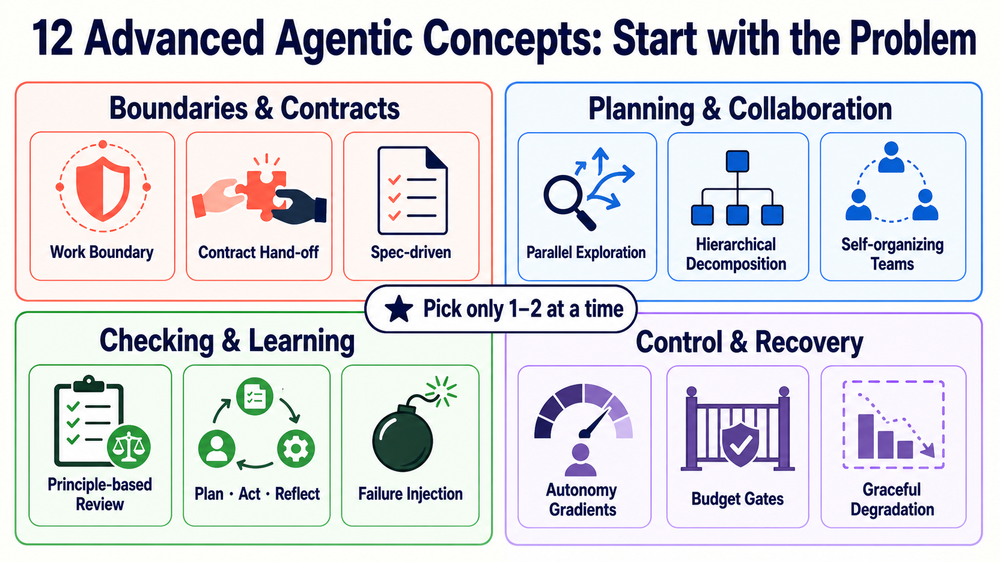
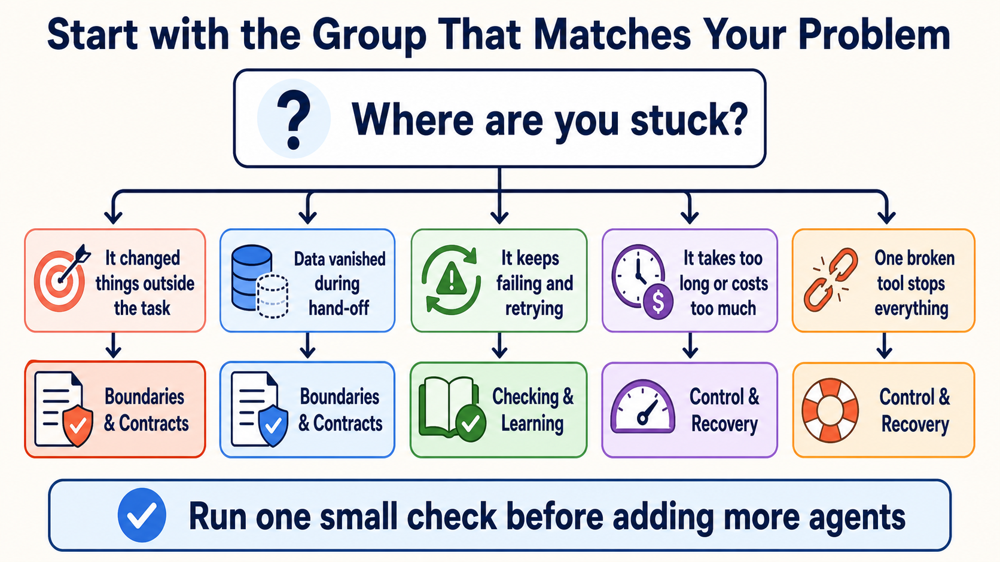
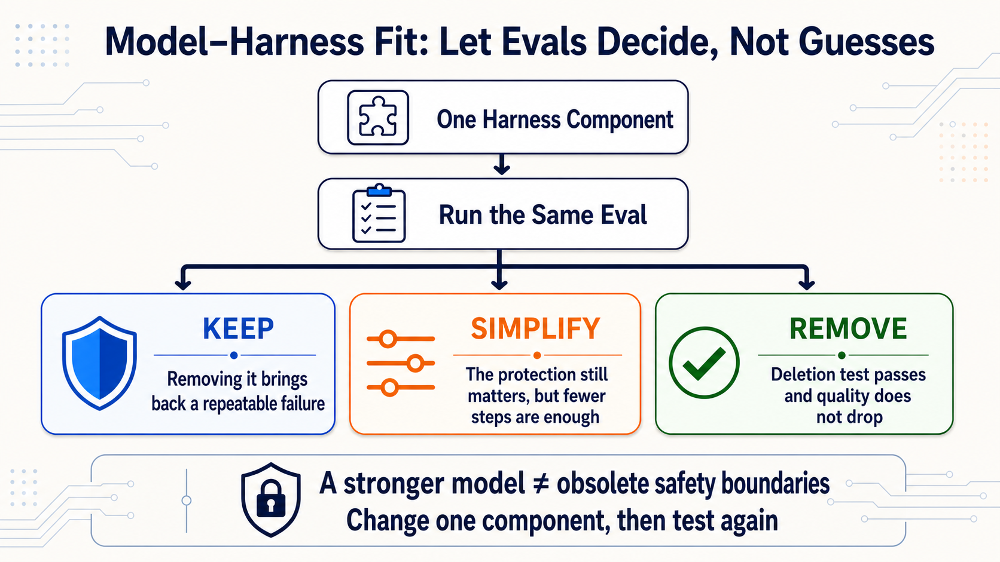

# Stage 7.5 — Advanced Agentic Concepts Map

> [繁體中文](./07.5-advanced-agentic-concepts.md) | [简体中文](./07.5-advanced-agentic-concepts.zh-Hans.md) | **English**

<!-- freshness: canonical=stages/07.5-advanced-agentic-concepts.md; verified_on=2026-08-29; scope=agent-patterns,harnesses,evals,dynamic-workflows,framework-status,research; max_age_days=90 -->

This stage is not about memorizing every new term. Think of it as a map: start with the small area where your agent is stuck.

## 🎯 What this stage does (positioning first)

Stage 7 taught you to make agents observable, testable, and safe to stop when something goes wrong. Stage 7.5 adds one more skill:

> **When a new problem appears, identify its type first, then choose 1–2 concepts. Do not install all 12 patterns at once.**

You do not need to write code here. By the end, you should be able to draw three clear lines: what an agent **can do**, **cannot do**, and **what evidence proves completion**.

## 📌 Learning goals

After reading, you can:

1. Explain the six core terms in plain language.
2. Choose the 1–2 concepts you actually need from the 12 advanced concepts.
3. Distinguish planning, looking back after execution, and having another agent grade the result.
4. Write a **work boundary**, stopping condition, and completion evidence.

## 🚪 Shortest entry requirements

[Stage 7](07-multi-agent-production.en.md) is the entry point. If you read selectively, first build an agent with a tool, an Eval, and a stopping condition.

<details markdown="1">
<summary>⏱ Time, prerequisites, and reading approach</summary>

- **Quick map:** about 30 minutes; read the core terms, the 12-concept table, and the work-boundary card.
- **Choose a deep dive:** pick 1–2 sources; you do not need to read the full resource table.
- **Prerequisites:** Agent, Workflow, Handoff, Eval, Observability, and Guardrail. Review the [Stage 7 core terms](07-multi-agent-production.en.md) if needed.
- **Not required here:** buying API credits, installing a framework, or exposing private Chain-of-Thought.

<small>Fact check: 2026-08-28 UTC.</small>

</details>

## 🔑 Six core terms

| Core term | Kid-friendly explanation | Precise meaning |
|---|---|---|
| **Work Boundary (scope)** | A line on the ground: play here, do not touch there. | The explicit range an agent may and may not operate in. |
| **Contract** | Assignment rules: what to deliver, its shape, and what counts as done. | An agreement about inputs, outputs, format, responsibility, and acceptance. |
| **Reflection (look-back)** | Check the evidence before deciding whether to fix something once. | Evaluate an approach from observable results, with bounded retries when needed. |
| **Autonomy** | How far an adult lets you decide for yourself. | How much an agent can decide and act without asking at every step. |
| **Budget Gate** | When money, time, or turns run out, the gate closes. | Stop or escalate when token, cost, time, tool-call, or loop limits are reached. |
| **Graceful Degradation** | If the best road breaks, take a slower but safer road. | Use a less capable but predictable path when the main path fails. |

> **Reflection does not mean exposing private reasoning.** The curriculum needs visible plans, actions, observations, tests, and results—not a model’s complete Chain-of-Thought.

## 🗺️ 12 concepts: four groups by problem



These 12 concepts are grouped by the problem they address. Start with one group, not all of them.

<table>
  <thead>
    <tr><th scope="col">Problem group</th><th scope="col">Concept</th><th scope="col">Plain-language definition</th><th scope="col">When to use it</th></tr>
  </thead>
  <tbody>
    <tr><th scope="rowgroup" rowspan="3">Boundaries and contracts</th><td><strong>Work Boundary／Scope Discipline</strong></td><td>Only touch what the task authorizes.</td><td>Agents often modify files or data outside their assignment.</td></tr>
    <tr><td><strong>Contract-driven Hand-off</strong></td><td>Make hand-offs explicit.</td><td>The next agent needs state, evidence, and artifacts.</td></tr>
    <tr><td><strong>Spec-driven Development</strong></td><td>Use a checkable spec to guide agent work.</td><td>Free-form instructions drift and are hard to verify.</td></tr>
  </tbody>
  <tbody>
    <tr><th scope="rowgroup" rowspan="3">Planning and collaboration</th><td><strong>Speculative／Parallel Exploration</strong></td><td>Try independent paths in parallel.</td><td>There are several plausible answers and exploration can be separated.</td></tr>
    <tr><td><strong>Hierarchical Task Decomposition</strong></td><td>Break a task into supervised layers.</td><td>One Agent or context cannot hold the task.</td></tr>
    <tr><td><strong>Self-organizing Teams</strong></td><td>Let agents form roles dynamically.</td><td>Open-ended research; avoid it when high-risk ownership must stay fixed.</td></tr>
  </tbody>
  <tbody>
    <tr><th scope="rowgroup" rowspan="3">Checking and learning</th><td><strong>Agent-as-Judge／Principle-based Review</strong></td><td>Another agent checks the result against explicit rules.</td><td>A single unit test cannot judge many outcomes.</td></tr>
    <tr><td><strong>Plan-Act-Reflect Loop</strong></td><td>Plan, act, inspect evidence, and adjust.</td><td>The same failure repeats without a new approach.</td></tr>
    <tr><td><strong>Failure Injection／Chaos Eval</strong></td><td>Intentionally introduce a small, recoverable fault.</td><td>Use it to test timeouts, stale data, bad formats, or tool failure.</td></tr>
  </tbody>
  <tbody>
    <tr><th scope="rowgroup" rowspan="3">Control and recovery</th><td><strong>Autonomy Gradients／Trust Layers</strong></td><td>Give different work different levels of autonomy.</td><td>Read-only queries can be automatic; payments, deletion, and publishing need approval.</td></tr>
    <tr><td><strong>Cost-aware Budget Gates</strong></td><td>Set stop lines for money, time, and turns.</td><td>Parallel agents, long loops, and paid tools can run away.</td></tr>
    <tr><td><strong>Graceful Degradation</strong></td><td>Do a little less safely when the main path fails.</td><td>Models, providers, tools, or data sources may be unavailable.</td></tr>
  </tbody>
</table>

<details markdown="1">
<summary>📚 Sources, limits, and common confusions for the 12 concepts</summary>

### Boundaries and contracts

- **Work Boundary／Scope Discipline:** Put the boundary in the brief, permissions, and acceptance checks; saying “do not touch it” only in a prompt is not a real control. See [OpenAI Harness Engineering](https://openai.com/index/harness-engineering/) and [Claude Code permissions](https://code.claude.com/docs/en/permissions).
- **Contract-driven Hand-off:** Every hand-off needs an artifact, state, evidence, and unfinished items. Compare the routing and orchestrator-workers pattern in [Anthropic Building Effective Agents](https://www.anthropic.com/engineering/building-effective-agents).
- **Spec-driven Development:** YAML, JSON Schema, and typed signatures can carry a specification; what matters is that it can be checked. See [DSPy signatures](https://dspy.ai/learn/programming/signatures/).

### Planning and collaboration

- **Speculative／Parallel Exploration:** Parallelize only independent work; shared state can make parallelism increase conflicts. See Anthropic’s [parallelization workflow](https://www.anthropic.com/engineering/building-effective-agents).
- **Hierarchical Task Decomposition:** Supervisor → Worker → Sub-worker is one shape, not proof that more layers are better. Start new Microsoft projects with [Microsoft Agent Framework](https://github.com/microsoft/agent-framework); AutoGen is in maintenance mode.
- **Self-organizing Teams:** CAMEL and related research explore dynamic role formation, but production responsibility, permissions, and an audit owner must remain identifiable. See [CAMEL](https://arxiv.org/abs/2303.17760).

### Checking and learning

- **Agent-as-Judge／Principle-based Review:** A Judge can also be wrong, so give it a rubric, fixed cases, deterministic checks, and human spot checks. **Constitutional AI** is Anthropic's principle-based training and critique method; it is not the same as every runtime LLM judge. See the [Constitutional AI paper](https://arxiv.org/abs/2212.08073).
- **Plan-Act-Reflect Loop:** Reflection reads tests, tool results, or grader evidence and changes the next approach. Simply saying “try again” is still a retry. Start with [Reflexion](https://arxiv.org/abs/2303.11366).
- **Failure Injection／Chaos Eval:** Start with a small recoverable failure; never create accidents casually in real production data. Design the Eval with [Anthropic Demystifying Evals](https://www.anthropic.com/engineering/demystifying-evals-for-ai-agents).

### Control and recovery

- **Autonomy Gradients／Trust Layers:** A common ladder is suggest → propose → execute. Money, deletion, publishing, and external messages need increasingly explicit approval.
- **Cost-aware Budget Gates:** Limit tokens, dollars, time, turns, and tool calls together. Stop or ask a person when any limit is reached.
- **Graceful Degradation:** A fallback must promise less—for example, draft without publishing. Do not quietly switch models and claim identical quality.

</details>

## 🧭 Where are you stuck?



| Problem you see | Read this group | One small action |
|---|---|---|
| Agent changes something out of scope | Boundaries and contracts | Write `can do / cannot do`. |
| Information disappears at hand-off | Boundaries and contracts | List required artifacts and evidence. |
| Repeated failures and retries | Checking and learning | Put observations and a retry limit in the loop. |
| Multi-agent work is slow or expensive | Control and recovery | Set cost, time, turn, and stop limits. |
| A model or tool crash stops everything | Control and recovery | Write a “do less, safely” fallback. |

## 🛠 Three-minute work-boundary card

Copy these four lines and adapt them to your task:

```text
Can do: read docs/ only and summarize three repeated sections.
Cannot do: do not edit code, delete files, publish, or touch real customer data.
Completion evidence: list filenames, line numbers, and the source for each decision.
Stopping condition: stop and ask a person if sources are missing, writing is required, or two rounds produce no new evidence.
```

If an agent cannot answer these four lines clearly, do not add more agents yet.

## 🔬 Topics to open when needed

<details markdown="1">
<summary>🧯 Three failure cases and their lessons</summary>

1. **Style mismatch after delegation:** Cognition’s Flappy Bird case shows that subagents without shared context are hard to combine. Source: [Don’t Build Multi-Agents](https://cognition.ai/blog/dont-build-multi-agents).
2. **Unverified speculation in research:** Anthropic’s Research system uses source quality, citations, and evaluators to reduce speculative leaps. Source: [How we built our multi-agent research system](https://www.anthropic.com/engineering/multi-agent-research-system).
3. **Text rules without mechanical defenses:** The July 2025 Replit production-database incident is a third-party case; it highlights permission gates but does not prove every product behaves the same. Sources: [AI Incident Database #1152](https://incidentdatabase.ai/cite/1152/) and [The Register](https://www.theregister.com/2025/07/21/replit_saastr_vibe_coding_incident/).

An incident does not automatically become best practice. Someone must turn its lesson into permissions, tests, review, and recovery gates.

</details>

<details markdown="1">
<summary>🧰 Cross-vendor Harness Engineering highlights</summary>

No vendor shares one formal set of “five principles.” This project’s synthesis from official material is:

| Problem | Useful principle | Observable implementation |
|---|---|---|
| Agent cannot find the right data | **Legibility**, **System of Record**, **Progressive Disclosure** | Small entry points, clear indexes, deeper docs on demand. |
| Tools are easy to misuse | **Agent-Computer Interface (ACI)**, typed contract | Clear descriptions, schemas, allowlists, and dangerous-default rejection. |
| Outputs drift | **Invariant**, Evaluator–Optimizer | Lint, tests, rubrics, and retry limits. |
| Too many agents make the flow heavy | **Simplicity** | Start with the simplest shape, then use Eval to justify layers. |
| Human review cannot keep up | **Risk-based review** | Automate low-risk gates; keep owners and approval for high risk. |

OpenAI’s `Types → Config → Repo → Service → Runtime → UI` is one product-codebase example, not the only Agent stack. The transferable lesson is: **boundaries must be machine-checkable**.

Recommended comparisons: [OpenAI Harness Engineering](https://openai.com/index/harness-engineering/), [Anthropic Building Effective Agents](https://www.anthropic.com/engineering/building-effective-agents), and [Effective Context Engineering](https://www.anthropic.com/engineering/effective-context-engineering-for-ai-agents).

</details>

<details markdown="1">
<summary>🧑‍💻 What Coding Agent harnesses add</summary>

Coding Agents edit files, run commands, and leave executable results, so they add three boundaries:

| Boundary | Why it matters | Related chapter |
|---|---|---|
| Repo state and diff | Know what changed and be able to recover. | [Stage 5](05-claude-code-ecosystem.en.md) |
| Isolated execution environment | New code must run without contaminating the host. | [Stage 8](08-agent-interfaces.en.md) |
| Long-task artifact hand-off | A new session must know where the previous one stopped. | [Stage 7](07-multi-agent-production.en.md) |

OpenAI Agents SDK Sandbox Agents put workspace, manifest, session, snapshot, and sandbox client into one API, but remain marked **Beta** as of the check date. Beta is useful to learn from, not proof that every interface is fixed. Official entry: [Sandbox Agents concepts](https://openai.github.io/openai-agents-python/sandbox/guide/).

</details>

<details markdown="1">
<summary>⚖️ How to read Agent benchmarks without being fooled by one score</summary>

Agent benchmarks measure more than the model: they also measure prompts, tools, harnesses, hardware, timeouts, and graders. When comparing results:

1. Keep the task, scaffold, tools, data, and environment fixed.
2. Run multiple times and report averages, variation, or pass^k—not only the best run.
3. Separate infrastructure errors from the Agent’s task failure.
4. Use held-out cases to avoid tuning only to known questions.
5. Pair a Judge with deterministic checks and human samples; do not let one LLM decide truth.

Anthropic’s 2026 research shows that infrastructure differences can exceed the gap between leaderboard models; a small lead is not proof of stable superiority. Sources: [Quantifying infrastructure noise in agentic coding evals](https://www.anthropic.com/engineering/infrastructure-noise) and [Demystifying Evals](https://www.anthropic.com/engineering/demystifying-evals-for-ai-agents).

</details>

<a id="-dynamic-workflowsopus-48--agent--workflow"></a>

### 🔀 Dynamic Workflows — when an Agent writes a rerunnable script

Dynamic Workflows is Claude Code’s Agent orchestration feature, not a model and not a replacement for OpenRouter, Airflow, or n8n.

<details markdown="1">
<summary>Current version, mechanism, limits, and safety boundaries</summary>

- **Current conditions:** Claude Code v2.1.154+; the docs list paid plans, the Anthropic API, Amazon Bedrock, Google Cloud Agent Platform, and Microsoft Foundry. Pro users can enable it from `/config`.
- **How it works:** Claude generates a JavaScript orchestration script run by a background runtime; intermediate results stay in script variables and the final result returns to conversation context.
- **How to start:** explicitly ask for `use a workflow`/`run a workflow`, or use `ultracode`. `/effort ultracode` requires v2.1.203+ and a model supporting `xhigh` effort.
- **Current limits:** up to 16 concurrent agents and 1,000 cumulative agents per run. This prevents runaway behavior; it is not a recommendation to max it out.
- **Safety boundary:** subagent tools remain constrained by permission and sandbox rules; the workflow itself has no arbitrary shell/filesystem access. Long runs consume more tokens; inspect the phase and cost first.
- **Limitations:** no ordinary user input can be inserted during a run; fan-out is unsuitable when shared state is heavy or one Agent is enough.

The 2026-05-28 announcement called it a research preview and announced it with Opus 4.8; that is historical and does not mean it is tied to Opus 4.8 today. Current rules are in the [Dynamic Workflows docs](https://code.claude.com/docs/en/workflows).

</details>

## ⚖️ Model–Harness Fit: Use Evals to Keep, Simplify, or Remove

This is the section that asks whether one part inside a Harness has gone stale. It is not the definition of Loop Engineering, and it does not replace an entire Harness with a Loop.

When a model improves, a prompt patch, context reset, or extra planning step may no longer be needed. Permissions, sandboxes, logs, Evals, human approvals, and recovery represent lasting responsibilities; they do **not disappear automatically after a model upgrade**. Test one Harness component at a time, then run the same quality and safety Evals.



| Decision | What you see | Next step |
|---|---|---|
| **Keep** | Removing it brings back the same repeatable failure | Restore it and record which failure it prevents |
| **Simplify** | The protection still helps, but fewer steps pass the same Eval | Remove one step, then test again |
| **Remove** | The deletion test passes without reducing quality or safety | Remove it, keep monitoring, and retain a rollback path |

| Classify it first | Examples | How to handle it |
|---|---|---|
| **Model-compensation component** | Context reset, repeated reminder prompt, extra planner / reviewer | Run a deletion test after a model change; use the same Evals to keep, simplify, or remove it |
| **Lasting safety responsibility** | Least privilege, sandbox, audit log, human approval, rollback | The implementation may change, but a stronger model is not evidence that the responsibility can be deleted |

<details markdown="1">
<summary>⏳ Evidence, the Bitter Lesson, and human–machine division</summary>

**Model–Harness Fit** is this chapter’s editorial shorthand, not a recognized standard. A harness often compensates for weaknesses in one model generation; as models improve, old patches can become friction. For every layer, ask:

1. What reproducible failure proves that we need it?
2. What Eval proves that adding it improved things?
3. What deletion test would show that it is no longer needed?

This echoes Rich Sutton’s [The Bitter Lesson](http://www.incompleteideas.net/IncIdeas/BitterLesson.html), but that essay is not a law of Agent Harnesses.

Anthropic’s analysis of Claude Code usage from 2025-10 through 2026-04 reported people making 70% of planning decisions while Claude made 80% of execution decisions. This is a specific product and dataset observation, not a ratio every team should copy. Takeaway: **people own purpose, boundaries, and acceptance; Agents execute within scope.** Source: [How Claude Code is used in practice](https://www.anthropic.com/research/claude-code-expertise).

</details>

## 🎯 Curated reading: choose one path

1. [Anthropic — Building Effective Agents](https://www.anthropic.com/engineering/building-effective-agents) ⭐⭐⭐⭐⭐: First advanced Agent pattern reading; start here.
2. [OpenAI — Harness Engineering](https://openai.com/index/harness-engineering/) ⭐⭐⭐⭐⭐: See how boundaries, docs, and mechanical gates fit into a real codebase.
3. [Anthropic — Demystifying Evals for AI Agents](https://www.anthropic.com/engineering/demystifying-evals-for-ai-agents) ⭐⭐⭐⭐⭐: Learn how to evaluate an Agent.
4. [Microsoft Agent Framework](https://github.com/microsoft/agent-framework) ⭐⭐⭐⭐⭐: Current Microsoft multi-agent/workflow implementation; do not start new projects with maintenance-mode AutoGen.
5. [datawhalechina/hello-agents](https://github.com/datawhalechina/hello-agents) ⭐⭐⭐⭐⭐: Connect concepts to complete implementations in Chinese.

## 📚 Complete learning resources and limits

<table>
  <thead>
    <tr><th scope="col">Category</th><th scope="col">Resource</th><th scope="col">Good for learning</th><th scope="col">Editorial rating</th><th scope="col">Limits / status</th></tr>
  </thead>
  <tbody>
    <tr><th scope="rowgroup" rowspan="5">Core design and Context</th><td><a href="https://www.anthropic.com/engineering/building-effective-agents">Anthropic — Building Effective Agents</a></td><td>Workflow, Agent, and common patterns</td><td>⭐⭐⭐⭐⭐</td><td>2024 foundation; not a current product list</td></tr>
    <tr><td><a href="https://www.anthropic.com/engineering/effective-context-engineering-for-ai-agents">Effective Context Engineering</a></td><td>How to choose context without filling the window</td><td>⭐⭐⭐⭐⭐</td><td>Vendor article; principles generalize across models</td></tr>
    <tr><td><a href="https://openai.com/index/harness-engineering/">OpenAI Harness Engineering</a></td><td>Readable codebase, SoR, and invariants</td><td>⭐⭐⭐⭐⭐</td><td>Single OpenAI codebase case study</td></tr>
    <tr><td><a href="https://www.anthropic.com/engineering/effective-harnesses-for-long-running-agents">Effective Harnesses for Long-running Agents</a></td><td>Cross-session artifacts and incremental progress</td><td>⭐⭐⭐⭐</td><td>Specific coding-harness experiment</td></tr>
    <tr><td><a href="https://www.anthropic.com/engineering/harness-design-long-running-apps">Harness Design for Long-running Apps</a></td><td>Planner/Generator/Evaluator</td><td>⭐⭐⭐⭐</td><td>2026 Labs case study; not the only architecture</td></tr>
  </tbody>
  <tbody>
    <tr><th scope="rowgroup" rowspan="5">Orchestration / Contracts</th><td><a href="https://www.anthropic.com/engineering/multi-agent-research-system">Anthropic Multi-Agent Research System</a></td><td>Orchestrator-workers production lessons</td><td>⭐⭐⭐⭐⭐</td><td>Best for breadth-first research; token cost is high</td></tr>
    <tr><td><a href="https://github.com/langchain-ai/langgraph">LangGraph</a></td><td>Stateful graph, checkpoints, and HITL</td><td>⭐⭐⭐⭐</td><td>Low-level framework; design state and Eval yourself</td></tr>
    <tr><td><a href="https://github.com/microsoft/agent-framework">Microsoft Agent Framework</a></td><td>Python/.NET Agents and workflows</td><td>⭐⭐⭐⭐⭐</td><td>Current successor entry point for AutoGen/Semantic Kernel</td></tr>
    <tr><td><a href="https://openai.github.io/openai-agents-python/sandbox/guide/">OpenAI Agents SDK Sandbox Agents</a></td><td>Workspace, session, snapshot, and sandbox</td><td>⭐⭐⭐⭐</td><td><strong>Beta</strong>; interfaces may change</td></tr>
    <tr><td><a href="https://code.claude.com/docs/en/workflows">Claude Code Dynamic Workflows</a></td><td>Agent-authored, rerunnable orchestration</td><td>⭐⭐⭐⭐</td><td>Claude Code feature; token-heavy, not a general workflow engine</td></tr>
  </tbody>
  <tbody>
    <tr><th scope="rowgroup" rowspan="5">Eval / Resilience</th><td><a href="https://www.anthropic.com/engineering/demystifying-evals-for-ai-agents">Demystifying Evals for AI Agents</a></td><td>Capability, regression, and transcript Eval</td><td>⭐⭐⭐⭐⭐</td><td>Start with a small reproducible failure set</td></tr>
    <tr><td><a href="https://www.anthropic.com/engineering/infrastructure-noise">Infrastructure Noise in Agentic Evals</a></td><td>How hardware and environment distort scores</td><td>⭐⭐⭐⭐</td><td>Specific benchmark experiment; do not extrapolate precise magnitudes</td></tr>
    <tr><td><a href="https://arxiv.org/abs/2507.02825">Best Practices for Rigorous Agentic Benchmarks</a></td><td>Task, reward, and environment design flaws</td><td>⭐⭐⭐⭐</td><td>Research paper; pair with current benchmark versions</td></tr>
    <tr><td><a href="https://github.com/sierra-research/tau2-bench">tau2-bench</a></td><td>Tool-Agent-User interaction and pass^k</td><td>⭐⭐⭐⭐</td><td>Benchmark is not a production SLA</td></tr>
    <tr><td><a href="https://github.com/SWE-bench/SWE-bench">SWE-bench</a></td><td>Coding Eval on real GitHub issues</td><td>⭐⭐⭐⭐⭐</td><td>Scores depend on harness, version, and environment</td></tr>
  </tbody>
  <tbody>
    <tr><th scope="rowgroup" rowspan="5">Research patterns</th><td><a href="https://arxiv.org/abs/2210.03629">ReAct</a></td><td>Reasoning/Action/Observation loop</td><td>⭐⭐⭐⭐⭐</td><td>Teaches observable actions; does not require exposing private CoT</td></tr>
    <tr><td><a href="https://arxiv.org/abs/2303.11366">Reflexion</a></td><td>Strategy correction after feedback</td><td>⭐⭐⭐⭐</td><td>Research setup is not every production loop</td></tr>
    <tr><td><a href="https://arxiv.org/abs/2212.08073">Constitutional AI</a></td><td>Principle-based critique and revision</td><td>⭐⭐⭐⭐</td><td>Training method; not identical to LLM-as-judge</td></tr>
    <tr><td><a href="https://arxiv.org/abs/2303.17760">CAMEL</a></td><td>Role-playing multi-agent research</td><td>⭐⭐⭐</td><td>Research prototype; high-risk responsibility still needs a fixed owner</td></tr>
    <tr><td><a href="https://github.com/stanfordnlp/dspy">DSPy</a></td><td>Typed signatures and program optimization</td><td>⭐⭐⭐⭐</td><td>Framework changes continuously; pin versions and Eval</td></tr>
  </tbody>
  <tbody>
    <tr><th scope="rowgroup" rowspan="4">Chinese / hands-on entry</th><td><a href="https://github.com/datawhalechina/hello-agents">datawhalechina/hello-agents</a></td><td>Complete Agent tutorial in Chinese</td><td>⭐⭐⭐⭐⭐</td><td>Long; select chapters by this stage’s concepts</td></tr>
    <tr><td><a href="https://github.com/microsoft/ai-agents-for-beginners">Microsoft AI Agents for Beginners</a></td><td>18 lessons of Agent introduction and multilingual material</td><td>⭐⭐⭐⭐</td><td>Many vendor examples; learn concepts before choosing an SDK</td></tr>
    <tr><td><a href="https://github.com/langchain-ai/deepagents">LangChain Deep Agents</a></td><td>Planning, subagents, and filesystem harness</td><td>⭐⭐⭐⭐</td><td>Higher-level abstraction; not every task needs it</td></tr>
    <tr><td><a href="https://speech.ee.ntu.edu.tw/~hylee/">Li Hongyi Agent course</a></td><td>Chinese course and research background</td><td>⭐⭐⭐⭐⭐</td><td>Choose topics by year; check official docs for product interfaces</td></tr>
  </tbody>
</table>

## ✅ Self-check

- [ ] I can explain the six core terms in my own words.
- [ ] I know the four groups for the 12 concepts and will not install them all at once.
- [ ] I can write `can do / cannot do / completion evidence / stopping condition`.
- [ ] I know Reflection should read evidence and LLM judges must also be checked.
- [ ] I can say what a safe fallback does less when the main path fails.

After all five, continue to [Stage 8 — Agent Interfaces](08-agent-interfaces.en.md): learn how Agents safely operate browsers, computers, and code sandboxes.
