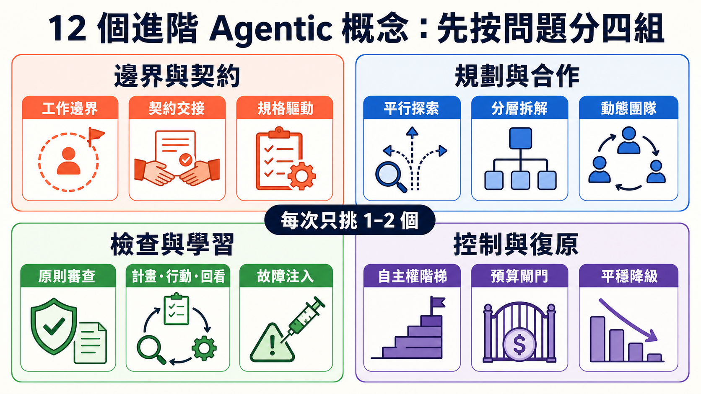
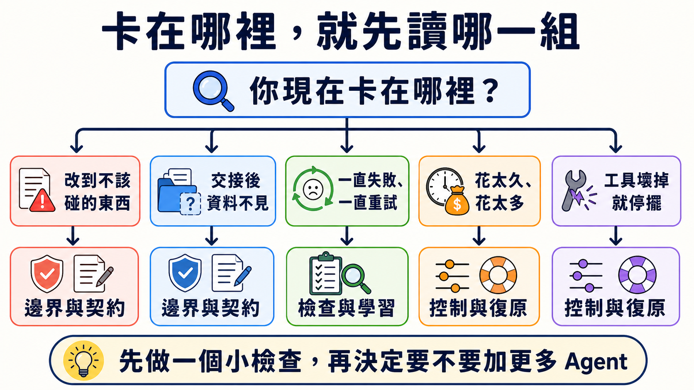
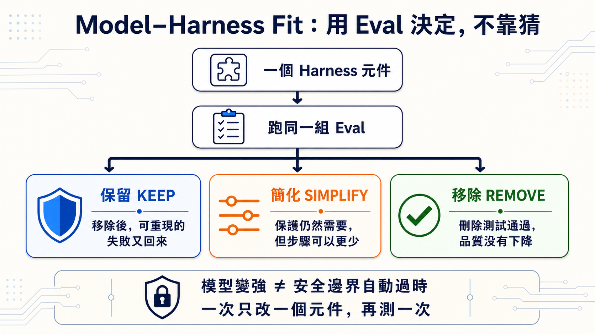

# Stage 7.5 — 進階 Agentic 概念地圖（Advanced Agentic Concepts Map）

> **繁體中文** | [简体中文](./07.5-advanced-agentic-concepts.zh-Hans.md) | [English](./07.5-advanced-agentic-concepts.en.md)

<!-- freshness: canonical=stages/07.5-advanced-agentic-concepts.md; verified_on=2026-08-29; scope=agent-patterns,harnesses,evals,dynamic-workflows,framework-status,research; max_age_days=90 -->

這一關不是要你背完所有新名詞。它像一張地圖：你的 Agent 卡在哪裡，就先看那一小塊。

## 🎯 這一關在做什麼（先定位）

Stage 7 已教你讓 Agent 可以被看見、被測試、出錯時安全停下來。Stage 7.5 再教一件事：

> **遇到新問題時，先找對問題種類，再挑 1–2 個概念。不要把 12 個方法一次全裝上去。**

這章不要求寫程式。你最後只要能畫清楚三條線：Agent **可以做什麼**、**不能做什麼**、**拿什麼證明完成**。

## 📌 學習目標

讀完後，你可以：

1. 用白話解釋六個核心詞。
2. 從 12 個進階概念中挑出眼前真正需要的 1–2 個。
3. 分清「先規劃」「做完回看」「另一個 Agent 評分」不是同一件事。
4. 寫出工作邊界、停止條件與完成證據。

## 🚪 最短進入條件

完成 [Stage 7](07-multi-agent-production.md) 就可以開始。若你跳著讀，至少要做過一個有工具、Eval 與停止條件的 Agent。

<details markdown="1">
<summary>⏱ 展開：時間、先備觀念與閱讀方式</summary>

- **快速看地圖**：約 30 分鐘。先讀核心詞、12 概念表與工作邊界卡。
- **挑一條深讀**：再選 1–2 篇來源，不必把完整資源表讀完。
- **先備觀念**：Agent、Workflow、Handoff、Eval、Observability、Guardrail。忘記時回 [Stage 7 核心詞](07-multi-agent-production.md)。
- **本章不要求**：購買 API、安裝框架、公開模型的私人 Chain-of-Thought。

<small>資料查核：2026-08-28 UTC。</small>

</details>

## 🔑 六個核心詞

| 核心詞 | 五歲也能懂的說法 | 正確意思 |
|---|---|---|
| **Work Boundary（工作邊界）** | 像地上的線：這邊可以玩，那邊不能碰。 | 明確寫出 Agent 可以操作與禁止操作的範圍。 |
| **Contract（契約）** | 像交作業規則：要交什麼、長什麼樣、怎樣算完成。 | 對輸入、輸出、格式、責任與驗收條件的約定。 |
| **Reflection（反思／回看）** | 做完先看證據，再決定要不要修一次。 | 根據可觀察結果評估做法，必要時有界重試。 |
| **Autonomy（自主權）** | 大人讓你自己決定到哪一步。 | Agent 不必逐步詢問就能做決定與採取行動的程度。 |
| **Budget Gate（預算閘門）** | 錢、時間或次數用完，門就關起來。 | Token、費用、時間、工具呼叫或迴圈到上限時停止或升級審核。 |
| **Graceful Degradation（平穩降級）** | 最好的路壞了，就走比較慢但安全的路。 | 主要路徑失敗時，改用能力較少但可預期的替代路徑。 |

> **Reflection 不等於公開私人推理。** 教材只需要看得到計畫、Action、Observation、測試與結果；不要求模型吐出完整內部 Chain-of-Thought。

## 🗺️ 12 個概念：先按問題分四組



這 12 個概念全部保留，但不是待辦清單。先找你卡住的問題，再讀同組的一兩列。

<table>
  <thead>
    <tr><th scope="col">問題群組</th><th scope="col">概念</th><th scope="col">白話定義</th><th scope="col">什麼時候用</th></tr>
  </thead>
  <tbody>
    <tr><th scope="rowgroup" rowspan="3">邊界與契約</th><td><strong>Work Boundary／Scope Discipline</strong></td><td>只動被交代的東西。</td><td>Agent 常順手改到不在任務裡的檔案或資料。</td></tr>
    <tr><td><strong>Contract-driven Hand-off</strong></td><td>交棒時連同清單與驗收規則一起交。</td><td>上游說完成，但下游拿不到需要的 artifact。</td></tr>
    <tr><td><strong>Spec-driven Development</strong></td><td>先寫可檢查的規格，再讓 Agent 動手。</td><td>自由文字太模糊，輸出格式常漂移。</td></tr>
  </tbody>
  <tbody>
    <tr><th scope="rowgroup" rowspan="3">規劃與合作</th><td><strong>Speculative／Parallel Exploration</strong></td><td>同時試幾條互不依賴的路，再比較。</td><td>有多個可能答案，而且探索真的能分開。</td></tr>
    <tr><td><strong>Hierarchical Task Decomposition</strong></td><td>大工作一層一層拆小。</td><td>一個 Agent 或一個 context 放不下整個任務。</td></tr>
    <tr><td><strong>Self-organizing Teams</strong></td><td>角色不是全由人先寫死，而是按任務形成。</td><td>研究與探索很開放；不適合責任必須固定的高風險流程。</td></tr>
  </tbody>
  <tbody>
    <tr><th scope="rowgroup" rowspan="3">檢查與學習</th><td><strong>Agent-as-Judge／Principle-based Review</strong></td><td>另一個 Agent 按明確規則檢查成果。</td><td>結果很難只靠一個 unit test 判斷。</td></tr>
    <tr><td><strong>Plan-Act-Reflect Loop</strong></td><td>先計畫、再做、看證據、最多修幾次。</td><td>同一種失敗一直重來，卻沒有改做法。</td></tr>
    <tr><td><strong>Failure Injection／Chaos Eval</strong></td><td>故意讓一小塊壞掉，看系統會不會安全停。</td><td>要驗證 timeout、舊資料、壞格式或工具失敗。</td></tr>
  </tbody>
  <tbody>
    <tr><th scope="rowgroup" rowspan="3">控制與復原</th><td><strong>Autonomy Gradients／Trust Layers</strong></td><td>不同工作給不同大小的自主權。</td><td>唯讀查詢可自動做，但付款、刪除或發布要人核准。</td></tr>
    <tr><td><strong>Cost-aware Budget Gates</strong></td><td>先寫好錢、時間與輪數的停止線。</td><td>平行 Agent、長迴圈或付費工具可能失控。</td></tr>
    <tr><td><strong>Graceful Degradation</strong></td><td>主要路徑壞掉時，安全地少做一點。</td><td>模型、供應商、工具或資料源暫時不可用。</td></tr>
  </tbody>
</table>

<details markdown="1">
<summary>📚 展開：12 個概念的來源、限制與容易混淆處</summary>

### 邊界與契約

- **Work Boundary／Scope Discipline**：邊界要同時寫進 brief、權限與驗收；只在 prompt 說「不要碰」不等於真的擋住。可對照 [OpenAI Harness Engineering](https://openai.com/index/harness-engineering/) 的機械式架構邊界與 [Claude Code permissions](https://code.claude.com/docs/en/permissions)。
- **Contract-driven Hand-off**：交接至少要有 artifact、狀態、證據與未完成事項。對照 [Anthropic Building Effective Agents](https://www.anthropic.com/engineering/building-effective-agents) 的 routing／orchestrator-workers pattern。
- **Spec-driven Development**：YAML、JSON Schema、typed signature 都可以是規格載體；重點是能驗證，不是迷信某種檔案格式。可看 [DSPy signatures](https://dspy.ai/learn/programming/signatures/)。

### 規劃與合作

- **Speculative／Parallel Exploration**：只平行處理彼此獨立的工作；共享狀態很多時，平行反而增加衝突。可看 Anthropic 的 [parallelization workflow](https://www.anthropic.com/engineering/building-effective-agents)。
- **Hierarchical Task Decomposition**：Supervisor → Worker → Sub-worker 是一種形狀，不代表層數越多越好。新 Microsoft 專案應從 [Microsoft Agent Framework](https://github.com/microsoft/agent-framework) 開始；AutoGen 已進入 maintenance mode。
- **Self-organizing Teams**：CAMEL 等研究探索動態角色形成，但 production 責任、權限與 audit owner 仍要能指出來。原始研究見 [CAMEL](https://arxiv.org/abs/2303.17760)。

### 檢查與學習

- **Agent-as-Judge／Principle-based Review**：Judge 也會錯，必須給 rubric、固定案例、deterministic checks 與人工抽查。**Constitutional AI** 是 Anthropic 的 principle-based training／critique 方法，不等於所有 runtime LLM judge；見 [Constitutional AI paper](https://arxiv.org/abs/2212.08073)。
- **Plan-Act-Reflect Loop**：Reflection 要讀測試、工具回傳或 grader 結果，再改做法；只有「再試一次」仍是 retry。研究入口見 [Reflexion](https://arxiv.org/abs/2303.11366)。
- **Failure Injection／Chaos Eval**：從可復原的小故障開始，不能在真實 production 資料上隨便製造事故。Eval 設計先看 [Anthropic Demystifying Evals](https://www.anthropic.com/engineering/demystifying-evals-for-ai-agents)。

### 控制與復原

- **Autonomy Gradients／Trust Layers**：常見階梯是 suggest → propose → execute。越接近金錢、刪除、發布與外部訊息，越需要明確 approval。
- **Cost-aware Budget Gates**：同時限制 token、美元、時間、輪數與工具呼叫；任一上限到達就停止或請人決定。
- **Graceful Degradation**：替代路徑必須降低承諾，例如只產草稿、不自動發布；不能偷偷換模型後仍宣稱品質完全相同。

</details>

## 🧭 你現在卡在哪裡？



| 你看到的問題 | 先讀哪一組 | 先做的一個小動作 |
|---|---|---|
| Agent 改到不該碰的東西 | 邊界與契約 | 寫出 `可以做／不能做`。 |
| 交給下一個 Agent 後資料不見 | 邊界與契約 | 列出必須交付的 artifact 與證據。 |
| 一直失敗、一直重試 | 檢查與學習 | 把 Observation 與最多重試次數寫進 loop。 |
| 多 Agent 花太久、太貴 | 控制與復原 | 先設費用、時間、輪數與停止條件。 |
| 模型或工具壞掉就整個 crash | 控制與復原 | 寫一條「少做但安全」的 fallback。 |

## 🛠 三分鐘工作邊界卡

直接複製下面四行，換成你的任務：

```text
可以做：只讀取 docs/，整理三個重複段落。
不能做：不改程式、不刪檔、不發布、不碰真實客戶資料。
完成證據：列出檔名、行號與每個判斷的來源。
停止條件：找不到來源、需要寫入，或查了兩輪仍沒有新證據就停下來問人。
```

如果 Agent 不能清楚回答這四行，先不要增加更多 Agent。

## 🔬 遇到需要時才展開的專題

<details markdown="1">
<summary>🧯 展開：三個失敗案例教了什麼</summary>

1. **分工後風格對不上**：Cognition 的 Flappy Bird 案例提醒，多個 subagent 若拿不到共同背景，最後很難拼在一起。來源：[Don’t Build Multi-Agents](https://cognition.ai/blog/dont-build-multi-agents)。
2. **研究 Agent 補進未驗證推測**：Anthropic 的 Research 系統用 source quality、引用與 evaluator 改善這類 speculative leap。來源：[How we built our multi-agent research system](https://www.anthropic.com/engineering/multi-agent-research-system)。
3. **文字規則沒有變成機械防線**：2025-07 的 Replit production database 事件是第三方記錄案例；它適合提醒 permission gate 的重要性，但不代表所有產品或所有版本都會發生相同行為。來源：[AI Incident Database #1152](https://incidentdatabase.ai/cite/1152/) 與 [The Register 報導](https://www.theregister.com/2025/07/21/replit_saastr_vibe_coding_incident/)。

事故不會自動變成最佳實踐。要有人把教訓寫成權限、測試、review 與 recovery gate，系統才真的改變。

</details>

<details markdown="1">
<summary>🧰 展開：Cross-vendor Harness Engineering 重點</summary>

不同供應商沒有共用一套正式的「五原則」命名。下面是本專案依官方資料做的編輯整理：

| 問題 | 可用原則 | 可觀察的實作 |
|---|---|---|
| Agent 找不到正確資料 | **Legibility**、**System of Record**、**Progressive Disclosure** | 小入口、清楚索引、按需讀 deeper docs。 |
| 工具容易被用錯 | **Agent-Computer Interface（ACI）**、typed contract | 清楚 description、schema、allowlist、拒絕危險預設。 |
| 輸出會漂移 | **Invariant**、Evaluator–Optimizer | lint、test、rubric、修正次數上限。 |
| Agent 太多、流程太重 | **Simplicity** | 先用最簡單能完成任務的形狀，再用 Eval 證明需要加層。 |
| 人類 review 跟不上 | **Risk-based review** | 低風險自動 gate；高風險仍需要 owner 與人工核准。 |

OpenAI 的 `Types → Config → Repo → Service → Runtime → UI` 是 Harness Engineering 文章中某個產品 codebase 的架構例子，不是所有 Agent 的唯一 stack。真正可帶走的是：**邊界要能被機器檢查**。

推薦對照：[OpenAI Harness Engineering](https://openai.com/index/harness-engineering/)、[Anthropic Building Effective Agents](https://www.anthropic.com/engineering/building-effective-agents)、[Effective Context Engineering](https://www.anthropic.com/engineering/effective-context-engineering-for-ai-agents)。

</details>

<details markdown="1">
<summary>🧑‍💻 展開：Coding Agent 的 Harness 多了什麼</summary>

Coding Agent 不只回答文字，它會改檔、跑命令、留下可執行結果，因此多三個邊界：

| 邊界 | 為什麼需要 | 對照章節 |
|---|---|---|
| Repo 狀態與 diff | 要知道改了什麼，也要能回復。 | [Stage 5](05-claude-code-ecosystem.md) |
| 隔離的執行環境 | 新程式要真的跑，但不能污染 host。 | [Stage 8](08-agent-interfaces.md) |
| 長任務的 artifact 交接 | 新 session 要知道上一段做到哪裡。 | [Stage 7](07-multi-agent-production.md) |

OpenAI Agents SDK 的 Sandbox Agents 已把 workspace、manifest、session、snapshot 與 sandbox client 放進同一套 API，但截至查核日仍標示 **Beta**。Beta 可以學，不等於所有介面已固定。官方入口：[Sandbox Agents concepts](https://openai.github.io/openai-agents-python/sandbox/guide/)。

</details>

<details markdown="1">
<summary>⚖️ 展開：怎麼讀 Agent benchmark，才不會被單一分數騙</summary>

Agent benchmark 測到的不只模型，也測到 prompt、tool、harness、硬體、timeout 與 grader。比較時至少做到：

1. 固定 task、scaffold、工具、資料與環境。
2. 重跑多次，報平均、變異或 pass^k，不只挑最好的一次。
3. 把 infrastructure error 和 Agent 解題失敗分開。
4. 用 held-out cases 防止只對已知題目調參。
5. Judge 搭配 deterministic checks 與人工抽樣，不讓一個 LLM 自己決定真相。

Anthropic 2026 的研究直接顯示，基礎設施差異可能大到超過排行榜模型間的差距；因此小幅領先不等於穩定較強。來源：[Quantifying infrastructure noise in agentic coding evals](https://www.anthropic.com/engineering/infrastructure-noise) 與 [Demystifying Evals](https://www.anthropic.com/engineering/demystifying-evals-for-ai-agents)。

</details>

<a id="-dynamic-workflowsopus-48-當-agent-自己寫出-workflow"></a>

### 🔀 Dynamic Workflows — 當 Agent 把分工寫成可重跑的 script

它是 Claude Code 的 Agent orchestration 功能，不是模型，也不是 OpenRouter、Airflow 或 n8n 的替代品。

<details markdown="1">
<summary>展開：現行版本、機制、限制與安全邊界</summary>

- **目前條件**：Claude Code v2.1.154+；現行官方文件列出所有付費方案、Anthropic API，以及 Amazon Bedrock、Google Cloud Agent Platform、Microsoft Foundry。Pro 可從 `/config` 啟用。
- **怎麼運作**：Claude 產生 JavaScript orchestration script，由背景 runtime 執行；中間結果留在 script 變數，最後結果才回到對話 context。
- **怎麼啟動**：明確要求 `use a workflow`／`run a workflow`，或使用 `ultracode`。`/effort ultracode` 需要 v2.1.203+ 且模型支援 `xhigh` effort。
- **現行上限**：最多 16 個 concurrent agents、每次 run 累計 1,000 個。這是防 runaway 的上限，不是建議你每次都用滿。
- **安全邊界**：subagent 的工具仍受 permission 與 sandbox 規則約束；workflow 本身沒有任意 shell／filesystem access。長 run 會用更多 token，啟動前仍要看 phase 與成本。
- **限制**：run 中不能插入一般使用者輸入；共享狀態很多或只需一個 Agent 的工作，不適合 fan out。

2026-05-28 的發布公告把它稱為 research preview，並和 Opus 4.8 同日公布；這只是一段歷史，不代表今天綁定 Opus 4.8。現行規則以 [Dynamic Workflows docs](https://code.claude.com/docs/en/workflows) 為準。

</details>

## ⚖️ Model–Harness Fit：用 Eval 決定保留、簡化或移除

這一節才回答「Harness 裡某個零件會不會過時」。它不是 Loop Engineering 的定義，也不是用 Loop 取代整個 Harness。

模型變強時，某個 prompt 補丁、context reset 或額外規劃步驟可能不再需要；但權限、sandbox、log、Eval、人工核准與 recovery 代表長期責任，**不會因模型升級就自動消失**。一次只拿一個 Harness 元件做刪除測試，再跑同一組品質與安全 Eval。



| 決定 | 你看到什麼 | 下一步 |
|---|---|---|
| **保留 Keep** | 拿掉後，同一個可重現失敗又回來 | 放回去，記下它防住哪個失敗 |
| **簡化 Simplify** | 保護還有用，但較少步驟也能通過同一組 Eval | 一次少一個步驟，再測一次 |
| **移除 Remove** | 刪除測試通過，品質與安全沒有退步 | 移除後繼續監測，保留回復方法 |

| 先分哪一類 | 例子 | 怎麼處理 |
|---|---|---|
| **模型補強元件** | context reset、重複提醒 prompt、額外 planner／reviewer | 模型變更時可做刪除測試；用同一組 Eval 決定保留、簡化或移除 |
| **長期安全責任** | 最小權限、sandbox、audit log、人工核准、rollback | 實作可以換，但責任不能靠「模型變強」直接刪除 |

<details markdown="1">
<summary>⏳ 展開：判斷證據、Bitter Lesson 與人機分工</summary>

**Model–Harness Fit** 是本章使用的編輯簡稱，不是公認標準。Harness 常在補某一代模型的弱點；模型變強後，舊補丁可能變成阻力。每加一層，問三件事：

1. 哪個可重現的失敗證明需要它？
2. 哪個 Eval 證明加上後真的變好？
3. 哪個刪除測試能告訴我們它已經不需要？

這和 Rich Sutton 的 [The Bitter Lesson](http://www.incompleteideas.net/IncIdeas/BitterLesson.html) 相呼應，但不是由該文章直接提出的 Agent Harness 定律。

Anthropic 對 2025-10 到 2026-04 Claude Code 使用資料的分析，平均觀察到使用者做約 70% planning decisions，而 Claude 做約 80% execution decisions。這是特定產品與資料集的觀察，不是每個團隊都應硬套的比例。可帶走的只有一句：**人負責目的、邊界與驗收；Agent 負責範圍內的執行。**來源：[How Claude Code is used in practice](https://www.anthropic.com/research/claude-code-expertise)。

</details>

## 🎯 精選閱讀：先挑一條

1. [Anthropic — Building Effective Agents](https://www.anthropic.com/engineering/building-effective-agents) ⭐⭐⭐⭐⭐：第一次讀進階 Agent pattern，先從這篇開始。
2. [OpenAI — Harness Engineering](https://openai.com/index/harness-engineering/) ⭐⭐⭐⭐⭐：看邊界、文件與機械 gate 怎麼放進真實 codebase。
3. [Anthropic — Demystifying Evals for AI Agents](https://www.anthropic.com/engineering/demystifying-evals-for-ai-agents) ⭐⭐⭐⭐⭐：想知道怎麼驗收 Agent，先讀這篇。
4. [Microsoft Agent Framework](https://github.com/microsoft/agent-framework) ⭐⭐⭐⭐⭐：要看現行 Microsoft multi-agent／workflow 實作；不要從 maintenance-mode AutoGen 開新專案。
5. [datawhalechina/hello-agents](https://github.com/datawhalechina/hello-agents) ⭐⭐⭐⭐⭐：想用中文把概念接到完整實作。

## 📚 完整學習資源與限制

<table>
  <thead>
    <tr><th scope="col">分類</th><th scope="col">資源</th><th scope="col">適合讀什麼</th><th scope="col">編輯評分</th><th scope="col">限制／狀態</th></tr>
  </thead>
  <tbody>
    <tr><th scope="rowgroup" rowspan="5">基本設計與 Context</th><td><a href="https://www.anthropic.com/engineering/building-effective-agents">Anthropic — Building Effective Agents</a></td><td>Workflow、Agent 與常用 pattern</td><td>⭐⭐⭐⭐⭐</td><td>2024 foundation；不是最新產品清單</td></tr>
    <tr><td><a href="https://www.anthropic.com/engineering/effective-context-engineering-for-ai-agents">Effective Context Engineering</a></td><td>怎麼挑 context，不把視窗塞滿</td><td>⭐⭐⭐⭐⭐</td><td>供應商文章；原則可跨模型使用</td></tr>
    <tr><td><a href="https://openai.com/index/harness-engineering/">OpenAI Harness Engineering</a></td><td>可讀 codebase、SoR、invariant</td><td>⭐⭐⭐⭐⭐</td><td>單一 OpenAI codebase case study</td></tr>
    <tr><td><a href="https://www.anthropic.com/engineering/effective-harnesses-for-long-running-agents">Effective Harnesses for Long-running Agents</a></td><td>跨 session artifact 與增量進度</td><td>⭐⭐⭐⭐</td><td>特定 coding harness 實驗</td></tr>
    <tr><td><a href="https://www.anthropic.com/engineering/harness-design-long-running-apps">Harness Design for Long-running Apps</a></td><td>Planner／Generator／Evaluator</td><td>⭐⭐⭐⭐</td><td>2026 Labs case study，不是唯一架構</td></tr>
  </tbody>
  <tbody>
    <tr><th scope="rowgroup" rowspan="5">Orchestration／Contracts</th><td><a href="https://www.anthropic.com/engineering/multi-agent-research-system">Anthropic Multi-Agent Research System</a></td><td>Orchestrator-workers production lessons</td><td>⭐⭐⭐⭐⭐</td><td>最適合 breadth-first research；token 開銷高</td></tr>
    <tr><td><a href="https://github.com/langchain-ai/langgraph">LangGraph</a></td><td>Stateful graph、checkpoint、HITL</td><td>⭐⭐⭐⭐</td><td>低階框架；要自己設計 state 與 Eval</td></tr>
    <tr><td><a href="https://github.com/microsoft/agent-framework">Microsoft Agent Framework</a></td><td>Python／.NET Agent 與 workflow</td><td>⭐⭐⭐⭐⭐</td><td>AutoGen／Semantic Kernel 的現行後繼入口</td></tr>
    <tr><td><a href="https://openai.github.io/openai-agents-python/sandbox/guide/">OpenAI Agents SDK Sandbox Agents</a></td><td>Workspace、session、snapshot、sandbox</td><td>⭐⭐⭐⭐</td><td><strong>Beta</strong>；介面仍可能變</td></tr>
    <tr><td><a href="https://code.claude.com/docs/en/workflows">Claude Code Dynamic Workflows</a></td><td>Agent-authored、可重跑的 orchestration</td><td>⭐⭐⭐⭐</td><td>Claude Code 功能；高 token、非通用 workflow engine</td></tr>
  </tbody>
  <tbody>
    <tr><th scope="rowgroup" rowspan="5">Eval／Resilience</th><td><a href="https://www.anthropic.com/engineering/demystifying-evals-for-ai-agents">Demystifying Evals for AI Agents</a></td><td>Capability、regression 與 transcript Eval</td><td>⭐⭐⭐⭐⭐</td><td>先從小而能重現的 failure set 開始</td></tr>
    <tr><td><a href="https://www.anthropic.com/engineering/infrastructure-noise">Infrastructure Noise in Agentic Evals</a></td><td>硬體與環境如何扭曲分數</td><td>⭐⭐⭐⭐</td><td>特定 benchmark 實驗；不要外推精確幅度</td></tr>
    <tr><td><a href="https://arxiv.org/abs/2507.02825">Best Practices for Rigorous Agentic Benchmarks</a></td><td>Task、reward 與環境設計缺陷</td><td>⭐⭐⭐⭐</td><td>研究 paper；需搭配 benchmark 現行版本</td></tr>
    <tr><td><a href="https://github.com/sierra-research/tau2-bench">tau2-bench</a></td><td>Tool-Agent-User interaction 與 pass^k</td><td>⭐⭐⭐⭐</td><td>Benchmark 不是 production SLA</td></tr>
    <tr><td><a href="https://github.com/SWE-bench/SWE-bench">SWE-bench</a></td><td>真實 GitHub issue 的 coding Eval</td><td>⭐⭐⭐⭐⭐</td><td>分數受 harness、版本與環境影響</td></tr>
  </tbody>
  <tbody>
    <tr><th scope="rowgroup" rowspan="5">Research patterns</th><td><a href="https://arxiv.org/abs/2210.03629">ReAct</a></td><td>Reasoning／Action／Observation loop</td><td>⭐⭐⭐⭐⭐</td><td>教可觀察行動，不要求公開私人 CoT</td></tr>
    <tr><td><a href="https://arxiv.org/abs/2303.11366">Reflexion</a></td><td>Feedback 後修正策略</td><td>⭐⭐⭐⭐</td><td>研究設定不等於每個 production loop</td></tr>
    <tr><td><a href="https://arxiv.org/abs/2212.08073">Constitutional AI</a></td><td>Principle-based critique 與 revision</td><td>⭐⭐⭐⭐</td><td>訓練方法；不能直接等同 LLM-as-judge</td></tr>
    <tr><td><a href="https://arxiv.org/abs/2303.17760">CAMEL</a></td><td>Role-playing multi-agent research</td><td>⭐⭐⭐</td><td>研究原型；高風險責任仍需固定 owner</td></tr>
    <tr><td><a href="https://github.com/stanfordnlp/dspy">DSPy</a></td><td>Typed signatures、program optimization</td><td>⭐⭐⭐⭐</td><td>框架持續更新；先鎖版本與 Eval</td></tr>
  </tbody>
  <tbody>
    <tr><th scope="rowgroup" rowspan="4">中文／動手入口</th><td><a href="https://github.com/datawhalechina/hello-agents">datawhalechina/hello-agents</a></td><td>中文完整 Agent 教材</td><td>⭐⭐⭐⭐⭐</td><td>篇幅長；按本章概念挑章節</td></tr>
    <tr><td><a href="https://github.com/microsoft/ai-agents-for-beginners">Microsoft AI Agents for Beginners</a></td><td>18 課 Agent 入門與多語教材</td><td>⭐⭐⭐⭐</td><td>供應商範例較多；先看概念再選 SDK</td></tr>
    <tr><td><a href="https://github.com/langchain-ai/deepagents">LangChain Deep Agents</a></td><td>Planning、subagent、filesystem harness</td><td>⭐⭐⭐⭐</td><td>較高階抽象；不是所有任務都需要</td></tr>
    <tr><td><a href="https://speech.ee.ntu.edu.tw/~hylee/">李宏毅生成式 AI 課程</a></td><td>中文課程與研究背景</td><td>⭐⭐⭐⭐⭐</td><td>依年份挑主題；產品介面仍查官方 docs</td></tr>
  </tbody>
</table>

## ✅ 自我檢查

- [ ] 我能用自己的話解釋六個核心詞。
- [ ] 我知道 12 個概念分成哪四組，但不會一次全裝。
- [ ] 我能寫出 `可以做／不能做／完成證據／停止條件`。
- [ ] 我知道 Reflection 要讀證據，LLM judge 也要被檢查。
- [ ] 我能說出主要路徑壞掉時，安全 fallback 會少做什麼。

五項都能做到，就進入 [Stage 8 — Agent 操作介面](08-agent-interfaces.md)：學 Agent 怎麼安全操作 Browser、Computer 與 Code Sandbox。
