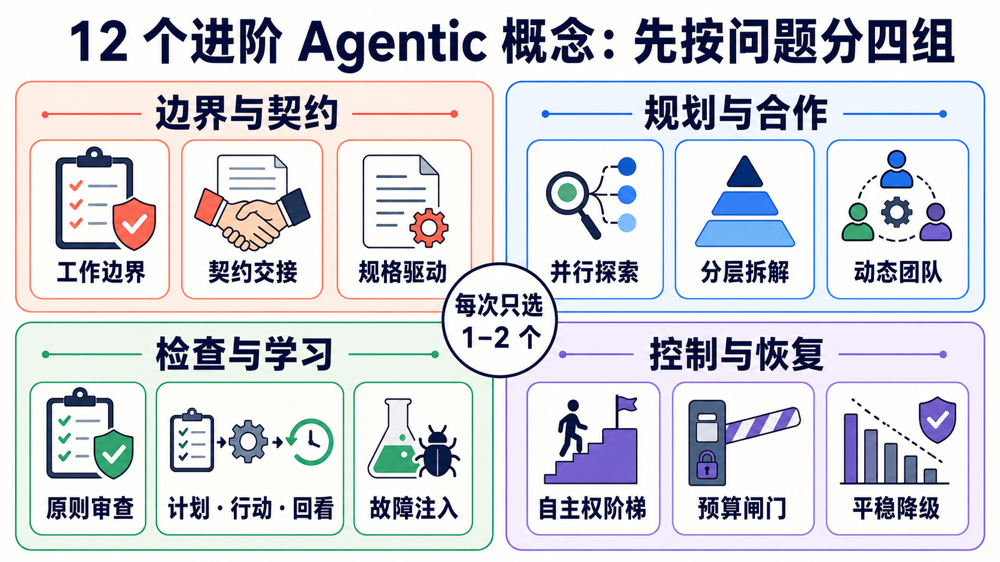
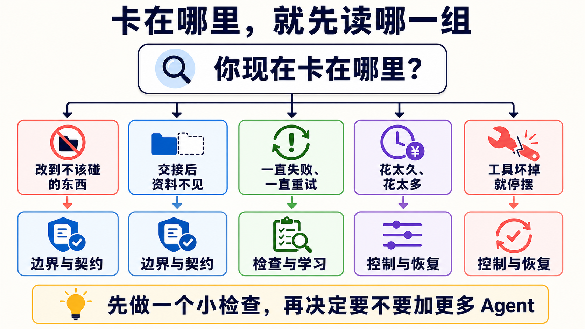
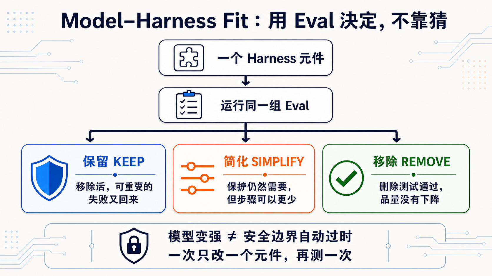

# Stage 7.5 — 进阶 Agentic 概念地图（Advanced Agentic Concepts Map）

> [繁體中文](./07.5-advanced-agentic-concepts.md) | **简体中文** | [English](./07.5-advanced-agentic-concepts.en.md)

<!-- freshness: canonical=stages/07.5-advanced-agentic-concepts.md; verified_on=2026-08-29; scope=agent-patterns,harnesses,evals,dynamic-workflows,framework-status,research; max_age_days=90 -->

这一关不是要你背完所有新名词。它像一张地图：你的 Agent 卡在哪里，就先看那一小块。

## 🎯 这一关在做什么（先定位）

Stage 7 已教你让 Agent 可以被看见、被测试、出错时安全停下来。Stage 7.5 再教一件事：

> **遇到新问题时，先找对问题种类，再挑 1–2 个概念。不要把 12 个方法一次全装上去。**

这章不要求写程序。你最后只要能画清楚三条线：Agent **可以做什么**、**不能做什么**、**拿什么证明完成**。

## 📌 学习目标

读完后，你可以：

1. 用白话解释六个核心词。
2. 从 12 个进阶概念中挑出眼前真正需要的 1–2 个。
3. 分清“先规划”“做完回看”“另一个 Agent 评分”不是同一件事。
4. 写出工作边界、停止条件与完成证据。

## 🚪 最短进入条件

完成 [Stage 7](07-multi-agent-production.zh-Hans.md) 就可以开始。若你跳着读，至少要做过一个有工具、Eval 与停止条件的 Agent。

<details markdown="1">
<summary>⏱ 展开：时间、先备观念与阅读方式</summary>

- **快速看地图**：约 30 分钟。先读核心词、12 概念表与工作边界卡。
- **挑一条深读**：再选 1–2 篇来源，不必把完整资源表读完。
- **先备观念**：Agent、Workflow、Handoff、Eval、Observability、Guardrail。忘记时回 [Stage 7 核心词](07-multi-agent-production.zh-Hans.md)。
- **本章不要求**：购买 API、安装框架、公开模型的私人 Chain-of-Thought。

<small>资料查核：2026-08-28 UTC。</small>

</details>

## 🔑 六个核心词

| 核心词 | 五岁也能懂的说法 | 正确意思 |
|---|---|---|
| **Work Boundary（工作边界）** | 像地上的线：这边可以玩，那边不能碰。 | 明确写出 Agent 可以操作与禁止操作的范围。 |
| **Contract（契约）** | 像交作业规则：要交什么、长什么样、怎样算完成。 | 对输入、输出、格式、责任与验收条件的约定。 |
| **Reflection（反思／回看）** | 做完先看证据，再决定要不要修一次。 | 根据可观察结果评估做法，必要时有界重试。 |
| **Autonomy（自主权）** | 大人让你自己决定到哪一步。 | Agent 不必逐步询问就能做决定与采取行动的程度。 |
| **Budget Gate（预算闸门）** | 钱、时间或次数用完，门就关起来。 | Token、费用、时间、工具调用或循环到上限时停止或升级审核。 |
| **Graceful Degradation（平稳降级）** | 最好的路坏了，就走比较慢但安全的路。 | 主要路径失败时，改用能力较少但可预期的替代路径。 |

> **Reflection 不等于公开私人推理。** 教材只需要看得到计划、Action、Observation、测试与结果；不要求模型吐出完整内部 Chain-of-Thought。

## 🗺️ 12 个概念：先按问题分四组



这 12 个概念全部保留，但不是待办清单。先找你卡住的问题，再读同组的一两列。

<table>
  <thead>
    <tr><th scope="col">问题群组</th><th scope="col">概念</th><th scope="col">白话定义</th><th scope="col">什么时候用</th></tr>
  </thead>
  <tbody>
    <tr><th scope="rowgroup" rowspan="3">边界与契约</th><td><strong>Work Boundary／Scope Discipline</strong></td><td>只动被交代的东西。</td><td>Agent 常顺手改到不在任务里的文件或资料。</td></tr>
    <tr><td><strong>Contract-driven Hand-off</strong></td><td>交棒时连同清单与验收规则一起交。</td><td>上游说完成，但下游拿不到需要的 artifact。</td></tr>
    <tr><td><strong>Spec-driven Development</strong></td><td>先写可检查的规格，再让 Agent 动手。</td><td>自由文字太模糊，输出格式常漂移。</td></tr>
  </tbody>
  <tbody>
    <tr><th scope="rowgroup" rowspan="3">规划与合作</th><td><strong>Speculative／Parallel Exploration</strong></td><td>同时试几条互不依赖的路，再比较。</td><td>有多个可能答案，而且探索真的能分开。</td></tr>
    <tr><td><strong>Hierarchical Task Decomposition</strong></td><td>大工作一层一层拆小。</td><td>一个 Agent 或一个 context 放不下整个任务。</td></tr>
    <tr><td><strong>Self-organizing Teams</strong></td><td>角色不是全由人先写死，而是按任务形成。</td><td>研究与探索很开放；不适合责任必须固定的高风险流程。</td></tr>
  </tbody>
  <tbody>
    <tr><th scope="rowgroup" rowspan="3">检查与学习</th><td><strong>Agent-as-Judge／Principle-based Review</strong></td><td>另一个 Agent 按明确规则检查成果。</td><td>结果很难只靠一个 unit test 判断。</td></tr>
    <tr><td><strong>Plan-Act-Reflect Loop</strong></td><td>先计划、再做、看证据、最多修几次。</td><td>同一种失败一直重来，却没有改做法。</td></tr>
    <tr><td><strong>Failure Injection／Chaos Eval</strong></td><td>故意让一小块坏掉，看系统会不会安全停。</td><td>要验证 timeout、旧资料、坏格式或工具失败。</td></tr>
  </tbody>
  <tbody>
    <tr><th scope="rowgroup" rowspan="3">控制与复原</th><td><strong>Autonomy Gradients／Trust Layers</strong></td><td>不同工作给不同大小的自主权。</td><td>只读查询可自动做，但付款、删除或发布要人批准。</td></tr>
    <tr><td><strong>Cost-aware Budget Gates</strong></td><td>先写好钱、时间与轮数的停止线。</td><td>并行 Agent、长循环或付费工具可能失控。</td></tr>
    <tr><td><strong>Graceful Degradation</strong></td><td>主要路径坏掉时，安全地少做一点。</td><td>模型、供应商、工具或资料源暂时不可用。</td></tr>
  </tbody>
</table>

<details markdown="1">
<summary>📚 展开：12 个概念的来源、限制与容易混淆处</summary>

### 边界与契约

- **Work Boundary／Scope Discipline**：边界要同时写进 brief、权限与验收；只在 prompt 说“不要碰”不等于真的挡住。可对照 [OpenAI Harness Engineering](https://openai.com/index/harness-engineering/) 的机械式架构边界与 [Claude Code permissions](https://code.claude.com/docs/en/permissions)。
- **Contract-driven Hand-off**：交接至少要有 artifact、状态、证据与未完成事项。对照 [Anthropic Building Effective Agents](https://www.anthropic.com/engineering/building-effective-agents) 的 routing／orchestrator-workers pattern。
- **Spec-driven Development**：YAML、JSON Schema、typed signature 都可以是规格载体；重点是能验证，不是迷信某种文件格式。可看 [DSPy signatures](https://dspy.ai/learn/programming/signatures/)。

### 规划与合作

- **Speculative／Parallel Exploration**：只平行处理彼此独立的工作；共享状态很多时，平行反而增加冲突。可看 Anthropic 的 [parallelization workflow](https://www.anthropic.com/engineering/building-effective-agents)。
- **Hierarchical Task Decomposition**：Supervisor → Worker → Sub-worker 是一种形状，不代表层数越多越好。新 Microsoft 专案应从 [Microsoft Agent Framework](https://github.com/microsoft/agent-framework) 开始；AutoGen 已进入 maintenance mode。
- **Self-organizing Teams**：CAMEL 等研究探索动态角色形成，但 production 责任、权限与 audit owner 仍要能指出来。原始研究见 [CAMEL](https://arxiv.org/abs/2303.17760)。

### 检查与学习

- **Agent-as-Judge／Principle-based Review**：Judge 也会错，必须给 rubric、固定案例、deterministic checks 与人工抽查。**Constitutional AI** 是 Anthropic 的 principle-based training／critique 方法，不等于所有 runtime LLM judge；见 [Constitutional AI paper](https://arxiv.org/abs/2212.08073)。
- **Plan-Act-Reflect Loop**：Reflection 要读测试、工具回传或 grader 结果，再改做法；只有“再试一次”仍是 retry。研究入口见 [Reflexion](https://arxiv.org/abs/2303.11366)。
- **Failure Injection／Chaos Eval**：从可复原的小故障开始，不能在真实 production 资料上随便制造事故。Eval 设计先看 [Anthropic Demystifying Evals](https://www.anthropic.com/engineering/demystifying-evals-for-ai-agents)。

### 控制与复原

- **Autonomy Gradients／Trust Layers**：常见阶梯是 suggest → propose → execute。越接近金钱、删除、发布与外部讯息，越需要明确 approval。
- **Cost-aware Budget Gates**：同时限制 token、美元、时间、轮数与工具调用；任一上限到达就停止或请人决定。
- **Graceful Degradation**：替代路径必须降低承诺，例如只产草稿、不自动发布；不能偷偷换模型后仍宣称质量完全相同。

</details>

## 🧭 你现在卡在哪里？



| 你看到的问题 | 先读哪一组 | 先做的一个小动作 |
|---|---|---|
| Agent 改到不该碰的东西 | 边界与契约 | 写出 `可以做／不能做`。 |
| 交给下一个 Agent 后资料不见 | 边界与契约 | 列出必须交付的 artifact 与证据。 |
| 一直失败、一直重试 | 检查与学习 | 把 Observation 与最多重试次数写进 loop。 |
| 多 Agent 花太久、太贵 | 控制与复原 | 先设费用、时间、轮数与停止条件。 |
| 模型或工具坏掉就整个 crash | 控制与复原 | 写一条“少做但安全”的 fallback。 |

## 🛠 三分钟工作边界卡

直接复制下面四行，换成你的任务：

```text
可以做：只读取 docs/，整理三个重复段落。
不能做：不改程序、不删除文件、不发布、不碰真实客户数据。
完成证据：列出档名、行号与每个判断的来源。
停止条件：找不到来源、需要写入，或查了两轮仍没有新证据就停下来问人。
```

如果 Agent 不能清楚回答这四行，先不要增加更多 Agent。

## 🔬 遇到需要时才展开的专题

<details markdown="1">
<summary>🧯 展开：三个失败案例教了什么</summary>

1. **分工后风格对不上**：Cognition 的 Flappy Bird 案例提醒，多个 subagent 若拿不到共同背景，最后很难拼在一起。来源：[Don’t Build Multi-Agents](https://cognition.ai/blog/dont-build-multi-agents)。
2. **研究 Agent 补进未验证推测**：Anthropic 的 Research 系统用 source quality、引用与 evaluator 改善这类 speculative leap。来源：[How we built our multi-agent research system](https://www.anthropic.com/engineering/multi-agent-research-system)。
3. **文字规则没有变成机械防线**：2025-07 的 Replit production database 事件是第三方记录案例；它适合提醒 permission gate 的重要性，但不代表所有产品或所有版本都会发生相同行为。来源：[AI Incident Database #1152](https://incidentdatabase.ai/cite/1152/) 与 [The Register 报导](https://www.theregister.com/2025/07/21/replit_saastr_vibe_coding_incident/)。

事故不会自动变成最佳实践。要有人把教训写成权限、测试、review 与 recovery gate，系统才真的改变。

</details>

<details markdown="1">
<summary>🧰 展开：Cross-vendor Harness Engineering 重点</summary>

不同供应商没有共用一套正式的“五原则”命名。下面是本专案依官方资料做的编辑整理：

| 问题 | 可用原则 | 可观察的实作 |
|---|---|---|
| Agent 找不到正确资料 | **Legibility**、**System of Record**、**Progressive Disclosure** | 小入口、清楚索引、按需读 deeper docs。 |
| 工具容易被用错 | **Agent-Computer Interface（ACI）**、typed contract | 清楚 description、schema、allowlist、拒绝危险预设。 |
| 输出会漂移 | **Invariant**、Evaluator–Optimizer | lint、test、rubric、修正次数上限。 |
| Agent 太多、流程太重 | **Simplicity** | 先用最简单能完成任务的形状，再用 Eval 证明需要加层。 |
| 人类 review 跟不上 | **Risk-based review** | 低风险自动 gate；高风险仍需要 owner 与人工批准。 |

OpenAI 的 `Types → Config → Repo → Service → Runtime → UI` 是 Harness Engineering 文章中某个产品 codebase 的架构例子，不是所有 Agent 的唯一 stack。真正可带走的是：**边界要能被机器检查**。

推荐对照：[OpenAI Harness Engineering](https://openai.com/index/harness-engineering/)、[Anthropic Building Effective Agents](https://www.anthropic.com/engineering/building-effective-agents)、[Effective Context Engineering](https://www.anthropic.com/engineering/effective-context-engineering-for-ai-agents)。

</details>

<details markdown="1">
<summary>🧑‍💻 展开：Coding Agent 的 Harness 多了什么</summary>

Coding Agent 不只回答文字，它会改档、跑命令、留下可执行结果，因此多三个边界：

| 边界 | 为什么需要 | 对照章节 |
|---|---|---|
| Repo 状态与 diff | 要知道改了什么，也要能恢复。 | [Stage 5](05-claude-code-ecosystem.zh-Hans.md) |
| 隔离的执行环境 | 新程序要真的跑，但不能污染 host。 | [Stage 8](08-agent-interfaces.zh-Hans.md) |
| 长任务的 artifact 交接 | 新 session 要知道上一段做到哪里。 | [Stage 7](07-multi-agent-production.zh-Hans.md) |

OpenAI Agents SDK 的 Sandbox Agents 已把 workspace、manifest、session、snapshot 与 sandbox client 放进同一套 API，但截至查核日仍标示 **Beta**。Beta 可以学，不等于所有接口已固定。官方入口：[Sandbox Agents concepts](https://openai.github.io/openai-agents-python/sandbox/guide/)。

</details>

<details markdown="1">
<summary>⚖️ 展开：怎么读 Agent benchmark，才不会被单一分数骗</summary>

Agent benchmark 测到的不只模型，也测到 prompt、tool、harness、硬体、timeout 与 grader。比较时至少做到：

1. 固定 task、scaffold、工具、资料与环境。
2. 重跑多次，报平均、变异或 pass^k，不只挑最好的一次。
3. 把 infrastructure error 和 Agent 解题失败分开。
4. 用 held-out cases 防止只对已知题目调参。
5. Judge 搭配 deterministic checks 与人工抽样，不让一个 LLM 自己决定真相。

Anthropic 2026 的研究直接显示，基础设施差异可能大到超过排行榜模型间的差距；因此小幅领先不等于稳定较强。来源：[Quantifying infrastructure noise in agentic coding evals](https://www.anthropic.com/engineering/infrastructure-noise) 与 [Demystifying Evals](https://www.anthropic.com/engineering/demystifying-evals-for-ai-agents)。

</details>

<a id="-dynamic-workflowsopus-48-当-agent-自己写出-workflow"></a>

### 🔀 Dynamic Workflows — 当 Agent 把分工写成可重跑的 script

它是 Claude Code 的 Agent orchestration 功能，不是模型，也不是 OpenRouter、Airflow 或 n8n 的替代品。

<details markdown="1">
<summary>展开：现行版本、机制、限制与安全边界</summary>

- **目前条件**：Claude Code v2.1.154+；现行官方文件列出所有付费方案、Anthropic API，以及 Amazon Bedrock、Google Cloud Agent Platform、Microsoft Foundry。Pro 可从 `/config` 启用。
- **怎么运作**：Claude 产生 JavaScript orchestration script，由背景 runtime 执行；中间结果留在 script 变数，最后结果才回到对话 context。
- **怎么启动**：明确要求 `use a workflow`／`run a workflow`，或使用 `ultracode`。`/effort ultracode` 需要 v2.1.203+ 且模型支援 `xhigh` effort。
- **现行上限**：最多 16 个 concurrent agents、每次 run 累计 1,000 个。这是防 runaway 的上限，不是建议你每次都用满。
- **安全边界**：subagent 的工具仍受 permission 与 sandbox 规则约束；workflow 本身没有任意 shell／filesystem access。长 run 会用更多 token，启动前仍要看 phase 与成本。
- **限制**：run 中不能插入一般用户输入；共享状态很多或只需一个 Agent 的工作，不适合 fan out。

2026-05-28 的发布公告把它称为 research preview，并和 Opus 4.8 同日公布；这只是一段历史，不代表今天绑定 Opus 4.8。现行规则以 [Dynamic Workflows docs](https://code.claude.com/docs/en/workflows) 为准。

</details>

## ⚖️ Model–Harness Fit：用 Eval 决定保留、简化或移除

这一节才回答“一个 Harness 零件会不会过时”。它不是 Loop Engineering 的定义，也不是用 Loop 取代整个 Harness。

模型变强时，某个 prompt 补丁、context reset 或额外规划步骤可能不再需要；但权限、sandbox、log、Eval、人工批准和 recovery 代表长期责任，**不会因为模型升级就自动消失**。一次只拿一个 Harness 元件做删除测试，再运行同一组质量和安全 Eval。



| 决定 | 你看到什么 | 下一步 |
|---|---|---|
| **保留 Keep** | 拿掉后，同一个可重复的失败又回来 | 放回去，记下它防住哪个失败 |
| **简化 Simplify** | 保护仍有用，但更少步骤也能通过同一组 Eval | 一次减少一个步骤，再测试一次 |
| **移除 Remove** | 删除测试通过，质量和安全没有退步 | 移除后继续监测，保留恢复方法 |

| 先分哪一类 | 例子 | 怎么处理 |
|---|---|---|
| **模型补强元件** | context reset、重复提醒 prompt、额外 planner／reviewer | 模型变化时可以做删除测试；用同一组 Eval 决定保留、简化或移除 |
| **长期安全责任** | 最小权限、sandbox、audit log、人工批准、rollback | 实现可以换，但不能只因为“模型变强”就删除责任 |

<details markdown="1">
<summary>⏳ 展开：判断证据、Bitter Lesson 与人机分工</summary>

**Model–Harness Fit** 是本章使用的编辑简称，不是公认标准。Harness 常在补某一代模型的弱点；模型变强后，旧补丁可能变成阻力。每加一层，问三件事：

1. 哪个可重现的失败证明需要它？
2. 哪个 Eval 证明加上后真的变好？
3. 哪个删除测试能告诉我们它已经不需要？

这和 Rich Sutton 的 [The Bitter Lesson](http://www.incompleteideas.net/IncIdeas/BitterLesson.html) 相呼应，但不是由该文章直接提出的 Agent Harness 定律。

Anthropic 对 2025-10 到 2026-04 Claude Code 使用资料的分析，平均观察到用户做约 70% planning decisions，而 Claude 做约 80% execution decisions。这是特定产品与资料集的观察，不是每个团队都应硬套的比例。可带走的只有一句：**人负责目的、边界与验收；Agent 负责范围内的执行。**来源：[How Claude Code is used in practice](https://www.anthropic.com/research/claude-code-expertise)。

</details>

## 🎯 精选阅读：先挑一条

1. [Anthropic — Building Effective Agents](https://www.anthropic.com/engineering/building-effective-agents) ⭐⭐⭐⭐⭐：第一次读进阶 Agent pattern，先从这篇开始。
2. [OpenAI — Harness Engineering](https://openai.com/index/harness-engineering/) ⭐⭐⭐⭐⭐：看边界、文件与机械 gate 怎么放进真实 codebase。
3. [Anthropic — Demystifying Evals for AI Agents](https://www.anthropic.com/engineering/demystifying-evals-for-ai-agents) ⭐⭐⭐⭐⭐：想知道怎么验收 Agent，先读这篇。
4. [Microsoft Agent Framework](https://github.com/microsoft/agent-framework) ⭐⭐⭐⭐⭐：要看现行 Microsoft multi-agent／workflow 实作；不要从 maintenance-mode AutoGen 开新专案。
5. [datawhalechina/hello-agents](https://github.com/datawhalechina/hello-agents) ⭐⭐⭐⭐⭐：想用中文把概念接到完整实作。

## 📚 完整学习资源与限制

<table>
  <thead>
    <tr><th scope="col">分类</th><th scope="col">资源</th><th scope="col">适合读什么</th><th scope="col">编辑评分</th><th scope="col">限制／状态</th></tr>
  </thead>
  <tbody>
    <tr><th scope="rowgroup" rowspan="5">基本设计与 Context</th><td><a href="https://www.anthropic.com/engineering/building-effective-agents">Anthropic — Building Effective Agents</a></td><td>Workflow、Agent 与常用 pattern</td><td>⭐⭐⭐⭐⭐</td><td>2024 foundation；不是最新产品清单</td></tr>
    <tr><td><a href="https://www.anthropic.com/engineering/effective-context-engineering-for-ai-agents">Effective Context Engineering</a></td><td>怎么挑 context，不把视窗塞满</td><td>⭐⭐⭐⭐⭐</td><td>供应商文章；原则可跨模型使用</td></tr>
    <tr><td><a href="https://openai.com/index/harness-engineering/">OpenAI Harness Engineering</a></td><td>可读 codebase、SoR、invariant</td><td>⭐⭐⭐⭐⭐</td><td>单一 OpenAI codebase case study</td></tr>
    <tr><td><a href="https://www.anthropic.com/engineering/effective-harnesses-for-long-running-agents">Effective Harnesses for Long-running Agents</a></td><td>跨 session artifact 与增量进度</td><td>⭐⭐⭐⭐</td><td>特定 coding harness 实验</td></tr>
    <tr><td><a href="https://www.anthropic.com/engineering/harness-design-long-running-apps">Harness Design for Long-running Apps</a></td><td>Planner／Generator／Evaluator</td><td>⭐⭐⭐⭐</td><td>2026 Labs case study，不是唯一架构</td></tr>
  </tbody>
  <tbody>
    <tr><th scope="rowgroup" rowspan="5">Orchestration／Contracts</th><td><a href="https://www.anthropic.com/engineering/multi-agent-research-system">Anthropic Multi-Agent Research System</a></td><td>Orchestrator-workers production lessons</td><td>⭐⭐⭐⭐⭐</td><td>最适合 breadth-first research；token 开销高</td></tr>
    <tr><td><a href="https://github.com/langchain-ai/langgraph">LangGraph</a></td><td>Stateful graph、checkpoint、HITL</td><td>⭐⭐⭐⭐</td><td>低阶框架；要自己设计 state 与 Eval</td></tr>
    <tr><td><a href="https://github.com/microsoft/agent-framework">Microsoft Agent Framework</a></td><td>Python／.NET Agent 与 workflow</td><td>⭐⭐⭐⭐⭐</td><td>AutoGen／Semantic Kernel 的现行后继入口</td></tr>
    <tr><td><a href="https://openai.github.io/openai-agents-python/sandbox/guide/">OpenAI Agents SDK Sandbox Agents</a></td><td>Workspace、session、snapshot、sandbox</td><td>⭐⭐⭐⭐</td><td><strong>Beta</strong>；接口仍可能变</td></tr>
    <tr><td><a href="https://code.claude.com/docs/en/workflows">Claude Code Dynamic Workflows</a></td><td>Agent-authored、可重跑的 orchestration</td><td>⭐⭐⭐⭐</td><td>Claude Code 功能；高 token、非通用 workflow engine</td></tr>
  </tbody>
  <tbody>
    <tr><th scope="rowgroup" rowspan="5">Eval／Resilience</th><td><a href="https://www.anthropic.com/engineering/demystifying-evals-for-ai-agents">Demystifying Evals for AI Agents</a></td><td>Capability、regression 与 transcript Eval</td><td>⭐⭐⭐⭐⭐</td><td>先从小而能重现的 failure set 开始</td></tr>
    <tr><td><a href="https://www.anthropic.com/engineering/infrastructure-noise">Infrastructure Noise in Agentic Evals</a></td><td>硬体与环境如何扭曲分数</td><td>⭐⭐⭐⭐</td><td>特定 benchmark 实验；不要外推精确幅度</td></tr>
    <tr><td><a href="https://arxiv.org/abs/2507.02825">Best Practices for Rigorous Agentic Benchmarks</a></td><td>Task、reward 与环境设计缺陷</td><td>⭐⭐⭐⭐</td><td>研究 paper；需搭配 benchmark 现行版本</td></tr>
    <tr><td><a href="https://github.com/sierra-research/tau2-bench">tau2-bench</a></td><td>Tool-Agent-User interaction 与 pass^k</td><td>⭐⭐⭐⭐</td><td>Benchmark 不是 production SLA</td></tr>
    <tr><td><a href="https://github.com/SWE-bench/SWE-bench">SWE-bench</a></td><td>真实 GitHub issue 的 coding Eval</td><td>⭐⭐⭐⭐⭐</td><td>分数受 harness、版本与环境影响</td></tr>
  </tbody>
  <tbody>
    <tr><th scope="rowgroup" rowspan="5">Research patterns</th><td><a href="https://arxiv.org/abs/2210.03629">ReAct</a></td><td>Reasoning／Action／Observation loop</td><td>⭐⭐⭐⭐⭐</td><td>教可观察行动，不要求公开私人 CoT</td></tr>
    <tr><td><a href="https://arxiv.org/abs/2303.11366">Reflexion</a></td><td>Feedback 后修正策略</td><td>⭐⭐⭐⭐</td><td>研究设定不等于每个 production loop</td></tr>
    <tr><td><a href="https://arxiv.org/abs/2212.08073">Constitutional AI</a></td><td>Principle-based critique 与 revision</td><td>⭐⭐⭐⭐</td><td>训练方法；不能直接等同 LLM-as-judge</td></tr>
    <tr><td><a href="https://arxiv.org/abs/2303.17760">CAMEL</a></td><td>Role-playing multi-agent research</td><td>⭐⭐⭐</td><td>研究原型；高风险责任仍需固定 owner</td></tr>
    <tr><td><a href="https://github.com/stanfordnlp/dspy">DSPy</a></td><td>Typed signatures、program optimization</td><td>⭐⭐⭐⭐</td><td>框架持续更新；先锁版本与 Eval</td></tr>
  </tbody>
  <tbody>
    <tr><th scope="rowgroup" rowspan="4">中文／动手入口</th><td><a href="https://github.com/datawhalechina/hello-agents">datawhalechina/hello-agents</a></td><td>中文完整 Agent 教程</td><td>⭐⭐⭐⭐⭐</td><td>篇幅长；按本章概念挑章节</td></tr>
    <tr><td><a href="https://github.com/microsoft/ai-agents-for-beginners">Microsoft AI Agents for Beginners</a></td><td>18 课 Agent 入门与多语教材</td><td>⭐⭐⭐⭐</td><td>供应商范例较多；先看概念再选 SDK</td></tr>
    <tr><td><a href="https://github.com/langchain-ai/deepagents">LangChain Deep Agents</a></td><td>Planning、subagent、filesystem harness</td><td>⭐⭐⭐⭐</td><td>较高阶抽象；不是所有任务都需要</td></tr>
    <tr><td><a href="https://speech.ee.ntu.edu.tw/~hylee/">李宏毅生成式 AI 课程</a></td><td>中文课程与研究背景</td><td>⭐⭐⭐⭐⭐</td><td>按年份挑主题；产品接口仍查官方 docs</td></tr>
  </tbody>
</table>

## ✅ 自我检查

- [ ] 我能用自己的话解释六个核心词。
- [ ] 我知道 12 个概念分成哪四组，但不会一次全装。
- [ ] 我能写出 `可以做／不能做／完成证据／停止条件`。
- [ ] 我知道 Reflection 要读证据，LLM judge 也要被检查。
- [ ] 我能说出主要路径坏掉时，安全 fallback 会少做什么。

五项都能做到，就进入 [Stage 8 — Agent 操作界面](08-agent-interfaces.zh-Hans.md)：学 Agent 怎么安全操作 Browser、Computer 与 Code Sandbox。
