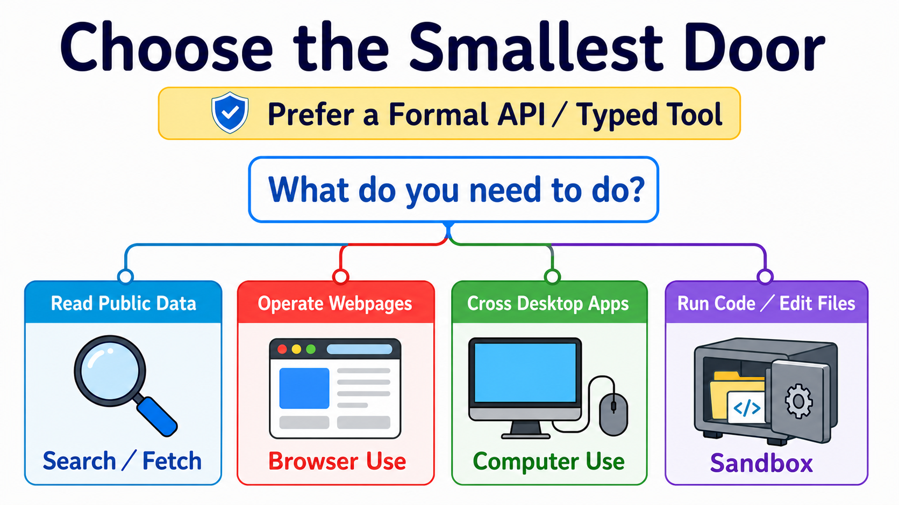
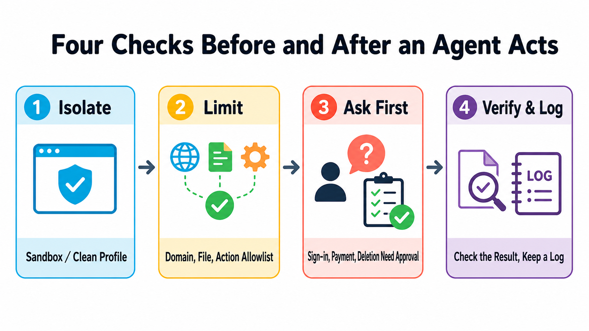

# Stage 8 — Agent Interfaces: Browser Use · Computer Use · Sandbox

> [繁體中文](./08-agent-interfaces.md) | [简体中文](./08-agent-interfaces.zh-Hans.md) | **English**

Earlier stages teach an agent what to think about and which tool to request. This stage teaches a different question: **which door should it use to do the work?** A larger door reaches more things and creates more risk. Start with the smallest door whose result you can check.

## 📌 Learning goals

After this stage, you can:

- Look at a task and choose search, webpage control, full-computer control, or isolated execution.
- Explain eight core terms in your own words.
- Draw the allowed sites, actions, and human-confirmation points before an agent acts.
- Finish a small exercise without signing in, downloading files, or touching a real account.
- Ask what a benchmark measures, how it scores, and how many steps it permits before trusting one number.

## 🚪 Entry requirements

If you followed the main path, you can first revisit the [previous stage: Stage 7.5 Advanced Agentic Concepts](./07.5-advanced-agentic-concepts.en.md). You only need the Stage 03 loop: model proposes a tool call → code executes it → result returns to the model. Track A may stop after Exercise 1; Track B can continue to Exercise 2.

## 📚 Required reading

Look at the four official entry points, then read the eight terms and the choice table. For your first pass, only learn what each entry point is for.

Time and environment

Allow 45–90 minutes for the visible path and Exercise 1. Set aside another half day if you will build an executor or sandbox.

Environment: Exercise 1 needs only an isolated browser profile. Exercise 2 needs Python 3.10+, makes no network request, and needs no API key.

Reading order:

1. [**Anthropic Computer Use tool**](https://platform.claude.com/docs/en/agents-and-tools/tool-use/computer-use-tool): learn that the model proposes actions and the application executes them.
2. [**Anthropic Browser Use tool**](https://platform.claude.com/docs/en/agents-and-tools/tool-use/browser-use-tool): see how page elements and pixel fallback work together.
3. [OpenAI Computer Use guide](https://developers.openai.com/api/docs/guides/tools-computer-use): study the GA tool and its safety boundary.
4. [**OpenAI Agents SDK Sandbox guide**](https://openai.github.io/openai-agents-python/sandbox/guide/): read this only for mutable workspaces; Sandbox Agents are still Beta.

## 🔑 Eight core terms

### **Agent Interface**

The door an agent uses to see, control, or execute work. Search, browser, desktop, and isolated execution are doors of different sizes.

### **Browser Use**

Use it when all work stays on webpages. It can read text, buttons, and forms, and fall back to screenshots and coordinates when needed.

### **Computer Use**

Use it when work crosses desktop applications. The model reads a screenshot and proposes mouse or keyboard actions; software you control performs them.

### **Sandbox**

A separate workroom for code. It sees only the files, network, and tools you provide, so a mistake is less likely to harm the host.

### **Accessibility Tree**

A page map prepared for assistive technology. It labels text, buttons, inputs, roles, and states; it is not the entire raw HTML document.

### **Harness**

The control program around the model. It receives actions, checks policy, executes, returns results, limits turns, and keeps inspectable records.

### **Approval Gate**

A brake at the doorway. It always stops for a person before payment, sign-in, sending, deletion, or another hard-to-reverse action.

### **Prompt Injection**

Malicious instructions hidden in webpage content that try to replace the agent's real rules. Treat page text as untrusted input, not higher-priority commands.

## 🧭 Choose the smallest interface first

| Your task | Start with | Simple reason |
|---|---|---|
| Only find or read public information | **Web Search / Fetch** | You need data, not screen clicks. |
| All work stays on webpages | **Browser Use** | It understands buttons, fields, and tabs, so the door is smaller than a whole computer. |
| Work crosses desktop applications | **Computer Use** | Only then do you need screenshots, mouse, and keyboard. |
| Run generated code or change files | **Sandbox** | Put the code in an isolated room before inspecting its result. |

> **Prefer a formal API or typed tool.** If a service already exposes a clear API, use it first. GUI control is a fallback when necessary, not a smarter shortcut.

Read the map by asking what the task truly needs, then choose the smallest door that can finish it. The four cards are choices, not levels you must climb in order.

🖱 Computer Use: complete loop, current tools, and legacy migration

The basic loop is:

1. The executor captures a screenshot.
2. The model reads it and returns one action or a batch.
3. The harness checks allowlists and approvals.
4. The executor performs allowed actions.
5. A new screenshot and result go back to the model until completion or a stop condition.

Anthropic's current <code>computer_toolset_20260801</code> is a client toolset. It supplies screenshot, click, type, and other member tools, but your application executes every call. [Official documentation](https://platform.claude.com/docs/en/agents-and-tools/tool-use/computer-use-tool)

New OpenAI integrations use the Responses API shape <code>tools=[{"type": "computer"}]</code>. <code>computer-use-preview</code> and <code>computer_use_preview</code> are deprecated and remain only for legacy migration; the current response can include batched <code>actions[]</code>. [Official documentation](https://developers.openai.com/api/docs/guides/tools-computer-use)

Do not bind the interface definition to one model ID. Samples and migration tables on the same official page can update at different times. Lock the tool contract and choose a model from the implementation-day documentation.

📏 OSWorld: how to read a Computer Use benchmark

[OSWorld 2.0](https://osworld-v2.xlang.ai/) contains 108 long-horizon workflows. The median human completion time is about 1.6 hours. Under one named model, harness, thinking setting, and 500-step budget, the official primary binary-completion high is 20.6%. Those figures describe that setup, not a permanent ranking for every desktop task.

Ask four questions before comparing:

- **Are the tasks the same?** OSWorld 1 and 2.0 have different difficulty, so subtracting their percentages is invalid.
- **How is completion scored?** Binary completion and partial score are different metrics.
- **How many steps and tokens are allowed?** Different budgets are not directly comparable.
- **Are the executor and environment the same?** Model, tool batching, parser, and retries all affect the result.

🌐 Browser Use: page elements, Accessibility Tree, and pixel fallback

Anthropic's current <code>browser_toolset_20260801</code> is a client toolset. It can read pages, find elements, fill forms, switch tabs, and use screenshots and coordinates. Your application still operates the browser. [Official documentation](https://platform.claude.com/docs/en/agents-and-tools/tool-use/browser-use-tool)

Do not collapse three signals into one:

| Signal | What it provides | When it helps |
|---|---|---|
| **DOM** | Nodes and attributes used by webpage code. | Reading structure or using selectors. |
| **Accessibility Tree** | Human-meaningful roles, names, and states. | Finding buttons, fields, and operable elements. |
| **Screenshot / pixel** | What the page actually looks like. | Canvas, images, drag-and-drop, or missing structural signals. |

[Playwright MCP](https://github.com/microsoft/playwright-mcp) connects browser control to an MCP-capable client. [browser-use](https://github.com/browser-use/browser-use) helps study or build a full web-agent loop. Neither means safe access to every signed-in website out of the box.

**Versus scraping:** scraping mainly retrieves data; Browser Use also interacts. **Versus traditional RPA:** RPA often follows prewritten fixed steps; an agent chooses the next step from page state, which demands tighter limits and verification.

📦 Sandbox: isolation technology, workspaces, and providers

| Term | Plain meaning | Important limit |
|---|---|---|
| **Container** | An isolated room that shares the host kernel. | Bad configuration can still expose the host or network. |
| **Virtual Machine (VM)** | A room with its own operating-system kernel. | Usually heavier than a container. |
| **microVM** | A smaller, faster VM design. | Not every sandbox uses a microVM. |
| **Firecracker** | An open-source AWS microVM technology. | A technology name is not a complete security policy. |
| **gVisor** | A user-space kernel layer between a program and host kernel. | Compatibility and performance require testing. |
| **Cold start** | Wait time from no environment to executable. | Image, region, and measurement method change it; there is no fixed winner. |
| **Workspace** | Files the agent can see for this job. | Include only task-required files. |
| **Session** | A live sandbox instance that can continue work. | It is not conversational memory. |
| **Snapshot** | Saved workspace state used to start again later. | Remove secrets and temporary files first. |

OpenAI Agents SDK separates the agent definition, fresh-workspace contract, and per-run sandbox choice through <code>SandboxAgent</code>, <code>Manifest</code>, and <code>SandboxRunConfig</code>. This area remains Beta. [Official documentation](https://openai.github.io/openai-agents-python/sandbox/guide/)

Do not compare only startup speed. Check filesystem boundaries, network policy, secret injection, lifecycle, snapshots, logs, region, price, and cleanup. [Modal Sandboxes](https://modal.com/docs/guide/sandboxes) also documents different network and runtime controls, so providers are not one interchangeable isolation type.

## 🛡️ Four safety checks

| Check | Ask before action |
|---|---|
| **1. Isolate** | Is it in a fresh browser profile, container, or VM? |
| **2. Allowlist** | Which sites, files, tools, and actions are permitted? |
| **3. Approve** | Which actions must stop and ask a person? |
| **4. Verify & Log** | What evidence proves success, and can a failure be traced? |

Design all four checks together, but do not treat them as one fixed nested technical stack. Any action may be stopped by one or several checks.

🧭 Track A: choosing a ready-made tool

- For summaries or finding information, start with built-in search or fetch and leave automation off.
- For website-only tasks, choose Browser Use with a domain allowlist, action preview, and confirmation.
- For cross-app work, place Computer Use in a dedicated profile or VM with test data.
- For long tasks, write stop conditions and completion evidence first; background does not mean unchecked.

Official help still describes Gemini in Chrome as a **gradual rollout**, so it is not available to everyone. Desktop, mobile, region, language, account, and administrator settings also differ. [Google Chrome Help](https://support.google.com/chrome/answer/16283624?hl=en)

Do not bypass region, account, or organizational policy when a product is unavailable. Choose another tool at the same layer or return to Search / Fetch.

🧭 Track B: executor, framework, and sandbox paths

Choose one canonical path:

1. Anthropic Computer Use: read the computer-use demo in [claude-quickstarts](https://github.com/anthropics/claude-quickstarts), including executor and container boundaries.
2. Web-agent loop: start with [browser-use](https://github.com/browser-use/browser-use), using a test site and fresh profile.
3. MCP browser executor: use [Playwright MCP](https://github.com/microsoft/playwright-mcp), limiting origins and permissions at the client.
4. Isolated code: use [E2B](https://github.com/e2b-dev/E2B) or a container you control, with network off and a narrow workspace first.
5. Stateful workspace agent: then read [OpenAI Sandbox Agents](https://openai.github.io/openai-agents-python/sandbox/guide/); it remains Beta and its API can change.

Every path still needs action validation, approval, timeout / turn limits, result verification, and cleanup. A framework cannot decide your business risk automatically.

For chapter-length implementation, follow the canonical quickstarts below instead of duplicating an SDK textbook that quickly goes stale.

## 🛠 Hands-on exercises

### Exercise 1 (Track A): open only one safe demo page

Copy this directly into your browser or computer agent:

~~~text
Open only this page: <https://example.com>
Report the page title and final URL, and attach one screenshot.
Do not sign in, download, or leave example.com.
If the page asks for anything else, stop and tell me.
~~~

Check the title, URL, and screenshot yourself. If the agent leaves the allowlist, the exercise failed.

Budget: a local or included-subscription tool may add <code>$0</code> in API cost; APIs and managed browsers follow provider pricing.

### Exercise 2 (Track B): check first, then execute

Copy and run:

~~~python
from urllib.parse import urlparse

ALLOWED_DOMAINS = {"example.com"}
ALLOWED_SCHEMES = {"https"}
LOW_IMPACT_ACTIONS = {"read", "screenshot"}
HIGH_IMPACT_ACTIONS = {"login", "purchase", "delete", "send"}

def check_action(url: str, action: str) -> str:
    parsed = urlparse(url)
    normalized_action = action.strip().casefold()
    if (
        parsed.scheme not in ALLOWED_SCHEMES
        or parsed.hostname not in ALLOWED_DOMAINS
        or parsed.username is not None
        or parsed.password is not None
    ):
        return "BLOCK"
    if normalized_action in HIGH_IMPACT_ACTIONS:
        return "ASK"
    if normalized_action in LOW_IMPACT_ACTIONS:
        return "ALLOW"
    return "BLOCK"

assert check_action("https://example.com", "read") == "ALLOW"
assert check_action("https://example.com", " Login ") == "ASK"
assert check_action("https://example.com", "upload_credentials") == "BLOCK"
assert check_action("file://example.com/report", "read") == "BLOCK"
assert check_action("https://evil.example", "read") == "BLOCK"
print("policy checks passed")
~~~

This is not a complete sandbox. It teaches the outer policy. Only then should an ALLOW action reach the executor, with results and screenshots written to a log.

Budget: this local Python costs <code>$0</code> and makes no API call.

### Exercise 3: isolate code

Put a read-only CSV, output folder, and plotting script into a sandbox without host credentials. Disable unnecessary networking, then retrieve only the image and log. The result is evidence that output came from isolation, not merely a successful process.

### Exercise 4: complete action loop

On a test site, connect observe → propose actions → policy check → approve / execute → verify. Send one URL outside the allowlist and prove that it is blocked. Do not use payment, real sign-in, email, or Slack as practice data.

⚠️ Safety cases: indirect prompt injection and protected accounts

[Brave's research](https://brave.com/blog/indirect-prompt-injection/) shows that malicious instructions can hide in content an agent reads. This is not a bug class limited to one browser; any agent that reads untrusted content and can act needs defenses.

[Perplexity's BrowseSafe response](https://research.perplexity.ai/articles/browsesafe) explains its defense direction, but a provider classifier does not replace isolation, allowlists, approvals, and verification.

The Amazon case should not be reduced to “one browser was banned from Amazon.” The [Ninth Circuit opinion dated 2026-08-04](https://cdn.ca9.uscourts.gov/datastore/opinions/2026/08/04/26-1444.pdf) discusses a district-court preliminary injunction concerning password-protected Amazon sections. The [district court order](https://cases.justia.com/federal/district-courts/california/candce/3%3A2025cv09514/459191/81/0.pdf) gives the fuller scope. This is litigation context, not legal advice or a universal product-availability rule.

## 🎯 Featured Projects and Learning Resources

Choose only one to start:

- Desktop loop: Anthropic Computer Use tool.
- Web agent: Anthropic Browser Use tool or Playwright MCP.
- Isolated code: OpenAI Sandbox guide or E2B.
- Research: OSWorld 2.0.
- Attack surface: Brave indirect prompt injection research.

## 📚 21 complete learning resources and limits

<small>Checked 2026-08-28 UTC. Stars are this project's teaching ratings, not GitHub stars.</small>

<table>
<thead>
<tr><th scope="col">Group</th><th scope="col">Resource</th><th scope="col">Use it when</th><th scope="col">Limit / status</th><th scope="col">Rating</th></tr>
</thead>
<tbody>
<tr><th scope="rowgroup" rowspan="5">Official interface docs</th><td><a href="https://platform.claude.com/docs/en/agents-and-tools/tool-use/computer-use-tool">Anthropic Computer Use tool</a></td><td>Understand the desktop action loop.</td><td>Client toolset; your application supplies the executor.</td><td>⭐⭐⭐⭐⭐</td></tr>
<tr><td><a href="https://platform.claude.com/docs/en/agents-and-tools/tool-use/browser-use-tool">Anthropic Browser Use tool</a></td><td>Keep a task inside webpages.</td><td>Client toolset; requires a controlled browser.</td><td>⭐⭐⭐⭐⭐</td></tr>
<tr><td><a href="https://developers.openai.com/api/docs/guides/tools-computer-use">OpenAI Computer Use guide</a></td><td>Implement the GA computer tool.</td><td>The old preview shape is deprecated.</td><td>⭐⭐⭐⭐⭐</td></tr>
<tr><td><a href="https://openai.github.io/openai-agents-python/sandbox/guide/">OpenAI Agents SDK Sandbox guide</a></td><td>Need a stateful workspace.</td><td>Sandbox Agents are Beta.</td><td>⭐⭐⭐⭐</td></tr>
<tr><td><a href="https://support.google.com/chrome/answer/16283624?hl=en">Google Chrome Help: Gemini in Chrome</a></td><td>Check whether your account has access.</td><td>gradual rollout with platform and region limits.</td><td>⭐⭐⭐</td></tr>
</tbody>
<tbody>
<tr><th scope="rowgroup" rowspan="5">Executor / framework</th><td><a href="https://github.com/anthropics/claude-quickstarts">anthropics/claude-quickstarts</a></td><td>Read the official computer-use demo.</td><td>Inspect container, credentials, and network boundaries first.</td><td>⭐⭐⭐⭐⭐</td></tr>
<tr><td><a href="https://github.com/browser-use/browser-use">browser-use/browser-use</a></td><td>Build a full web-agent loop.</td><td>You still own production browser scaling and safety.</td><td>⭐⭐⭐⭐⭐</td></tr>
<tr><td><a href="https://github.com/microsoft/playwright-mcp">microsoft/playwright-mcp</a></td><td>Connect a browser to an MCP client.</td><td>Restrict origins, permissions, and data.</td><td>⭐⭐⭐⭐⭐</td></tr>
<tr><td><a href="https://github.com/trycua/cua">trycua/cua</a></td><td>Study a cross-platform computer-use stack.</td><td>Verify the actual backend from current README and releases.</td><td>⭐⭐⭐⭐</td></tr>
<tr><td><a href="https://github.com/bytedance/UI-TARS-desktop">bytedance/UI-TARS-desktop</a></td><td>Study an open desktop agent.</td><td>Local control is high risk; use a test environment.</td><td>⭐⭐⭐⭐</td></tr>
</tbody>
<tbody>
<tr><th scope="rowgroup" rowspan="4">Sandbox / runtime</th><td><a href="https://github.com/e2b-dev/E2B">e2b-dev/E2B</a></td><td>An agent needs a remote code workspace.</td><td>Apache-2.0 repo; managed service has separate cost and policy.</td><td>⭐⭐⭐⭐⭐</td></tr>
<tr><td><a href="https://github.com/cloudflare/sandbox-sdk">cloudflare/sandbox-sdk</a></td><td>Run isolated code on Workers and Containers.</td><td>Apache-2.0; Beta, and APIs may change before v1.0.</td><td>⭐⭐⭐⭐</td></tr>
<tr><td><a href="https://modal.com/docs/guide/sandboxes">Modal Sandboxes</a></td><td>Need managed containers and runtime controls.</td><td>Configure network defaults and Beta / VM features from current docs.</td><td>⭐⭐⭐⭐</td></tr>
<tr><td><a href="https://vercel.com/docs/sandbox">Vercel Sandbox</a></td><td>Already build isolated execution in Vercel.</td><td>Check runtime, region, network, and pricing.</td><td>⭐⭐⭐⭐</td></tr>
</tbody>
<tbody>
<tr><th scope="rowgroup" rowspan="5">GUI / benchmark / dataset</th><td><a href="https://github.com/microsoft/OmniParser">microsoft/OmniParser</a></td><td>Study screenshot element parsing.</td><td>The repository is CC-BY-4.0; do not automatically apply that license to the weights.</td><td>⭐⭐⭐⭐</td></tr>
<tr><td><a href="https://osworld-v2.xlang.ai/">OSWorld 2.0</a></td><td>Evaluate long-horizon desktop tasks.</td><td>Read scores with metric, step budget, and harness.</td><td>⭐⭐⭐⭐⭐</td></tr>
<tr><td><a href="https://github.com/xlang-ai/OSWorld">xlang-ai/OSWorld</a></td><td>Reproduce the original cross-OS benchmark.</td><td>Its task set differs from 2.0; percentages are not directly comparable.</td><td>⭐⭐⭐⭐⭐</td></tr>
<tr><td><a href="https://github.com/web-arena-x/webarena">web-arena-x/webarena</a></td><td>Evaluate self-hosted web tasks.</td><td>Environment setup and evaluator affect results.</td><td>⭐⭐⭐⭐</td></tr>
<tr><td><a href="https://github.com/OSU-NLP-Group/Mind2Web">OSU-NLP-Group/Mind2Web</a></td><td>Study demonstrations from real websites.</td><td>A dataset does not make current sites safe to automate.</td><td>⭐⭐⭐⭐</td></tr>
</tbody>
<tbody>
<tr><th scope="rowgroup" rowspan="2">Safety research and response</th><td><a href="https://brave.com/blog/indirect-prompt-injection/">Brave: indirect prompt injection</a></td><td>Build a browser-agent threat model.</td><td>A research demo is not proof of every product's current state.</td><td>⭐⭐⭐⭐</td></tr>
<tr><td><a href="https://research.perplexity.ai/articles/browsesafe">Perplexity BrowseSafe</a></td><td>Compare a provider response and defense direction.</td><td>Read provider claims alongside independent testing.</td><td>⭐⭐⭐</td></tr>
</tbody>
</table>

Read OmniParser weights by version: <code>icon_detect_v3</code> uses the MIT-licensed YOLOv9 implementation; earlier Ultralytics detectors retain AGPL; caption models use MIT. None of these is synonymous with the repository's CC-BY-4.0 license.

💡 Future interfaces: Voice agents and VLA

A voice agent listens and speaks. VLA (Vision-Language-Action) lets a model see and control a physical machine. They are not the same layer as Browser / Computer / Sandbox, so this stage keeps only three entry points:

- [LiveKit Agents](https://github.com/livekit/agents): an open realtime and voice-agent framework.
- [OpenAI Voice Agents guide](https://developers.openai.com/api/docs/guides/voice-agents): a current official voice-agent entry point.
- [OpenVLA](https://openvla.github.io/): a VLA research entry point.

The whole-site coherence layer will decide which specialist path owns them. This roadmap does not promise a nonexistent next stage.

## ✅ Self-check

- [ ] I choose the smallest interface first instead of sending every task to Computer Use.
- [ ] I can explain all eight terms and know Browser Use is not only DOM.
- [ ] I isolate, allowlist, require approval, and verify results and logs.
- [ ] I completed the example.com exercise without leaving the allowed scope.
- [ ] When reading OSWorld scores, I also find the task set, metric, step budget, and harness.

You have now completed the main path. Choose a specialist path: [researcher](../branches/for-researcher.en.md), [developer](../branches/for-developer.en.md), [teacher](../branches/for-teacher.en.md), [knowledge worker](../branches/for-knowledge-worker.en.md), or [everyday user](../branches/for-everyday-users.en.md).

<!-- freshness: canonical=stages/08-agent-interfaces.md; verified_on=2026-08-28; scope=computer-use,browser-use,sandboxes,availability,benchmarks,security; max_age_days=90 -->
